---
tags:
  - 现代硬件算法
  - 数据结构案例
created: 2026-09-11
source: https://en.algorithmica.org/hpc/data-structures/s-tree/
original_title: Static B-Trees
---

# 静态 B 树

本节是[[二分查找.md|上一节]]的后续，在那里我们通过去掉分支和改善内存布局来优化二分查找。这里，我们同样要在有序数组中查找，但这次我们不局限于一次只取回并比较一个元素。

在本节中，我们把为二分查找开发的技巧推广到*静态 B 树*，并用[[SIMD并行.md|SIMD 指令]]进一步加速。具体而言，我们开发出两种新的隐式数据结构：

- [第一种](#b树布局)基于 B 树的内存布局，根据数组大小不同，它比 `std::lower_bound` 快至多 8 倍，同时占用与原数组相同的空间，且只需对元素做一次重排。
- [第二种](#b+树布局)基于 B+ 树的内存布局，它比 `std::lower_bound` 快至多 15 倍，而只多用 6–7% 的内存——或者，如果我们能保留原始有序数组，则只用其内存的 6–7%。

为了把它们与 B 树（那些带指针、每个节点有数百到数千个键、且内部有空位的结构）区分开，我们将分别用 *S 树* 与 *S+ 树* 这两个名字来指代这些特定的内存布局[^name]。

[^name]: [类似于 B 树](https://en.wikipedia.org/wiki/B-tree#Origin)，"你越去想 S 在 S 树里代表什么，就越能理解 S 树。"

<!--

Similar to how the B in B-trees stands for many thing in We even have more claim to it than Bayer had on B-tree: it is succinct, static, simd, my name, my surname.

- *S-tree*: an approach based on the implicit (pointer-free) B-layout accelerated with SIMD operations to perform search efficiently while using less memory bandwidth and is ~8x faster on small arrays and 5x faster on large arrays.
- *S+ tree*: an approach similarly based on the B+ layout and achieves up to 15x faster for small arrays and ~7x faster on large arrays. Uses 6-7% of the array memory.

There is a an obscure data structure in computer vision.

The last two approaches use SIMD, which technically disqualifies it from being binary search. This is technically not a drop-in replacement, since it requires some preprocessing, but I can't recall a lot of scenarios where you obtain a sorted array but can't spend linear time on preprocessing.

-->

据我所知，这是对现有[方法](http://kaldewey.com/pubs/FAST__SIGMOD10.pdf)的显著改进。和之前一样，我们用面向 Zen 2 CPU 的 Clang 10，但这些性能提升应当大致能迁移到大多数其它平台，包括基于 Arm 的芯片。如果你想在自己的机器上测试，可以用最终实现的[这个单文件基准](https://github.com/sslotin/amh-code/blob/main/binsearch/standalone.cc)。

这是一篇长文，并且由于它同时作为[[现代硬件算法·总览.md|教材]]式案例研究，为了教学目的我们会逐步地改进算法。如果你已经是专家，且能毫无障碍地阅读几乎没有上下文的[[内建函数与向量类型.md|内建函数]]密集代码，可以直接跳到[最终实现](#隐式b+树)。

## B 树布局

B 树通过允许节点拥有多于两个子节点，推广了二叉搜索树的概念。与单个键不同，一个 $k$ 阶 B 树的节点最多可以包含 $B = (k - 1)$ 个按键有序存储的键，以及至多 $k$ 个指向子节点的指针。每个子节点 $i$ 都满足：其子树中的所有键都介于父节点的键 $(i - 1)$ 与 $i$ 之间（如果它们存在）。

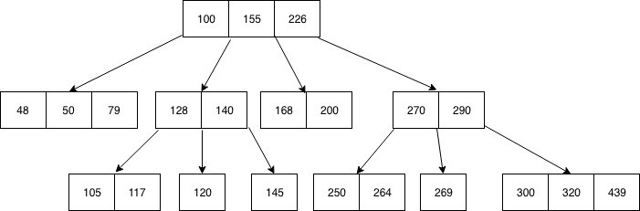

这种方法的主要优势在于，它把树高降低了 $\frac{\log_2 n}{\log_k n} = \frac{\log k}{\log 2} = \log_2 k$ 倍，同时取回每个节点仍大致花相同的时间——只要它能塞进一个[[存储层次.md|内存块]]。

B 树主要是为了管理磁盘数据库而开发的，在这种场景下随机取回单个字节的延迟，与顺序读接下来 1MB 数据的耗时相当。对我们的用例，我们会用 $B = 16$ 个元素的块大小——即 $64$ 字节，缓存行的大小——这使得树高以及每次查询的缓存行取回总数，相比二分查找小了 $\log_2 17 \approx 4$ 倍。

### 隐式 B 树

在 B 树节点里存指针、取指针既浪费宝贵的缓存空间又降低性能，但它们对于在插入和删除时改变树结构至关重要。但当没有更新、树的结构是*静态*的时候，我们可以去掉指针，使结构变成*隐式*的。

实现这一点的一种办法是把[[二分查找.md#优化布局|Eytzinger 编号]]推广到 $(B + 1)$ 叉树：

- 根节点编号为 $0$。
- 节点 $k$ 有 $(B + 1)$ 个子节点，编号为 $\\{k \cdot (B + 1) + i + 1\\}$，其中 $i \in [0, B]$。

这样，我们只需分配一个大二维数组来存键，并依靠下标运算来定位树中的子节点，从而只多用 $O(1)$ 额外内存：

```c++
const int B = 16;

int nblocks = (n + B - 1) / B;
int btree[nblocks][B];

int go(int k, int i) { return k * (B + 1) + i + 1; }
```

<!-- todo: exact height -->

这种编号自动使 B 树是完全或近乎完全的，高度为 $\Theta(\log_{B + 1} n)$。如果初始数组的长度不是 $B$ 的倍数，最后一块用该数据类型的最大值填充。

### 构建

我们可以像构建 Eytzinger 数组那样构建 B 树——通过遍历搜索树：

```c++
void build(int k = 0) {
    static int t = 0;
    if (k < nblocks) {
        for (int i = 0; i < B; i++) {
            build(go(k, i));
            btree[k][i] = (t < n ? a[t++] : INT_MAX);
        }
        build(go(k, B));
    }
}
```

它是正确的，因为初始数组的每个值都会被复制到结果数组中的一个唯一位置，且树高为 $\Theta(\log_{B+1} n)$，因为每次下行到子节点时 $k$ 都会乘以 $(B + 1)$。

注意这种编号会导致轻微的不平衡：靠左的子节点可能有更大的子树，尽管这只对 $O(\log_{B+1} n)$ 个父节点成立。

### 查找

要找下界（lower bound），我们需要取回一个节点里的 $B$ 个键，找到第一个不小于 $x$ 的键 $a_i$，下行到第 $i$ 个子节点——如此继续，直到到达叶节点。如何找到那个第一个键，存在一些变体。例如，我们可以做一个微小内部二分查找，做 $O(\log B)$ 次迭代，或者干脆顺序比较每个键，在 $O(B)$ 时间内直到找到局部下界，希望能早点退出循环。

但我们不打算那样做——因为我们可以用[[SIMD并行.md|SIMD]]。它不太擅长处理分支，所以本质上我们想做的是：不管怎样都与全部 $B$ 个元素比较，由这些比较算出一个位掩码，然后用 `ffs` 指令找到对应第一个不小于元素的位：

```cpp
int mask = (1 << B);

for (int i = 0; i < B; i++)
    mask |= (btree[k][i] >= x) << i;

int i = __builtin_ffs(mask) - 1;
// now i is the number of the correct child node
```

遗憾的是，编译器还不够聪明，无法对这种代码[[自动向量化与 SPMD.md|自动向量化]]，所以我们必须手动优化。在 AVX2 中，我们可以载入 8 个元素，把它们与搜索键比较，产生一个[[掩码与混合.md|向量掩码]]，然后用 `movemask` 从中抽取出标量掩码。下面是一个最小化且配图说明的例子，展示我们想要做的事：

```center
       y = 4        17       65       103     
       x = 42       42       42       42      
   y ≥ x = 00000000 00000000 11111111 11111111
           ├┬┬┬─────┴────────┴────────┘       
movemask = 0011                               
           ┌─┘                                
     ffs = 3                                  
```

由于我们一次只能处理 8 个元素（半个块 / 缓存行大小），必须把元素分成两组，再合并两个 8 位掩码。为此，把条件换成 `x > y`、转而计算反掩码会稍微容易些：

```c++
typedef __m256i reg;

int cmp(reg x_vec, int* y_ptr) {
    reg y_vec = _mm256_load_si256((reg*) y_ptr); // load 8 sorted elements
    reg mask = _mm256_cmpgt_epi32(x_vec, y_vec); // compare against the key
    return _mm256_movemask_ps((__m256) mask);    // extract the 8-bit mask
}
```

现在，要处理整个块，我们需要调用它两次并合并掩码：

```c++
int mask = ~(
    cmp(x, &btree[k][0]) +
    (cmp(x, &btree[k][8]) << 8)
);
```

要下行树，我们对该掩码用 `ffs` 得到正确的子节点编号，然后直接调用前面定义的 `go` 函数：

```c++
int i = __builtin_ffs(mask) - 1;
k = go(k, i);
```

要最终返回结果，我们希望只取回最后访问节点里的 `btree[k][i]`，但问题是局部下界有时并不存在（$i \ge B$），因为 $x$ 恰好大于节点里的所有键。理论上，我们可以像[[二分查找.md#构建|Eytzinger 二分查找]]那样，在算出最后一个下标之后恢复正确的元素，但这次我们没有漂亮的位技巧，而必须做很多[[整数除法.md|除以 17]]来算它，这既慢又几乎肯定不值得。

相反，我们可以记住并返回下行树时遇到的最后一个局部下界：

```c++
int lower_bound(int _x) {
    int k = 0, res = INT_MAX;
    reg x = _mm256_set1_epi32(_x);
    while (k < nblocks) {
        int mask = ~(
            cmp(x, &btree[k][0]) +
            (cmp(x, &btree[k][8]) << 8)
        );
        int i = __builtin_ffs(mask) - 1;
        if (i < B)
            res = btree[k][i];
        k = go(k, i);
    }
    return res;
}
```

这个实现大幅胜出之前所有二分查找实现：

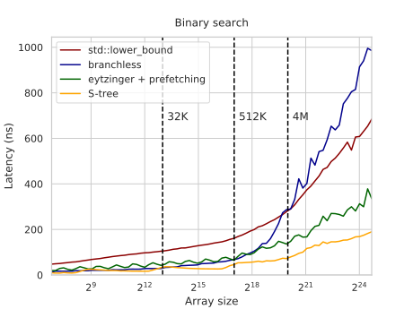

这非常好——但我们还能进一步优化。

### 优化

首先，我们在[[内存分页.md|大页]]上为数组分配内存：

```c++
const int P = 1 << 21;                        // page size in bytes (2MB)
const int T = (64 * nblocks + P - 1) / P * P; // can only allocate whole number of pages
btree = (int(*)[16]) std::aligned_alloc(P, T);
madvise(btree, T, MADV_HUGEPAGE);
```

这在大数组规模上略微提升了性能：

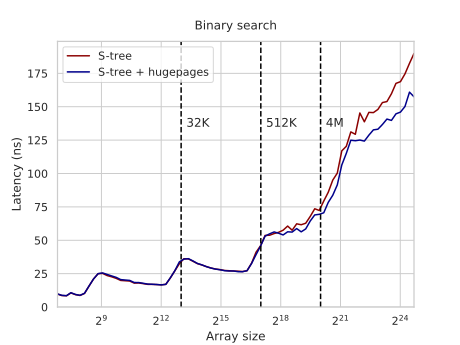

理想情况下，我们也应给所有[[二分查找.md|此前实现]]启用大页，让对比公平，但这影响不大，因为它们都有某种形式的预取来缓解此问题。

这一定下来，我们就开始真正的优化。首先，我们希望尽可能用编译期常量而非变量，因为这样编译器可以把它们嵌进机器码、展开循环、优化算术，并免费为我们做各种其它好事。具体而言，我们希望提前知道树高：

<!-- todo: maybe this can be computed simpler? -->

```c++
constexpr int height(int n) {
    // grow the tree until its size exceeds n elements
    int s = 0, // total size so far
        l = B, // size of the next layer
        h = 0; // height so far
    while (s + l - B < n) {
        s += l;
        l *= (B + 1);
        h++;
    }
    return h;
}

const int H = height(N);
```

<!--

```c++
constexpr std::pair<int, int> precalc(int n) {
    int s = 0, // total size
        l = B, // size of next layer
        h = 0; // height so far
    while (s + l - B < n) {
        s += l;
        l *= (B + 1);
        h++;
    }
    int r = (n - s + B - 1) / B; // remaining blocks on the last layer
    return {h, s / B + (r + B) / (B + 1) * (B + 1)};
}

const int [height, nblocks] = precalc(N);
```

-->

接下来，我们可以更快地在节点里找局部下界。与其为两个 8 元素块分别计算再合并两个 8 位掩码，不如用 [packs](https://www.intel.com/content/www/us/en/docs/intrinsics-guide/index.html#ig_expand=3037,4870,6715,4845,3853,90,7307,5993,2692,6946,6949,5456,6938,5456,1021,3007,514,518,7253,7183,3892,5135,5260,3915,4027,3873,7401,4376,4229,151,2324,2310,2324,4075,6130,4875,6385,5259,6385,6250,1395,7253,6452,7492,4669,4669,7253,1039,1029,4669,4707,7253,7242,848,879,848,7251,4275,879,874,849,833,6046,7250,4870,4872,4875,849,849,5144,4875,4787,4787,4787,5227,7359,7335,7392,4787,5259,5230,5223,6438,488,483,6165,6570,6554,289,6792,6554,5230,6385,5260,5259,289,288,3037,3009,590,604,5230,5259,6554,6554,5259,6547,6554,3841,5214,5229,5260,5259,7335,5259,519,1029,515,3009,3009,3011,515,6527,652,6527,6554,288,3841,5230,5259,5230,5259,305,5259,591,633,633,5259,5230,5259,5259,3017,3018,3037,3018,3017,3016,3013,5144&text=_mm256_packs_epi32&techs=AVX,AVX2) 指令合并向量掩码，并只用一次 `movemask` 就抽取出来：

```c++
unsigned rank(reg x, int* y) {
    reg a = _mm256_load_si256((reg*) y);
    reg b = _mm256_load_si256((reg*) (y + 8));

    reg ca = _mm256_cmpgt_epi32(a, x);
    reg cb = _mm256_cmpgt_epi32(b, x);

    reg c = _mm256_packs_epi32(ca, cb);
    int mask = _mm256_movemask_epi8(c);

    // we need to divide the result by two because we call movemask_epi8 on 16-bit masks:
    return __tzcnt_u32(mask) >> 1;
}
```

这条指令把存在两个寄存器里的 32 位整数转换成存在一个寄存器里的 16 位整数——在我们的例子里，实质上是把向量掩码合并成一个。注意我们交换了比较的顺序——这让我们最后不用反转掩码，但必须在最开始把搜索键减一[^float]以使其正确（否则它就变成了 `upper_bound`）。

[^float]: 如果你需要处理[[浮点数.md|浮点]]键，考虑 `upper_bound` 是否就够用——因为如果你特别需要 `lower_bound`，那么从搜索键里减一或减机器精度并不管用：你需要[取前一个可表示的数值](https://stackoverflow.com/questions/10160079/how-to-find-nearest-next-previous-double-value-numeric-limitsepsilon-for-give)才行。除一些边界情况外，这本质上意味着把它的位重新解释为整数、减一、再重新解释回浮点数（由于[[IEEE 754 浮点数.md|IEEE-754 浮点数]]在内存中的存储方式，这神奇地有效）。

问题是，它做了一种奇怪的交错：结果以 `a1 b1 a2 b2` 的顺序写入，而非我们想要的 `a1 a2 b1 b2`——许多 AVX2 指令都倾向于这么做。为了纠正，我们需要对结果向量做[[寄存器内重排.md|置换]]，但与其在查询时做，不如在预处理时对每个节点做置换：

```c++
void permute(int *node) {
    const reg perm = _mm256_setr_epi32(4, 5, 6, 7, 0, 1, 2, 3);
    reg* middle = (reg*) (node + 4);
    reg x = _mm256_loadu_si256(middle);
    x = _mm256_permutevar8x32_epi32(x, perm);
    _mm256_storeu_si256(middle, x);
}
```

现在我们只需在构建完一个节点后立即调用 `permute(&btree[k])`。可能有更快的方法交换中间元素，但就先放这，因为预处理时间目前没那么重要。

这个新的 SIMD 例程显著更快，因为额外的 `movemask` 很慢，而且混合两个掩码也要不少指令。遗憾的是，我们现在不能再做 `res = btree[k][i]` 那种更新了，因为元素被重排了。我们可以用一些位级技巧通过 `i` 来算，但查一个小查找表结果更快、且不需要新分支：

```c++
const int translate[17] = {
    0, 1, 2, 3,
    8, 9, 10, 11,
    4, 5, 6, 7,
    12, 13, 14, 15,
    0
};

void update(int &res, int* node, unsigned i) {
    int val = node[translate[i]];
    res = (i < B ? val : res);
}
```

这个 `update` 过程要花些时间，但它不在迭代间的关键路径上，所以并不太影响实际性能。

把它们缝合在一起（并略去一些其它小优化）：

```c++
int lower_bound(int _x) {
    int k = 0, res = INT_MAX;
    reg x = _mm256_set1_epi32(_x - 1);
    for (int h = 0; h < H - 1; h++) {
        unsigned i = rank(x, &btree[k]);
        update(res, &btree[k], i);
        k = go(k, i);
    }
    // the last branch:
    if (k < nblocks) {
        unsigned i = rank(x, btree[k]);
        update(res, &btree[k], i);
    }
    return res;
}
```

所有这些工作为我们省下约 15–20%：

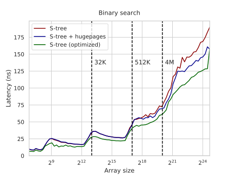

到目前为止感觉不太令人满意，但这些优化思路我们后面会复用。

当前实现有两个主要问题：

- `update` 过程相当昂贵，尤其考虑到它极可能是无用的：17 次里有 16 次，我们只需从最后一块取回结果。
- 我们做了数量不固定的迭代，造成类似于[[二分查找.md#预取|Eytzinger 二分查找]]的分支预测问题；这次你也能在图上看到，但延迟突跳的周期是 $2^4$。

为解决这些问题，我们需要稍微改变布局。

## B+ 树布局

大多数时候，当人们谈论 B 树时，他们实际指的是*B+ 树*，这是一种区分两类节点的变体：

- *内部节点*最多存 $B$ 个键和 $(B + 1)$ 个指向子节点的指针。第 $i$ 个键始终等于第 $(i + 1)$ 个子节点子树里的最小键。
- *数据节点*或*叶子*最多存 $B$ 个键、指向下一个叶节点的指针，以及（可选）每个键关联的值——如果结构被用作键值映射的话。

这种方法的优点包括更快的搜索时间（因为内部节点只存键）和快速遍历一段区间元素的能力（通过跟随下一个叶节点指针），但代价是一些内存开销：我们必须在内部节点里存键的副本。

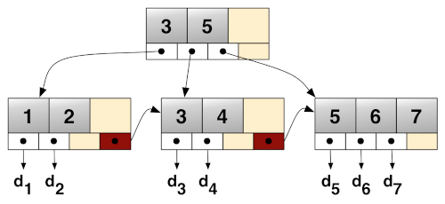

回到我们的用例，这种布局能帮我们解决两个问题：

- 要么我们下行到的最后一个节点有局部下界，要么它就是下一个叶节点的第一个键，所以我们不需要在每次迭代都调用 `update`。
- 所有叶子的深度是恒定的，因为 B+ 树在根处而非叶处生长，这消除了对分支的需要。

缺点在于这种布局不是*简洁*的：我们需要一些额外内存来存内部节点——确切地说约为原数组大小的 $\frac{1}{16}$——但性能提升绝对值得。

### 隐式 B+ 树

为了更清晰地做指针运算，我们会把整棵树存进一个一维数组。为了最小化运行时的下标计算，我们会把每一层顺序地存进这个数组，并用编译期算好的偏移来寻址：第 `h` 层上编号为 `k` 的节点的键从 `btree[offset(h) + k * B]` 开始，它的第 `i` 个子节点在 `btree[offset(h - 1) + (k * (B + 1) + i) * B]`。

要实现这一切，我们需要稍微多一些 `constexpr` 函数：

```c++
// number of B-element blocks in a layer with n keys
constexpr int blocks(int n) {
    return (n + B - 1) / B;
}

// number of keys on the layer previous to one with n keys
constexpr int prev_keys(int n) {
    return (blocks(n) + B) / (B + 1) * B;
}

// height of a balanced n-key B+ tree
constexpr int height(int n) {
    return (n <= B ? 1 : height(prev_keys(n)) + 1);
}

// where the layer h starts (layer 0 is the largest)
constexpr int offset(int h) {
    int k = 0, n = N;
    while (h--) {
        k += blocks(n) * B;
        n = prev_keys(n);
    }
    return k;
}

const int H = height(N);
const int S = offset(H); // the tree size is the offset of the (non-existent) layer H

int *btree; // the tree itself is stored in a single hugepage-aligned array of size S
```

注意我们逆序存储各层，但层内节点和其中的数据仍是自左向右，且层是从下往上编号的：叶子构成第零层，根是第 `H - 1` 层。这些都只是任意选择——只是在代码里实现起来稍微容易些。

### 构建

要从有序数组 `a` 构建树，我们首先把它复制到第零层并用无穷大填充：

```c++
memcpy(btree, a, 4 * N);

for (int i = N; i < S; i++)
    btree[i] = INT_MAX;
```

现在我们逐层构建内部节点。对每个键，我们需要下行到它的右边、然后始终向左，直到到达一个叶节点，再取它的第一个键——那将是子树里最小的键：

```c++
for (int h = 1; h < H; h++) {
    for (int i = 0; i < offset(h + 1) - offset(h); i++) {
        // i = k * B + j
        int k = i / B,
            j = i - k * B;
        k = k * (B + 1) + j + 1; // compare to the right of the key
        // and then always to the left
        for (int l = 0; l < h - 1; l++)
            k *= (B + 1);
        // pad the rest with infinities if the key doesn't exist 
        btree[offset(h) + i] = (k * B < N ? btree[k * B] : INT_MAX);
    }
}
```

最后一点润色——我们需要在内部节点里置换键，以更快地搜索它们：

```c++
for (int i = offset(1); i < S; i += B)
    permute(btree + i);
```

我们从 `offset(1)` 开始，并且特意不对叶节点做置换，保留数组原有的有序顺序。动机是：如果键被置换了，我们就需要在 `update` 里做那种复杂的下标转换，而这是最后一步操作、处于关键路径上。所以仅对这一层，我们改用原始的掩码混合局部下界流程。

### 查找

搜索过程比 B 树布局更简单：我们不需要做 `update`，且只执行固定次数的迭代——尽管最后一步要特殊对待：

```c++
int lower_bound(int _x) {
    unsigned k = 0; // we assume k already multiplied by B to optimize pointer arithmetic
    reg x = _mm256_set1_epi32(_x - 1);
    for (int h = H - 1; h > 0; h--) {
        unsigned i = permuted_rank(x, btree + offset(h) + k);
        k = k * (B + 1) + i * B;
    }
    unsigned i = direct_rank(x, btree + k);
    return btree[k + i];
}
```

切换到 B+ 布局非常值得：与优化后的 S 树相比，S+ 树快了 1.5–3 倍：

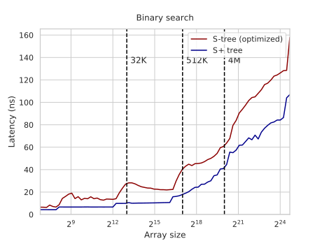

图高端的尖峰是由 L1 TLB 不够大造成的：它有 64 个条目，所以最多处理 64 × 2 = 128MB 数据，而这恰好是存 `2^25` 个整数所需的。S+ 树由于约 7% 的内存开销，会稍微早一点撞到这个限制。

### 与 `std::lower_bound` 的对比

我们已沿途从二分查找走得很远：

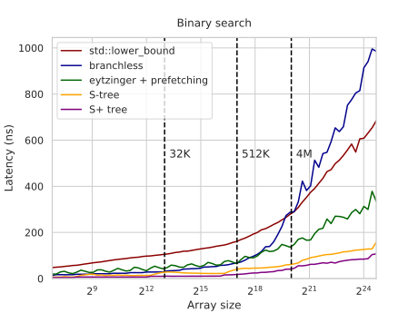

在这种尺度上，看相对加速比更有意义：

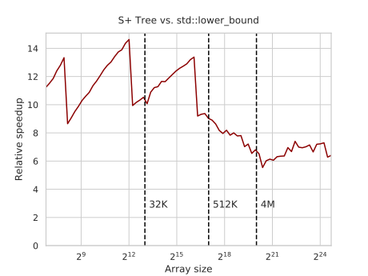

图开头的悬崖是因为 `std::lower_bound` 的运行时间随数组大小平滑增长，而对 S+ 树，它在局部是平的，并在需要新增一层时以离散的台阶增长。

一个我们还没讨论的重要星号是：我们测的并非真实延迟，而是*倒数吞吐（reciprocal throughput）*——执行大量查询的总时间除以查询数：

```c++
clock_t start = clock();

for (int i = 0; i < m; i++)
    checksum ^= lower_bound(q[i]);

float seconds = float(clock() - start) / CLOCKS_PER_SEC;
printf("%.2f ns per query\n", 1e9 * seconds / m);
```

要测*真实*延迟，我们需要在循环迭代间引入依赖，使下一个查询不能在前一个完成前开始：

```c++
int last = 0;

for (int i = 0; i < m; i++) {
    last = lower_bound(q[i] ^ last);
    checksum ^= last;
}
```

就真实延迟而言，加速比没那么惊艳：

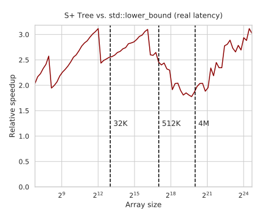

S+ 树的大量性能提升来自于去掉分支、最小化内存请求，这让更多地相邻查询得以重叠执行——显然平均约三个。

<!-- grouping requests together explicitly? -->

尽管除了也许做高频交易的那些人，没人关心真实延迟，而且大家即使嘴上说"延迟"实际测的也是吞吐，这个细微差别在预测用户应用中可能的加速比时仍要考虑。

### 修改与进一步优化

<!--

Bloated:

```c++
void permute32(int *node) {
    // a b c d 1 2 3 4 -> (a c) (b d) (1 3) (2 4) -> (a c) (1 3) (b d) (2 4)
    reg x = _mm256_load_si256((reg*) (node + 8));
    reg y = _mm256_load_si256((reg*) (node + 16));
    _mm256_storeu_si256((reg*) (node + 8), y);
    _mm256_storeu_si256((reg*) (node + 16), x);
    permute16(node);
    permute16(node + 16);
}

unsigned permuted_rank32(reg x, int *node) {
    reg a = _mm256_load_si256((reg*) node);
    reg b = _mm256_load_si256((reg*) (node + 8));
    reg c = _mm256_load_si256((reg*) (node + 16));
    reg d = _mm256_load_si256((reg*) (node + 24));

    reg ca = _mm256_cmpgt_epi32(a, x);
    reg cb = _mm256_cmpgt_epi32(b, x);
    reg cc = _mm256_cmpgt_epi32(c, x);
    reg cd = _mm256_cmpgt_epi32(d, x);

    reg cab = _mm256_packs_epi32(ca, cb);
    reg ccd = _mm256_packs_epi32(cc, cd);
    reg cabcd = _mm256_packs_epi16(cab, ccd);
    unsigned mask = _mm256_movemask_epi8(cabcd);

    return __tzcnt_u32(mask);
}
```

```c++
unsigned rank32(reg x, int *node) {
    unsigned mask = cmp(x, node)
                  | (cmp(x, node + 8) << 8)
                  | (cmp(x, node + 16) << 16)
                  | (cmp(x, node + 24) << 24);
```

That's it. This implementation should outperform even the [state-of-the-art indexes](http://kaldewey.com/pubs/FAST__SIGMOD10.pdf) used in high-performance databases, though it's mostly due to the fact that data structures used in real databases have to support fast updates while we don't.

The problem has more dimensions.

-->

为了在查询期间最小化内存访问次数，我们可以增大块大小。要在一个 32 元素节点（横跨两条缓存行和四个 AVX2 寄存器）里找局部下界，我们可以用[类似的技巧](https://github.com/sslotin/amh-code/blob/a74495a2c19dddc697f94221629c38fee09fa5ee/binsearch/bplus32.cc#L94)，用两个 `packs_epi32` 和一个 `packs_epi16` 来合并掩码。

我们也可以尝试通过控制每层树存在缓存层次结构的何处，来更高效地使用缓存。我们可以做到这一点，方法是把节点预取到[[预取.md#硬件预取|特定层级]]，并在查询期间使用[[内存带宽.md#单向访问|非临时读]]。

我实现了这两个优化的两个版本：一个是块大小为 32 的，另一个是最后一次读为非临时的。它们没有改善吞吐：

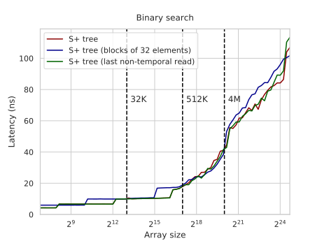

……但它们确实降低了延迟：

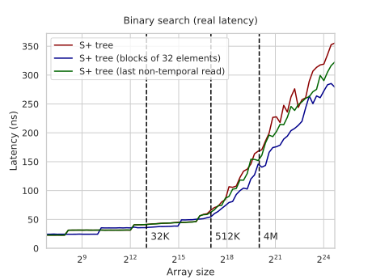

我还没能实现、但认为很有前景的想法有：

- 让块大小非均匀。动机在于：有一层 32 元素带来的减速，小于有两层独立层带来的减速。而且根经常不满，所以也许有时它应只有 8 个键、甚至只有 1 个键。为给定数组大小挑选最优的层配置，应当能去掉相对加速比图上的尖峰，让它看起来更像其包络上界。

  我知道如何用代码生成来做，但我选了通用方案，并试着用现代 C++ 的设施[实现](https://github.com/sslotin/amh-code/blob/main/binsearch/bplus-adaptive.cc)，但编译器无法用这种方式产生最优代码。
- 把节点与其一到两代后代（约 300 节点 / 约 5k 键）分组，使它们在内存中靠近——呼应 [FAST](http://kaldewey.com/pubs/FAST__SIGMOD10.pdf) 所谓的层级分块（hierarchical blocking）。这减轻了 TLB 缺失的严重性，也可能改善延迟，因为内存控制器可能选择保持[[AoS 与 SoA.md#填充式 AoS|RAM 行缓冲]]开放，预期局部读取。
- 可选地在特定层上使用预取。除了有 $\frac{1}{17}$ 的概率取到我们需要的节点外，如果数据总线不忙，硬件预取器也可能为我们取回它的一些邻居。它与分块有同样的 TLB 和行缓冲效应。

其它可能的小优化包括：

- 也对最后一层节点做置换——如果我们只需要下标而非值。
- 反转各层的存储顺序为自左向右，使头几层在同一页上。
- 用汇编重写整个东西，因为编译器似乎在指针运算上犯难。
- 用[[掩码与混合.md|混合]]代替 `packs`：你可以奇偶洗牌节点键（`[1 3 5 7] [2 4 6 8]`），与搜索键比较，然后混合第一个寄存器掩码的低 16 位与第二个寄存器掩码的高 16 位。混合在许多架构上稍快，也可能有助于在 packing 与 blending 间交替，因为它们用不同的端口子集。（感谢 HackerNews 上的 Const-me [提出](https://news.ycombinator.com/item?id=30381912)这个想法。）
- 用[[寄存器内重排.md#寄存器内重排|popcount]]代替 `tzcnt`：下标 `i` 等于小于 `x` 的键的数量，所以我们可以把 `x` 与所有键比较，用我们喜欢的任何方式合并向量掩码，调用 `maskmov`，然后用 `popcnt` 算置位位数。这免去了以任何特定顺序存键的需要，让我们能跳过置换步骤，也能在最后一层用这个流程。
- 把键 $i$ 定义为子节点 $i$ 子树里的*最大*键，而非子节点 $(i + 1)$ 子树里的*最小*键。正确性不变，但这保证结果会存在我们访问的最后一个节点里（而非下一个邻居节点的第一个元素），让我们能少取几条缓存行。

注意当前实现是特定于 AVX2 的，要适配其它平台可能需要一些不平凡的改动。把它移植到带 AVX-512 的 Intel CPU 和带 128 位 NEON 的 Arm CPU 会很有趣，而这可能需要一些[技巧](https://github.com/WebAssembly/simd/issues/131)才能工作。

<!--

Mobile and some older CPUs only have 128-bit wide registers, and some high-end CPUs have 512-bit registers. and some computers even have different cache line size. NEON would require some [trickery](https://github.com/WebAssembly/simd/issues/131)

-->

有了这些优化，我不会惊讶地看到在某些平台上有另外 10–30% 的提升，以及对大数组上 `std::lower_bound` 超过 10 倍的加速。

### 作为动态树

与 `std::set` 和其它基于指针的树相比，对比更加有利。在我们的基准里，我们加入相同的元素（不计入加入它们的时间），并用相同的下界查询，S+ 树快了至多 30 倍：

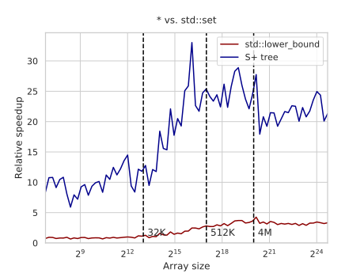

这表明我们大概也能用这种方法大幅改进*动态*搜索树。

为了验证这个假设，我为每个节点加了一个 17 元下标数组，指向它们子节点应在的位置，并用这个数组（而非通常的隐式编号）下行树。这个数组与树分离、未对齐、甚至不在大页上——我们做的唯一优化是预取一个节点的第一个和最后一个指针。

我还把 [Abseil 的 B 树](https://abseil.io/blog/20190812-btree)加入了对比，它是我所知唯一被广泛使用的 B 树实现。它只比 `std::lower_bound` 略好，而带指针的 S+ 树在大数组上快约 15 倍：

<!--

My next priorities is to adapt it to segment trees, which I know how to do, and to B-trees, which I don't exactly know how to do. But comparing to `std::set` hints that there may be up to 30x improvements:

`absl::btree_set`, the only widely-used B-tree implementation I know, is just slightly faster than binary search.

-->

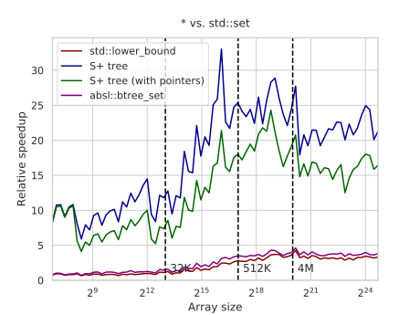

当然，这个对比并不公平，因为实现一棵动态搜索树是一个更高维的问题。

我们还需要实现更新操作，它不会那么高效，并且我们需要为此牺牲分叉因子。但似乎仍有可能实现比 `std::set` 快 10–20 倍、比 `absl::btree_set` 快 3–5 倍的结构，取决于你如何定义"更快"——而这正是我们[[搜索树.md|下一步要尝试]]的事。

<!--

A ~15x improvement is definitely worth it — and the memory overhead is not large, as we only need to store pointers (indices, actually) for internal nodes. It may be higher, because we need to fetch two separate memory blocks, or lower, because we need to handle updates somehow. Either way, this will be an interesting optimization problem.

though it's mostly due to the fact that data structures used in real databases have to support fast updates while we don't.

The problem has more dimensions.

-->

### 致谢

Cory Nelson 在 [StackOverflow 上的这个回答](https://stackoverflow.com/questions/20616605/using-simd-avx-sse-for-tree-traversal) 是我在置换 16 元素搜索技巧上的来源。

<!--

I stole some pictures from blogs and I can't find the originals.

-->
