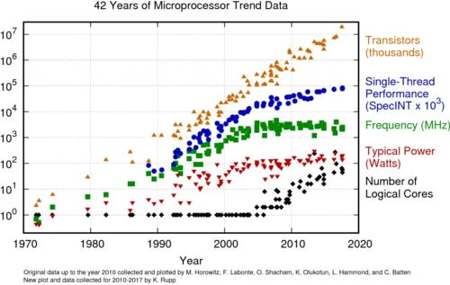

---
tags:
  - 现代硬件算法
  - 并行计算
created: 2026-09-11
source: https://en.algorithmica.org/hpc/parallel/
original_title: Parallel Computing
---

# 并行计算

经典的计算机科学算法致力于最小化*工作量（work）*：即完成任务所需的操作总数。

但是，计算机完成一项任务究竟执行了多少次算术运算，并不是人们真正关心的事情。此外，正如我们之前所见，由于计算机硬件本身的复杂性，工作量更少并不一定意味着运行时间更短，或消耗的资源更少。

我们真正关心的是运行时间，偶尔也关心计算成本（以 CPU 秒、瓦特，乃至直接的美元来计量）。

## 摩尔定律（Moore's Law）

*摩尔定律*由 [Gordon Moore](https://en.wikipedia.org/wiki/Gordon_Moore)（Intel 联合创始人兼前 CEO）提出，其内容为：微处理器中的晶体管数量大约每两年翻一番。从实践角度看，这大致意味着性能也翻一番。

在大部分计算历史中，厂商提升性能的主要手段，就是不断提高时钟频率。这之所以可行，是因为更精密的工艺使得芯片可以越做越小。然而在 2005 年前后，他们遇到了从晶圆上散除额外热量的根本性问题。以更高频率运行 CPU 不仅能效低下，而且在某个临界点之后物理上已不可能。

因此，在过去 20 年里，方向发生了转变。与其试图让每秒执行更多周期，不如让处理器在每个周期内完成更多有用的工作。我们已经在实践中看到了这方面的应用：流水线（pipelining）允许一定程度的交叠执行，而 SIMD 指令允许以小批量的方式处理数据。

但可扩展性更强的方案，是在晶圆上放置更多相互独立的核心，由它们完成各自独立的工作，并交换中间结果以进行同步。

## 多线程硬件

超线程（Hyperthreading）

每块主板上多个 CPU 插槽

你可以在 Google 上获得 400 个核心

SIMD

GPU
