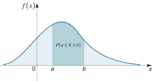
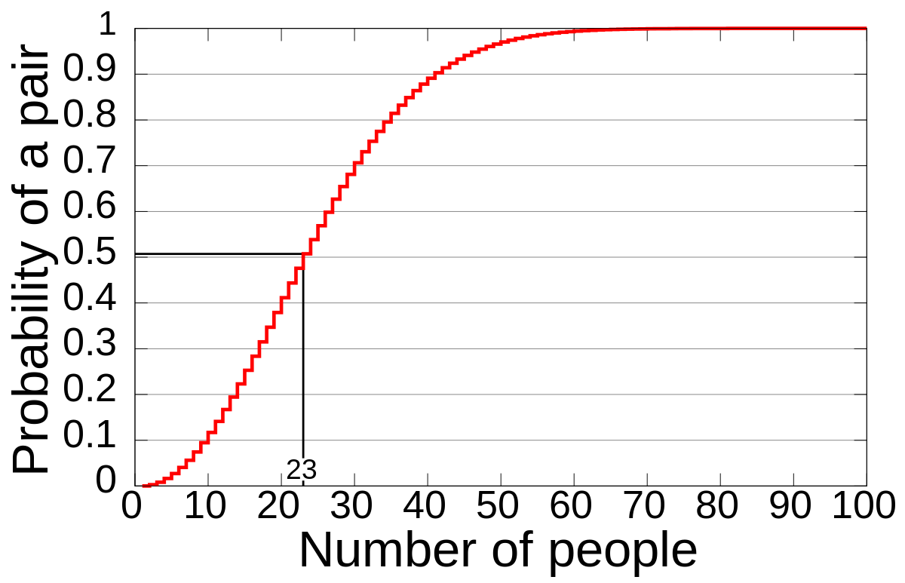
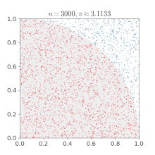
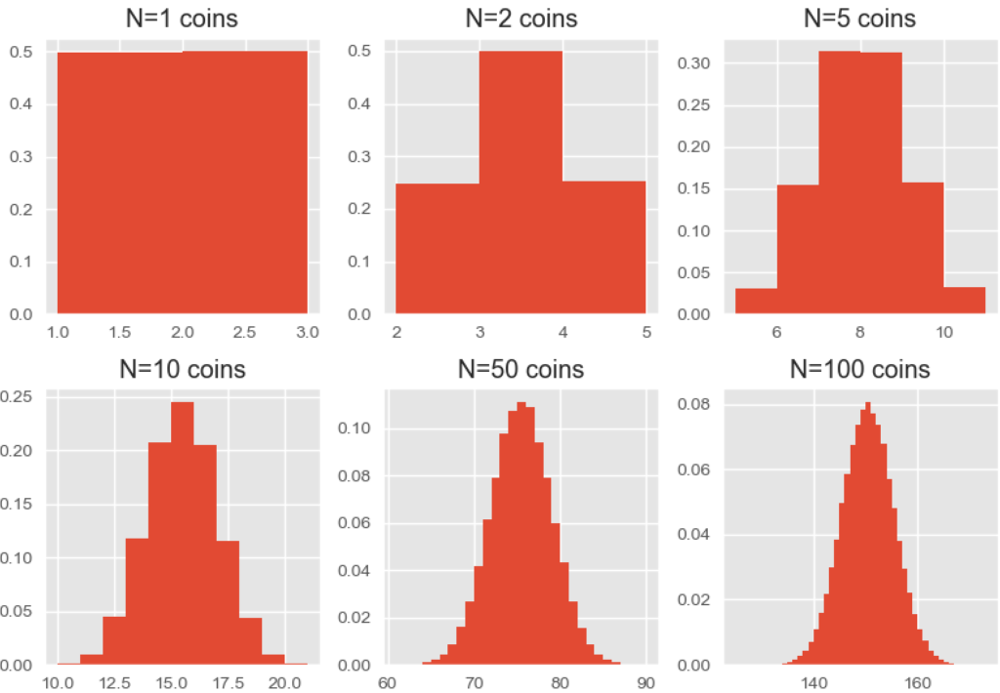

---
tags:
  - 现代硬件算法
  - 附录
created: 2026-09-11
source: https://en.algorithmica.org/hpc/stats/
original_title: Probability Theory Refresher
---

# 概率论速览

在本书中，我们将广泛使用概率论来设计更高效的算法并对其加以评估。本节是对计算机科学中统计学内容的一次简要回顾。其目标是带领读者从随机变量的定义一路推进到统计显著性与建模，且在此过程中不遗漏任何证明，大约耗时 40 分钟左右。

## 基础

**随机变量**（random variable）是指其值依赖于某个随机事件结果的变量。它可以用一组可能取值的集合 $S$（称为*样本空间*，sample space）以及一个将它们映射到各自概率的函数 $P$ 来刻画。任何满足以下性质的函数都可以作为概率函数：

1. $P$ 的定义域是 $X$ 的样本空间。
2. $\forall x \in X, 0 \leq P \leq 1$。
3. $\sum_{x \in X} P(x) = 1$。

例如，考虑一个具有 $k$ 个离散状态的随机变量 $X$（例如掷骰子的结果）。我们可以通过将其概率分布设为如下形式，从而在 $X$ 上施加*均匀分布*（uniform distribution）——即令其每个状态出现的可能性相等：

$$
P(x=x_i) = \frac{1}{k}
$$

随机变量可用于派生出另一个随机变量。**事件**（event）是样本空间的一个子集，其本身也是一个随机变量，具有两个状态，分别表示该事件是否发生；其中"发生"这一状态的概率，等于其子集内各事件的累积概率。

例如，在六面骰上掷出 4 点或以上的概率为：

$$
P(x \geq 4) = \frac{|\\{ 4, 5, 6 \\}|}{|X|} = \frac{3}{6} = \frac{1}{2}
$$

两个或多个事件的**联合概率**（joint probability）是它们同时发生的概率。若对所有 $x \in X$ 和 $y \in Y$ 都有 $p(x, y) = p(x) p(y)$，则称随机变量 $X$ 与 $Y$ 相互**独立**（independent），否则称它们**相关**（correlated）。

例如，先后两次掷同一枚骰子的结果被视为相互独立的，而人类的身高与体重则是相关的。需注意，相关并不意味着任何方向上的因果关系。

**观测值**（observation）是被观测到（即实际发生）的随机变量取值。**样本**（sample）是一组对某随机变量的独立观测值的集合。**统计量**（statistic）是由样本计算得到的任何量，例如均值或中位数。

一个变量的样本空间不必是有限的，甚至不必是离散的，但在这种情况下，我们需要调整概率分布的定义。例如，当我们从 $0$ 到 $1$ 之间均匀选取一个数时，每一个具体的实数结果被选中的概率都是 $0$（因为可选的数有无穷多个），因此我们不再使用概率函数，而是定义*概率密度*（probability density），它可用于计算某个数落在某一区间内的概率：

概率密度函数需满足类似的要求，只是针对连续情形：

$$
p(a \leq x \leq b) = \int_{a}{b} p(x) \\; dx
$$

为简化起见，我们将只考虑有限样本空间，但大多数结论都可以推广到一般情形。

## 期望

随机变量的**期望值**（expected value）直观上就是大量独立观测值的均值；在简单的有限情形下，它被定义为加权平均：

$$
E[X] = \sum_{i=1}^n x_i \cdot p_i = \mu
$$

例如，掷骰子的期望值为 $E[X] = \sum_{i=1}^k i \cdot \frac{1}{k} = \frac{k \cdot (k + 1)}{2} \frac{1}{k} = \frac{k+1}{2} = 3.5$，当样本量足够大时，它将接近于你所观测到的数值。

期望具有线性性质，即若 $a$ 为常数，则 $E[X+Y] = E[X] + E[Y]$ 且 $E[aX] = a E[X]$。后一性质是显然的，因为 $E[aX] = \sum a x_i p_i = a \sum a x_i p_i = a E[X]$；而前一性质则不那么直观：

$$
\begin{aligned}
E[X+Y]  & = \sum_{x, y} (x+y) p(x, y)
\\\     & = \sum_{x, y} x p(x, y) + \sum_{x, y} y p(x, y)
\\\     & = \sum_x x p(x) \sum_y p(y) + \sum_y y p(y) \sum_x p(x)
\\\     & = \sum_x x p(x) + \sum_y y p(y)
\\\     & =  E[X] + E[Y] 
\end{aligned}
$$

这一点很重要，因为它使得我们得以计算那些用其他方法推导起来会十分繁琐的均值。

### 排列的稳定点

例如，考虑一个长度为 $n$ 的随机排列，它从全部 $n!$ 个可能的排列中均匀抽取。该排列的*稳定点*（stable points）的期望数量是多少？所谓稳定点，即满足 $p_i = i$ 的下标 $i$。

我们不必走组合数学的老路——逐一统计具有 $0$、$1$、$2$…$n$ 个稳定点的排列数量再求加权和，而可以采用如下方法。构造 $n$ 个*指示变量*（indicators）$I_k$，分别对应每个可能位置上的稳定点，即：若 $p_i=i$ 则为 $1$、否则为 $0$ 的 $n$ 个随机变量。于是，稳定点的期望数量可表示为：

$$
E[X]
= E[\sum_k^n I_k]
= \sum_k^n E[I_k]
= \sum_k^n P(p_i=i)
= \sum_k^n \frac{1}{n}
= \frac{n}{n}
= 1
$$

尽管这些指示变量之间高度相关（考虑 $n=2$ 的情形：两个指示变量要么同时为 $1$，要么同时为 $0$），但每一个的期望都很容易计算，因为它就等于对应单个事件的概率（$E[I_k] = 1 \cdot P(p_i=i) + 0 \cdot P(p_i \neq i) = P(p_i=i) = \frac{1}{n}$）；而由于期望的线性性质，我们只需将这些期望直接相加即可。

### 快速排序的运行时间

快速排序（Quicksort）是一种常用的元素序列排序算法，其工作流程如下：

1. 从数组中选取一个随机元素 $p$（称为*基准*，pivot）。
2. 使用谓词 $a_i > p$ 将数组划分为两部分：第一部分包含不超过 $p$ 的所有元素，第二部分包含所有大于 $p$ 的元素。
3. 对每个划分出的子数组递归地进行排序。
4. 将排序后的子数组拼接起来，合并为单一数组。

为简化起见，我们假设所有元素互不相同。

其总运行时间为 $O(n \log n)$，但这一结论为何成立并非一目了然。"每次数组长度平均减半，因此总步数为 $O(\log n)$" 这一论证并不充分。需要注意的是，上述 4 个步骤都可以在与数组长度成正比的时间内完成。我们不去分析递归函数具体会变成什么样子，而是估计第 2 步中的比较总次数，用它来作为运行时间的代理指标。

具体而言，我们引入 $n^2$ 个指示变量 $I_{ij}$：若在某次比较中以 $i$ 为基准、将 $i$ 与 $j$ 作了比较，则 $I_{ij}=1$。在执行过程中的某个时刻，$i$ 与 $j$ 终将被分开，而这恰好发生在区间 $[i, j]$ 内的某个元素被选中为基准时；在此之前，该区间内的每个元素被选中的概率都相同。因此，$i$ 与 $j$ 被比较的概率，就等于 $i$ 在 $[i, j]$ 区间内被第一个选中的概率：

$$
p(i, j) = \frac{1}{|i - j| + 1}
$$

现在，为了得到总运行时间，我们需要将所有指示变量在所有数对上求和：

$$
\sum_{i,j} I_{ij} = \sum_{i,j} p(i, j) = \sum_{i,j} \frac{1}{|i - j| + 1} \leq n \sum_{k=1}^n \frac{2}{k} = \Theta(n \log n)
$$

最后一步转化成立，是因为这是一个调和级数的求和。

### 顺序统计量

快速排序有一个略有改动的版本，称为快选（quickselect），它能在 $O(n)$ 时间内找到第 $k$ 小的元素，当我们需要快速计算顺序统计量（order statistics），例如中位数或第 75 百分位数时非常有用。

1. 从数组中随机选取一个元素 $p$。
2. 使用谓词 $a_i > p$ 将数组划分为两个子数组 $L$ 和 $R$。
3. *若第一个数组中至少有 $k$ 个元素，则在该数组中递归查找第 $k$ 个元素，否则在右侧数组中递归查找第 $(k-|L|)$ 个元素。*

为何它能在线性时间内工作？

### 马尔可夫不等式

在概率论中，有几个重要的不等式可用于为某些量给出虽然宽松但仍然有用的上界——常用于证明之中。其中之一便是马尔可夫不等式（Markov's inequality）。它指出：对于非负随机变量 $X$ 和常数 $a > 0$，$X$ 至少为 $a$ 的概率至多为其期望值除以 $a$：

$$
P(X \geq a) \leq \frac{E[X]}{a}
$$

为证明这一点，考虑指示变量 $I_{X \geq a}$：当事件 $X \geq a$ 发生时其值为 $1$，当 $X < a$ 时其值为 $0$。于是，对于 $a > 0$：

$$
a I_{X \geq a} \leq X
$$

这一点很容易看出，只需考虑 $X \geq a$ 的两种可能结果。若它成立，则 $a \cdot 1 \leq X$，这正是我们的假设；若不成立，则 $a \cdot 0 \leq X$，由于 $X$ 非负，这也成立。

由于该不等式对所有 $X$ 的取值都成立，我们可以对其两边同时取期望，不等式依然成立：

$$
E[a I_{X \geq a}] \leq E[X]
$$

等号左边等同于：

$$
E[a I_{X \geq a}] = a E[I_{X \geq a}] = a P(X \geq a)
$$

于是我们得到：

$$
a P(X \geq a) \leq E[X]  \iff  P(X \geq a) \leq \frac{E[X]}{a}
$$

马尔可夫不等式给出了一些有用的上界。对于形如 $P(X < a)$ 的条件，可利用 $P(X < a) = 1 - P(X \geq a) \geq 1 - \frac{E[X]}{a}$ 这一事实得到下界。

### 生日问题

鸽巢原理（pigeonhole principle）指出：若将 $n$ 个物品放入 $m < n$ 个组中，则至少有一个组包含多于一个物品。

生日问题考虑的情形则是：组的数量足以容纳所有物品（$m \geq n$），但物品被随机分配到各组之中；它关注的是其中存在某对物品被分配到同一组的概率。

一个具体的例子是：在随机选取的 $n$ 个人中，存在某两个人生日相同的概率。在 23 人的群体中，至少有两个人生日相同的概率超过 50%；而在 70 人的群体中，这一概率至少为 99.9%。考虑到只有 23 个人、却要对应 366 个可能的生日，这一结果看似有违直觉；但你真正需要考虑的是，生日的比较是在每一对可能的个体之间进行的，因此共有 $23 \times 22 / 2 = 253$ 对需要比较，这已超过了全年天数的一半。

更一般地，令 $f(n, m)$ 表示*没有*发生生日冲突的概率，即 $f(n, m) = 1 - g(n, m)$，其中 $g(n, m)$ 才是我们真正想要的冲突概率。现在，考虑已有 $n-1$ 个生日互不相同的人，再加入第 $n$ 个人而不引发冲突的概率，这等价于不选中那 $(n-1)$ 个已被占用的生日中的任何一个：

$$
f(n, m) = f(n-1,m) \cdot (1 - \frac{n-1}{m})
$$

该式可以展开如下：

$$
\begin{aligned}
f(n, m) &= 1 \times (1-\frac{1}{m}) \times (1-\frac{2}{m}) \times ... \times (1-\frac{n-1}{m})
\\\     &= \frac{m \times (m-1) \times (m-2) \times \ldots \times (m-n+1)}{m^n}
\\\     &= \frac{m!}{m^n (m-n)!}
\end{aligned}
$$

这一乘积随着 $n$ 的增大下降得相当快，但要达到"安全"所需 $m$ 的具体取值尚不明朗。事实上，若 $n = O(\sqrt m)$，则冲突概率趋于零；而任何渐近意义上更大的取值都会保证发生冲突。这一点可以用微积分证明，但我们选择用概率论的方法。

让我们回到统计生日配对的思路，引入 $\frac{n \cdot (n-1)}{2}$ 个指示变量 $I_{ij}$——每一对 $(i, j)$ 人员对应一个——当两人生日相同时其值为 $1$。每个指示变量的概率与期望均为 $\frac{1}{m}$。

现在，考虑随机变量 $X$，其值为共享生日的对数。它等于这些指示变量之和，因此其期望值为：

$$
E[X] = E[\sum_{i < j} I_{ij}] = \sum_{i < j} E[I_{ij}] = \sum_{i < j} \frac{1}{m} = \frac{n \cdot (n-1)}{2} \cdot \frac{1}{m} = \Theta(\frac{n^2}{m})
$$

这意味着，除非 $m = \Theta(n^2)$，否则冲突的数量将趋于零或无穷大。

严格地说，这并不意味着至少发生一次冲突的概率趋于 $0$ 或 $1$，因为也有可能出现这样一种情况：几乎总是 $0$ 次冲突，或者几乎从不出现但一旦出现就是极大的数量，从而拉高平均值使其高于 1。为了完成证明，我们调用马尔可夫不等式：

$$
g(n, m) = P(X \geq 1) \leq \frac{E[X]}{1} = \Theta(\frac{n^2}{m})
$$

另一方面，由于 $P(X = 0) \leq E[X]$（这对任意 $X \geq 0$ 都成立；可尝试将所有 $x \geq 1$ 替换为 $1$）：

$$
g(n, m) = P(X \geq 1) = 1 - P(X = 0) \geq 1 - \Theta(\frac{n^2}{m})
$$

综合起来可知：当 $m \ll n^2$ 时 $g(n, m) \to 1$，而当 $m \gg n^2$ 时 $g(n, m) \to 0$。

## 方差

**离散程度**（dispersion）衡量的是一个分布有多"嘈杂"。度量它的方法有多种，其中最常用的是**方差**（variance），即随机变量离差平方的期望：

$$
Var[X] = E[(X - E[X])^2] = \sigma^2
$$

**标准差**（standard deviation）记为 $\sigma$，等于方差的平方根，它在实际中作为统计量被更频繁地使用——因为至少它与原变量具有相同的量纲；而方差则拥有一些有用的数学性质。

经过简单的代数运算，我们可以推导出方差一个更易计算的公式：

$$
\begin{aligned}
Var(X) &= E[ (X - E[ X ])^2 ]
\\\    &= E[ X^2 - 2X E[ X ] + E[ X ]^2 ]
\\\    &= E[ X^2 ] - 2 E[ X ] E[ X ] + E[ X ]^2
\\\    &= E[ X^2 ] - E[ X ]^2
\end{aligned}
$$

均值与方差的一个妙处在于，它们可以依据简单的规则进行加减和数乘，这使得我们能够轻松得到派生随机变量的某些有用性质。

具体而言，若 $Var(X) = \sigma^2$，则当我们将 $X$ 乘以常数 $a$ 时：

$$
Var(aX) = E[(aX - E[ aX ])^2] = a^2 E[ (X - E[ X ])^2] = a^2 Var(X)
$$

若将两个*独立*的随机变量 $X$ 与 $Y$ 相加：

$$
\begin{aligned}
Var(X + Y) &= E[ (X+Y)^2 ] - E[X+Y]^2
\\\        &= E[ X^2 + 2XY + Y^2] - (E[X] + E[Y])^2 
\\\        &= E[X^2] + 2 E[XY] + E[Y^2] - (E[X]^2 + 2 E[X] E[Y] + E[Y]^2) 
\\\        &= E[X^2] - E[X]^2 + E[Y^2] - E[Y^2]
\\\        &= Var(X) + Var(Y)
\end{aligned}
$$

这里我们用到了一个事实：对于独立的 $X$ 与 $Y$，有 $E[XY] = E[X] E[Y]$，因此 $2 E[XY]$ 与 $2 E[X] E[Y]$ 相互抵消。一般而言这并不成立：例如，可能出现 $Y = -X$ 的情况，此时 $X$ 偏离均值的偏差会抵消 $Y$ 的偏差，使得 $X+Y$ 的方差为零。

对于相关的变量，和的方差则为：

$$
Var(X + Y) = Var(X) + Var(Y) + 2 \cdot cov(X, Y)
$$

其中 $cov(X, Y)$ 即为**协方差**（covariance）：

$$
\begin{aligned}
cov(X, Y) &= E[(X-E[X])(Y-E[Y])]
\\\       &= E[XY] - E[X] E[Y] - E[Y] E[X] + E[X] E[Y]
\\\       &= E[XY] - E[X]E[Y]
\end{aligned}
$$

如果我们对 $n$ 个独立同分布、方差为 $\sigma^2$ 的随机变量求平均，其方差是多少？我们需要先将这 $n$ 个变量相加，此时和的方差为：

$$
Var(\sum_{i=1}^n X_i) = \sum_{i=1}^n Var(X_i) = n \sigma^2
$$

随后，当我们除以 $n$ 以得到均值：

$$
Var(\frac{1}{n} \sum_{i=1}^n X_i) = \frac{1}{n^2} Var(\sum_{i=1}^n X_i) = \frac{n\sigma^2}{n^2} = \frac{\sigma^2}{n}
$$

这被称为*大数定律*（law of large numbers）：方差随 $n$ 增大而趋于零，这意味着随着试验次数增多，大量试验结果的平均值将收敛到其期望值。我们将在后续进一步探讨其确切含义。

### 切比雪夫不等式

设 $X$ 是一个期望为 $\mu$、方差为 $\sigma^2 > 0$ 的随机变量。则对任意 $k > 0$：

$$
P(|X-\mu| \geq k \sigma) \leq \frac{1}{k^2}
$$

这被称为切比雪夫不等式（Chebyshev's inequality），它给出了随机变量取值偏离均值超过 $k$ 个标准差的概率的上界。只有 $k > 1$ 的情形是有用的；例如，它保证了无论分布如何：

- 50% 的结果将落在距均值 $\sqrt 2 \cdot \sigma$ 之内，
- 75% 的结果将落在距均值 $2 \cdot \sigma$ 之内，
- 99% 的结果将落在距均值 $10 \cdot \sigma$ 之内，依此类推。

该不等式可直接由马尔可夫不等式应用于随机变量 $(X-\mu)^2$ 与 $a=(k\sigma)^2$ 得到：

$$
P(|X-\mu| \geq k \sigma) = P((X-\mu)^2 \geq (k\sigma)^2) \leq \frac{E((X-\mu)^2)}{(k \sigma)^2} = \frac{\sigma^2}{k^2\sigma^2} = \frac{1}{k^2}
$$

这个界相当宽松：结果往往更可能密集分布在均值附近，但它对证明而言依然非常有用。

### 蒙特卡洛方法

考虑如下问题。给定一张城市地图（为简化起见，假设它就是一个单位正方形）以及一份信号塔坐标及其覆盖范围的列表。你需要计算它们的覆盖率，即在城市中至少有一个信号塔在其覆盖范围内的点的比例。

我们可以将问题更简洁地重新表述为：计算单位正方形与一组圆的并集的交集面积。这一问题存在精确但极其困难的求解方法，它需要先计算出任意两个图形相交的所有"兴趣点"，再从左到右对地图进行扫描，并在每一段无交集的区间上做复杂的积分。该解法能达到浮点运算所允许的精度，但速度缓慢且实现起来十分繁琐，除非你是计算几何方面的专家。

我们可以换一种做法：从正方形中随机选取若干个点，并用简单的谓词 $(x-x_i)^2 + (y-y_i)^2 \leq r_i^2$ 逐一检查它们是否被某个圆覆盖。那么，被覆盖的点所占的比例，就是我们对真实答案的估计；在取点足够多的情况下，结果应当相当接近。

但是，如果我们对答案的精度有形式化的要求——例如，希望至少有 99% 的概率得到 3 位有效数字——那么我们需要多少个点？我们可以估计近似结果的方差，再将其代入切比雪夫不等式。

我们的估计量 $X$ 是 $n$ 个指示变量 $I_k$ 的平均值，每个 $I_k$ 在被采样点被某个圆覆盖时取值为 $1$。若被覆盖区域的面积为 $p$，则每个指示变量的方差为 $p \cdot (1-p) + (1 - p) \cdot p = 2 p \cdot (1 - p)$，其最大值为 $\frac{1}{2}$，并在 $p = \frac{1}{2}$ 时达到。

由于各次试验相互独立，估计量的方差至多为：

$$
Var(X) = Var(\frac{1}{n} \sum_{k=1}^n I_k) = \frac{1}{n^2} \sum_{k=1}^n Var(I_k) \leq \frac{1}{n^2} \frac{n}{2} = \frac{1}{2 \cdot n}
$$

现在，切比雪夫不等式告诉我们：

$$
P(|X-\mu| \geq k \sigma) \leq \frac{1}{k^2}
$$

这意味着，对于固定的可容许错误率 $\frac{1}{k^2}$ 和期望的偏差上界 $d = k \sigma$，随机变量 $X$ 的标准差至多需为 $\frac{d}{k}$。另一方面，由于 $Var(X) = \sigma^2 \leq \frac{1}{2 \cdot n}$，标准差满足 $\sigma \leq \frac{1}{\sqrt{2 \cdot n}}$。因此，若

$$
\sigma \leq \frac{1}{\sqrt{2 \cdot n}} \leq \frac{d}{k}
$$

我们便能达到所需的精度；求解 $n$ 可得：

$$
n \geq \frac{k^2}{2 \cdot d^2}
$$

这关键地意味着 $n = \Theta(d^{-2})$。直观地说，这意味着要获得 $k$ 位小数的精度（$d = 10^{-k}$），我们需要进行 $n = \Theta(10^{2k})$ 次试验。

这类算法被称为蒙特卡洛方法（Monte-Carlo methods）。此外还有拉斯维加斯方法（Las-Vegas methods），它们总是给出正确结果，但耗时是非确定性的。快速排序便是一例。

## 贝叶斯法则

$$
P(A|B) = \frac{P(B|A)P(A)}{P(B)}
$$

### 置信区间

有一个略微超出本教程范围的定理指出：如果我们持续将分布相加，那么所得的分布最终将收敛到所谓的正态分布（normal distribution）：

对于呈"钟形"曲线的数据，约 68% 的数值落在距均值一个标准差之内，约 95% 落在距均值两个标准差之内，超过 99% 落在距均值三个标准差之内。

$$
f(x) = \frac{1}{\sigma \sqrt{2\pi} } e^{-\frac{1}{2}\left(\frac{x-\mu}{\sigma}\right)^2}
$$

我们在此需要了解的就是这些内容。

### A/B 测试

出口民调（exit polls）。
