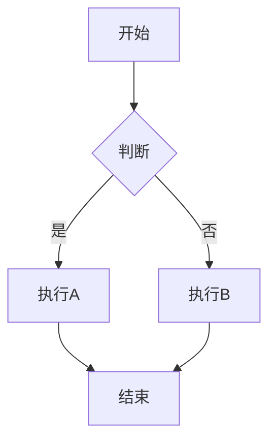

# Obsidian 完全使用指南

> **目标**: 从零基础到日常高级使用，覆盖 Obsidian 所有核心功能和进阶技巧。

---

## 📖 目录

1. [核心哲学与基础概念](#1-核心哲学与基础概念)
2. [编辑器全功能详解](#2-编辑器全功能详解)
3. [Markdown 增强语法](#3-markdown-增强语法)
4. [核心插件逐一详解](#4-核心插件逐一详解)
5. [社区插件深度指南](#5-社区插件深度指南)
6. [快捷键完全速查](#6-快捷键完全速查)
7. [搜索与 Dataview 查询](#7-搜索与-dataview-查询)
8. [外观定制与主题](#8-外观定制与主题)
9. [同步、备份与发布](#9-同步备份与发布)
10. [进阶工作流与最佳实践](#10-进阶工作流与最佳实践)

---

## 1. 核心哲学与基础概念

### 1.1 什么是 Obsidian？

Obsidian 是一个**基于本地 Markdown 文件的第二大脑**知识管理工具。核心理念：

| 原则 | 说明 |
| :--- | :--- |
| **本地优先** | 所有数据存为 `.md` 纯文本文件，永远归你所有 |
| **链接为王** | 通过 `[[双向链接]]` 在笔记之间建立关联网络 |
| **可扩展** | 核心精简，通过插件系统按需添加功能 |
| **离线可用** | 完全离线工作，不依赖云服务 |

### 1.2 Vault（仓库）

- **Vault** = 一个文件夹 = 一个知识库
- 可以拥有多个 Vault（如：工作、学习、个人）
- 每个 Vault 有独立的 `.obsidian/` 配置目录
- 你的当前 Vault 结构：

```
Vault/
├── 00_Inbox/          # 收件箱：快速记录，稍后整理
├── 01_数学/            # 知识主题 1
├── 02_DSP/            # 知识主题 2
├── 03_计算机组成原理/    # 知识主题 3
├── 04_音频算法/         # 知识主题 4
├── 05_编程/            # 知识主题 5
├── 06_英语/            # 知识主题 6
├── 07_工具/            # 工具使用笔记
├── 99_Archive/         # 归档：不再活跃的内容
└── .obsidian/         # Vault 配置文件（不要手动删除）
```

### 1.3 `.obsidian/` 配置目录

| 文件/文件夹 | 作用 |
| :--- | :--- |
| `app.json` | 编辑器外观、行为设置 |
| `appearance.json` | 主题、字体、CSS 片段设置 |
| `hotkeys.json` | 自定义快捷键 |
| `core-plugins.json` | 核心插件开关状态 |
| `community-plugins.json` | 社区插件列表与开关 |
| `templates.json` | 模板文件夹配置 |
| `snippets/` | 自定义 CSS 片段 |
| `themes/` | 已安装的主题 |

---

## 2. 编辑器全功能详解

### 2.1 三种视图模式

| 模式 | 快捷键 | 说明 |
| :--- | :--- | :--- |
| **实时预览 (Live Preview)** | 默认模式 | 所见即所得，Markdown 语法即时渲染 |
| **源码模式 (Source Mode)** | `Cmd/Ctrl` + `E` | 显示原始 Markdown 代码 |
| **阅读模式 (Reading View)** | `Cmd/Ctrl` + `E` | 完全渲染的只读视图 |

> **💡 建议**: 日常写作使用"实时预览"模式；批量编辑/正则替换时切到"源码模式"。

### 2.2 面板管理（Panes）

Obsidian 支持任意分屏，每个分屏叫做一个 **Pane**：

| 操作 | 快捷键 | 说明 |
| :--- | :--- | :--- |
| 垂直分屏 | `Cmd/Ctrl` + `\` | 左右分屏 |
| 水平分屏 | `Cmd/Ctrl` + `Shift` + `\` | 上下分屏（需在快捷键设置中配置） |
| 关闭当前面板 | `Cmd/Ctrl` + `W` | 关闭当前面板 |
| 聚焦切换 | `Cmd/Ctrl` + `Shift` + `←/→` | 在面板之间移动焦点 |
| 拖拽分屏 | 按住 `Cmd/Ctrl` + 点击链接 | 在新面板打开链接 |
| 拖拽重排 | 拖拽标签页标题 | 重新排列面板布局 |

### 2.3 多标签页

- 右键标签页 → 固定（Pin）、复制、关闭
- 按顺序切换: `Cmd/Ctrl` + `Tab`
- 跳转到特定标签: `Cmd/Ctrl` + `1~9`
- 关闭当前标签: `Cmd/Ctrl` + `W`
- 恢复刚关闭的标签: `Cmd/Ctrl` + `Shift` + `T`

### 2.4 折叠与大纲

| 操作 | 说明 |
| :--- | :--- |
| `Cmd/Ctrl` + `↑/↓` | 折叠/展开当前标题区域 |
| `Cmd/Ctrl` + `Shift` + `↑/↓` | 折叠/展开所有标题 |
| 侧边栏 → 大纲面板 | 显示当前文档的完整目录树，点击跳转 |

### 2.5 多光标与批量编辑

| 操作 | 快捷键 |
| :--- | :--- |
| 添加光标 | `Alt/Option` + `点击` |
| 向上添加光标 | `Cmd/Ctrl` + `Alt/Option` + `↑` |
| 向下添加光标 | `Cmd/Ctrl` + `Alt/Option` + `↓` |
| 选中下一个相同词 | `Cmd/Ctrl` + `D` |
| 选中所有相同词 | `Cmd/Ctrl` + `Shift` + `L` |

---

## 3. Markdown 增强语法

Obsidian 在标准 Markdown 基础上增加了许多 "Obsidian Flavored Markdown" 语法。

### 3.1 内部链接（Wiki-links）

```markdown
[[笔记名]]                      → 链接到同 Vault 内的笔记
[[笔记名|显示文本]]               → 自定义显示文字
[[笔记名#标题]]                  → 链接到笔记内的特定标题
[[笔记名#^段落ID]]               → 链接到笔记内的特定段落
[[文件夹/笔记名]]                → 链接到子文件夹中的笔记
```

**自动补全**: 输入 `[[` 后会自动弹出候选笔记列表，支持模糊搜索。

**重命名自动更新**: 重命名笔记时，Obsidian 会自动更新所有引用该笔记的链接。

### 3.2 嵌入（Embeds）

将其他笔记或文件的内容直接渲染在当前笔记中：

```markdown
![[笔记名]]                      → 嵌入整个笔记
![[笔记名#标题]]                  → 嵌入笔记的特定区域
![[image.png]]                  → 嵌入图片
![[audio.mp3]]                  → 嵌入音频
![[video.mp4]]                  → 嵌入视频
![[pdf-file.pdf]]               → 嵌入 PDF（可翻页）
```

> **💡 嵌入 vs 链接**: `![[文件]]` 是嵌入（显示内容），`[[文件]]` 是链接（点击跳转）。

### 3.3 Callout（标注框）

使用 `> [!type]` 创建信息框，支持折叠：

```markdown
> [!note] 标题
> 这是一个笔记框。

> [!info]
> 这是一个信息框。

> [!warning] 注意
> 这是一个警告框。

> [!danger] 危险
> 这是一个危险提示框。

> [!tip] 技巧
> 这是一个小技巧。

> [!question] 问题
> 这是一个问题框。

> [!example]
> 这是一个示例框。

> [!quote]
> 这是一个引用框。

> [!success]
> 这是一个成功/完成框。

> [!failure]
> 这是一个失败/错误框。

> [!abstract]
> 这是一个摘要框。
```

**可折叠 Callout**：在类型后加 `+` 或 `-`：

```markdown
> [!tip]+ 点我展开
> 默认折叠的提示内容。

> [!note]- 默认展开可折叠
> 默认显示但可以折叠的内容。
```

### 3.4 标签（Tags）

```markdown
#tag-name                       → 全局标签
#folder/sub-tag                 → 嵌套标签
在 frontmatter 中: tags: [obsidian, 教程]
```

- 标签面板（右侧边栏）可以按标签浏览笔记
- 标签自动补全
- 支持中文标签（但推荐用英文，兼容性更好）

### 3.5 属性 / Frontmatter

每篇笔记顶部的 YAML 元数据块：

```yaml
---
title: 我的笔记
date: 2026-06-23
tags: [obsidian, 教程]
aliases: [别名1, 别名2]
cssclasses: [custom-class]
---
```

**属性面板**（设置 → 编辑器 → 显示属性）会在文档顶部显示可交互的表单视图，方便编辑元数据。

> **`aliases`（别名）特别有用**: 添加别名后，搜 `别名1` 也能找到这篇笔记。

### 3.6 脚注（Footnotes）

```markdown
这是一个需要注释的句子。[^1]

[^1]: 这是脚注内容，会显示在文档末尾。
```

支持内联脚注：`^[这是内联脚注]`

### 3.7 数学公式（LaTeX）

用 `$...$` 行内公式，`$$...$$` 块级公式：

```markdown
行内: $E = mc^2$

块级:
$$
\sum_{i=1}^{n} x_i = x_1 + x_2 + \cdots + x_n
$$
```

> 依赖 **obsidian-latex** 社区插件（你已安装）。

### 3.8 Mermaid 图表

用 \`\`\`mermaid 创建流程图、时序图、甘特图等：

````markdown

````

支持的图表类型：`graph`（流程图）、`sequenceDiagram`（时序图）、`classDiagram`（类图）、`gantt`（甘特图）、`pie`（饼图）、`mindmap`（思维导图）。

### 3.9 任务列表

```markdown
- [ ] 未完成的任务
- [x] 已完成的任务
- [>] 推迟的任务
- [?] 未知状态
- [-] 取消的任务
```

### 3.10 高亮文本

```markdown
==这段文字会被高亮显示==
```

> 依赖 **highlightr-plugin** 社区插件获得彩色高亮（你已安装）。

### 3.11 评论（Comments）

```markdown
这是一行可见文本。%%这是一行注释，在阅读模式下不可见%%

%%
这是一段
多行注释
%%
```

---

## 4. 核心插件逐一详解

核心插件是 Obsidian 内置的，默认开启或可手动开启。

### 4.1 快速切换（Quick Switcher）

- **快捷键**: `Cmd/Ctrl` + `O`
- 输入关键词快速跳转到任意笔记
- 输入 `@` 搜索标题（headings）
- 输入 `#` 搜索标签
- 支持模糊匹配，无需完整拼写

### 4.2 命令面板（Command Palette）

- **快捷键**: `Cmd/Ctrl` + `P`
- 执行所有 Obsidian 命令（包括插件命令）
- 每个命令右侧显示快捷键（如果已分配）
- 输入关键词过滤命令

### 4.3 关系图谱（Graph View）

- 打开方式: `Cmd/Ctrl` + `G` 或左侧功能按钮
- **本地图谱**: 显示当前笔记的直接关联
- **全局图谱**: 显示整个 Vault 的笔记关联网络
- 交互: 拖拽节点、缩放、鼠标悬停预览
- 支持按文件夹/标签/搜索词分组上色

### 4.4 反向链接（Backlinks）

- 右侧边栏或文档底部
- 显示**哪些笔记引用了当前笔记**
- 分为"已链接"和"未链接提及"两部分
- "未链接提及"显示包含当前笔记名但没加 `[[ ]]` 的地方

> **💡 这是 Obsidian 最具价值的核心功能之一**，帮你发现隐含的知识关联。

### 4.5 出链（Outgoing Links）

- 右侧边栏或文档底部
- 显示**当前笔记引用了哪些笔记**
- 帮助你理解当前笔记的知识网络

### 4.6 标签面板（Tag Pane）

- 右侧边栏
- 按树形结构展示所有标签
- 点击标签即可搜索相关笔记
- 显示每个标签的笔记数量

### 4.7 大纲（Outline）

- 右侧边栏
- 自动生成当前笔记的标题树
- 点击标题跳转到对应位置
- 拖拽标题可以重新排列内容

### 4.8 星标（Starred）

- 左侧边栏
- 收藏重要笔记，快速访问
- 支持拖拽排序
- 新版已升级为**书签（Bookmarks）**，可收藏笔记、标题、搜索词、图谱等

### 4.9 Canvas（白板）

- 创建方式: 新建文件 → Canvas，或右键文件夹
- 一个无限画布，可放置：
  - **笔记卡片**: 拖拽笔记到 Canvas
  - **媒体卡片**: 图片、PDF、网页嵌入
  - **自由文本卡片**: 写任意文字
- 用连线（Edges）连接卡片，标注关系
- 支持分组框（Group）整理卡片

> **你的额外插件**: `advanced-canvas` 和 `excalidraw-extras` 进一步增强了 Canvas 功能。

### 4.10 日记（Daily Notes）

- 设置指定日记文件夹和模板
- 点击左侧日历图标或使用快捷键打开今日日记
- 配合 **Calendar 插件**（你已安装）可以在日历视图浏览日记
- 模板变量: `{{date}}`、`{{time}}`、`{{title}}`

### 4.11 模板（Templates）

- 设置模板文件夹
- 创建包含前置 YAML + 结构的模板文件
- 在模板中插入变量: `{{title}}`、`{{date}}`、`{{time}}`

**模板示例**：
```markdown
---
date: {{date}}
tags: []
---

# {{title}}

## 核心内容


## 相关笔记

- 
```

### 4.12 随机笔记（Random Note）

- 命令面板 → "Open random note"
- 随机打开一篇笔记，帮助发现遗忘的知识

### 4.13 录音（Audio Recorder）

- 右下角状态栏点击麦克风图标
- 录音文件保存到设置的附件文件夹
- 录音过程中可继续编辑笔记

### 4.14 幻灯片（Slides）

- 用 `---` 分隔幻灯片页面
- 开始演示: 命令面板 → "Start presentation"
- 支持 `<!-- slide -->` 进行更细粒度的分页控制

### 4.15 字数统计（Word Count）

- 右下角状态栏显示
- 点击可查看更详细统计（字符数、段落数、阅读时间）

### 4.16 文件恢复（File Recovery）

- 自动保存文件快照
- 崩溃后可恢复未保存的修改
- 设置中可调整快照间隔

---

## 5. 社区插件深度指南

以下是你的 Vault 中已安装的社区插件，逐一详细说明：

### 5.1 Calendar（日历）

> 与日记功能协同工作的日历视图。

- **打开方式**: 左侧功能按钮或命令面板 → "Calendar: Open view"
- 日历上每天会显示一个点（如果当天有日记）
- 点击日期打开对应日记
- **周记支持**: 设置中可启用周刊（Weekly Note）

### 5.2 Excalidraw（白板绘图）

> 专业级手绘/图表工具，比原生 Canvas 更强大。

- **创建文件**: 新建文件 → Excalidraw drawing
- 提供自由手绘、形状、连线、文字等工具
- 拥有庞大的**素材库**（Library）
- 支持导出为 PNG/SVG
- 可嵌入 Markdown 笔记: `![[drawing.excalidraw]]`
- **脚本引擎**: 支持自动化绘图脚本

### 5.3 Advanced Canvas（增强白板）

- 增强原生 Canvas 的功能：
  - 更好的节点样式控制
  - 更多的连线类型
  - 节点分组和锁定
  - 快捷键优化

### 5.4 Excalidraw Extras

- Excalidraw 的扩展功能包：
  - 更多形状和模板
  - 与 Canvas 的增强集成
  - 自动化布局工具

### 5.5 Execute Code（代码执行）

> 在笔记中直接运行代码块。

- **使用方法**: 创建代码块，然后 `Cmd/Ctrl` + `Enter` 或点击运行按钮
- 支持语言: Python, JavaScript, R, Shell, C/C++, 等
- 输出显示在执行按钮下方
- **设置**: 可配置各语言的解释器路径

```python
# 在笔记中直接运行！
print("Hello from Obsidian")
```

### 5.6 Obsidian Git

> 通过 Git 进行版本控制和备份。

- **自动备份**: 设置自动 commit + push 间隔（如每 30 分钟）
- **手动操作**: 命令面板 → "Obsidian Git: Create backup"
- **历史查看**: `Cmd/Ctrl` + `P` → "Obsidian Git: Open history view"
- **冲突解决**: 内置 diff 视图解决合并冲突

**关键设置**:
- `Auto backup interval` (minutes): 0 表示禁用自动备份
- `Auto pull interval` (minutes): 多设备同步时自动拉取
- `Commit message`: 自定义提交信息模板

### 5.7 Easy Typing（Easy Typing  Obsidian）

> 优化中文写作体验的自动格式化插件。

**功能清单**:

| 功能 | 说明 |
| :--- | :--- |
| 中英文间自动加空格 | `中文English中文` → `中文 English 中文` |
| 中英文符号间加空格 | 对标点符号的智能处理 |
| 英文首字母大写 | `hello world. this is...` → `Hello world. This is...` |
| 标点符号转换 | 可自定义半角/全角转换规则 |
| 英文引号配对 | `'` 自动配对为 `''` |
| 自定义正则替换 | 支持用户定义的高级替换规则 |

### 5.8 Highlightr（彩色高亮）

> 丰富的文本高亮颜色。

- 选中文本后选择颜色高亮
- 多个预设颜色主题
- 快捷键快速应用高亮
- 支持自定义高亮颜色和样式

### 5.9 Mousewheel Image Zoom（鼠标滚轮缩放）

> 按住快捷键 + 鼠标滚轮即可缩放图片。

- **使用方法**: 光标悬停在图片上 → 按住 `Alt/Option` + 滚轮
- 支持设置最大/最小缩放比例
- 支持按住拖动图片

### 5.10 Fast Text Color（快速文字颜色）

> 快速为文字添加颜色。

- 选中文字 → 选择颜色 → 自动添加 HTML 颜色标签
- 多种颜色预设
- 与 Highlightr 互补使用

### 5.11 Image Toolkit（图片工具箱）

> 全面增强图片处理的社区插件。

- **点击放大**: 点击图片以灯箱模式查看
- **旋转/缩放**: 图片查看时的交互操作
- **对齐**: 左对齐、居中、右对齐
- **自定义尺寸**: `![[image.png|300]]` 设置宽度
- **图片边框/阴影**: 自定义 CSS 样式

### 5.12 LaTeX（数学公式增强）

> 增强 LaTeX 数学公式渲染。

- 支持更多 LaTeX 宏包
- 更快的公式渲染速度
- 自定义 preamble（宏定义）
- 实时预览公式

### 5.13 RealClaudian（Claude AI 助手）⭐

> **你的 AI 助手**，即当前与你对话的插件。

**核心能力**:
- 笔记创作、编辑、整理
- 知识库问答与搜索
- 代码分析与优化
- 多文件操作
- Canvas / Base 文件支持
- 网页内容提取与分析

### 5.14 其他推荐社区插件（可选安装）

| 插件名 | 功能 | 推荐理由 |
| :--- | :--- | :--- |
| **Dataview** | 将 Vault 变成可查询数据库 | 对笔记进行 SQL 式查询，自动生成列表和表格 |
| **Kanban** | 看板视图 | 在笔记中创建任务看板 |
| **Tasks** | 任务管理增强 | 全局任务收集、日期管理、优先级 |
| **Quick Add** | 快速捕获 | 一键添加新笔记/任务到指定文件 |
| **Paste URL into selection** | 粘贴链接 | 选中文字 → 粘贴 URL → 自动转 Markdown 链接 |
| **Style Settings** | 主题自定义 | 在设置面板中调整主题的各种参数 |
| **Commander** | 自定义按钮 | 在界面任意位置添加命令按钮 |
| **Remember cursor position** | 记住光标 | 重新打开文件时恢复上次光标位置 |
| **File Explorer Note Count** | 文件计数 | 文件夹旁边显示文件数量 |

---

## 6. 快捷键完全速查

### 6.1 全局快捷键

| 快捷键 | 功能 |
| :--- | :--- |
| `Cmd/Ctrl` + `P` | 打开命令面板 |
| `Cmd/Ctrl` + `O` | 快速切换文件 |
| `Cmd/Ctrl` + `G` | 打开关系图谱 |
| `Cmd/Ctrl` + `E` | 切换编辑/阅读模式 |
| `Cmd/Ctrl` + `,` | 打开设置 |
| `Cmd/Ctrl` + `Shift` + `F` | 全局搜索 |
| `Cmd/Ctrl` + `Shift` + `V` | 新建 Canvas（白板） |

### 6.2 编辑快捷键

| 快捷键 | 功能 |
| :--- | :--- |
| `Cmd/Ctrl` + `B` | **加粗** |
| `Cmd/Ctrl` + `I` | *斜体* |
| `Cmd/Ctrl` + `K` | 插入链接 |
| `Cmd/Ctrl` + `Enter` | 快速插入 `[[` |
| `Shift` + `Enter` | 软换行（不产生新段落） |
| `Cmd/Ctrl` + `Z` | 撤销 |
| `Cmd/Ctrl` + `Shift` + `Z` | 重做 |
| `Cmd/Ctrl` + `F` | 当前文档内搜索 |
| `Cmd/Ctrl` + `Shift` + `R` | 当前文档内替换 |
| `Cmd/Ctrl` + `D` | 选中下一个相同词 |
| `Cmd/Ctrl` + `]` | 缩进 |
| `Cmd/Ctrl` + `[` | 减少缩进 |
| `Tab` | 缩进（列表项内） |

### 6.3 面板与导航快捷键

| 快捷键 | 功能 |
| :--- | :--- |
| `Cmd/Ctrl` + `\` | 垂直分屏 |
| `Cmd/Ctrl` + `W` | 关闭当前面板 |
| `Cmd/Ctrl` + `Shift` + `T` | 恢复关闭的标签 |
| `Cmd/Ctrl` + `Tab` | 切换标签（按顺序） |
| `Cmd/Ctrl` + `1~9` | 跳转到第 N 个标签 |
| `Cmd/Ctrl` + `Shift` + `↑/↓` | 折叠/展开所有标题 |
| `Cmd/Ctrl` + `←/→` | 前进/后退（浏览历史） |
| `Cmd/Ctrl` + `Shift` + `←/→` | 焦点在面板间移动 |

### 6.4 搜索语法

在全局搜索框中使用的增强语法：

| 语法 | 说明 | 示例 |
| :--- | :--- | :--- |
| `"精确短语"` | 匹配完整短语 | `"machine learning"` |
| `path:` | 按路径过滤 | `path:07_工具` |
| `file:` | 按文件名过滤 | `file:Obsidian` |
| `tag:` | 按标签过滤 | `tag:#obsidian` |
| `line:` | 按行搜索 | `line:(import torch)` |
| `section:` | 按节标题 | `section:(## 核心概念)` |
| `task:` | 搜索任务 | `task-todo:"未完成"` |
| `task:` | 已完成任务 | `task-done:"已完成"` |
| `content:` | 按正文搜索 | `content:Obsidian` |
| `match-case:` | 大小写匹配 | `match-case:Obsidian` |
| `ignore-case:` | 忽略大小写 | `ignore-case:obsidian` |
| `block:` | 按代码块语言 | `block:python` |

**组合示例**:
```
path:07_工具 tag:#tutorial "快速切换"
file:Obsidian line:快捷键
```

### 6.5 自定义快捷键

**设置路径**: 设置 → 快捷键（Hotkeys）

- 点击命令旁的 `+` 分配新快捷键
- 点击已有快捷键旁的 `×` 删除
- 支持组合键和多级快捷键
- 冲突时会有警告提示

**推荐自定义的快捷键**:
| 命令 | 推荐快捷键 |
| :--- | :--- |
| 水平分屏 | `Cmd/Ctrl` + `Shift` + `\` |
| 移动行上移/下移 | `Alt/Option` + `↑/↓` |
| 复制当前行 | `Cmd/Ctrl` + `Shift` + `D` |
| 删除当前段落 | `Cmd/Ctrl` + `Shift` + `K` |
| 打开今日日记 | `Cmd/Ctrl` + `Shift` + `J` |

---

## 7. 搜索与 Dataview 查询

### 7.1 内置搜索技巧

#### 7.1.1 搜索运算符

在搜索框中直接使用：

```
- 逻辑与: word1 word2 （默认）
- 逻辑或: word1 OR word2
- 逻辑非: word1 -word2
- 分组: (word1 OR word2) -word3
- 正则表达式: /pattern/flags
```

#### 7.1.2 搜索结果操作

- **复制结果**: 右键搜索结果 → "Copy search results"
- **嵌入搜索**: ` ```query ``` ` 代码块可以嵌入搜索结果到笔记
- **保存搜索**: 拖拽搜索结果到书签面板

### 7.2 Dataview 查询（社区插件）

> Dataview 将你的 Vault 变成一个可查询的数据库。你可以写查询来生成动态列表和表格。

#### 7.2.1 基本查询

**行内查询**（Inline）：
```markdown
`= this.file.name`          → 显示当前文件名
`= this.file.tags`          → 显示当前文件的标签
`= this.file.ctime`         → 显示创建时间
```

**列表查询**（List）：
````markdown
```dataview
LIST
FROM #obsidian
SORT file.name ASC
```
````

**表格查询**（Table）：
````markdown
```dataview
TABLE file.ctime AS "创建时间", file.mtime AS "修改时间"
FROM "07_工具"
SORT file.mtime DESC
LIMIT 10
```
````

**任务查询**（Task）：
````markdown
```dataview
TASK
FROM "日记"
WHERE !completed
SORT file.name ASC
```
````

**日历查询**（Calendar）：
````markdown
```dataview
CALENDAR file.ctime
FROM "日记"
```
````

#### 7.2.2 FROM 子句

| 写法 | 说明 |
| :--- | :--- |
| `FROM #tag` | 从有指定标签的笔记 |
| `FROM "文件夹"` | 从指定文件夹 |
| `FROM [[笔记名]]` | 从链接了指定笔记的笔记 |
| `FROM outgoing([[笔记名]])` | 指定笔记链接出去的笔记 |
| `FROM #tag AND "文件夹"` | 组合条件 |

#### 7.2.3 WHERE 过滤

```dataview
TABLE file.name, tags
FROM "07_工具"
WHERE contains(tags, "obsidian")
WHERE file.size > 1000                 -- 文件大小 > 1000 字节
WHERE file.mtime >= date(today) - dur(7 days)  -- 最近 7 天修改
```

#### 7.2.4 FLATTEN 展开

```dataview
TABLE tag
FROM "07_工具"
FLATTEN file.tags AS tag
```

#### 7.2.5 GROUP BY 分组

```dataview
TABLE length(rows) AS "笔记数"
FROM "07_工具"
GROUP BY file.folder
```

---

## 8. 外观定制与主题

### 8.1 主题更换

**路径**: 设置 → 外观 → 主题 → 管理

- 浏览社区主题市场
- 一键安装和切换
- 热门主题推荐: `Minimal`, `AnuPpuccin`, `Catppuccin`, `Dracula`, `Things`

### 8.2 CSS 片段（Snippets）

**路径**: 设置 → 外观 → CSS 片段

- 存放位置: `.obsidian/snippets/`
- 这是小段自定义 CSS，可以在主题之上微调样式
- 点击刷新按钮加载新片段
- 切换开关启用/禁用片段

**CSS 片段示例** (`custom-font.css`):
```css
/* 修改正文字体 */
body {
  --font-text-theme: 'LXGW WenKai', 'Source Han Sans', sans-serif;
}

/* 修改代码块字体 */
.markdown-source-view .cm-inline-code,
.markdown-rendered code {
  font-family: 'JetBrains Mono', monospace;
}

/* 标题颜色 */
.markdown-rendered h1 {
  color: #ff6b6b;
}
```

### 8.3 Style Settings 插件

如果有 Style Settings 社区插件，可以在设置面板中直接调整主题参数（颜色、字体、间距等），而无需写 CSS。

### 8.4 自定义界面

**设置 → 外观 → 界面**:

| 设置项 | 效果 |
| :--- | :--- |
| 基础颜色 | 明亮/暗黑模式 |
| 字体 | 正文字体、代码字体、标题字体 |
| 字号 | 快速调整编辑器字体大小 |
| 可读行宽 | 限制每行文字宽度（推荐开启，更易读） |
| 缩进引导线 | 显示缩进层级线 |
| 显示行号 | 编辑器左侧显示行号 |
| 折叠缩进 | 支持按缩进级别折叠 |
| 属性显示 | 切换文档顶部属性面板样式 |

---

## 9. 同步、备份与发布

### 9.1 Obsidian Sync（官方同步）

> 付费服务，端到端加密同步。

- 所有设备实时同步（桌面 + 移动端）
- 版本历史（可回溯任意时间点的版本）
- 端到端加密
- 选择性同步（排除特定文件夹）

### 9.2 Git 备份（你正在使用）⭐

> 通过 **Obsidian Git** 插件，免费且版本可控。

**工作流**:
1. 在 GitHub/GitLab 创建私有仓库
2. 在 Vault 中 `git init` 并关联远程仓库
3. Obsidian Git 插件设置自动备份间隔
4. 每次备份 = 一次 commit + push

**`.gitignore` 推荐配置**:
```gitignore
.obsidian/workspace.json
.obsidian/workspace-mobile.json
.obsidian/cache
.trash/
.DS_Store
```

**多设备工作流**:
```
设备A: 编辑 → Git 自动 push
设备B: 打开前 Git 自动 pull → 编辑 → Git 自动 push
```

### 9.3 iCloud / OneDrive / 网盘同步

| 方案 | 优点 | 缺点 |
| :--- | :--- | :--- |
| iCloud | Mac/iOS 原生，零配置 | Windows 支持差；偶尔有冲突文件 |
| OneDrive | 跨平台好 | 同步有时延迟 |
| Syncthing | 开源、P2P、实时 | 需要一定技术配置 |
| Google Drive | 通用 | 桌面端体验一般 |

> ⚠️ **注意**: 多个同步方案不要同时使用，容易产生冲突。

### 9.4 Obsidian Publish（官方发布）

> 付费服务，将笔记发布为公开网站。

- 一键发布选定的笔记
- 自动生成导航和搜索
- 支持自定义域名
- 双向链接、图谱在网站中完全可用

---

## 10. 进阶工作流与最佳实践

### 10.1 笔记组织策略

#### PARA 方法（你正在使用）

| 层级 | 别名 | 用途 |
| :--- | :--- | :--- |
| 00_Inbox | Projects | 快速收集，尽快清空 |
| 01~06 | Areas | 持续关注的领域/主题 |
| 99_Archive | Archive | 不活跃但保留的内容 |

#### Zettelkasten（卡片笔记法）

- 每篇笔记 = 一个原子概念（一张卡片）
- 通过 `[[链接]]` 在概念之间建立连接
- 用标题编号建立层级（如：`1.1a` → `1.1b` → `1.2`）

#### MOC（Map of Content）

- 一个笔记 = 一个内容地图
- MOC 中列出所有相关笔记的链接
- 相当于书本的"目录页"

**MOC 示例**:
```markdown
# Obsidian MOC

## 基础概念
- [[什么是 Obsidian]]
- [[Vault 结构设计]]

## 核心功能
- [[编辑器使用]]
- [[插件管理]]

## 进阶技巧
- [[CSS 片段定制]]
- [[Dataview 查询]]
```

### 10.2 每日工作流建议

1. **快速捕获**: `Cmd/Ctrl` + `N` 新建笔记 → 快速写下想法 → 丢入 Inbox
2. **日记记录**: 打开今日日记 → 记录任务、想法、会议笔记
3. **定期整理**: 每天/每周清空 Inbox，将笔记分类到对应文件夹
4. **建立链接**: 写笔记时多用 `[[ ]]` 连接相关概念
5. **回顾复习**: 用随机笔记功能或图谱浏览发现旧知识

### 10.3 模板使用策略

创建以下模板可以大幅提升效率：

- **日记模板**: 包含今日任务、感恩、复盘区域
- **会议模板**: 参与者、讨论点、行动项
- **读书笔记模板**: 书名、作者、核心观点、行动启发
- **概念笔记模板**: 定义、类比、实例、相关概念、来源

### 10.4 附件管理

**设置路径**: 设置 → 文件与链接 → 附件文件夹

| 方案 | 效果 |
| :--- | :--- |
| `attachments` | 全部附件归入一个文件夹 |
| `./assets` | 每个文件夹有自己的 assets 子目录 |
| Vault 根目录 | 附件散落在根目录（不推荐） |

### 10.5 元数据一致性

用 Dataview 检查 Vault 健康度：

````markdown
```dataview
TABLE file.mtime AS "最后修改", length(file.inlinks) AS "被引用次数"
FROM ""
WHERE length(file.inlinks) = 0
AND !contains(file.path, "00_Inbox")
AND !contains(file.path, "templates")
SORT file.mtime DESC
LIMIT 20
```
````

这个查询帮你发现**孤立笔记**（没有被任何其他笔记链接的笔记）。

### 10.6 Markdown 格式规范

| 推荐 | 避免 |
| :--- | :--- |
| 用 `-` 做无序列表 | 混用 `-` `*` `+` |
| 标题前后空一行 | 标题紧跟文字 |
| 属性用 YAML frontmatter | 正文中手动写元数据 |
| 图片用 Wiki-link 嵌入 | 外部 URL 图片（离线不可见） |
| 英文文件名 | 纯中文文件名（某些插件兼容性差） |

---

## 附录 A：你的 Vault 插件一览

| 插件名 | 类型 | 状态 |
| :--- | :--- | :--- |
| Calendar | 社区 | ✅ 已安装 |
| Excalidraw | 社区 | ✅ 已安装 |
| Advanced Canvas | 社区 | ✅ 已安装 |
| Excalidraw Extras | 社区 | ✅ 已安装 |
| Execute Code | 社区 | ✅ 已安装 |
| Easy Typing | 社区 | ✅ 已安装 |
| Highlightr | 社区 | ✅ 已安装 |
| Mousewheel Image Zoom | 社区 | ✅ 已安装 |
| Fast Text Color | 社区 | ✅ 已安装 |
| Image Toolkit | 社区 | ✅ 已安装 |
| LaTeX | 社区 | ✅ 已安装 |
| Obsidian Git | 社区 | ✅ 已安装 |
| RealClaudian | 社区 | ✅ 已安装 |

---

## 附录 B：推荐学习路径

```
第1天: 编辑器基本操作 + 快速切换 + 命令面板
第2天: [[链接]] 语法 + 反向链接 + 标签
第3天: Callout + 模板 + 日记功能
第4天: 关系图谱 + 大纲 + 搜索语法
第5天: Canvas + Excalidraw 可视化
第6天: Dataview 查询基础
第7天: 外观定制 + CSS 片段 + 快捷键自定义
```

> **💡 最重要的建议**: 不要试图一次性掌握所有功能。从**写笔记**和**建立链接**开始，其他功能在需要时自然学会。

---

*最后更新: 2026-06-23*
