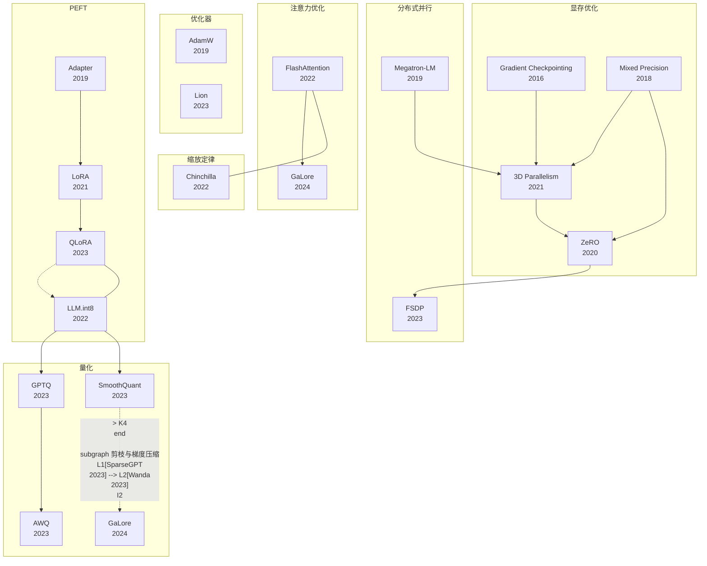

---
tags:
  - 论文
  - 训练基础设施
created: 2026-06-30
updated: 2026-06-30
---

# 训练基础设施 论文总览精讲

本专题按**训练效率的八大基础设施方向**排列 20 篇论文，覆盖从 2016 年 Gradient Checkpointing 到 2024 年 GaLore，时间跨近 10 年的核心使能技术。Wan et al. (TMLR 2024)、Bai et al. (2024)、Duan et al. (2024)、Liu et al. (2024)、Wang et al. (2025) 五篇权威综述均将这些技术归为高效 LLM 训练的核心支撑。

---

## 目录

1. [一、领域全景——训练基础设施的定义、范式与革命性](#一领域全景训练基础设施的定义范式与革命性)
2. [二、显存优化：用计算换空间的经典智慧](#二显存优化用计算换空间的经典智慧)
3. [三、分布式并行：从单卡到万卡集群的缩放之路](#三分布式并行从单卡到万卡集群的缩放之路)
4. [四、注意力优化：打破 O(N²) 瓶颈](#四注意力优化打破-on²-瓶颈)
5. [五、缩放定律：重新定义"需要多大"](#五缩放定律重新定义需要多大)
6. [六、优化器：梯度更新的艺术](#六优化器梯度更新的艺术)
7. [七、参数高效微调（PEFT）：冻结预训练的学习](#七参数高效微调peft冻结预训练的学习)
8. [八、量化：把模型压进更少的比特](#八量化把模型压进更少的比特)
9. [九、剪枝与梯度压缩：让稀疏成为优势](#九剪枝与梯度压缩让稀疏成为优势)
10. [十、技术趋势深度分析](#十技术趋势深度分析)
11. [十一、跨论文核心洞察](#十一跨论文核心洞察)
12. [十二、知识图谱——论文间依赖关系](#十二知识图谱论文间依赖关系)
13. [十三、学习建议——从零到前沿的分级路线](#十三学习建议从零到前沿的分级路线)
14. [十四、研究路线推荐——按硬件与目标分层](#十四研究路线推荐按硬件与目标分层)
15. [十五、硬件适配总表](#十五硬件适配总表)
16. [十六、每篇论文的一句话核心贡献](#十六每篇论文的一句话核心贡献)

---

## 一、领域全景——训练基础设施的定义、范式与革命性

**训练基础设施**（Training Infrastructure）涵盖让大规模模型训练从"不可能"变为"可能"、从"能训练"变为"高效训练"的全部底层技术栈。它不直接定义模型架构，而是定义**如何让算力、显存、通信、数据被高效利用**。

### 1.1 为什么必须关注训练基础设施

GPT-3 175B 训练需要约 3,640 PetaFLOP/s-days 的计算量，相当于单张 V100 GPU 连续运行约 355 年。即使拥有 10,000 张 GPU 的集群，如何让它们**真正协同工作**——而非互相等待——是直接影响模型迭代速度的核心问题。

### 1.2 八大基础设施方向的架构

| 方向 | 核心问题 | 代表技术 |
|------|---------|---------|
| **显存优化** | VRAM 不够装下模型/激活值怎么办？ | Mixed Precision, Gradient Checkpointing |
| **分布式并行** | 模型太大单卡装不下怎么办？ | Megatron-LM (TP), 3D Parallelism (PTD-P), ZeRO, FSDP |
| **注意力优化** | Attention 的 O(N²) 显存如何降维？ | FlashAttention (tiling + recompute) |
| **缩放定律** | 给固定预算，参数与数据如何分配最优？ | Chinchilla Scaling Laws |
| **优化器** | 梯度下降能否更快更稳？ | AdamW (解耦衰减), Lion (符号发现) |
| **PEFT** | 能不能不更新全量参数？ | Adapter, LoRA, QLoRA |
| **量化** | 权重能否压到 4-bit 还能用？ | LLM.int8(), GPTQ, AWQ, SmoothQuant |
| **剪枝与压缩** | 不重要的权重能否直接删掉？ | SparseGPT, Wanda, GaLore |

### 1.3 时间线总览

```
2016 ─ Gradient Checkpointing (Chen et al.)
2018 ─ Mixed Precision Training (Micikevicius et al.)
2019 ─ Adapter (Houlsby et al.) · Megatron-LM (Shoeybi et al.) · AdamW (Loshchilov & Hutter)
2020 ─ ZeRO (Rajbhandari et al.)
2021 ─ LoRA (Hu et al.) · 3D Parallelism/PTD-P (Narayanan et al.)
2022 ─ FlashAttention (Dao et al.) · Chinchilla (Hoffmann et al.) · LLM.int8() (Dettmers et al.)
2023 ─ FSDP (Zhao et al.) · QLoRA (Dettmers et al.) · GPTQ (Frantar et al.)
      · AWQ (Lin et al.) · SmoothQuant (Xiao et al.) · SparseGPT (Frantar & Alistarh)
      · Wanda (Sun et al.) · Lion (Chen et al.)
2024 ─ GaLore (Zhao et al.)
```

---

## 二、显存优化：用计算换空间的经典智慧

### 1. [[Mixed Precision Training]]（2018，ICLR）

**核心地位：** FP16 混合精度训练的奠基之作，AMP（Automatic Mixed Precision）的理论基础。

**背景与动机：** FP32 训练占用两倍显存且吞吐量受限于 GPU 的内存带宽。Tensor Core 硬件支持 FP16 矩阵乘加，但直接使用 FP16 训练会因梯度下溢和精度丢失导致模型无法收敛。

**核心贡献：** 提出"主权重"（Master Weights）方案——前向和反向传播用 FP16 存储权重/激活值，但在 FP32 中维护一份主权重副本用于梯度累加。用动态损失缩放（Loss Scaling）解决小梯度在 FP16 中下溢为零的问题：将损失乘以一个大因子（初始 $2^{15}$），使梯度数值上移，再在权重更新前反向缩放。

**关键发现：** 在 ImageNet、DCGAN、DeepSpeech 2 等任务上，混合精度训练与 FP32 基线精度无统计显著差异。NVIDIA V100 GPU 上可实现 2-5× 吞吐提升。

**历史意义：** 为后续 NVIDIA APEX、PyTorch AMP、TensorFlow AMP 提供了标准化范式。当前所有大规模训练——从 GPT-3 到 LLaMA 3——均默认使用 BF16/FP16 混合精度。

**关键启示：** 理解 Loss Scaling 的原理不仅是使用 AMP 的前提，也是在自定义训练循环中避免"静默精度丢失"的关键。

---

### 2. [[Gradient Checkpointing]]（2016，NeurIPS）

**核心地位：** 以额外前向计算换取 O(√n) 激活值显存的基本技术，是 PyTorch `torch.utils.checkpoint` 的理论来源。

**背景与动机：** 训练 n 层深度网络的反向传播需存储全部 n 层中间激活值，对于 GPT-2（48 层、序列长度 1024）单序列即需 ~60GB VRAM 仅用于激活值。

**核心贡献：** 证明以下定理：只需存储 O(√n) 个中间激活值（checkpoints），反向传播时通过重新前向计算恢复其余激活值，即可以将显存复杂度从 O(n) 降至 O(√n)，而计算量仅增加约 33%。

**关键发现：** 在 n=1000 层 ResNet 上验证，激活值显存降低了 ~96%。实际应用中，gradient checkpointing 使 Vocab 为 50k 的 GPT-2 模型在单卡 V100 上的可训练批量大小提升约 5×。

**历史意义：** 成为所有深度学习框架（PyTorch、TensorFlow、JAX/Flax）的内置功能。[[Megatron-LM]] 和 [[3D Parallelism]] 的流水线并行依赖于其选择性重计算以消除激活值气泡。

**关键启示：** `torch.utils.checkpoint` 仅应用于计算重但显存轻的层（如 Attention、FFN），跳过轻量层（如 LayerNorm、Dropout）。配合 [[FlashAttention]] 可进一步降低重计算成本。

---

## 三、分布式并行：从单卡到万卡集群的缩放之路

### 3. [[Megatron-LM]]（2019）

**核心地位：** 第一个证明张量并行（Tensor Parallelism）可高效扩展到 8.3B 参数的工作。NVIDIA Megatron 框架的奠基石。

**背景与动机：** 2019 年之前，大语言模型训练受限于单 GPU 显存（V100 32GB）。数据并行需要每张卡持有完整模型参数的副本，无法突破单卡容量上限。

**核心贡献：** 对 Transformer 的 Self-Attention 和 MLP 层的权重矩阵做**列切分（Column-wise）**和**行切分（Row-wise）**张量并行。对于 Attention 的 QKV 投影，将 $W_Q, W_K, W_V$ 各按列切分到 g 个 GPU，每卡计算部分注意力头；对于 FFN 的 MLP 层，将第一个线性层按列切分，激活函数后按行切分。

**关键发现：** 8.3B GPT-2 模型在 512 GPU（DGX SuperPOD）上训练，单卡达到 15.1 PFLOPS（约为理论峰值的 30%）。证明了模型规模可随 GPU 数量**线性增大**。

**历史意义：** 张量并行成为混合并行的第一维度（最细粒度、最高通信）。后续 [[3D Parallelism]] 将其扩展为 PTD-P 三维架构。

**关键启示：** 张量并行最优在节点内（NVLink 高带宽），节点间使用流水线并行或数据并行。Megatron 的核心公式 $f = 1/g$ (forward) 和 $b = 1/g$ (backward) 定义了 TP 通信量。

---

### 4. [[3D Parallelism]]（2021，SC）

**核心地位：** 首次系统性地将张量并行、流水线并行、数据并行组合为三维混合架构，验证了从 530B 到万亿参数级的可行性。PTD-P 配方成为行业标准。

**背景与动机：** Megatron-LM 解决了单层内的并行问题（TP），但当模型层数极多时，TP 的 AllReduce 通信开销随 GPU 数量平方增长。

**核心贡献：** **PTD-P 架构**：
- **Tensor Parallelism (TP)**：节点内（NVLink），8 GPU 以内。切分 Attention 和 MLP 层内的权重矩阵
- **Pipeline Parallelism (PP)**：节点间（跨机器的 inter-node），通过微批量（micro-batch）流水线减少空闲气泡（bubble ratio $\frac{p-1}{m}$）——引入**交错流水线调度（1F1B）**以减少气泡
- **Data Parallelism (DP)**：扩展至所有 PP/TP 之外的维度，使用 ZeRO-1 分片优化器状态

**关键发现：** 530B 模型在 560 GPU 上达成 171 TFLOPS/卡；万亿参数模型在 3072 GPU 上达成 163 TFLOPS/卡（约 52% 理论峰值）。证明了大规模训练的硬件效率可通过 PTD-P 三维组合接近理论上限。

**历史意义：** 此后所有大模型（PaLM、Llama 2、Llama 3、Chinchilla）的训练均遵循 PTD-P 或其变体架构。是后续 FSDP、DeepSpeed 优化的参考基线。

**关键启示：** 流水线气泡比例 $= (p-1)/m$，当微批量数 $m \gg p$ 时气泡可忽略。实践中 $m$ 至少应为 $4p$。

---

### 5. [[ZeRO]]（2020，SC）

**核心地位：** DeepSpeed 的核心引擎。三阶段显存分片策略使万亿参数训练在适度 GPU 数量上成为可能。

**背景与动机：** 即使使用 TP+PP，数据并行的每卡仍存储完整模型状态的冗余副本。Adam 优化器每个参数需要存储 fp32 参数 + momentum + variance = 12 字节，远超 fp16 模型权重本身的 2 字节。

**核心贡献：** 将优化器状态、梯度、模型参数逐步分片（partition）到所有数据并行进程中：

| 阶段 | 分片内容 | 每卡显存（含 7.5B 模型、Adam、DP=64） | 通信量 |
|:--:|---------|:---:|:--:|
| ZeRO-1 | 仅优化器状态（$P_{os}$） | 减少 4× → 消耗减少 75% | 与 DDP 相同 |
| ZeRO-2 | 优化器状态 + 梯度（$P_{os+g}$） | 减少 8× | 额外 reduce-scatter |
| ZeRO-3 | 优化器状态 + 梯度 + 参数（$P_{os+g+p}$） | 与模型大小线性无关！ | 额外 broadcast 参数 |

**关键发现：** ZeRO-3 可以在 1024 GPU 上训练具有 1 万亿参数的模型，每卡 VRAM 需求仅约 31GB（TF32）。ZeRO-1 零额外开销，ZeRO-3 通信量约为 DDP 的 3×。

**历史意义：** 使中小型组织（如 EleutherAI 训练 GPT-NeoX 20B）也能训练大规模模型。ZeRO-Offload 进一步卸载至 CPU/NVMe 存储。

**关键启示：** 对于 7B 模型微调，ZeRO-2 通常是最佳性价比选择。ZeRO-3 的全参数收集开销会导致 ~20% 的吞吐下降，仅当模型远大于 GPU 显存（>2×）时使用。

---

### 6. [[FSDP]]（2023，VLDB）

**核心地位：** PyTorch 原生 ZeRO-3 实现。与 HuggingFace Transformers、PyTorch Lightning 的深度集成使其成为开源社区分布式训练的默认选择。

**背景与动机：** DeepSpeed 虽性能领先，但其独立的引擎架构（ZeRO engine）与 PyTorch 原生的 autograd 系统不兼容，导致调试困难和框架级优化（如 torch.compile）难以应用。

**核心贡献：** 完全在 PyTorch 框架内实现 ZeRO-3 式分片：利用 `FlatParameter` 将模型参数展平后按 DP 进程切分，在 `pre_forward` 中通过 `all_gather` 收集所需参数，在 `post_backward` 中通过 `reduce_scatter` 分散梯度。

**关键发现：** 在 128 GPU 上训练 13B LLaMA 模型，FSDP + activation checkpointing 的吞吐与 DeepSpeed 相当（差异 < 5%）。FSDP 在 tuning 便利性上显著优于 DeepSpeed。

**历史意义：** PyTorch 2.0 的 `torch.compile` 与 FSDP 天然兼容（DeepSpeed 目前不支持），使 FSDP 成为未来 PyTorch 生态的首选分布式方案。HuggingFace Trainer + FSDP 已是标准微调配方式。

**关键启示：** 对于 HuggingFace + PyTorch 生态的微调任务，FSDP 是优于 DeepSpeed 的选择（调试友好，与 torch.compile 兼容）。仅在需要 ZeRO-Offload 或超大集群优化时转向 DeepSpeed。

---

## 四、注意力优化：打破 O(N²) 瓶颈

### 7. [[FlashAttention]]（2022，NeurIPS Oral）

**核心地位：** 通过 IO-aware tiling 将标准注意力的显存复杂度从 $O(N^2)$ 降至 $O(N)$，不损失精度。所有现代 LLM 框架中注意力计算的默认实现。

**背景与动机：** Transformer 的 Scaled Dot-Product Attention 的中间矩阵 $QK^T \in \mathbb{R}^{N \times N}$ 和 Softmax 输出需完整存储在 GPU HBM 中。序列长度 2048 → 16MB，8192 → 256MB，32768 → 4GB——这是 GPU SRAM（~192KB/SM）容量的数万倍。GPU 在 HBM↔SRAM 之间的数据传输消耗了 >60% 的时间。

**核心贡献：** 将大型注意力矩阵**分块（tile）**加载至 SRAM，在块内完成 Softmax 计算后**不写回 HBM 完整矩阵**，仅保留最终输出。解决三个关键技术挑战：
1. **Tiling**：将 $Q, K, V$ 切分为适配 SRAM 尺寸的块
2. **Online Softmax**：在分块计算 Softmax 的同时正确维护全局归一化常数 $m(x)=\max_j x_j$, $\ell(x)=\sum_j e^{x_j-m}$
3. **反向重计算**：梯度的计算同样分块进行，通过存储 SRAM 中的 Softmax 归一化统计量（$m, \ell$）来重算原始注意力矩阵

**关键发现：** BERT-large 序列长度 2048 训练加速 3×，GPT-2 序列长度 8192 端到端加速 2.4×。无需近似——**精确注意力**。已被 PyTorch 2.2 (`torch.nn.functional.scaled_dot_product_attention`) 原生集成。

**历史意义：** 使得 8K+ 长序列 Transformer 训练从显存不可行变为可行。GPT-4（据说上下文 32K）、Claude（100K）、Llama 2 长上下文微调（32K）均依赖 FlashAttention。

**关键启示：** FlashAttention + [[Gradient Checkpointing]] 是当前长序列训练的核心组合。对于 VLA 模型，序列长度往往是动作分块×帧数，FlashAttention 可将长序列训练的开销降低 ~3×。

---

## 五、缩放定律：重新定义"需要多大"

### 8. [[Chinchilla Scaling Laws]]（2022，NeurIPS）

**核心地位：** 推翻 Kaplan et al. (2020) 的缩放定律，证明给定计算预算下模型参数与训练数据应按**等比**缩放。DeepMind 70B Chinchilla 用 4× 更小的参数规模碾压了 280B Gopher。

**背景与动机：** Kaplan et al. 的原始定律声称：$N_{opt} \propto C^{0.73}$，即参数增长应快于数据增长。这导致全行业追逐"更大模型"而非"更多数据"——GPT-3 175B 仅训练 300B tokens。

**核心贡献：** 通过三种不同方法（Approach 1: 固定模型大小变化训练量; Approach 2: 固定 FLOPs 变化模型大小; Approach 3: 参数化拟合损失函数 $L(N, D) = E + \frac{A}{N^\alpha} + \frac{B}{D^\beta}$），一致得出：

$$N_{opt}(C) \propto C^{0.50}, \quad D_{opt}(C) \propto C^{0.50}$$

**具体结论**：对于 1 万亿 FLOPs 的训练预算，最优模型大小是 ~70B 参数，训练数据是 ~1.4T tokens（约 20× 参数量）。意味着：给定固定预算时，"小模型 + 多数据" 优于 "大模型 + 少数据"。

**关键发现：** Chinchilla（70B, 1.4T tokens）在 MMLU 上得分 67.6%，超过 Gopher（280B, 300B tokens）的 60.0%，且参数量仅为 1/4。推理成本降低 4×。

**历史意义：** 改变了全行业的训练策略。Llama 2 70B（2T tokens）、Llama 3 8B（15T tokens ❗）、Falcon 180B（3.5T tokens）均遵循 Chinchilla 最优原则——数据量为参数量的 20×-200×。

**关键启示：** 在 Chinchilla 最优条件下，决定最终模型质量的**最直接杠杆是数据量**，而非参数量。这直接塑造了当前"小模型 + 海量数据"的研究趋势。

---

## 六、优化器：梯度更新的艺术

### 9. [[AdamW]]（2019，ICLR）

**核心地位：** 解耦权重衰减（Decoupled Weight Decay）的标准实现。GPT-3、LLaMA 1/2/3、Chinchilla、PaLM——所有现代 LLM 均使用 AdamW 作为默认优化器。

**背景与动机：** 原版 Adam (Kingma & Ba, 2015) 将 L2 正则化与自适应学习率耦合：$\theta_{t+1} = \theta_t - \eta \cdot \frac{m_t}{\sqrt{v_t}+\epsilon} - \eta \lambda \theta_t$。由于自适应学习率 $\frac{\eta}{\sqrt{v_t}}$ 对每个参数不同，L2 正则化实际上对**梯度较小的参数施加了更弱的正则**——与正则化的原始意图相悖。

**核心贡献：** 将权重衰减从梯度更新中**解耦**：

**Adam (耦合，有缺陷)**:
$$\theta_{t+1} = \theta_t - \eta \cdot \frac{\hat{m}_t}{\sqrt{\hat{v}_t}+\epsilon} - \eta \lambda \theta_t$$

**AdamW (解耦)**:
$$\theta_{t+1} = \theta_t - \eta \cdot \frac{\hat{m}_t}{\sqrt{\hat{v}_t}+\epsilon} - \eta \lambda \theta_t$$ ← 形式上相同，但 AdamW 的 $\lambda$ 是**独立于 $\frac{\hat{m}_t}{\sqrt{\hat{v}_t}}$ 的直接权重收缩**

**关键发现：** SGD + 解耦权重衰减在 ImageNet（ResNet-50, 152）和 CIFAR 上均优于传统的 L2 正则化。AdamW 训练出的模型具有更好的泛化能力。权重衰减率 $\lambda$ 与学习率 $\eta$ 的最优比值在 $10^{-3}$ 到 $10^{-2}$ 之间。

**历史意义：** HuggingFace Transformers、PyTorch 的默认 AdamW 实现。对于 LLM，典型设置：$\beta_1=0.9, \beta_2=0.999, \lambda=0.1$。

**关键启示：** 微调 LLM 时，一定要用 AdamW 而非 Adam。区分清楚：`weight_decay` 应用于所有可训练权重，**不应用于 LayerNorm 和 bias**。

---

### 10. [[Lion]]（2023，NeurIPS 2024 Spotlight）

**核心地位：** Google 通过进化算法符号搜索发现的优化器。显存需求比 AdamW 减半，ViT 和扩散模型训练已全面切换至 Lion。

**背景与动机：** Adam 的"三状态"设计（参数 + $m_t$ + $v_t$）导致每参数 12-16 字节的优化器存储。能否找到一个显存需求更低且性能不降的优化器？

**核心贡献：** 在低维任务空间中运行进化搜索（Program Search），从几千个候选优化器更新公式中自动发现 Lion (EvoLved Sign Momentum)：

$$\theta_{t+1} = \theta_t - \eta \cdot \text{sign}(\beta_1 m_t + (1-\beta_1) g_t) - \eta \lambda \theta_t$$

其中 $m_t = \beta_2 m_{t-1} + (1-\beta_2) g_t$。关键设计：**只使用动量项，不计算二阶矩**（无需 $v_t$）。更新方向仅取符号——类似于 signSGD 的变体。

**关键发现：** 在 ImageNet（ViT-B/16）、JFT-300M、扩散模型上，Lion 在相似训练步数内达到或超越 AdamW 的精度。显存节省约 50%（每参数仅需 1 个动量状态而非 2 个）。但**对 batch size 敏感**——小 batch size 下 sign 操作的噪声放大效应明显。

**历史意义：** Google 已将 ViT 和 Imagen 的训练迁移至 Lion。社区中的主流态度是"对大型模型训练（>1B）Lion 值得尝试，微调场景保持 AdamW"。

**关键启示：** 显存紧张时 Lion 是 AdamW 的直接替代品（节省 ~40% 优化器显存）。默认超参数 $\beta_1=0.9, \beta_2=0.99$，学习率约为 AdamW 的 **1/3 到 1/10**。

---

## 七、参数高效微调（PEFT）：冻结预训练的学习

### 11. [[Adapter]]（2019，ICML）

**核心地位：** PEFT 领域的原始方案。瓶颈适配器（Bottleneck Adapter）是第一个证明"不必更新预训练模型全部参数也能实现任务迁移"的里程碑。

**背景与动机：** 2019 年 BERT-large 的全量微调需 330M 可训练参数，每个下游任务需存储一个完整 1.3GB checkpoint。多任务场景下这造成了指数级存储爆炸。

**核心贡献：** 在 Transformer 的每个子层后插入轻量瓶颈模块：

$$\text{Adapter}(x) = W_{up} \cdot \text{ReLU}(W_{down} \cdot x) + x$$

其中 $W_{down} \in \mathbb{R}^{d \times m}$ 将维度投影到瓶颈 $m \ll d$，$W_{up} \in \mathbb{R}^{m \times d}$ 恢复原始维度。仅训练 Adapter 模块和 LayerNorm 参数（约占原始参数的 3-8%）。

**关键发现：** 在 GLUE 基准上，Adapter 以 1.3%-3.6% 的可训练参数达到全量微调的 98.6% 平均得分。**推理带来额外延迟**——瓶颈维度 $m=64$ 时延迟增加约 3-4%（小批量时 20-30%）。

**历史意义：** 启发了整个 PEFT 领域：`[[LoRA]]` 明确提及其目标之一是解决 Adapter 的推理延迟问题。Adapter 的残差设计也成为后续 PEFT 方法的共同模式。

**关键启示：** Adapter 思想的核心——"冻结主体，仅训练注入的轻量模块"——是所有 PEFT 方法的公共 DNA。理解 Adapter 的推理延迟问题才能理解为什么 LoRA 的设计力图实现"零额外延迟"。

---

### 12. [[LoRA]]（2021，ICLR 2022）

**核心地位：** 以低秩分解矩阵 $BA$ 替代全量微调，PEFT 领域引用量最高的论文（~28,000+）。是当前开源 LLM 微调的事实标准。

**背景与动机：** [[Adapter]] 虽参数少但在推理时引入额外深度（串行计算），小批量场景延迟增加 20-30%。Prefix Tuning 占用宝贵的序列长度预算。能否找到**零推理开销**的 PEFT 方案？

**核心贡献：** 假设微调时的权重更新矩阵 $\Delta W$ 具有低"内在秩"（intrinsic rank），将其分解为：
$$h = W_0 x + BA x$$
其中 $B \in \mathbb{R}^{d \times r}, A \in \mathbb{R}^{r \times k}, r \ll \min(d,k)$。$A$ 随机高斯初始化，$B$ 零初始化。推理时直接合并 $\tilde{W} = W_0 + \frac{\alpha}{r}BA$，计算图与原始模型完全一致。

**关键发现：** GPT-3 175B 上，仅用 0.003% 的可训练参数（4.7M vs 175B），LoRA 在 WikiSQL、MNLI、SAMSum 上全部**超越全量微调**。惊人发现：rank $r=1$ 在 $W_q, W_v$ 组合下就足以完成多项任务。

**历史意义：** HuggingFace PEFT 库的核心实现。Llama 2、Mistral、Gemma——几乎所有 2023-2024 发布的开源模型的社区微调均基于 LoRA。是 VLA 模型（如 OpenVLA）微调的标配方案。

**关键启示：** LoRA 应用于 $W_q, W_v$ 的组合最优——宁可降低 rank 也要覆盖更多类型的权重矩阵。$\frac{\alpha}{r}$ 缩放因子在 Adam 下等价于调整学习率。详情参见 [[LoRA]]。

---

### 13. [[QLoRA]]（2023，NeurIPS 2023）

**核心地位：** 将 4-bit 量化与 LoRA 结合，首次实现在单张 48GB GPU 上微调 65B 参数模型。QLoRA 将 LLM 微调门槛从"需要 8× A100"降至"一张 RTX 3090 即可"。

**背景与动机：** [[LoRA]] 虽然减少了可训练参数，但基模型仍以全精度（16-bit）加载。65B 的 fp16 模型本身需要 ~130GB VRAM——这对大多数研究人员完全不可行。

**核心贡献：** 三项关键技术组合：
1. **4-bit NormalFloat (NF4)**：新的 4-bit 数据类型，假定权重服从零均值正态分布，通过分位数划分将值域非均匀量化为 16 个值。信息论最优。
2. **双重量化（Double Quantization）**：不仅量化模型权重，还**对量化缩放因子的元数据再做一次 FP8 量化**，每个 64 个权重块节省 0.373 bits。
3. **分页优化器（Paged Optimizer）**：利用统一内存（Unified Memory），当 GPU 显存不足时自动将优化器状态分页到 CPU RAM。

**关键发现：** Guanaco 65B（基于 LLaMA + QLoRA 微调，仅需 48GB VRAM）在 Vicuna 基准上达到 ChatGPT 99.3% 的性能。单卡 24GB GPU 可微调 33B 模型。

**历史意义：** 真正民主化了 LLM 微调。消费级 GPU（RTX 3090/4090）上微调 13B-33B 模型从不可能变为日常实践。

**关键启示：** 对所有 VLA 和机器人学习研究者而言，QLoRA 是让 7B-13B 模型在 16-24GB GPU 上可微调的核心技术。典型配置：NF4 + double quantization + LoRA rank=64, $\alpha=16$。详情参见 [[QLoRA]]。

---

## 八、量化：把模型压进更少的比特

### 14. [[LLM.int8()]]（2022，NeurIPS 2022）

**核心地位：** 首个在大规模 Transformer（175B）上实现无损 8-bit 推理的方法。发现"极端异常值特征"（Emergent Massive Features）是量化失效的根本原因。

**背景与动机：** 在 6.7B 以下的 Transformer 上，简单的 INT8 量化几乎无损。但在 6.7B+ 规模的模型上，某些隐藏维度以 100× 的幅度异于其他维度——这些"极端异常值特征"在所有 Transformer 层中持续出现（约占所有特征维度的 0.1%）。

**核心贡献：** **混合精度分解**——将输入特征 $X$ 分解为异常值部分 $X_o$（在 fp16 中处理）和正常部分 $X_n$（在 INT8 中处理），形成两个独立的矩阵乘法，最后在 fp16 中重新组合。量化缩放因子（quantization constants）`cx, cw` 无需校准——使用动态量化（逐 token/per-token 量化）。

**关键发现：** OPT-175B 和 BLOOM-176B 上，LLM.int8() 的困惑度退化 < 0.01（与 fp16 无统计差异）。在 175B 模型上推理内存减少 2×（~175GB → ~90GB）。

**历史意义：** 直接催生了 HuggingFace `bitsandbytes` 库。也是 [[QLoRA]] 的量化理论基础——QLoRA 解决了训练时的量化问题，而 LLM.int8() 解决的是推理时。

**关键启示：** 6.7B 是"异常值出现"的临界规模。小于此规模的模型可使用简单 INT8 量化；大于此规模必须处理异常值特征。[[GPTQ]] 和 [[AWQ]] 通过不同的方式（Hessian/激活感知）绕过了显式异常值分解。

---

### 15. [[GPTQ]]（2023，ICLR 2023）

**核心地位：** 第一个能够将 175B GPT 系列模型量化为 3/4-bit 且保持低困惑度的逐层后训练量化方法。当前所有 LLM 权重量化的工业标准——被 HuggingFace、LMDeploy、AutoGPTQ、llama.cpp 等工具直接使用。

**背景与动机：** [[LLM.int8()]] 的异常值处理在 8-bit 足够，但推到 4-bit 或 3-bit 时失效——极端异常值维度在极低精度下无法正确重构。需要一个**更精确的权重量化框架**，且在单 GPU 上可完成万亿级参数的量化。

**核心贡献：** 将经典的 Optimal Brain Quantization (OBQ) 从二次复杂度优化为线性复杂度，使其可直接处理 Transformer 的百万级权重矩阵。

**OBQ 基础**：每一步选择对损失影响最小的权重 $w_q$ 进行舍入，然后计算最优的剩余权重更新 $\delta_p = \frac{w_q - \text{quant}(w_q)}{[H^{-1}]_{qq}} \cdot H^{-1}_{:,q}$ 以补偿量化误差。这是 $O(d_{row} \times d_{col}^3)$ 复杂度。

**GPTQ 创新**：解耦了 OBQ 中的"贪婪选择顺序"和"权重更新"两个步骤——固定所有行的量化顺序为从左到右，批量更新所有剩余权重的 Hessian 补偿。复杂度降至 $O(d_{row} \times d_{col}^2)$。配合**量级达 100-1000 列的 Cholesky 矫正**以控制误差积累。

**关键发现：** OPT-175B 在 4-bit GPTQ (`groupsize=128`) 下 WikiText-2 困惑度仅从 10.86（fp16）退化至 11.27（+3.8%）。3-bit 下退化至 12.84（+18%）但在生成质量上仍然可用。

**历史意义：** HuggingFace `transformers` + `auto-gptq` 成为了量化模型部署的标准工作流。llama.cpp 的 `q4_K_M` 量化格式直接借鉴了 GPTQ 的组级量化思路。

**关键启示：** GPTQ 在 4-bit 是**黄金标准**。3-bit 的退化开始显著（困惑度 +10-20%），需要配合 [[SmoothQuant]] 的 W8A8 或更高精度激活一起使用。

---

### 16. [[AWQ]]（2023，NeurIPS 2024）

**核心地位：** 通过只保护 ~1% 的显著（salient）权重通道实现与 GPTQ 相当或更优的 4-bit 量化质量。简单、有效、已内置于 vLLM 的默认量化后端。

**背景与动机：** GPTQ 通过 Hessian 补偿实现高精度量化，但其复杂度（$O(d_{col}^2)$）和校准时间限制了实用性（如 70B 模型需数小时）。能否找到一个更简单、更快的框架？

**核心贡献：** **激活感知缩放（Activation-Aware Scaling）**——观察发现：不是所有权重同等重要。仅 ~1% 的权重通道（对应大激活值范数）承载了大部分输出信号。AWQ 的解决方案不是避免量化这些通道（那会引入混合精度计算的复杂性），而是**在量化前对该通道的权重做等效缩放**，将激活值的动态范围压缩：

$$\text{s}^* = \text{argmin}_\text{s} \; \|\; Q(W \cdot \text{diag}(s)) \cdot (X \cdot \text{diag}(s)^{-1}) - WX \;\|$$

**关键发现：** 在 LLaMA、Vicuna、Mistral 上，4-bit AWQ 的困惑度退化 < 3%（与 fp16 比较），在大多数 benchmark 上准确率退化 < 1%。量化速度：7B 模型约 20 秒（vs GPTQ 的数分钟）。

**历史意义：** vLLM 的高吞吐推理采用了 AWQ 作为默认量化格式。TinyChat（MIT HAN Lab）使用 AWQ + 内核融合在边缘设备上部署 LLaMA-7B。

**关键启示：** 对于快速原型开发（需要多次量化的实验），AWQ 是 GPTQ 的更快捷替代品。但 AWQ 仅支持权重量化（W4A16），如需 W4A8 或全面激活+权重量化，仍需 [[SmoothQuant]] 或 [[GPTQ]]。

---

### 17. [[SmoothQuant]]（2023，ICML 2023）

**核心地位：** 第一个实现**同时**对权重和激活值进行 8-bit 量化（W8A8）且保持精度的后训练量化方法。在 H100 FP8 训练之前，SmoothQuant 是 INT8 训练的奠基性使能技术。

**背景与动机：** W8A16（仅权重量化）已经成熟，但激活值的 INT8 量化面临根本性困难——LLaMA 的某些激活通道的幅度比其他通道大 100×，且这些异常值在每一层都以相同的通道索引出现。直接对激活值做 INT8 量化导致灾难性精度下降。

**核心贡献：** **数学等价变换**——通过引入"平滑因子" $s \in \mathbb{R}^{C_i}$，将激活值量化难度迁移到权重上：

$$Y = XW = (X \cdot \text{diag}(s)^{-1}) \cdot (\text{diag}(s) \cdot W) = \hat{X} \hat{W}$$

使得变换后的 $\hat{X}$ 和 $\hat{W}$ 都易于量化。平滑因子通过 $\max$ 迁移公式计算：

$$s_j = \max(|X_j|)^\alpha / \max(|W_j|)^{1-\alpha}$$

**关键发现：** $\alpha=0.5$（均衡迁移）在所有模型规模（OPT 6.7B-175B）上表现最佳。W8A8 量化后，OPT-175B 困惑度退化 < 3%。首次证明了纯 INT8 GEMM 对大模型可行。

**历史意义：** 为 NVIDIA H100 的 FP8 训练提供了理论路线图。以 INT8 计算代价（2× 吞吐 vs FP16）实现几乎无精度损失的全 INT8 推理。

**关键启示：** SmoothQuant 是理解权重-激活值**联合量化**的必修课。`migrate_strength` 参数（$\alpha$）在 0.5-0.7 之间调整，偏向权重迁移可保护激活值量化精度。

---

## 九、剪枝与梯度压缩：让稀疏成为优势

### 18. [[SparseGPT]]（2023，ICML 2023）

**核心地位：** 第一个证明大规模 LLM（OPT-175B, BLOOM-176B）无需任何微调即可一次性剪枝至 50-60% 稀疏度的工作。LLM 后训练剪枝领域的奠基性突破。

**背景与动机：** 标准权重量级剪枝在大型 Transformer 上严重破坏精度。重训练剪枝对小模型可行，但重训 175B 模型完全不可行——需要一个**仅需一次前向过程**即可完成高质量剪枝的方法。

**核心贡献：** 将**最优脑外科手术（OBS）**的经典理论扩展到 LLM 规模。给定权重矩阵 $W$，对每个权重 $w_{pq}$ 计算其"重要性"——移除该权重后剩余权重的最优调整量——并使用 Hessian 矩阵的 Cholesky 分解实现 $O(d_{row} \times d_{col}^2)$ 的线性化。关键创新是**逐层独立剪枝**——每层只需一次前向过程收集 Hessian。

**关键发现：**
- OPT-175B 在 50% 稀疏度（一半权重被移除）下，WikiText-2 困惑度仅从 10.86 退化至 12.07（+11%）
- 60% 稀疏度下困惑度退化 < 20%
- 剪枝所需时间与模型大小**线性**相关。175B 模型仅需约 4 小时（单 A100）

**历史意义：** 颠覆了"大模型剪枝必须重训练"的认知。直接启发了 Wanda、SliceGPT 等更快/更简单/结构化的后续方法。

**关键启示：** 结合 4-bit [[GPTQ]] 量化与 50% SparseGPT 剪枝，理论压缩比可达 8×（50% × 75% 量化为 4-bit），但需要稀疏矩阵乘法的硬件支持（如 NVIDIA 的 2:4 结构化稀疏）。

---

### 19. [[Wanda]]（2023）

**核心地位：** 最简单的 LLM 剪枝方法——通过权重×激活范数的乘积度量重要性——达到与 SparseGPT 相当的质量，但速度快 700×。

**背景与动机：** [[SparseGPT]] 的核心瓶颈在于 Hessian 矩阵的计算和 Cholesky 分解，这在大规模模型上仍然耗时。能否完全绕过二阶信息，找到更简单的剪枝度量？

**核心贡献：** **Wanda 度量**：第 $j$ 行第 $k$ 列的权重 $W_{jk}$ 的重要性定义为：

$$I(W_{jk}) = |W_{jk}| \cdot \|X_j\|_2$$

其中 $\|X_j\|_2$ 是第 $j$ 个输入特征的 L2 范数，通过对一小批校准数据的一次前向过程获得。这等价于使用**对角 Hessian 近似**且不做权重补偿的 SparseGPT 极限情况。

**关键发现：** 在 LLaMA-7B 上，Wanda 50% 稀疏度 + WikiText-2 困惑度退化 < 4%（与 SparseGPT 几乎相同）。计算成本：LLaMA-7B 约 1 分钟（vs SparseGPT 的约 12 小时）。Calibration 数据量：128 个序列即饱和（更多数据无继续增益）。

**历史意义：** 证明了**激活值的分布信息（$X$ 的范数）是剪枝最重要的信号**——比权重本身的大小或 Hessian 的二阶统计量更具判别力。

**关键启示：** Wanda 极其适合快速剪枝实验（1 分钟内完成 7B 模型的剪枝-质量评估）。但仅支持 2:4 结构化稀疏（NVIDIA Ampere+ 原生支持），不支持如 M:N 平滑稀疏等更灵活的模式。

---

### 20. [[GaLore]]（2024，ICML 2024）

**核心地位：** 第一个在预训练阶段实现全参数训练但以低秩梯度运行的方案，将优化器状态内存从 $O(mn)$ 降至 $O((m+n)r)$。在 LLaMA 7B 上全量预训练仅需 28GB VRAM（vs 58GB for AdamW）。

**背景与动机：** 梯度矩阵 $G \in \mathbb{R}^{m \times n}$ 的完整存储和对应优化器状态（Adam 的 $M, V$）消耗了训练显存的主导部分。[[LoRA]] 解决了微调的问题但限制了模型的表现力（低秩适配），全参数训练仍然是追求最高质量时的唯一选择。

**核心贡献：** 观察到：在训练过程中，梯度矩阵 $G$ **缓慢变得低秩**。GaLore 的解决方案：

$$G_t \approx P_t \cdot R_t, \quad R_t = P_t^\top G_t$$

其中 $P_t \in \mathbb{R}^{m \times r}$ 是投影矩阵（每隔 T 步通过 SVD 更新）。优化器状态仅维护在**低维压缩空间** $R_t \in \mathbb{R}^{r \times n}$ 中。更新完整权重：$W_{t+1} = W_t - \eta \cdot P_t \cdot \text{Opt}(R_t)$。

**关键发现：** LLaMA 7B 预训练（C4 数据集）时，GaLore 使用 28GB VRAM（全参数训练但仅 28GB）达到与全参数 AdamW（58GB）相当的困惑度。GSM8K 数学推理任务上，GaLore (r=128) 准确率 42.3%，与全参数微调的 43.7% 仅差 1.4 个百分点。

**历史意义：** 被《ICML 2024》收录并获广泛关注。虽然因 SVD 周期性更新的开销尚未在工业界广泛采用，但其"梯度本身也是低秩"的核心发现影响了后续的 [[ReLoRA]]、LoSparse 等工作。

**关键启示：** GaLore 的核心价值在于证明——**全参数训练不一定需要全显存**。对于希望在 24GB GPU 上做 7B 级全量预训练的研究者，GaLore 是唯一可行的路线。

---

## 十、技术趋势深度分析

### 趋势 1：从"大模型专用设施"到"消费级 GPU 可运行"

2018-2020 年的核心叙事是"如何让大模型训练在万卡集群上可能"（Megatron, ZeRO, 3D Parallelism）。2022 年 FlashAttention 的登场标志着转折点——开始在单卡层面解决显存效率。到 2023-2024 年，QLoRA + FlashAttention 的组合使**消费级 GPU（24GB）上微调 33B 模型成为日常**。

代表论文：[[FlashAttention]]、[[QLoRA]]、[[GaLore]]

### 趋势 2：从"近似"到"精确无损"

早期量化论文（如 8-bit 量化）对精度损失的处理方式是容忍。FlashAttention 打破了这个范式——它证明了**不需要近似就能实现 O(N²) → O(N)** 的显存节省。GPTQ 和 AWQ 随后在量化领域实现了"4-bit 几乎无损"。

代表论文：[[FlashAttention]]、[[GPTQ]]、[[AWQ]]

### 趋势 3：从"专用硬件"到"软件-硬件协同设计"

FlashAttention 系列（尤其 FlashAttention-3 for H100）是软件-硬件协同设计的标杆——根据 GPU 的 SRAM 容量、Tensor Core 指令（WGMMA）、异步拷贝引擎（TMA）定制内核。[[Mixed Precision Training]] 也是面向 Tensor Core 的早期协同设计。

代表论文：[[FlashAttention]]、[[Mixed Precision Training]]

### 趋势 4：从"权重驱动"到"激活驱动"

[[AWQ]] 发现激活值的分布决定了哪些权重重要；[[Wanda]] 证明激活范数 × 权重值的乘积是最优剪枝度量；[[SmoothQuant]] 通过数学变换将激活量化困难平滑到权重。**激活值的信息正在重新定义我们对权重价值的理解**。

代表论文：[[AWQ]]、[[Wanda]]、[[SmoothQuant]]

### 趋势 5：Chinchilla 之后——数据是新的参数

Chinchilla 之后，全行业共识已从"做大模型"转变为"做更多数据"。这反过来推动了训练基础设施方向的转变——从关注"如何装下更大的模型"到关注"如何高效处理更多数据"。

代表论文：[[Chinchilla Scaling Laws]]

---

## 十一、跨论文核心洞察

### 洞察 1：显存是唯一瓶颈

无论分布式并行（[[ZeRO]]、[[FSDP]]）、注意力优化（[[FlashAttention]]）、还是量化（[[GPTQ]]、[[QLoRA]]），终极目标都是**降低每参数或每标记的显存占用**。显存——而非计算（FLOPS）——才是 LLM 训练和推理的第一瓶颈。

### 洞察 2：低秩性是贯穿全局的暗线

- [[LoRA]]：权重更新矩阵 $\Delta W$ 是低秩的
- [[GaLore]]：梯度矩阵 $G_t$ 缓慢变得低秩
- FlashAttention：注意力矩阵 $QK^T$ 在 tiling 视角下有效秩极低
- [[SparseGPT]] / [[Wanda]]：权重矩阵可被大幅稀疏化而保持功能等效——暗示大量权重的存在是为了低秩结构的表现力

**低秩性不是巧合，而是过参数化深度学习的根本性质。**

### 洞察 3：PEFT + 量化 = 消费级 GPU 的钥匙

[[QLoRA]] = [[LoRA]] + NF4 量化 + 双量化。正是这个组合使得"一个研究者、一张 RTX 3090、一周时间"足以微调 33B 模型。PEFT 解决了可训练参数的问题，量化解决了基模型加载的问题。

### 洞察 4：从 Kaplen 到 Chinchilla 的认知翻转

[[Chinchilla Scaling Laws]] 推翻的是整个行业的训练理念。之前：把预算花在更大模型上（GPT-3 175B, 300B tokens）。之后：把预算花在更多数据上（Llama 2 70B, 2T tokens; Llama 3 8B, 15T tokens）。这一思路改变了**训练基础设施的设计重心**——瓶颈从模型并行（TP, PP）更多地转移到了数据高效的预处理和加载管道。

---

## 十二、知识图谱——论文间依赖关系



实线箭头 = 直接继承或技术依赖。虚线箭头 = 思想影响。

---

## 十三、学习建议——从零到前沿的分级路线

### Level 0：打好基础

**目标：** 理解为什么大模型训练需要基础设施，以及最基本的显存优化技术。

**阅读顺序：**
1. [[Mixed Precision Training]] — 为什么 FP16 训练需要 Loss Scaling 和 Master Weights
2. [[Gradient Checkpointing]] — "计算换空间"的核心思想
3. [[AdamW]] — 为什么权重衰减必须从自适应学习率中解耦

**学完你应该能回答：**
- 为什么 `torch.cuda.amp` 的 GradScaler 会动态调整 loss_scale？
- PyTorch 的 `torch.utils.checkpoint` 如何决定在计算图的哪些节点插入检查点？

### Level 1：入门篇

**目标：** 掌握 PEFT 核心方法和基础量化，能够在消费级 GPU 上微调 7B-13B 模型。

**阅读顺序：**
4. [[LoRA]] — PEFT 的标准答案
5. [[QLoRA]] — 消费级 GPU 微调大模型的完整配方
6. [[LLM.int8()]] — 量化的第一个关键挑战：异常值
7. [[FlashAttention]] — 训练长序列的必修课

**学完你应该能回答：**
- LoRA 的 rank $r=1$ 为何对 GPT-3 有效？什么任务需要更大的 $r$？
- QLoRA 的 NF4 数据类型如何通过分位数实现信息论最优 4-bit 量化？
- FlashAttention 如何在不存储 $QK^T$ 完整矩阵的情况下完成反向传播？

### Level 2：进阶篇

**目标：** 理解分布式训练和高级量化技术，能够设计多卡微调方案。

**阅读顺序：**
8. [[Megatron-LM]] — 张量并行的数学原理
9. [[ZeRO]] — 三阶段分片的策略选择
10. [[3D Parallelism]] — TP + PP + DP 的组合逻辑
11. [[GPTQ]] — 从 OBS 理论到大模型量化的推导链
12. [[AWQ]] / [[SmoothQuant]] — 激活感知量化的两种范式

**学完你应该能回答：**
- 什么场景选择 FSDP 而非 DeepSpeed ZeRO-3？什么场景反过来？
- GPTQ 的 Cholesky 矫正如何防止逐层量化误差累积？
- SmoothQuant 的 $\alpha$ 参数在什么范围最优？

### Level 3：前沿篇

**目标：** 理解剪枝、梯度压缩和新型优化器，能够追踪当前研究前沿。

**阅读顺序：**
13. [[Adapter]] — PEFT 的起源，理解设计演化
14. [[Chinchilla Scaling Laws]] — 改变全行业的缩放认知
15. [[Lion]] — 优化器的进化搜索
16. [[SparseGPT]] / [[Wanda]] — LLM 后训练剪枝两种范式
17. [[FSDP]] — PyTorch 原生分布式方案
18. [[GaLore]] — 梯度低秩投影的前沿

**学完你应该能回答：**
- 给定 10,000 GPU·小时的计算预算，应训练多大参数的模型和多少数据？
- Wanda 是 SparseGPT 的什么近似？这个近似在什么条件下失效？
- GaLore 的梯度投影和 LoRA 的权重更新有什么本质不同？

---

## 十四、研究路线推荐——按硬件与目标分层

### 路线 A：入门实验路线（16-24GB 消费级 GPU）

```
理解显存优化 ──────────────────────────────────────────
  │
  ├─ Mixed Precision Training ──→ 使用 BF16 + AMP 训练
  ├─ Gradient Checkpointing ──→ 激活值重算，batch_size 加倍
  │
  ├─ LoRA ──→ 用 PEFT 微调 7B 模型
  ├─ QLoRA ──→ 单卡 16GB 微调 13B 模型
  │
  └─ GGUF/GPTQ/AWQ 量化 ──→ 推理部署 4-bit 模型
```

### 路线 B：算法研究路线（单机多卡 4-8× GPU）

```
掌握分布式并行 ──────────────────────────────────────────
  │
  ├─ FlashAttention ──→ 长序列训练加速
  ├─ FSDP ──→ 4/8 卡数据并行微调 70B
  ├─ ZeRO-3 ──→ 分布式微调 70B+
  │
  ├─ Megatron-LM ──→ 理解张量并行的数学
  ├─ 3D Parallelism ──→ 组合并行策略
  │
  └─ Chinchilla Scaling Laws ──→ 优化训练预算分配
```

### 路线 C：工程部署路线（生产级部署）

```
模型压缩与推理优化 ──────────────────────────────────────
  │
  ├─ LLM.int8() ──→ 8-bit 推理
  ├─ GPTQ ──→ 4-bit 权重量化 + vLLM/TGI 部署
  ├─ AWQ ──→ 更快量化 + vLLM 集成
  ├─ SmoothQuant ──→ W8A8 全 INT8 推理
  │
  ├─ SparseGPT / Wanda ──→ 剪枝（配合 2:4 稀疏硬件）
  │
  └─ GaLore ──→ 资源受限场景下的全参数训练
```

---

## 十五、硬件适配总表

### ✅ 可在消费级 GPU（16-24GB）上直接运行

| # | 论文 | 任务 | 最小 VRAM | 推荐 GPU |
|:--:|------|------|:--:|------|
| 01 | Mixed Precision Training | 任意训练 | 4GB | RTX 2060+ |
| 02 | Gradient Checkpointing | 任意训练 | 6GB | RTX 2060+ |
| 07 | FlashAttention | 训练/推理 | 8GB | RTX 3060+ |
| 09 | AdamW | 任意训练 | 6GB | RTX 2060+ |
| 10 | Lion | 任意训练 | 6GB（比 AdamW 少 40%） | RTX 2060+ |
| 12 | LoRA (bf16, 7B) | 微调 | 14GB | RTX 3090 |
| 13 | QLoRA (4-bit, 7B) | 微调 | 10GB | RTX 3060 (12GB) |
| 13 | QLoRA (4-bit, 13B) | 微调 | 16GB | RTX 4090 (24GB) |
| 14 | LLM.int8() (7-13B) | 推理 | 10-14GB | RTX 3080+ |
| 15 | GPTQ (4-bit, 7B) | 量化+推理 | 6GB | RTX 3060+ |
| 16 | AWQ (4-bit, 7B) | 量化+推理 | 6GB | RTX 3060+ |
| 18 | SparseGPT (7B) | 剪枝 | 16GB | RTX 3090 |
| 19 | Wanda (7B) | 剪枝 | 14GB | RTX 3080+ |

### ⚠️ 需要多卡（2-4×）或高端 GPU（24GB+）

| # | 论文 | 任务 | 最低配置 | 备注 |
|:--:|------|------|------|------|
| 03 | Megatron-LM (13B+) | 训练 | 4× V100 32GB | 需 NVLink |
| 04 | 3D Parallelism (175B+) | 训练 | 64× V100/A100 | 多节点 |
| 05 | ZeRO-3 (13B+) | 训练 | 4× RTX 3090 | FC 网络 |
| 06 | FSDP (13B+) | 训练 | 4× RTX 3090/4090 | |
| 13 | QLoRA (33B, 4-bit) | 微调 | 24GB (单卡) | batch_size=1 |
| 20 | GaLore (7B 预训练) | 预训练 | 28GB (单卡) | RTX A6000 48GB |

### ❌ 需要大规模集群（16-64+ GPU）或数据中心 GPU

| # | 论文 | 任务 | 最低配置 |
|:--:|------|------|------|
| 04 | 3D Parallelism (530B+) | 训练 | 280× A100 80GB |
| 05 | ZeRO（万亿参数） | 训练 | 1024× V100/A100 |
| 08 | Chinchilla Scaling Laws | 验证 | 需多规模实验 |
| 11 | Adapter (175B+) | 全量训练 | 16× A100 80GB+ |
| 14 | LLM.int8() (175B) | 推理 | 90GB VRAM (多卡) |
| 15 | GPTQ (175B) | 量化 | 350GB VRAM (多卡) |
| 18 | SparseGPT (175B) | 剪枝 | 4× A100 80GB |

---

## 十六、每篇论文的一句话核心贡献

| # | 论文 | 一句话核心贡献 |
|:--:|------|------|
| 01 | Mixed Precision Training | FP16 前向/反向 + FP32 主权重 + Loss Scaling = 2-5× 加速且不损失精度 |
| 02 | Gradient Checkpointing | 仅存 O(√n) 个检查点，反向时重算 = 激活值显存降低 96% |
| 03 | Megatron-LM | 对 Attention 和 MLP 权重做行列切分 = 模型大小可随 GPU 线性扩展 |
| 04 | 3D Parallelism | TP (节点内) + PP (节点间) + DP = 530B 模型 52% 峰值效率 |
| 05 | ZeRO | 三阶段分片优化器/梯度/参数 = 万亿参数训练在 1024 GPU 上可行 |
| 06 | FSDP | ZeRO-3 的 PyTorch 原生实现 = HuggingFace 生态的分布式微调标准 |
| 07 | FlashAttention | Tiling + Online Softmax + 反向重计算 = O(N) 显存的精确注意力 |
| 08 | Chinchilla Scaling Laws | $N_{opt} \propto C^{0.5}, D_{opt} \propto C^{0.5}$ — 参数和数据等比增长 |
| 09 | AdamW | 将权重衰减从自适应学习率中解耦 = 更好泛化的 LLM 默认优化器 |
| 10 | Lion | 进化搜索发现的符号驱动优化器 = AdamW 精度 + 一半显存 |
| 11 | Adapter | 瓶颈模块插入 Transformer 子层 = PEFT 的原始方案（有推理延迟） |
| 12 | LoRA | $\Delta W = BA$, 推理零延迟 = 微调 175B 仅需 0.003% 可训练参数 |
| 13 | QLoRA | NF4 量化 + 双量化 + LoRA = 48GB 单卡微调 65B 模型 |
| 14 | LLM.int8() | 混合精度分解处理"极端异常值特征" = 175B 模型无损 8-bit 推理 |
| 15 | GPTQ | OBQ 理论 → 逐层 Hessian 线性化 = 175B 模型 4-bit 困惑度退化 < 4% |
| 16 | AWQ | 保护 1% 显著通道 = 4-bit 量化 20 秒完成且超越 GPTQ 精度 |
| 17 | SmoothQuant | 平滑因子 $\mathbf{s}$ 迁移量化难度 = 首个 W8A8 全 INT8 推理方案 |
| 18 | SparseGPT | OBS 驱动的一次性剪枝 = 175B 模型 50% 稀疏度无需微调 |
| 19 | Wanda | $I(W) = \|W\| \cdot \|X\|_2$ 剪枝度量 = SparseGPT 700× 更快 |
| 20 | GaLore | 梯度矩阵低秩投影 = 7B 全参数预训练 28GB (vs 58GB AdamW) |

---

*本总览由五篇权威综述（Wan et al. TMLR 2024、Bai et al. 2024、Duan et al. 2024、Liu et al. 2024、Wang et al. 2025）交叉验证路线生成。*
