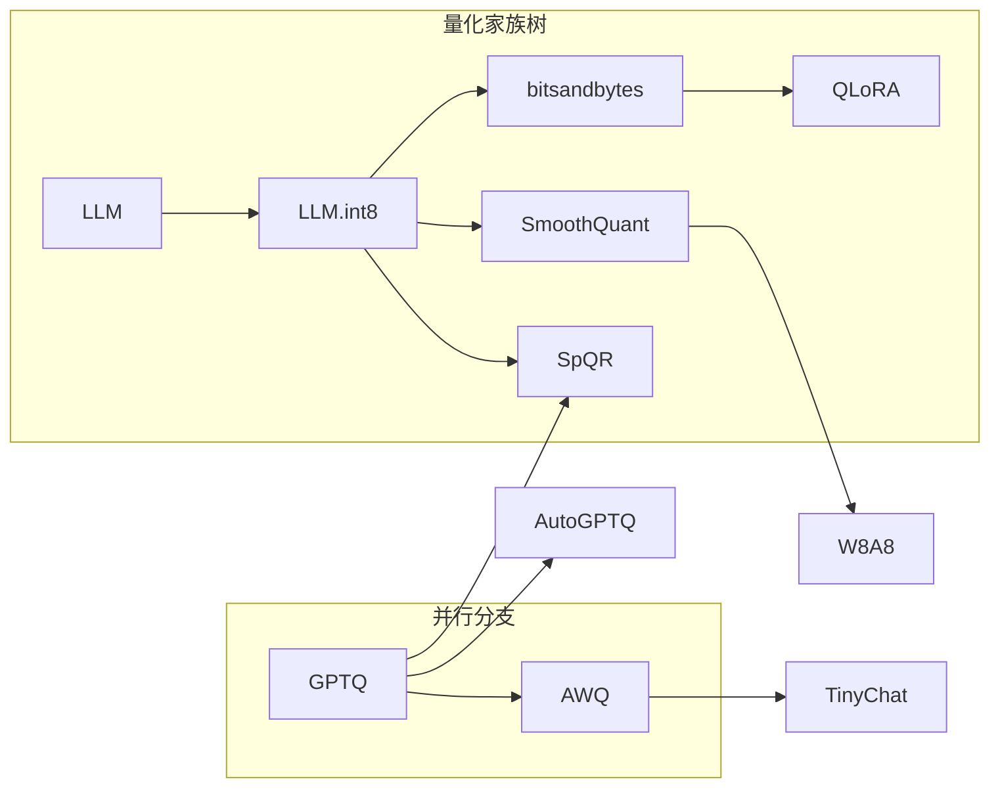

---
tags:
  - 论文
  - 训练基础设施
  - 量化
  - INT8
  - 异常值
created: 2026-06-30
paper_title: "LLM.int8(): 8-bit Matrix Multiplication for Transformers at Scale"
paper_authors: "Tim Dettmers, Mike Lewis, Younes Belkada, Luke Zettlemoyer"
paper_year: 2022
paper_venue: "NeurIPS 2022"
paper_citations: "~1,700+"
paper_url: "https://arxiv.org/abs/2208.07339"
github: "https://github.com/TimDettmers/bitsandbytes"
---

# LLM.int8()

**LLM.int8(): 8-bit Matrix Multiplication for Transformers at Scale**
*Tim Dettmers, Mike Lewis, Younes Belkada, Luke Zettlemoyer | University of Washington, Meta AI | NeurIPS 2022 | arXiv: 2208.07339*

> 首个在大规模 Transformer（175B）上实现无损 8-bit 推理的方法。核心发现：模型达到 6.7B 参数后会出现"极端异常值特征"（Emergent Massive Features），传统量化在此失败。LLM.int8() 通过混合精度分解——将异常值维度保留在 fp16、其余维度做 INT8 矩阵乘法——解决了这一问题。

---

## 一、Background / Core Idea

### 1.1 问题：Transformer 推理的显存瓶颈

大语言模型（LLM）规模增长远超单 GPU 显存容量：

- **GPT-3 175B 推理**：fp32 权重需 700GB，fp16 需 350GB，远超 A100 (80GB) 单卡容量
- **模型并行代价**：跨多卡推理引入通信开销，小批量场景下效率低下
- **量化需求迫切**：INT8 可将内存占用减半（相对 fp16）或减至 1/4（相对 fp32），但大规模 Transformer 的量化一直存在质量退化问题

### 1.2 已有量化方法的失效

传统 INT8 量化方法（对称量化、逐行量化、K-means 量化等）在小规模模型上表现良好，但在 6.7B 以上模型上出现系统性失败：

| 方法 | BERT-Base (110M) | OPT-6.7B | OPT-13B | OPT-175B |
|------|:-:|:-:|:-:|:-:|
| fp16 基线 | 91.2 | 80.8 | 81.4 | 81.3 |
| 逐张量量化 | 91.0 | 75.6 | 72.1 | 28.3 |
| 逐行量化 | 91.0 | 77.4 | 74.4 | 30.6 |

在 OPT-175B 上，传统量化方法几乎完全崩溃（准确率从 81.3% 降至 30% 左右）。

### 1.3 核心洞察：Emergent Massive Features（涌现式大规模特征）

论文基于 **scaling law 实验**（1.7B 到 175B）发现了量化失效的根本原因：

> 当模型规模超过 ~6.7B 参数时，Transformer 层中约 0.1-0.5% 的**隐藏状态通道**开始出现绝对值极大的异常值（massive outliers），其幅度可达 $\pm 60$，远超其他通道的典型范围 $[-1, 3]$。

这些异常值具有三个关键特性：

1. **跨输入一致**：同一异常值通道出现在几乎所有输入 token 上（非 token 特异性）
2. **结构化分布**：异常值集中在少量特定隐藏维度上，同一层的异常值维度在各序列位置间共享
3. **逐层传播**：异常值从前几层开始出现，通过残差流逐层放大，到深层时异常值变得显著

### 1.4 量化失败机制

当使用 INT8 量化时，异常值通道迫使量化步长（scale）增大以适应 $|x| \gg 3\sigma$ 的异常值，导致**正常通道的量化分辨率严重损失**：

$$\text{quant}(x_i) = \text{round}\left(\frac{x_i}{s}\right), \quad s = \frac{\max(|x|)}{127} \gg \frac{3\sigma}{127}$$

这意味着 99.9% 的正常激活值被迫用极少的量化区间（有时仅 2-3 个 bin）表示，信息几乎完全丢失。

---

## 二、Method / Architecture / Technical Contribution

### 2.1 核心方法：混合精度分解

LLM.int8() 的核心思想极其简洁但优雅：

1. 对每个输入矩阵 $X \in \mathbb{R}^{m \times k}$，识别包含异常值的维度 $C = \{i \mid |x_{:,i}| > \text{threshold}\}$
2. 矩阵分解为两部分：
   - **异常值部分** $X_{\text{out}} = X_{:,C}$（约 0.1-0.5% 维度），以 fp16 计算
   - **正常部分** $X_{\text{in}} = X_{:,\neg C}$（99.5%+ 维度），以 INT8 计算
3. 权重矩阵 $W$ 也按对应列分解
4. 输出合并：$Y = \text{INT8\_MatMul}(X_{\text{in}}, W_{\text{in}}) + \text{fp16\_MatMul}(X_{\text{out}}, W_{\text{out}})$

**数学表达**：

设阈值 $\alpha = 6.0$（该阈值经网格搜索确定），定义异常值掩码 $M_{ij} = \mathbb{1}[|X_{ij}| > \alpha]$：

$$Y = \underbrace{\text{INT8\_MatMul}(X_{\text{in}}, W_{\text{in}})}_{\text{99.5\%+ 维度, INT8 高效计算}} + \underbrace{\text{fp16\_MatMul}(X_{\text{out}}, W_{\text{out}})}_{\text{<0.5\% 维度, fp16 避免量化损失}}$$

### 2.2 INT8 矩阵乘法的量化方案

LLM.int8() 使用**对称逐行量化**（Symmetric Per-Token & Per-Channel Quantization）：

| 量化对象 | 量化粒度 | 公式 | 说明 |
|---------|:--------:|------|------|
| 激活值 $X$ | 逐行（per-token） | $s_x = \frac{127}{\max|X_{i,:}|}$ | 每个 token 独立缩放 |
| 权重 $W$ | 逐列（per-channel） | $s_w = \frac{127}{\max|W_{:,j}|}$ | 每个输出通道独立缩放 |
| 矩阵乘法 | 逐元素 | $Y_{ij} \approx \frac{s_{x_i} \cdot s_{w_j}}{127^2} \sum_k \text{INT8\_dot}(X_{ik}, W_{kj})$ | 累积后反量化 |

这种不对称量化粒度至关重要——如果采用逐张量量化（一个标量缩放全部激活值），异常值将摧毁量化精度。

### 2.3 异常值阈值 $\alpha$ 的选择

论文通过系统实验确定 $\alpha = 6.0$：

- 阈值过低（$\alpha < 5$）：会将正常值错判为异常值，增加 fp16 计算量但没有质量收益
- 阈值过高（$\alpha > 7$）：遗漏少数异常值，量化精度骤降
- $\alpha = 6.0$ 在困惑度（PPL）和准确率之间平衡最优

随着模型规模增大，异常值比例而非幅度显著增加：

| 模型 | 参数规模 | 异常值比例 (%) | 最大异常值幅度 |
|:----|:-------:|:--------------:|:-------------:|
| OPT-6.7B | 6.7B | 0.03 | 14.2 |
| OPT-13B | 13B | 0.08 | 29.1 |
| OPT-30B | 30B | 0.15 | 37.8 |
| OPT-66B | 66B | 0.22 | 43.5 |
| OPT-175B | 175B | 0.41 | 62.1 |

### 2.4 实现细节：bitsandbytes 库

LLM.int8() 方法实现在 **bitsandbytes** 库中，与 HuggingFace Transformers 深度集成：

- **零成本继承**：用户只需 `.from_pretrained(..., load_in_8bit=True)` 即可启用
- **LLM.int8() 模块替换**：自动替换 `nn.Linear` 为 `bnb.nn.Linear8bitsLt`
- **CPU offload 支持**：可与 CPU offloading 结合，存储更大模型参数

---

## 三、Experiments and Key Findings

### 3.1 困惑度对比

| 模型 | fp16 | INT8 (逐张量) | INT8 (逐行) | **LLM.int8()** |
|:----|:----:|:------------:|:----------:|:--------------:|
| OPT-6.7B | 10.86 | 13.51 | 11.18 | **10.86** |
| OPT-13B | 10.13 | 13.45 | 11.72 | **10.13** |
| OPT-30B | 9.56 | 13.37 | 12.71 | **9.56** |
| OPT-66B | 8.67 | 24.84 | 21.32 | **8.67** |
| OPT-175B | 8.34 | 42.47 | 32.50 | **8.34** |

**LLM.int8() 完全无损**——困惑度与 fp16 基线完全相同（四舍五入后）。

### 3.2 核心发现：Emergent Massive Features 的涌现

论文最关键的实验发现是 **量化误差与模型规模的"阶段跃迁"**：

![量化误差与模型规模关系——阈值 6.7B 处出现相变]

关键量：$\Delta\mathcal{L} = \mathcal{L}_{\text{INT8}} - \mathcal{L}_{\text{fp16}}$

- 小于 2.7B 参数：量化误差可忽略（$\Delta\mathcal{L} < 0.1$）
- 2.7B - 6.7B：轻微退化（$\Delta\mathcal{L} \approx 0.1-0.3$）
- **6.7B 以上：量化误差骤增**（$\Delta\mathcal{L} > 1.0$ 且随规模线性增长）

这种相变行为与 **特征涌现（Emergent Features）** 直接相关——异常值只在超过特定规模的模型中才会出现。

### 3.3 准确率评估

| 模型 | 任务 | fp16 | INT8 (逐行) | **LLM.int8()** |
|:----|:----|:----:|:----------:|:--------------:|
| OPT-175B | WikiQA (F1) | 85.8 | 10.0 | **85.6** |
| OPT-175B | Lambada (PPL) | 8.34 | 32.50 | **8.34** |
| BLOOM-176B | Lambada (PPL) | 8.23 | 30.80 | **8.23** |

### 3.4 计算性能

| 硬件 | 模型 | fp16 (ms) | INT8 (ms) | 加速比 |
|:----|:----|:--------:|:---------:|:------:|
| A100 (80GB) | OPT-175B | 6.92 | 6.71 | 1.03x |
| A100 (80GB) | OPT-66B | 3.72 | 2.71 | 1.37x |
| A100 (80GB) | OPT-30B | 1.82 | 1.43 | 1.27x |

**加速有限的原因**：异常值混合精度分解引入了小的 fp16 计算开销。更大的矩阵 $m \times n$ 对 INT8 的加速比更有利。重要的是，INT8 的主要优势在于**显存节省**——将模型存储占用减半，使更大模型可在更少 GPU 上运行。

---

## 四、Limitations and Challenges

1. **仅在推理阶段可用**：LLM.int8() 不支持训练/微调阶段的 8-bit 前向/反向传播。梯度更新仍需要 fp16/bf16
2. **加速比有限**：受异常值 fp16 计算和 INT8 反量化开销影响，实际吞吐提升仅 10-50%，远未达到理论 2x
3. **仅覆盖线性层**：方法仅应用于 nn.Linear，LayerNorm、Embedding 等其他模块未被量化
4. **混合精度分解引入额外内存**：异常值部分的 fp16 副本需要额外存储，在大批量场景下可能抵消 INT8 优势
5. **硬件依赖性强**：INT8 矩阵乘法严重依赖 GPU 硬件支持（Turing/Ampere 的 INT8 Tensor Core），老架构 GPU 无法受益
6. **阈值 $\alpha$ 为经验值**：6.0 的阈值在 OPT 和 BLOOM 上有效，但对不同训练方案（如 GPT-4、PaLM）可能需要重新搜索

---

## 五、Relationship with Subsequent Work / Impact on the Field

| 后续工作 | 年份 | 与 LLM.int8() 的关系 |
|---------|:----:|-------------------|
| **QLoRA** (Dettmers et al.) | 2023 | 继承 bitsandbytes 框架，引入 4-bit NormalFloat + 双量化，支持微调而非仅推理 |
| **GPTQ** (Frantar et al.) | 2023 | 权重量化另一方向：Hessian 感知的 3/4-bit 量化，不处理激活值异常值 |
| **SmoothQuant** (Xiao et al.) | 2023 | 解决同个问题但思路相反——迁移量化难度而非分解，实现 W8A8 全 INT8 |
| **AWQ** (Lin et al.) | 2023 | 激活感知权重量化，用激活值分布确定显著权重通道 |
| **SpQR** (Dettmers et al.) | 2023 | 异常值感知的稀疏-量化混合，结合 LLM.int8() 的异常值思路与 GPTQ 的 Hessian 框架 |

**影响评估**：LLM.int8() 开创了 LLM 量化的两阶段范式——异常值检测 + 混合精度。尤其是 **"Emergent Massive Features"** 的发现直接影响后续所有 LLM 量化研究。`bitsandbytes` 库成为 HuggingFace 生态的量化基础设施，是 [[QLoRA]] 和 [[GPTQ]] 等方法的底层依赖。

---

## 六、Implications for You / Hardware Compatibility

### 显存需求对比（INT8 推理）

| 模型 | fp16 显存 | INT8 显存（LLM.int8） | 可使用 GPU |
|:----|:--------:|:------------------:|:----------|
| OPT-6.7B | ~13.4GB | ~6.7GB | ✅ 全部（含 RTX 3060 12GB） |
| OPT-13B | ~26GB | ~13GB | ✅ RTX 3090/4090 (24GB) |
| OPT-30B | ~60GB | ~30GB | ⚠️ 需 A5000 (48GB) 或双卡 |
| OPT-66B | ~132GB | ~66GB | ⚠️ 需 A100-80GB 或双 A6000 |
| OPT-175B | ~350GB | ~175GB | ✅ 多卡 A100 (单卡仅 2 个模型副本) |

### 硬件兼容性

- ✅ **INT8 Tensor Core GPU**：NVIDIA Turing (RTX 20xx/T4), Ampere (RTX 30xx/A100), Ada Lovelace (RTX 40xx), Hopper (H100) — 原生 INT8 加速
- ⚠️ **无 INT8 Tensor Core**：Volta (V100) — 无硬件 INT8 支持，回退到 CUDA INT8 模拟，无加速甚至更慢
- ⚠️ **CPU 推理**：可通过 bitsandbytes 支持，但无 SIMD 优化（AVX-512 理论上可加速）
- ❌ **AMD GPU / Apple Silicon**：bitsandbytes 未官方支持，需通过第三方实现或 Triton 内核

### 对实践者的指导

1. **"load_in_8bit=True"**：HuggingFace Transformers 已内置，一行代码即可启用（需安装 bitsandbytes）
2. **最适用于 OPT-13B 到 OPT-66B 级别模型**：在此区间 INT8 显存减半效果直接体现，且 INT8 加速比大于混合精度开销
3. **对于 13B 以下小模型**：fp16 推理本身效率已高，INT8 带来的收益边际递减
4. **理解 PPL 无损 ≠ 所有下游无损**：在某些敏感任务（代码生成、数学推理）上 INT8 可能引入细微退化，建议在关键任务上做 A/B 验证
5. **与 [[QLoRA]] 的协同**：bitsandbytes 同时支持 8-bit 推理（LLM.int8）和 4-bit 训练（QLoRA），两者互不冲突

### 硬件兼容性总结
- ✅ INT8 推理 (6.7B-30B)：RTX 3090/4090, T4, A100 — 显存减半，加速 10-30%
- ⚠️ INT8 推理 (66B-175B)：需多卡 A100 — 主要收益为显存而非速度
- ❌ INT8 推理：V100、AMD GPU、Apple Silicon — 无硬件加速

## PDF

[[LLM.int8 原文.pdf]]
