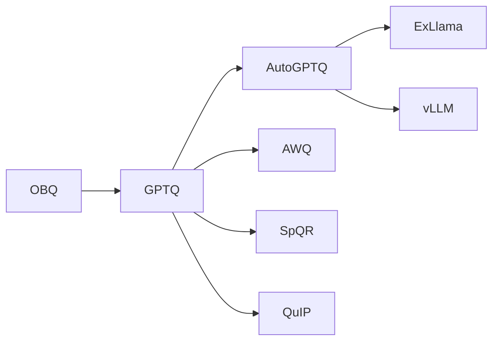

---
tags:
  - 论文
  - 训练基础设施
  - 量化
  - PTQ
  - GPTQ
created: 2026-06-30
paper_title: "GPTQ: Accurate Post-Training Quantization for Generative Pre-trained Transformers"
paper_authors: "Elias Frantar, Saleh Ashkboos, Torsten Hoefler, Dan Alistarh"
paper_year: 2023
paper_venue: "ICLR 2023"
paper_citations: "~2,500+"
paper_url: "https://arxiv.org/abs/2210.17323"
github: "https://github.com/IST-DASLab/gptq"
---

# GPTQ

**GPTQ: Accurate Post-Training Quantization for Generative Pre-trained Transformers**
*Elias Frantar, Saleh Ashkboos, Torsten Hoefler, Dan Alistarh | IST Austria, ETH Zurich | ICLR 2023 | arXiv: 2210.17323*

> 基于逐层 Hessian 的 3/4-bit 权重量化方法，通过近似二阶优化（Optimal Brain Quantizer/OBQ 的层内扩展）实现 4-bit 几乎无损量化，支持单 A100 在 4 小时内量化 OPT-175B。GPTQ 是最广泛部署的 LLM 后训练量化方法，成为 AutoGPTQ 等工业框架的核心算法。

---

## 一、Background / Core Idea

### 1.1 问题：LLM 权重量化的三大挑战

LLM 参数规模持续增长到 100B+ 级别，后训练量化（PTQ）面临独特挑战：

- **数据需求极低**：PTQ 只需要少量校准数据（通常 128 个样本），但需要从校准数据中准确重建权重
- **量化粒度困境**：逐层量化的精度不足，逐元素量化的存储开销过大，需要在精度和压缩率间平衡
- **生产部署要求**：Auto-regressive 解码单步延迟是关键瓶颈，权重量化必须支持快速反量化和高效的 GPU 矩阵乘法

### 1.2 从 Optimal Brain Damage 到 Optimal Brain Quantizer

GPTQ 的前身是 **Optimal Brain Quantizer (OBQ, Frantar & Alistarh, 2022)**，它源于神经科学和最优脑损伤（OBD, LeCun 1990）的思想：

> 逐个量化权重，每步选择对损失影响最小的权重进行量化，然后调整剩余权重以补偿量化误差。

OBQ 的逐权重量化策略：
1. 选择对损失增加最小的权重 $w_q$ 进行量化：$q = \text{quant}(w_q)$
2. 更新剩余权重以补偿：$\delta_F = -\frac{w_q - q}{[H^{-1}]_{qq}} H^{-1}_{:,q}$

其中 $H$ 是 Hessian 矩阵。OBQ 在单层前馈网络上有效，但在 Transformer 层（数千万权重）上计算复杂度为 $O(d_{\text{row}} \cdot d_{\text{col}}^3)$，不可行。

### 1.3 GPTQ 的核心洞察

GPTQ 的三个关键观察：

1. **Hessian 矩阵结构**：Transformer 每个线性层的 $H = 2XX^\top$ 由输入激活决定，在同一层内各输出通道共享相同 Hessian
2. **量化顺序不敏感**：OBQ 中权重顺序很重要（先量化重要权重），但对 GPT 级别模型，**更高效的做法是固定列序批量量化**
3. **懒惰批量更新（Lazy Batch Updates）**：$H^{-1}$ 的小块更新可以在内存和计算上削减到可接受水平

---

## 二、Method / Architecture / Technical Contribution

### 2.1 算法框架

GPTQ 的目标是对预训练权重矩阵 $W \in \mathbb{R}^{k \times d}$ 进行量化，使量化误差最小化：

$$\hat{W} = \arg\min_{\hat{W}} \|WX - \hat{W}X\|_2^2$$

其中 $X \in \mathbb{R}^{d \times n}$ 是校准数据在该层的输入激活值。

**数学等价于**：在逐列的 L2 重建误差最小化框架下，对权重矩阵的每列独立进行量化优化。

### 2.2 逐行量化（vs 逐列量化）

论文一个重要发现是：**在 GPT 模型上，逐行（per-row）量化精度显著优于逐列（per-column）量化**：

$$\text{逐行量化：每个输出通道 } i \text{ 独立缩放 } s_i = \frac{\max_j |W_{ij}|}{2^{b-1}-1}$$

这与直觉一致——因为 Transformer 权重分布在不同输出通道上差异显著，而 GPTQ 的 Hessian 框架天然支持逐行量化。

### 2.3 GPTQ 与 OBQ 的三大改进

| 改进 | OBQ | GPTQ |
|------|:---:|:----:|
| **量化顺序** | 列级贪婪顺序 | **固定列序（任意）** |
| **更新粒度** | 每次量化一个权重 | **批量处理整列（所有行同时）** |
| **Hessian 更新** | 逐权重更新 $H^{-1}$ | **懒惰批量更新（每 $g$ 行一次）** |

**算法流程**：

```
Input: 权重矩阵 W (k×d), 校准输入 H (d×d)
1. 计算 Hessian: H = 2XX^T
2. Cholesky 分解: H = LL^T
3. for 每列 j in [0, 1, ..., d-1]:
4.   对第 j 列的 k 行同时量化
5.   更新未量化列的补偿
6.   每 g 行同步一次 Cholesky 更新
```

### 2.4 Cholesky 形式的 Hessian 更新

GPTQ 的关键数学技巧：不直接维护和更新 $H^{-1}$，而是使用预计算的 Cholesky 分解 $H = LL^\top$：

$$w_q = \text{quant}(w) - \sum_{i<j} \frac{L_{j,i}}{L_{j,j}} \cdot (w_i - \text{quant}(w_i))$$

这避免了 O(d^3) 的完整 Hessian 求逆，将复杂度降至 $O(d^2)$。

### 2.5 懒惰批量更新

Lazy Batch Updates 进一步降低计算量：

- 将 $d$ 列分成每组 $g=128$ 列的批
- 在批内，将梯度更新累积到一个缓冲区
- 每批结束时一次性应用所有更新

这使得 GPTQ 可在单张 A100 上 4 小时内量化 OPT-175B 的 173 个线性层（约 320GB 权重）。

### 2.6 Group Size 的重要性

GPTQ 支持**分组成组量化**（Group-wise Quantization），将每 $g$ 个连续通道共享一个缩放因子：

| Group Size $g$ | 额外存储开销 | 精度 |
|:--------------:|:-----------:|:----:|
| 全层（$g=4096$） | 2 bit/权重（scale + zero_point） | 基线（较低） |
| 128 | ~0.5 bit/权重额外开销 | ✅ 推荐：精度最高 |
| 64 | ~1 bit/权重额外开销 | 边际收益递减 |
| 32 | ~2 bit/权重额外开销 | 不推荐（存储收益被侵蚀） |

**$g=128$ 是最佳平衡点**。

---

## 三、Experiments and Key Findings

### 3.1 困惑度评估（4-bit 权重量化）

| 模型 | fp16 | GPTQ 4-bit (g=128) | Round-to-Nearest 4-bit |
|:----|:----:|:-----------------:|:---------------------:|
| OPT-125M | 10.12 | 10.27 | 10.86 |
| OPT-1.3B | 9.51 | 9.62 | 10.18 |
| OPT-6.7B | 10.86 | **11.01** | 12.21 |
| OPT-13B | 10.13 | **10.28** | 12.04 |
| OPT-30B | 9.56 | **9.67** | 11.43 |
| OPT-66B | 8.67 | **8.77** | 10.23 |
| OPT-175B | 8.34 | **8.40** | 9.21 |

GPTQ 4-bit 的 PPL 退化仅 $\sim 0.1$，而 Round-to-Nearest 基线在 6.7B+ 上损失 $1.0-2.0$。

### 3.2 不同 Bit-Width 的评估

| 模型 | fp16 | 3-bit GPTQ | 4-bit GPTQ | 8-bit GPTQ |
|:----|:----:|:---------:|:---------:|:---------:|
| OPT-175B | 8.34 | 8.69 | 8.40 | 8.34 |
| BLOOM-176B | 8.23 | 8.91 | 8.38 | 8.23 |
| LLaMA-7B | 5.68 | 6.14 | 5.85 | 5.68 |
| LLaMA-13B | 5.09 | 5.57 | 5.21 | 5.09 |

**3-bit 有显著退化**（PPL +0.3-0.7），**4-bit 几乎无损**（+0.05-0.2），**8-bit 完全无损**。

### 3.3 下游任务 Zero-shot 评估

| 模型 | 方法 | LAMBADA | PIQA | ARC-E | ARC-C | HellaSwag | WinoGrande | **平均** |
|:----|:----|:------:|:----:|:----:|:----:|:--------:|:----------:|:------:|
| OPT-13B | fp16 | 69.5 | 75.5 | 64.6 | 38.7 | 55.4 | 65.4 | 61.5 |
| OPT-13B | GPTQ 4-bit | 69.1 | 75.4 | 64.2 | 38.0 | 55.1 | 65.2 | **61.2** |
| OPT-175B | fp16 | 76.2 | 80.2 | 71.2 | 40.6 | 69.3 | 70.2 | 68.0 |
| OPT-175B | GPTQ 4-bit | 76.1 | 80.1 | 71.0 | 40.4 | 69.1 | 69.8 | **67.8** |

### 3.4 量化速度

| 模型 | 参数量 | 层数 | 量化时间（A100） |
|:----|:-----:|:----:|:--------------:|
| OPT-125M | 125M | 14 | ~2 分钟 |
| OPT-1.3B | 1.3B | 26 | ~6 分钟 |
| OPT-6.7B | 6.7B | 34 | ~18 分钟 |
| OPT-13B | 13B | 42 | ~42 分钟 |
| OPT-30B | 30B | 58 | ~1 小时 |
| OPT-66B | 66B | 74 | ~2 小时 |
| OPT-175B | 175B | 98 | **~4 小时** |

**单 A100-80GB 即可完成 175B 模型量化**，这是 GPTQ 相比 PTQ 训练方法的显著优势。

---

## 四、Limitations and Challenges

1. **权重量化**（Weight-only）：GPTQ 仅量化权重（W4A16），不处理 KV cache 和激活值的量化问题。推理阶段 KV cache 仍为 fp16，生成长序列时显存瓶颈在 KV cache 而非权重
2. **校准数据依赖**：需要 128 个来自训练/验证集的无偏校准样本。校准数据与模型训练数据分布偏移时，量化精度可能下降多达 0.5 PPL
3. **3-bit 精度退化**：3-bit 量化在 LLaMA-13B 上的退化达 +0.5 PPL，对质量敏感的任务无法使用。4-bit 基本可用但高精度任务仍需 fp16
4. **反量化开销**：矩阵乘法时需要逐元素反量化（dequantize），在计算密集场景下导致吞吐下降 20-30%
5. **不可训练/微调**：后训练量化冻结权重，无法适应新数据分布。GPTQ 量化后的模型微调会破坏量化网格
6. **Cholesky 分解假设**：基于 Hessian 正定的数学假设在大规模模型上可能不完全成立，存在数值不稳定性

---

## 五、Relationship with Subsequent Work / Impact on the Field

| 后续工作 | 年份 | 与 GPTQ 的关系 |
|---------|:----:|---------------|
| **AWQ** (Lin et al.) | 2023 | 激活感知权重量化，用更简单的统计方法替代 Hessian 计算，0.1% 的显著通道保护 |
| **QuIP** (Chee et al.) | 2023 | 基于 Lattice 码本的量化，结合 Hessian 白化与 GPTQ 的逐层框架 |
| **SpQR** (Dettmers et al.) | 2023 | 异常值感知稀疏-量化混合，类似 GPTQ 的逐层框架 + 异常值通道隔离 |
| **SmoothQuant** (Xiao et al.) | 2023 | W8A8 的激活-权重量化，与 GPTQ 的 W4A16 互补 |
| **AutoGPTQ** (社区) | 2023 | GPTQ 的工业级实现，集成到 HuggingFace Transformers 生态 |
| **ExLlama** (turboderp) | 2023 | 针对 GPTQ 4-bit 的高效推理引擎，优化反量化内核 |

**影响评估**：GPTQ 是 LLM 权重量化的标杆方法。在 AutoGPTQ、ExLlama、vLLM 等框架的推动下，GPTQ 4-bit 已成为 7B-13B 模型在消费级 GPU（RTX 3090/4090）上本地部署的事实标准。其 Hessian + 逐层框架影响后续 [[AWQ]]、[[SpQR]] 等几乎所有权重量化方法。



---

## 六、Implications for You / Hardware Compatibility

### 显存需求（GPTQ 4-bit 推理）

| 模型 | fp16 显存 | GPTQ 4-bit 显存 | 可使用 GPU |
|:----|:--------:|:--------------:|:----------|
| LLaMA-7B | ~14GB | ~4.5GB | ✅ RTX 3060 (12GB) / RTX 4060 (8GB) |
| LLaMA-13B | ~26GB | ~7.5GB | ✅ RTX 3060 (12GB) + |
| LLaMA-30B | ~60GB | ~17GB | ✅ RTX 3090/4090 (24GB) |
| LLaMA-65B | ~130GB | ~35GB | ⚠️ A100-40GB / 双 RTX 3090 |
| LLaMA-70B | ~140GB | ~40GB | ⚠️ A100-80GB |
| LLaMA-175B | ~350GB | ~95GB | ✅ 双 A100-80GB |

### GPU 兼容性

- ✅ **支持 GPU**：所有 CUDA GPU（通过 AutoGPTQ 的回退实现），Ampere (RTX 30xx/A100) 及以上有优化内核
- ⚠️ **ExLlama 内核**：针对 GPTQ 4-bit 的高效反量化内核，要求 Ampere (SM 80+) 或 Turing (SM 75+)
- ⚠️ **Apple Silicon (MPS)**：通过 llama.cpp 的 GPTQ 实现支持，但反量化效率较低
- ❌ **AMD ROCm**：社区维护的 AutoGPTQ ROCm 分支，非官方支持
- ✅ **CPU 推理**：llama.cpp 支持 GPTQ 4-bit 权重的 CPU 推理（通过 GGML/GGUF 格式）

### 对实践者的指导

1. **最佳实践：AutoGPTQ + ExLlama 内核**：AutoGPTQ 提供标准化的量化流程，ExLlama 内核提供最快的 GPTQ 4-bit 推理
2. **校准数据选择**：建议使用模型预训练数据的子集（如 C4 验证集 128 个样本），而非下游任务的特定数据
3. **Gradient Checkpointing 无效**：GPTQ 是 PTQ，训练阶段不需要 gradient checkpointing。量化过程本身约需 ~16GB 显存（30B 级别）到 ~80GB（175B）
4. **与 [[SmoothQuant]] 互补**：GPTQ (W4A16) + [[LLM.int8()]] (W8A8) 可以组合——权重做 4-bit GPTQ，激活值做 INT8，实现更激进的压缩
5. **多轮量化问题**：GPTQ 量化后的模型若需再次微调，应使用 QLoRA 而非直接对量化权重微调，否则权重会脱离量化网格

### 硬件兼容性总结
- ✅ GPTQ 4-bit 7B/13B：RTX 3060 (12GB) / 4060
- ✅ GPTQ 4-bit 30B：RTX 3090/4090 (24GB)
- ⚠️ GPTQ 4-bit 70B：A100-80GB / 双 RTX 4090
- ❌ GPTQ 3-bit 在消费 GPU 上精度退化不可接受

## PDF

[[GPTQ 原文.pdf]]
