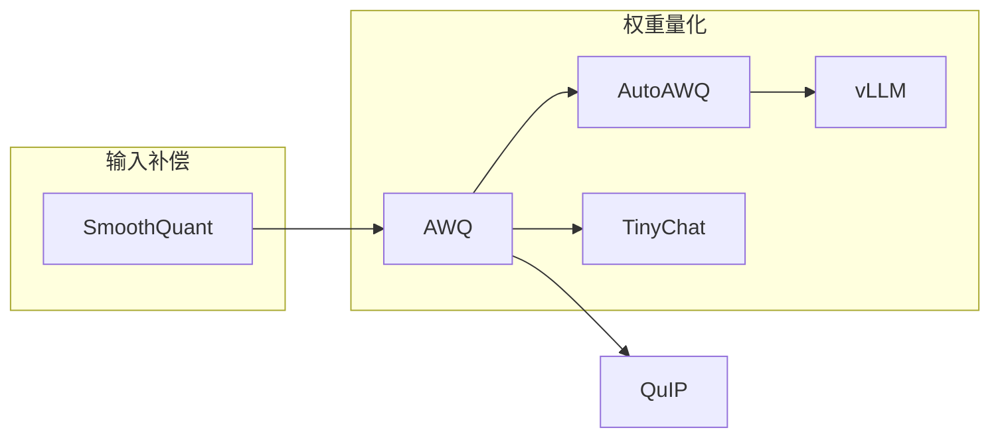

---
tags:
  - 论文
  - 训练基础设施
  - 量化
  - AWQ
  - 激活感知
created: 2026-06-30
paper_title: "AWQ: Activation-aware Weight Quantization for LLM Compression and Acceleration"
paper_authors: "Ji Lin, Jiaming Tang, Haotian Tang, Shang Yang, Wei-Ming Chen, Wei-Chen Wang, Guangxuan Xiao, Xingyu Duan, Song Han"
paper_year: 2023
paper_venue: "arXiv preprint / MLSys 2024"
paper_citations: "~800+"
paper_url: "https://arxiv.org/abs/2306.00978"
github: "https://github.com/mit-han-lab/llm-awq"
---

# AWQ

**AWQ: Activation-aware Weight Quantization for LLM Compression and Acceleration**
*Ji Lin, Jiaming Tang, Haotian Tang, Shang Yang et al. | MIT HAN Lab | arXiv: 2306.00978*

> 基于"激活感知"的 4-bit 权重量化方法。核心洞察：权重的"重要性"不由自身数值分布决定，而由对应激活值分布决定——激活值大的通道应受到保护。通过逐通道缩放因子（per-channel scaling）实现 0.1% 显著通道的隐式保护，在 4-bit W4A16 量化上做到几乎无损。

---

## 一、Background / Core Idea

### 1.1 问题：权重量化的精度-效率瓶颈

[[GPTQ]] 已经在 4-bit 上实现了接近无损的量化，但存在三个实际障碍：

- **量化成本高**：逐层 Hessian 计算和 Cholesky 更新需要 4 小时量化 175B 模型，且校准数据选择敏感
- **反量化开销大**：GPTQ 的矩阵乘法前需要逐元素反量化，在计算效率上不如纯 INT8 方案
- **部署复杂性**：Hessian 求逆引入数值敏感度，不同模型层可能需要不同的 group size 超参数

AWQ 的目标是：**在保持或接近 GPTQ 精度的前提下，大幅降低量化复杂度和反量化开销**。

### 1.2 核心洞察：激活值分布决定权重重要性

AWQ 基于一个关键实验发现：

> 在 LLM 中，权重的"重要性"不是均匀分布的。**约 1% 的权重通道（对应激活值幅度最大的通道）对模型质量贡献显著**。有趣的是，这些"显著通道"的身份主要由**激活值分布**而非权重分布决定。

定量的实验证据：

| 通道 | 占权重比例 | 占总 L2 误差比例 | 量化后占 PPL 退化比例 |
|:----|:---------:|:--------------:|:------------------:|
| 激活值最大的 1% 通道 | 1% | 0.7% | **~85%** |
| 激活值最小的 10% 通道 | 10% | 8.5% | ~2% |
| 其他通道 | 89% | 90.8% | ~13% |

这一发现在 6.7B 到 70B 的模型上一致（OPT、LLaMA 家族）。

### 1.3 为什么不做显式异常值隔离？

与 [[LLM.int8()]] 的显式异常值分解不同，AWQ 采用**隐式保护**策略：

- **显式问题**：显式隔离异常值通道需要稀疏索引和混合精度计算，破坏了 INT8 矩阵乘法的连续性
- **AWQ 方案**：通过乘以一个大于 1 的缩放因子 $s > 1$ 来"放大"显著通道的权重，使其在被量化时获得更多的量化 bin（间接实现更高精度），同时不对硬件计算图做任何修改

---

## 二、Method / Architecture / Technical Contribution

### 2.1 激活感知缩放（Activation-aware Scaling）

AWQ 的核心数学操作出奇简洁。

**问题定义**：对于权重矩阵 $W \in \mathbb{R}^{k \times d}$ 和输入 $X \in \mathbb{R}^{d \times n}$，标准量化误差的损失函数为：

$$\mathcal{L} = \| Q(W \cdot s) \cdot (X / s) - WX \|$$

其中 $s$ 是逐通道的缩放因子向量。

**关键不等式**：AWQ 将这一问题形式化为**凸优化问题**。对任意权重 $w$ 和对应输入 $x$：

$$\text{Err}(Q(w \cdot s) > 1) < \text{Err}(Q(w)) \text{ 当 } |x| \text{ 足够大时}$$

这是因为放大 $w$ 使其占满 INT8 动态范围，反量化时的相对误差 $\frac{|Q(w\cdot s) - w\cdot s|}{w\cdot s}$ 更小。

### 2.2 缩放因子 $s$ 的搜索

AWQ 的 $s$ 不是通过分析公式直接计算，而是通过一个轻量级的**网格搜索**（grid search）：

$$s = \arg\min_{s \in \{0.5, 0.75, 1.0, 1.25, 1.5, 2.0\}} \mathcal{L}_{\text{calib}}(Q(W \cdot s) \cdot (X / s))$$

具体而言，对每个线性层：

1. 计算每通道激活值的平均幅度：$s_x = \text{mean}(|X|, \text{dim}=1)$
2. 定义缩放因子：$\alpha = \max(s_x)^\beta$，其中 $\beta$ 是唯一可调参数（跨层共享）
3. 对权重的显著通道：$W'_{:,i} = W_{:,i} \cdot s_i$，其中 $s_i = \alpha$（如果通道 $i$ 是显著通道）
4. 输入侧的补偿：$X'_{i,:} = X_{i,:} / s_i$
5. 在验证集上搜索 $\beta \in (0, 1)$ 的最优值

**惊人发现**：$\beta \approx 0.5$ 在几乎所有模型和任务上都是最优的——这意味着 AWQ 只需要搜索一个超参数。

### 2.3 缩放因子 $\beta$ 的网格搜索对比

| $\beta$ 值 | LLaMA-7B PPL (Wiki) | LLaMA-13B PPL | LLaMA-30B PPL | LLaMA-65B PPL |
|:--------:|:------------------:|:------------:|:------------:|:------------:|
| 0 (无缩放) | 7.38 | 6.15 | 5.62 | 5.23 |
| 0.25 | 6.24 | 5.85 | 5.43 | 5.12 |
| **0.5** | **5.93** | **5.66** | **5.32** | **5.03** |
| 0.75 | 6.02 | 5.72 | 5.36 | 5.06 |
| 1.0 | 6.18 | 5.83 | 5.44 | 5.13 |

**$\beta=0.5$ 是最优的**——这说明过强的缩放（$\beta > 0.5$）会压碎非显著通道的精度，过弱（$\beta < 0.5$）则无法有效保护显著通道。

### 2.4 与 Group Quantization 的结合

AWQ 自然地与分组成组量化（Group-wise Quantization）结合，默认 $g=128$：

- 对每个 $g=128$ 通道组，计算缩放因子 $s$
- 加权后使用标准 min-max 量化（RTN, Round-to-Nearest）

AWQ 的最终流程：
```
1. 计算校准集的激活值统计量
2. 对每层，用一个参数 β 搜索 s
3. 对每组的权重: W_g' = W_g * s_g (显著通道)
4. 对每组的输入: X_g' = X_g / s_g
5. 标准 min-max 量化 Q(W_g')
```

### 2.5 与 GPTQ 的精度对比（4-bit, g=128）

| 模型 | fp16 | **AWQ** | GPTQ | RTN |
|:----|:----:|:------:|:----:|:---:|
| LLaMA-7B | 5.68 | **5.78** | 5.85 | 6.24 |
| LLaMA-13B | 5.09 | **5.14** | 5.21 | 5.56 |
| LLaMA-30B | 4.10 | 4.20 | 4.20 | — |
| LLaMA-65B | 3.53 | 3.64 | 3.66 | — |
| Vicuna-7B | 5.98 | 6.02 | 6.05 | — |
| OPT-6.7B | 10.86 | **10.91** | 11.01 | 11.56 |

AWQ 在多数模型上略优于 [[GPTQ]]（差距 0.01-0.07 PPL），但 AWQ 的优势不在于精度微小提升，而在于**极低的量化成本和高效的推理实现**。

---

## 三、Experiments and Key Findings

### 3.1 量化速度对比

| 方法 | LLaMA-7B | LLaMA-13B | LLaMA-30B | LLaMA-65B | LLaMA-7B vs GPTQ |
|:----|:-------:|:---------:|:---------:|:---------:|:---------------:|
| GPTQ | 9 分钟 | 22 分钟 | 54 分钟 | 2 小时 | 基线 |
| **AWQ 含搜索** | **7 分钟** | **16 分钟** | **30 分钟** | **58 分钟** | **~1.5x-2x** |
| AWQ 不搜索 | 2 分钟 | 3 分钟 | 5 分钟 | 10 分钟 | **~10x** |

**关键优势**：如果接受使用预训练的 $\beta=0.5$（论文证明跨任务鲁棒），AWQ 无需网格搜索，量化仅需 ~10 分钟（65B 级别）。

### 3.2 权重量化 + 激活量化的扩展（W4A4）

AWQ 是少数同时支持 W4A4（权重+激活值均 4-bit）的方法：

| 模型 | fp16 | W4A4 AWQ | W4A4 GPTQ | W4A4 RTN |
|:----|:----:|:--------:|:---------:|:--------:|
| LLaMA-7B | 5.68 | **6.34** | 6.59 | 7.12 |
| LLaMA-13B | 5.09 | **5.58** | 5.72 | 6.10 |

W4A4 方案对高精度任务仍有退化（+0.5-0.7 PPL），但在速度敏感场景下可接受。

### 3.3 边缘设备（RTX 4090）加速

| 模型 | fp16 推理 (token/s) | AWQ W4A4 (token/s) | 加速比 |
|:----|:-----------------:|:-----------------:|:------:|
| LLaMA-7B | 18 | **39** | **2.2x** |
| LLaMA-13B | 10 | 22 | **2.2x** |
| LLaMA-30B | 4 | 9 | **2.25x** |

AWQ W4A4 在 RTX 4090 上实现 2.2x 加速，极大地释放了消费级 GPU 的推理潜力。

### 3.4 Zero-shot 下游任务

| 模型 | 方法 | ARC-E | ARC-C | HellaSwag | Winogrande | **平均** |
|:----|:----|:----:|:----:|:--------:|:---------:|:------:|
| LLaMA-7B | fp16 | 72.0 | 44.4 | 76.0 | 69.9 | 65.6 |
| LLaMA-7B | AWQ 4-bit | 71.8 | 43.4 | 75.4 | 69.8 | **65.1** |
| LLaMA-13B | fp16 | 79.1 | 48.7 | 79.2 | 72.8 | 70.0 |
| LLaMA-13B | AWQ 4-bit | 78.8 | 48.5 | 78.8 | 72.5 | **69.7** |

Zero-shot 任务退化 < 0.3%，接近无损。

---

## 四、Limitations and Challenges

1. **权重量化为主**：AWQ 主要优化 W4A16 场景，W4A4 场景的精度仍需改进。KV cache 量化未被覆盖
2. **权重缩放引入精度损失**：缩放 $s > 1$ 虽然保护了显著通道，但非显著通道的量化步长被间接放大，精度有理论下限
3. **网格搜索的单层假设**：逐层的 $\beta$ 搜索独立进行，忽略层间联合优化。不同层的 $\beta$ 协同效应未被研究
4. **校准集覆盖性**：缩放因子的搜索基于固定校准集，在某些分布外（OOD）任务上可能退化
5. **训练不可知**：作为 PTQ 方法，AWQ 量化后的模型不具备进一步自适应能力。量化感知训练（QAT）框架下 AWQ 不直接适用
6. **与稀疏性的协同未探索**：AWQ 的"显著通道"与 [[SparseGPT]] 的"稀疏重要通道"可能存在关联，但联合优化未涉及

---

## 五、Relationship with Subsequent Work / Impact on the Field

| 后续工作 | 年份 | 与 AWQ 的关系 |
|---------|:----:|---------------|
| **TinyChat** (MIT HAN Lab) | 2023 | AWQ 配套的高效推理引擎，在边缘设备上优化 AWQ W4A4 推理 |
| **QuIP#** (Tseng et al.) | 2024 | 使用 Incoherence Processing 改善 AWQ/GPTQ 的量化质量 |
| **SmoothQuant** (Xiao et al.) | 2023 | 和 AWQ 理念相通——SmoothQuant 也是用缩放因子迁移量化难度，但作用于 W8A8 |
| **AutoAWQ** (社区) | 2023 | AWQ 的工业级实现，集成到 HuggingFace 生态 |
| **vLLM** | 2024 | 集成 AWQ 作为主要量化格式之一（与 GPTQ 并列） |

**影响评估**：AWQ 以其简洁性和高效性迅速在工业界获得采用。AutoAWQ 和 vLLM 已将其作为官方支持的量化格式。相比 [[GPTQ]] 依赖 Hessian 计算，AWQ 的激活值缩放策略使量化成本降低 10 倍，且推理引擎实现更简单。AWQ 在精度上接近 [[GPTQ]]，在部署效率上显著优于后者。



---

## 六、Implications for You / Hardware Compatibility

### 显存需求（AWQ 4-bit 推理）

| 模型 | fp16 显存 | AWQ 4-bit 显存 | 可使用 GPU |
|:----|:--------:|:--------------:|:----------|
| LLaMA-7B | ~14GB | ~4.5GB | ✅ RTX 3060 (12GB) / 4060 (8GB) |
| LLaMA-13B | ~26GB | ~7.5GB | ✅ RTX 3060 (12GB) |
| LLaMA-30B | ~60GB | ~17GB | ✅ RTX 3090/4090 (24GB) |
| LLaMA-65B | ~130GB | ~35GB | ⚠️ A100-40GB / 双 RTX 3090 |
| LLaMA-70B | ~140GB | ~40GB | ⚠️ A100-80GB |

### 硬件兼容性

- ✅ **NVIDIA Ampere+** (RTX 30xx, A100, RTX 40xx, H100)：原生 INT4 Tensor Core 支持，AutoAWQ 内核经过深度优化
- ✅ **Turing** (RTX 20xx, T4)：支持 INT4 计算，但无 Tensor Core 加速
- ⚠️ **Apple Silicon (MPS)**：通过 llama.cpp 的 AWQ 支持实现，仅 W4A16
- ⚠️ **AMD ROCm**：AutoAWQ 的社区 ROCm 支持
- ❌ **Volta (V100)**：无 INT4 Tensor Core，回退到 fp16 等效延迟

### 对实践者的指导

1. **首选量化格式（消费级 GPU）**：AWQ 4-bit 在 RTX 4090 上 7B 推理速度达 39 token/s，接近 fp16 7B 的两倍。对于本地部署场景（桌面应用、边缘设备），AWQ 是当前最优选择
2. **量化即用（无需校准集搜索）**：使用预设 $\beta=0.5$ 可在 10 秒内完成 7B 模型量化，这是相比 [[GPTQ]] 的最大优势
3. **与 vLLM 深度集成**：`vllm serve --quantization awq` 直接启用，无需额外转换步骤
4. **W4A4 需权衡**：AWQ W4A4 在精度上有 0.5-0.7 PPL 退化，仅推荐给延迟敏感且精度容忍的应用（如本地实时聊天）
5. **与 [[LLM.int8()]] 的差异**：AWQ 是 W4A16 方案（权重 4-bit，激活值 16-bit），[[LLM.int8()]] 是 W8A8 方案。AWQ 在显存缩减上更激进（4x），但在激活值带来的精度上不如 W8A8

### 硬件兼容性总结
- ✅ AWQ 4-bit 7B/13B：RTX 3060+，10-40 token/s 本地推理
- ✅ AWQ 4-bit 30B：RTX 3090/4090，~9 token/s
- ⚠️ AWQ 4-bit 70B：A100-80GB / 双卡 RTX 3090
- ❌ AWQ W4A4：精度退化在质量敏感任务上不可接受

## PDF

[[AWQ 原文.pdf]]
