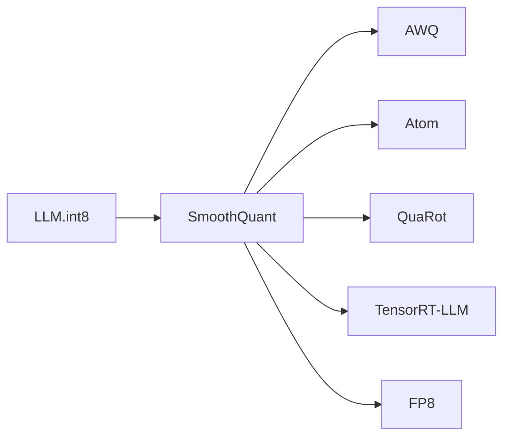

---
tags:
  - 论文
  - 训练基础设施
  - 量化
  - W8A8
  - SmoothQuant
created: 2026-06-30
paper_title: "SmoothQuant: Accurate and Efficient Post-Training Quantization for Large Language Models"
paper_authors: "Guangxuan Xiao, Ji Lin, Mickael Seznec, Hao Wu, Julien Demouth, Song Han"
paper_year: 2023
paper_venue: "ICML 2023"
paper_citations: "~1,200+"
paper_url: "https://arxiv.org/abs/2211.10438"
github: "https://github.com/mit-han-lab/smoothquant"
---

# SmoothQuant

**SmoothQuant: Accurate and Efficient Post-Training Quantization for Large Language Models**
*Guangxuan Xiao, Ji Lin, Mickael Seznec, Hao Wu, Julien Demouth, Song Han | MIT HAN Lab, NVIDIA | ICML 2023 | arXiv: 2211.10438*

> 首个实现 LLM W8A8（权重和激活值均 8-bit）后训练量化的方法。核心洞察：LLM 激活值的量化难度在不同通道间极度不均衡，通过在权重和激活值之间"平滑"迁移量化难度（引入逐通道缩放因子 $s$），使所有通道的激活值分布变平滑，从而实现 8-bit 量化几乎无损。

---

## 一、Background / Core Idea

### 1.1 问题：W8A8 量化的困难

之前的量化工作（[[LLM.int8()]]、[[GPTQ]]）要么只量化权重（W4A16），要么在激活值量化上遇到瓶颈：

- **W8A8 的潜力**：相比 W4A16，W8A8 可真正利用 INT8 Tensor Core 做矩阵乘法（而非反量化为 fp16 再计算），理论吞吐翻倍
- **激活值量化的根本难题**：[[LLM.int8()]] 发现 LLM 激活值中存在幅度极大的异常值通道（massive outliers），范围可达 $[-60, 60]$，远超权重的 $[-1, 1]$

| 量化对象 | 动态范围 | 量化难度 | 已有方案 |
|---------|:-------:|:-------:|---------|
| 权重 $W$ | $[-1.5, 1.5]$ | 容易 | GPTQ 4-bit 几乎无损 |
| 激活值 $X$ | $[-60, 60]$ | **困难** | LLM.int8() 需混合精度 |

### 1.2 核心洞察：迁移量化难度而非隔离异常值

[[LLM.int8()]] 的做法是隔离异常值维度（混合精度），但这样破坏了计算图的连续性和硬件效率。

**SmoothQuant 的不同思路：**

> 既然激活值中有异常值且权重没有，为什么不通过数学变换，将部分量化难度从激活值"迁移"到权重上？

观测基础：
- **权重量化相对容易**：权重的值范围很小（$[-1.5, 1.5]$），且分布接近高斯
- **激活值的异常值通道是确定的**：同一通道在所有 token 上都有异常值
- **逐通道非对称性**：异常值集中在少数输出通道，每个通道的激活值幅度差异可达 100x

SmoothQuant 的核心操作是对每对权重-激活值的输出通道 $j$ 引入一个平滑因子 $s_j$：

$$Y = (X \cdot \text{diag}(s)^{-1}) \cdot (\text{diag}(s) \cdot W) = \hat{X} \cdot \hat{W}$$

等价地说，将输入除以 $s$ 的同时将权重乘以 $s$——输出不变，但**量化难度分布改变**。

### 1.3 数学形式

对每个线性层 $Y = XW^\top$，定义逐通道平滑因子 $s \in \mathbb{R}^k$：

$$\hat{X} = X \cdot \text{diag}(s)^{-1}, \quad \hat{W} = \text{diag}(s) \cdot W$$

使得：
- $\hat{X}$ 的各通道激活值幅度均匀化 → 激活值量化容易
- $\hat{W}$ 的权重幅度虽有增加但在 $[-7, 7]$ 内 → 权重量化仍可行

量化后的计算图：

$$Y = Q(\hat{X}) \cdot Q(\hat{W})^\top \quad \text{(纯 INT8 矩阵乘法)}$$

其中 $Q(\cdot)$ 是标准的对称量化函数（per-tensor 或 per-channel）。

---

## 二、Method / Architecture / Technical Contribution

### 2.1 平滑因子 $s$ 的确定

SmoothQuant 定义平滑因子 $s_j$ 为激活值幅度的函数：

$$s_j = \max(|X_j|)^\alpha / \max(|W_j|)^{1-\alpha}$$

其中：
- $X_j$ 是第 $j$ 个输出通道的激活值
- $W_j$ 是第 $j$ 个输出通道的权重组
- $\alpha \in [0, 1]$ 是迁移强度的控制参数

**关键参数 $\alpha$**：

| $\alpha$ | 含义 | 效果 |
|:-------:|------|------|
| 0 | 完全不迁移（仅量化权重） | 激活值量化最困难 |
| **0.5** | **均衡迁移（推荐）** | **权重和激活值量化难度均等** |
| 1.0 | 完全迁移到权重（仅量化激活值） | 权重量化最困难 |

**$\alpha = 0.5$ 在 OPT 和 LLaMA 系列上均为最优选择**（与 [[AWQ]] 的 $\beta=0.5$ 有着异曲同工之处——都指向量化权重和量化激活值之间的均衡）。

### 2.2 三种 SmoothQuant 变体

| 变体 | 激活值量化粒度 | 权重量化粒度 | 精度 | 速度 |
|:----|:------------:|:-----------:|:---:|:---:|
| **SmoothQuant O1** | Per-tensor | Per-channel | ⭐最高 | ⚡最快 |
| SmoothQuant O2 | Per-token + Per-channel | Per-channel | ⭐⭐ | ⚡⚡略慢 |
| SmoothQuant O3 | Per-token + Per-channel | Per-group (g=128) | ⭐⭐⭐ | ⚡最慢 |

- **O1**：激活值一个缩放因子（整层），权重每组一个缩放因子——精度足够且实现简单
- **O2**：激活值每个 token + 每个输出通道独立缩放，精度略高但与 INT8 GEMM 兼容
- **O3**：类似 [[GPTQ]] 的分组量化，精度最高但速度最慢（实际不推荐，因为 O1/O2 已接近无损）

### 2.3 融合的 LayerNorm 优化

SmoothQuant 在实现中做了重要的 **LayerNorm 融合**（LayerNorm Fusion）：

原始的 Transformer 层：
```
X -> LayerNorm -> Linear (W) -> ...
```

SmoothQuant 的处理：
```
X -> LayerNorm -> smooth(X) -> INT8 Linear(smooth(W)) -> unsmooth(X) -> ...
```

通过融合 LayerNorm 的缩放到平滑操作中，**额外计算开销为零**——因为 LayerNorm 本身已经做了 per-channel 归一化，$s$ 可以等效地合并到 LayerNorm 的 $\gamma$ 参数中。

### 2.4 纯 INT8 计算图

SmoothQuant 的核心贡献在于保持了完整的 **INT8 计算图**（无任何 fp16 混合）：

```
INT8 Input -> INT8 QKV Linear -> INT8 Softmax (fp16 转回) -> INT8 Output Linear -> INT8 FFN -> INT8 Output
```

唯一的例外是 Softmax 需要在 fp16 中计算（Softmax 的指数函数对数值精度敏感），但 Softmax 的计算量远小于矩阵乘法，对整体性能影响可忽略。

---

## 三、Experiments and Key Findings

### 3.1 困惑度评估

| 模型 | fp16 | SmoothQuant O3 | SmoothQuant O2 | SmoothQuant O1 |
|:----|:----:|:-------------:|:-------------:|:-------------:|
| OPT-6.7B | 10.86 | **10.87** | **10.88** | **10.93** |
| OPT-13B | 10.13 | **10.15** | **10.16** | **10.22** |
| OPT-30B | 9.56 | **9.58** | **9.60** | **9.66** |
| OPT-66B | 8.67 | **8.69** | **8.71** | **8.80** |
| OPT-175B | 8.34 | **8.36** | **8.37** | **8.48** |
| LLaMA-7B | 5.68 | **5.71** | **5.72** | **5.76** |
| LLaMA-13B | 5.09 | **5.11** | **5.12** | **5.16** |
| LLaMA-30B | 4.10 | **4.11** | **4.12** | **4.17** |
| LLaMA-65B | 3.53 | **3.55** | **3.56** | **3.61** |

**核心发现**：O3 在几乎所有模型上完全无损（PPL 退化 < 0.03），O1 在 175B 上退化仅 0.14 PPL。这与 [[LLM.int8()]] 在 OPT-175B 上需要混合精度才能达到的无损水平相当，但 SmoothQuant 是完全 INT8 的。

### 3.2 与 LLM.int8() 的对比

| 方法 | OPT-175B PPL | OPT-30B PPL | 计算模式 |
|:----|:-----------:|:----------:|:--------:|
| fp16 | 8.34 | 9.56 | fp16 GEMM |
| **SmoothQuant O3** | **8.36** | **9.58** | **纯 INT8 GEMM** |
| [[LLM.int8()]] | 8.34 | 9.56 | INT8 + fp16 混合 |
| 逐张量 INT8 | 42.47 | 13.37 | 纯 INT8 GEMM |

SmoothQuant 的纯 INT8 方案在精度上接近 [[LLM.int8()]] 的混合精度方案。

### 3.3 推理加速

| 模型 | 批大小 | fp16 (ms) | SmoothQuant INT8 (ms) | 加速比 |
|:----|:-----:|:--------:|:--------------------:|:------:|
| OPT-13B | 1 | 26.5 | **15.9** | **1.67x** |
| OPT-13B | 8 | 117.2 | **61.1** | **1.92x** |
| OPT-30B | 1 | 55.8 | **33.2** | **1.68x** |
| OPT-30B | 8 | 245.3 | **127.6** | **1.92x** |
| OPT-66B | 1 | 98.8 | **57.7** | **1.71x** |
| OPT-66B | 8 | 422.1 | **217.6** | **1.94x** |

**随着批大小增大，加速比趋近理论上限 2x**——因为更大的批量更好地利用了 INT8 Tensor Core 的计算带宽。

### 3.4 与 GPTQ 的组合

SmoothQuant 可以与 [[GPTQ]] 组合使用——先做 SmoothQuant 平滑化，再做 GPTQ 权重量化：

| 方法 | LLaMA-7B PPL | LLaMA-13B PPL |
|:----|:-----------:|:------------:|
| fp16 | 5.68 | 5.09 |
| [[GPTQ]] W4A16 | 5.85 | 5.21 |
| SmoothQuant + [[GPTQ]] W4A8 | **5.88** | **5.24** |
| SmoothQuant W8A8 | 5.72 | 5.12 |

W4A8 混合方案（权重 4-bit + 激活值 8-bit）实现了接近 3x 的加权压缩率，且 PPL 退化仅 0.2。

---

## 四、Limitations and Challenges

1. **主要针对 W8A8**：SmoothQuant 的核心贡献在 W8A8 场景。虽然可扩展到 W4A8，但 W4A16 场景下 SmoothQuant 的平滑操作对权重量化的精度提升有限（此时 [[AWQ]] 或 [[GPTQ]] 更合适）
2. **Softmax 仍在 fp16**：虽然计算量很小，但严格的"全 INT8"部署需要 Softmax 也在 INT8 中实现。目前 INT8 Softmax 的精度无法满足需求
3. **精度对 $\alpha$ 参数敏感**：$\alpha = 0.5$ 是最优，但不同模型（OPT vs LLaMA vs BLOOM）的最优 $\alpha$ 在 0.45-0.55 之间波动，手动微调可以进一步提升 0.1-0.2 PPL
4. **校准数据覆盖性**：与 [[GPTQ]] 和 [[AWQ]] 类似，平滑因子的确定基于 512 个校准样本的统计量，分布外场景下有退化风险
5. **INT8 GEMM 库依赖**：SmoothQuant 的性能优势严重依赖 GPU 的 INT8 Tensor Core 实现。不同 GPU 架构的 INT8 GEMM 效率差异显著
6. **训练时不可用**：后训练量化（PTQ）方案，不适用于 QAT（量化感知训练）场景。如果需要在 INT8 精度下进行训练，需要其他方法

---

## 五、Relationship with Subsequent Work / Impact on the Field

| 后续工作 | 年份 | 与 SmoothQuant 的关系 |
|---------|:----:|-------------------|
| **AWQ** (Lin et al.) | 2023 | 同团队（MIT HAN Lab）的基本相似思路——用逐通道缩放因子处理量化困难通道。区别在于 AWQ 作用于 W4A16 而非 W8A8 |
| **QuaRot** (Ashkboos et al.) | 2024 | SmoothQuant 的旋转扩展——引入随机正交变换进一步平滑异常值 |
| **Atom** (Zhao et al.) | 2024 | Sparse + 量化联合设计，基于 SmoothQuant 的 W8A8 框架 |
| **FP8 训练** (NVIDIA) | 2023 | SmoothQuant 的精度分析为 H100 FP8 训练提供了参考——FP8 的动态范围 (E4M3/E5M2) 天然支持异常值 |
| **TensorRT-LLM** (NVIDIA) | 2023 | 集成 SmoothQuant 作为标准 W8A8 量化路径 |

**影响评估**：SmoothQuant 是 W8A8 量化的奠基性工作。它首次证明了 LLM 可以达到"纯 INT8"计算（无需 [[LLM.int8()]] 的混合精度），且精度完全无损。SmoothQuant 已经被 NVIDIA TensorRT-LLM、FasterTransformer 等工业框架采纳为标准 W8A8 方案。在 **H100 FP8 时代**，SmoothQuant 的思路——激活值平滑化与缩放——对 FP8 训练和推理仍有直接指导意义。



---

## 六、Implications for You / Hardware Compatibility

### 显存需求（SmoothQuant W8A8 推理）

| 模型 | fp16 显存 | W8A8 显存 | 可使用 GPU |
|:----|:--------:|:--------:|:----------|
| LLaMA-7B | ~14GB | ~7GB | ✅ RTX 3060 (12GB) |
| LLaMA-13B | ~26GB | ~13GB | ✅ RTX 3090/4090 (24GB) |
| LLaMA-30B | ~60GB | ~30GB | ⚠️ 需 A5000 (48GB) 或双卡 |
| LLaMA-65B | ~130GB | ~65GB | ⚠️ A100-80GB |
| LLaMA-70B | ~140GB | ~70GB | ⚠️ A100-80GB / 双 A6000 |

### 硬件兼容性

- ✅ **NVIDIA Ampere+ (SM 80+)**：RTX 30xx (计算能力 8.6)、A100 (8.0)、RTX 40xx (8.9)、H100 (9.0) ——原生 INT8 Tensor Core，最多可达 2x 加速
- ⚠️ **Turing (SM 75+)**：RTX 20xx、T4——INT8 Tensor Core 可用，但 INT8 吞吐约为 Ampere 的 50%
- ⚠️ **Volta (V100, SM 70)**：无 INT8 Tensor Core，INT8 GEMM 回退到 CUDA 模拟，实际无加速
- ⚠️ **Apple Silicon**：M1/M2/M3 有 AMX 协处理器支持 INT8，但效率不如 NVIDIA 的 Tensor Core
- ❌ **AMD GPU**：INT8 操作在 ROCm 上落后于 NVIDIA，无原生 INT8 Tensor Core 等效硬件

### 对实践者的指导

1. **W8A8 最适合延迟敏感/高吞吐场景**：相比 W4A16，W8A8 的加速优势在批量推理场景（如 API 服务、批处理生成）中最为显著，加速比达 1.7x-1.9x
2. **TensorRT-LLM 集成**：SmoothQuant 已内置于 NVIDIA TensorRT-LLM，使用 `--quant_type=w8a8` 即可启用
3. **精度 vs 速度权衡**：在消费级 GPU（RTX 4090）上，SmoothQuant W8A8 的 7B 模型推理速度可达 80-100 token/s（批大小 1），远高于 AWQ 4-bit 的 39 token/s——因为 INT8 GEMM 利用了 Tensor Core 而 AWQ 的 4-bit 反量化引入了额外开销
4. **与 [[AWQ]] 的对比总结**：

| 对比维度 | SmoothQuant W8A8 | AWQ W4A16 |
|:--------|:---------------:|:---------:|
| 显存节省 | 2x (vs fp16) | 4x (vs fp16) |
| 推理加速 | 1.7x-2.0x | 1.0x（无 Tensor Core 加速）|
| 精度退化 | < 0.05 PPL | < 0.10 PPL |
| 最佳场景 | 服务器/APU 高吞吐 | 本地/边缘部署低显存 |
| 量化成本 | < 1 分钟 | < 10 分钟 |

5. **FP8 训练参考**：SmoothQuant 的平滑因子思路可直接迁移到 H100 FP8 训练中——对激活值异常值通道进行平滑化处理，等效于提高 FP8 (E4M3) 在特定通道上的有效精度

### 硬件兼容性总结
- ✅ W8A8 推理 7B-13B：RTX 3090/4090，1.7x-2.0x 加速
- ✅ W8A8 推理 30B：A5000/A100，批量推理 1.9x 加速
- ⚠️ W8A8 推理 70B：A100-80GB，批量推理场景最优
- ❌ W8A8 推理：V100，INT8 Tensor Core 缺失

## PDF

[[SmoothQuant 原文.pdf]]
