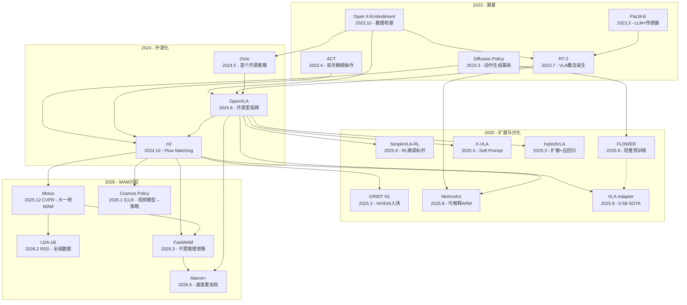

---
tags:
  - 论文
  - VLA
created: 2026-06-30
updated: 2026-06-30
---

# VLA 论文总览精讲

按发表时间线排列，展示 VLA（Vision-Language-Action，视觉-语言-动作）领域从概念提出（2023）到最新前沿（2026）的完整演进脉络。共覆盖 **20 篇核心论文**，从基础概念、动作生成、开源化，到 RL 微调、轻量化、世界动作模型（WAM）的全景图谱。

---

## 目录

1. [什么是 VLA——领域全景](#一什么是-vla领域全景)
2. [第一批：奠基篇（2023-2024）——概念起源与开源化](#二第一批奠基篇2023-2024概念起源与开源化)
3. [第二批：前沿篇（2025-2026）——RL 微调、轻量化与 WAM 兴起](#三第二批前沿篇2025-2026rl-微调轻量化与-wam-兴起)
4. [2025-2026 年五大技术趋势深度分析](#四2025-2026-年五大技术趋势深度分析)
5. [跨论文核心洞察](#五跨论文核心洞察)
6. [知识图谱——论文间依赖关系](#六知识图谱论文间依赖关系)
7. [学习建议——从零到前沿的分级路线](#七学习建议从零到前沿的分级路线)
8. [研究路线推荐——按硬件与目标分层](#八研究路线推荐按硬件与目标分层)
9. [硬件适配总表](#九硬件适配总表)
10. [每篇论文的一句话核心贡献](#十每篇论文的一句话核心贡献)

---

## 一、什么是 VLA——领域全景

### 1.1 VLA 的定义

**VLA（Vision-Language-Action Model）** 是一类以**视觉（Vision）**和**语言（Language）**为输入，直接输出**机器人动作（Action）**的端到端模型。它的核心假设是：**如果大语言模型能理解文字、视觉语言模型能理解图片，那么一个足够大的模型也应该能理解"如何行动"。**

VLA 这一术语由 Google DeepMind 在 **RT-2（2023.7）** 中首次正式提出，但其思想根源可以追溯到更早的工作——PaLM-E（2023.3）首次将大型语言模型与机器人传感器数据直接融合，而 Open X-Embodiment（2023.10）则为这个领域建立了数据基础设施。

### 1.2 VLA 的核心技术范式

一个典型的 VLA 模型由三个模块组成：

```
输入图像 + 语言指令 → [视觉编码器] → [语言模型/Transformer 骨干] → [动作解码器] → 机器人动作
```

- **视觉编码器**：将相机图像转化为特征向量。现代 VLA 通常使用 VLM（视觉语言模型）的视觉编码器，如 DINOv2（空间特征）+ SigLIP（语义特征）的双编码器方案。
- **语言模型/Transformer 骨干**：融合视觉特征、语言指令和本体感觉信息，进行跨模态推理。这是模型的"大脑"。
- **动作解码器**：将骨干网络的输出转化为具体的机器人控制命令。这是 VLA 区别于纯 VLM 的关键——输出不是文本，而是连续的关节角度或末端执行器位移。

### 1.3 为什么 VLA 是革命性的

在 VLA 之前，机器人控制系统是**模块化**的：感知模块（目标检测、姿态估计）→ 规划模块（运动规划、抓取规划）→ 控制模块（PID 控制、阻抗控制）。每个模块需要大量人工工程，且模块之间的误差会累积。

VLA 的革命性在于**端到端（end-to-end）**：从像素直接到动作，中间没有人工设计的模块。这意味着：

1. **语义泛化**：模型可以利用互联网预训练学到的常识（"能量饮料是什么"、"轻拿轻放是什么意思"）来指导动作
2. **零样本能力**：在训练中从未见过的物体、场景、指令组合上，VLA 仍能产生合理的动作
3. **规模化**：像 NLP 一样，VLA 的性能随数据量和模型规模持续提升

### 1.4 领域时间线速览

```
2023.03  PaLM-E        ─ 第一次把 LLM 接上机器人传感器
2023.04  ACT           ─ 低成本双手操作，Action Chunking
2023.03  Diffusion Policy ─ 扩散模型做动作生成的理论基础
2023.07  RT-2          ─ "VLA"概念诞生，动作即语言
2023.10  OXE & RT-X    ─ VLA 的数据地基，21 机构联合
2024.05  Octo          ─ 第一个开源通用机器人策略
2024.06  OpenVLA       ─ 开源 VLA 里程碑，7B 击败 55B
2024.10  π0            ─ Flow Matching + 双系统架构，最强 VLA
2025.03  GR00T N1      ─ NVIDIA 入场，人形机器人 VLA
2025.03  HybridVLA     ─ 同一 LLM 内融合扩散+自回归
2025.03  X-VLA         ─ Soft Prompt 跨形态，0.04% 额外参数
2025.08  MolmoAct      ─ 可解释空间推理 VLA（ARM 范式）
2025.09  SimpleVLA-RL  ─ 1条演示+RL → 92%，Pushcut 现象
2025.09  FLOWER        ─ 950M VLA，预训练成本降低 100×
2025.09  VLA-Adapter   ─ 0.5B 模型 LIBERO 98.5%
2025.12  Motus         ─ 大一统世界动作模型（WAM），CVPR 2026
2026.01  Cosmos Policy ─ 视频基础模型→机器人策略，ICLR 2026
2026.02  LDA-1B        ─ "完美数据迷信"终结者，RSS 2026
2026.03  FastWAM       ─ WAM 不需要推理时想象未来，4× 加速
2026.05  AttenA+       ─ 逆速度场重加权，零参数即插即用
```

---

## 二、第一批：奠基篇（2023-2024）——概念起源与开源化

### 1. [[Open X-Embodiment & RT-X]]（2023.10，CoRL 2023）

**核心地位：VLA 的"数据地基"**

**背景与动机：** NLP 和 CV 的成功来自大规模多样化数据上的预训练，但机器人学习始终没有走到这一步——每个数据集只包含一种机器人、一个环境、一个任务集，格式互不兼容。论文提出的根本问题：**如果在来自多个不同机器人的数据上训练一个模型，每个机器人的表现会变好还是变差？**

**核心贡献：**

1. **OXE 数据集**：全球 21 个机构联合，将 60 个现有数据集统一为标准格式。包含 1M+ 真实机器人轨迹、22 种机器人形态、527 种技能。数据按 RLDS 格式存储（tfrecord），统一输出 7 维动作向量 `[x, y, z, roll, pitch, yaw, gripper]`。

2. **RT-X 模型**：
   - RT-1-X（35M）：RT-1 的多形态版本，仅用机器人数据训练
   - RT-2-X（55B/5B）：基于 VLM 骨干（PaLI-X: ViT + UL2），动作被 token 化成文本

3. **三大关键发现**：
   - **正迁移存在**：在小数据集上，RT-1-X 比原作者专门训练的模型平均高出 **50%** 成功率
   - **模型容量是关键**：35M 在多形态场景下欠拟合；55B 的 RT-2-X 继续提升
   - **涌现技能**：Google Robot 学会了 Bridge 数据集中 WidowX 才有的技能——跨形态技能迁移是真实发生的（27.3% → 75.8%）
   - **互联网预训练是生存线**：没有互联网预训练 = 0%/1% 成功率，彻底报废

**历史意义：** 没有 OXE，就没有后来的 Octo、OpenVLA、π0、GR00T。它是 VLA 大厦的地基。RT-2-X 是这篇论文训练的模型，而不是 RT-2 原论文的模型——很多人混淆了这一点。

**关键启示：** 数据多样性比数据质量更重要（至少在预训练阶段）；不要只收集你自己机器人上的数据；模型要足够大（7B+ 比较保险）。

---

### 2. [[PaLM-E]]（2023.3，ICML 2023）

**核心地位：首次将 LLM 与机器人传感器直接融合，RT-2 的直接前身**

**核心思想——"多模态句子"：** 把机器人传感器数据当作"另一种语言的 token"直接喂给 LLM。输入序列可以同时包含文本 token 和来自各种传感器模态的嵌入（图像、3D 场景状态、关节角度等），LLM 只做一件事：预测下一个 token。

**架构要点：**

- **输入侧**：图像通过 ViT 编码为 patch embedding；场景状态向量通过 MLP 投影到 LLM 的 embedding 空间；不同类型嵌入插入序列的不同位置（场景状态在任务描述前，相机图像在具体动作步骤附近）
- **输出侧**：所有任务都是 next-token prediction——对于机器人控制，可以输出高层规划（自然语言步骤）或低层动作序列（离散化的关节目标/末端位移）
- **骨干**：PaLM 540B（decoder-only Transformer）

**训练策略：** 多任务联合训练——同时训练 VQA、图像描述、语言推理、机器人操作、机器人规划、场景理解。关键发现：**训练机器人控制数据时，模型被迫学习感知和物理推理；训练 VQA 数据时，模型又保持了高层语义理解。两者相互增强。**

**正迁移与负迁移：**
- 正迁移：在 VQA 任务上，PaLM-E（带机器人训练）比纯 PaLM 表现更好——学习物理交互知识对视觉理解有帮助
- 防遗忘：在训练混合中保持足够比例的语言-only 数据可以有效防止灾难性遗忘

**与 RT-2 的关系：** PaLM-E 更偏"高层规划器"（输出自然语言步骤，由其他控制器执行），RT-2 更进一步——直接输出机器人动作 token，实现了真正的"从像素到动作"端到端。

**关键启示：** "多模态句子"的设计范式被后续几乎所有 VLA 继承；大模型的能力不只在"准确率"，而在于对未见情况的创造性应对。

---

### 3. [[RT-2]]（2023.7，CoRL 2023）

**核心地位：提出"VLA"概念，证明动作可以是"另一种语言"**

**核心洞察——动作即语言：** 在 RT-2 之前，使用 LLM/VLM 做机器人的方法有两类：LLM 做高层规划（但底层控制器没有语义知识）或 VLM 做视觉特征提取（但语义理解没有直接流入动作生成）。RT-2 的突破性想法：**为什么不直接让 VLM 输出动作？** 如果我们把动作也变成一种"语言"（文本 token），VLM 就天然可以输出动作。

**动作 token 化方案：** 机器人动作空间是 7 维的：`[Δx, Δy, Δz, Δθx, Δθy, Δθz, gripper] + terminate`。连续值被离散化到 256 个 bin 中。在 PaLI-X 骨干中，整数 0-999 都有自己的专用 token；在 PaLM-E 骨干中，直接覆写 256 个最不常用的 token 作为动作 token。

**Co-Fine-Tuning（联合微调）：** RT-2 最重要的训练策略。每个 batch 中同时包含原始 VLM 数据和机器人数据，机器人数据给更高的采样权重。为什么？纯机器人数据微调 → 灾难性遗忘，所有语义泛化消失；纯 VLM 数据 → 不会输出动作；联合微调 → 既保持 VLM 的语义泛化，又学会输出动作。

**涌现能力（最令人兴奋）：** RT-2 展现出训练数据中**不存在**的能力：
- 符号理解：把物体放到写有特定数字/图标的盘子上（训练数据中没有"数字/图标"标签）
- 关系推理："拿起最小的物体"、"拿起离蓝色杯子最近的东西"（训练数据中没有这类指令）
- 人识别："把可乐递给 Taylor Swift"
- Chain-of-Thought 推理："我累了，什么饮料最好？" → 推理出"能量饮料" → 抓起红牛

**RT-2-55B 的推理：** 这是当时用于直接闭环控制的最大模型，无法在机器人本地运行。解决方案是部署在多 TPU 云服务上，通过网络查询（1-3 Hz）。

**关键缺陷：** 完全闭源（代码、权重、训练数据都不公开）；推理速度慢（55B 仅 1-3Hz）；仅支持单臂 7DoF；动作 token 化粗糙（256-bin 均匀离散化）。

**关键启示：** "动作即语言"是目前最成功的 VLA 范式；语义泛化来自互联网预训练——没有它，RT-2 就跟 RT-1 没什么区别；规模不仅让模型"更好"，还让模型"能做一些小模型根本不会的事情"（涌现的典型特征）。

---

### 4. [[Diffusion Policy]]（2023.3，IJRR 2024 / RSS 2023）

**核心地位：定义"怎么做动作生成"，当前几乎所有 VLA 动作头的基础**

**这篇论文本身不是 VLA 论文，但它是 VLA 动作头的理论基础——理解 VLA 必须理解这篇。**

**为什么需要新的策略表示？** 模仿学习的简单回归会遇到三个根本挑战：
1. **多模态动作分布**：同一个任务有多种"正确"的动作方式（从左边绕 vs 从右边绕）。确定性回归（MSE loss）只会学到所有可能动作的**均值**——这个"均值动作"可能根本不在任何有效轨迹上
2. **高维输出空间**：预测整个动作序列（14维×16步=224维），传统回归模型表现很差
3. **训练稳定性**：隐式策略（IBC/EBM）理论上可以解决多模态问题但极难训练（需要负采样估计归一化常数）

**方法：把扩散模型放在动作空间上。** 将机器人策略建模为一个条件去噪扩散过程。噪声预测网络实际上在学习动作分布的梯度场（score function）：`ε_θ(O_t, a, k) ≈ -∇_a log p(a | O_t)`。

**为什么扩散策略训练稳定？** 隐式策略（IBC）的麻烦在于归一化常数 `Z(o,θ)` 的估计需要负采样。而扩散策略直接学习 score function（梯度），`Z(o,θ)` 的梯度恒为零——score function 的估计**完全独立于归一化常数**。这就是扩散策略训练极度稳定的数学根源。

**三个关键设计决策：**

1. **网络架构**：CNN-based（1D 时间卷积 + FiLM 条件化，开箱即用）vs Transformer-based（交叉注意力，擅长高频变化和复杂任务但超参敏感）。建议新任务先用 CNN 版本。

2. **动作时序设计（最重要！）**：预测 `T_p` 步 → 执行 `T_a` 步（`T_a < T_p`）→ 重新预测。`T_a` 的权衡——太小（如 1）反应快但动作抖动多；太大（如 `T_p`）时序一致但不响应环境变化；适中（如 8）是反应性和时序一致性的最优平衡。实验发现 `T_a = 8` 在大多数任务上最优。

3. **视觉编码器**：空间 softmax 池化替代全局平均池化（保留空间信息）；GroupNorm 替代 BatchNorm（与 EMA 兼容）；微调预训练视觉编码器效果最好。

**最有说服力的结果——多模态行为：** 在 Push-T 任务中，扩散策略有 ~50% 概率从左边绕、~50% 从右边绕——它学到了两种模式，每次 rollout 只执行其中一种，不混在一起。相比之下，LSTM-GMM、IBC、BET 都只能偏向一边或在模式间来回跳。

**与 VLA 的关系：** π0 的 Flow Matching 是扩散模型的变体（学习从噪声到数据的最优传输路径）；GR00T N1 的 DiT 动作头直接使用 Flow Matching；Octo 使用 DDPM 作为动作解码头。

**关键启示：** 扩散策略是你最应该掌握的算法——它是当前几乎所有 SOTA 机器人策略的基础；位置控制 + 扩散是一个强大的组合；训练稳定性是 diffusion 被低估的优势。

---

### 5. [[ACT]]（2023.4，RSS 2023）

**核心地位：定义"怎么做细粒度双手操作"，ALOHA 系统成为社区标配**

**问题背景——精细操作为什么这么难？** 以"打开透明调料杯的盖子"为例：需要推倒杯子、推入夹爪、拎离桌面、撬开盖子——每一步都需要毫米级精度。传统方案用高精度工业机器人 + 昂贵力传感器 + 精确标定，成本极高。

**论文的核心赌注：** 人类也没有工业级的本体感知精度，但通过闭环视觉反馈和主动纠错能做精细任务。如果训练机器人"从像素直接到动作"，它也应该能做到。

**三大技术贡献：**

1. **Action Chunking（动作分块）——解决组合误差：** 模仿学习的经典问题是组合误差（每步的小偏差累积导致完全脱离训练分布）。Action Chunking 一次预测未来 k 步的动作然后执行——有效任务长度 = 原始长度 / k，组合误差被减少 k 倍。

2. **Temporal Ensembling（时序集成）——让动作更平滑：** 更高频地查询策略，对重叠的动作块取加权平均。越近的预测权重越大（指数衰减权重）。

3. **CVAE（条件变分自编码器）——处理人类演示中的风格差异：** 这是 ACT 最深刻的设计。不同人类演示者的动作风格完全不同（快而果断 vs 慢而谨慎）。CVAE 的隐变量 z 捕获"除给定观测外导致动作变化的其他因素"——本质上就是**风格**。训练时编码器可以看到真实动作来编码风格；推理时从先验分布采样。KL 正则化确保训练时和推理时的 z 分布不会差太远。

**硬件系统——ALOHA：** 两套 ViperX/WidowX 机械臂（领导者/跟随者）+ 4 个 RealSense 摄像头 + 3D 打印件。总成本 < $20,000。设计要点：关节空间映射（领导者 → 跟随者）、3D 打印的反向驱动适配器、透明夹爪（方便腕部摄像头看到夹爪内物体）。

**惊人结果：** 每个任务仅收集 **50 条演示轨迹**（约 10 分钟的遥操作），6 个任务中的 5 个达到 **80-100%** 成功率。BC-RNN 和 BC-ConvMLP 在相同数据上仅 0-40%。

**为什么 ACT 对于 VLA 很重要：** Action Chunking 被 π0 直接继承；CVAE 的"风格建模"思想影响了 π0 的 Flow Matching；ALOHA 硬件成为社区标配（更便宜的 SO-100 臂衍生于 ALOHA 设计）。

**关键启示：** Action Chunking 简单但极度有效——是解决组合误差最经济的方法；CVAE 是处理人类演示多样性的优雅方案；"10 分钟演示就够了"对于快速原型的价值不可估量。

---

### 6. [[Octo]]（2024.5，RSS 2024）

**核心地位：第一个开源通用机器人策略，为 OpenVLA 奠定基础**

**历史定位：** 2024 年初，有强大的闭源模型（RT-2, RT-2-X）但无法使用和复现；有开源的具体任务策略（ACT, Diffusion Policy）但缺乏泛化能力；有开源的大数据集（OXE）但没有在其上预训练的、可直接使用的开源策略。Octo 填补了这个空白。

**架构设计哲学：** "一个 transformer，任意 token 进，任意 token 出"。不预设特定的传感器配置、动作空间或任务定义方式。

**Token 化方案：** 输入 tokens = 任务 token（语言指令 T5 embedding 或目标图像）+ 观测 tokens（多相机图像 + 本体感觉）+ 读入 tokens（动作预测的"前缀"）。输出 tokens → 线性投影头 → 具体动作。

**模块化注意力设计：** 观测 tokens 全自注意力；任务 token 交叉注意力到观测；动作 tokens 因果自注意力（自回归生成）。这种设计增加了灵活性但也增加了实现复杂度。

**为什么 Octo 不是真正的 VLA？** 语言模型仅作为文本编码器（T5-base），没有集成在骨干中；视觉编码从零训练或预训练（非 VLM 的视觉编码器）；知识来源仅来自 OXE 数据（无互联网规模预训练）；语义推理有限（T5 embedding 是固定向量）。Octo 更像是一个"跨形态通用策略"（GRP），而不是 VLA。

**性能与局限：** 零样本泛化在 9 种机器人平台上进行了评估，但成功率仅 10-40%。语言指令遵循能力弱，空间推理几乎为零，对未见环境泛化差。被超越的原因：架构不是 VLA（没有利用 VLM 的互联网预训练知识）、模型太小（93M vs 7B，近 100 倍参数差距）、动作生成方式落后（自回归 token 生成 vs 扩散/流匹配）。

**持久贡献：** 模块化设计的哲学；数据混合权重成为 OXE 数据使用的标准参考；开源精神推动了整个社区。

**现在的价值：** 学习价值 > 使用价值。作为训练起点应直接用 OpenVLA 或 SmolVLA。

---

### 7. [[OpenVLA]]（2024.6，CoRL 2024）

**核心地位：开源 VLA 的里程碑，7B 参数击败 55B 的 RT-2-X**

**为什么是分水岭？** OpenVLA 之于机器人，就像 Llama 之于 NLP。之前 RT-2/RT-2-X 全部闭源——看不到代码、不知道具体训练方法、没法微调。OpenVLA 发布后，权重、代码、训练配方全部公开，社区可以在消费级 GPU 上微调和推理。这是社区从"仰望闭源巨头"转向"围绕开源标准迭代"的转折点。

**架构三件套——视觉编码器 + 投影器 + 语言模型：**

1. **双视觉编码器**（最关键的架构决策）：
   - DINOv2（自监督 ViT）：擅长细粒度空间特征——物体的精确位置、形状、姿态
   - SigLIP（语言监督 ViT）：擅长语义理解——这是什么物体、类别和属性
   - 两者 features 按通道拼接后送入投影器。动机来自 Prismatic VLM 的实验发现。

2. **语言模型**：Llama 2 7B——7B 在性能和可用性之间最好平衡，bf16 推理需 15GB，可用 4-bit 量化 + LoRA 微调。

3. **动作离散化**：与 RT-2 的关键改进——在数据集的 **1st-99th 百分位**上分 bin（而非 min-max 范围），避免异常值拉大范围导致精细度损失。覆写 Llama tokenizer 词汇表末尾 256 个最不常用的 token。

**宝贵的"试错日记"：**

- VLM 骨干选择：Prismatic（双视觉编码器）> LLaVA > IDEFICS-1——双编码器带来更好的空间推理能力
- 图像分辨率：224×224 赢了——384×384 在 VLA 上完全没有性能差异但训练时间是 3 倍
- 视觉编码器：VLA 训练**必须微调**视觉编码器（与 VLM 训练冻结视觉编码器相反）——机器人控制需要精确的空间信息
- 训练 Epoch 数：**27 个 epochs**——在 VLM 训练中极其异常（典型 1-2 epoch），但 VLA 需要更多的"过遍历"来充分吸收机器人控制信号
- 学习率：直接复用 Prismatic VLM 的学习率 2e-5，不需要 warmup——额外惊喜

**实验结果：**
- 零样本泛化：OpenVLA 7B 比 RT-2-X 55B 高出 **16.5%** 绝对成功率
- 如何做到的？更大的训练数据（970k vs 350k 轨迹）、更仔细的数据清洗（移除 Bridge 数据中 18% 的全零动作帧）、双视觉编码器、更长的训练（27 epochs vs 1-2 epochs）
- 微调后：在 7 个 Franka 任务上一致优于 Octo（微调）和 Diffusion Policy（从零训练）

**消费级适配——这才是杀手锏：**
- LoRA 微调：rank=32 约等于全量微调性能，训练参数减少到 1.4%
- 4-bit 量化（NF4）：bf16 推理 15GB → 仅需 7GB，性能损失几乎为零
- 在 16GB 显卡上：4-bit 推理完美（~7GB），bf16 推理勉强（~15GB），4-bit QLoRA 微调可行但紧（12-16GB, batch_size=1），全量微调不可行

**技术债务：** Llama 2 已显老旧；离散 256-bin 动作 token 本质上是粗糙的量化方案；6Hz 推理对很多动态任务仍不够；只支持单臂 7DoF。

**关键启示：** "开源"本身就是研究贡献——OpenVLA 成为数十篇论文的基础设施；数据清洗比大多数架构创新重要得多（移除 18% 全零动作帧可能是最被低估的性能因素）；VLA 和 VLM 的训练动态不同（27 epochs vs 1-2 epochs）；双视觉编码器（空间+语义）是正确方向。

---

### 8. [[π0]]（2024.10，RSS 2025）

**核心地位：当前公认最强的开源 VLA，Flow Matching 架构，50Hz 实时控制**

**现有 VLA 的三大痛点：**
1. 动作生成的表达能力不够（离散 256 bin + 自回归生成 → 信息损失 + 慢 + 无法优雅表达多模态分布）
2. 缺少专门的灵巧操作能力（VLM 擅长语义理解但不擅长精细力控和轨迹）
3. 缺少系统的训练方法（7 种不同机器人的多样化数据，格式、动作空间、频率各不相同）

**三大核心创新：**

**创新 1：Flow Matching（替代 Diffusion/Discrete Token）**
- Flow Matching 学习确定性的最优传输路径（Optimal Transport），从纯噪声**直线**走向目标数据
- 训练目标：学习时变向量场 `v_t(x)`，使 `dx/dt = v_t(x_t)`
- 核心优势 vs Diffusion：确定性路径 → 更少推理步数（~10 步 vs ~100 步训练），最优传输 → 路径更直接，连续建模 → 天然适合机器人连续动作空间
- 为什么特别适合机器人？动作空间是连续的，真实动作分布通常不是高斯的（多峰/非对称/尖峰），对高频控制友好（50Hz 平滑轨迹）

**创新 2：双系统架构（VLM 大脑 + Action Expert 小脑）**
- VLM（PaliGemma 3B）："大脑"，负责语义理解+推理。输入图像+语言指令，输出语义 embedding
- Action Expert（DiT 300M）："小脑"，负责动作生成。输入 VLM 语义 embedding + 本体感觉，通过 Flow Matching 输出连续动作序列（chunk size = 50，即 1 秒动作）
- 两者通过交叉注意力连接：Action Expert 的每一层都可以"查询"VLM 对场景的理解
- 与 RT-2/OpenVLA 直接微调 VLM 的区别：Action Expert 更小更快，VLM 语义知识不会被"稀释"，可以灵活替换 VLM

**创新 3：预训练/后训练分离（借鉴 LLM 的成功经验）**
- 预训练（Pre-training）：极大（10,000+ 小时机器人数据），混合质量——有好的演示也有粗糙的。学什么？广泛的物理世界知识、恢复行为、纠错能力
- 后训练（Post-training）：小（精选高质量数据）。学什么？高效、精准、优美的行为模式
- 为什么两个阶段缺一不可？论文核心直觉：**"高质量数据里没有恢复行为"**。如果训练数据全是专家演示的完美轨迹，模型会学到"世界是确定的"——它不会知道如果抓取失败了该怎么办。预训练混入"不完美"数据教会模型应对不确定性，后训练精细化

**版本演进：** π0（2024.10）→ π0-FAST（2025，自回归变体）→ π0.5（2025.9，"知识隔离"训练）→ π0.6/RECAP（即将，RL 微调方案，吞吐量 2×+，失败率↓50%）

**硬件约束：** 16GB 无法微调（LoRA 需 >22.5 GB），但推理可行（>8 GB）。

**关键启示：** Flow Matching > 离散 token 自回归——连续生成更优雅、更快、表达能力更强；VLM + Action Expert 的分离设计是正解；预训练/后训练分离可能比架构更重要。

---

### 9. [[GR00T N1]]（2025.3）

**核心地位：NVIDIA 正式入场，专门面向人形机器人的 VLA**

**生态战略：** GR00T 是 NVIDIA 机器人全栈战略的一部分：Isaac Sim（仿真）→ DreamGen（数据生成）→ GR00T N1（模型）→ Jetson（部署）。相比于 Physical Intelligence（π0）专注于模型本身，NVIDIA 的优势在于全链路闭环。

**架构：** 双系统设计（与 π0 类同）——System 2 VLM（Cosmos-Reason-2B，慢系统，~1-5Hz）+ System 1 DiT（Diffusion Transformer，快系统，~50Hz）。与 π0 的核心区别：VLM 骨干是 NVIDIA 自研的 Cosmos-Reason；数据格式兼容 **LeRobot**（关键！选择与社区标准对齐）；DreamGen 合成数据（用视频世界模型生成训练数据）。

**DreamGen——用世界模型造数据：**
- 微调 Cosmos-Predict2（NVIDIA 视频世界模型）于真实机器人操作视频
- 给定初始帧，生成"如果机器人这样做会看到什么"
- IDM（逆动力学模型）从合成视频中反推应该执行的动作
- 将生成的 (视频帧, 动作) 对加入训练集 → **不需要遥操作就能扩展训练数据**

**支持的机器人形态：** 通过 `EmbodimentTag` 机制——Fourier GR1 人形、DROID 单臂、AGIBOT_GENIE1 人形+夹爪、自定义形态。还支持 Franka Panda、SO-100/101、WidowX、RoboCasa 仿真等。

**版本演化：** N1（2025.3, 2B）→ N1.5（2025.6, 3B, Eagle 2.5 视觉, FLARE, DreamGen）→ N1.6（最新, 3B, Cosmos-Reason-2B VLM, 双倍 DiT 层, 双手+移动操作）。N1.6 在 RTX 4090 上推理速度：~44ms 端到端 = ~22.8Hz。

**与 π0 的选择：** 性能（SimplerEnv）π0 略优（~68% vs ~60%）；社区活跃度 π0 更大；如果你做人形机器人选 GR00T；用 LeRobot 选 GR00T；需要合成数据选 GR00T；用 NVIDIA 硬件栈选 GR00T。

**关键启示：** VLA 市场正形成"NVIDIA vs 开源社区"的双轨格局；LeRobot 正成为数据格式的事实标准；合成数据 + 世界模型是 VLA 训练的下一步。

---

### 10. [[MolmoAct]]（2025.8）

**核心地位：VLA 的未来方向——从黑盒端到端走向可解释空间推理**

**核心哲学——VLA 缺了什么？** 从 RT-2 到 OpenVLA 到 π0，都有一个共同特征：**感知直接映射到动作，中间没有显式的"推理"环节。** 这导致四个严重问题：不可解释（为什么选那个动作？不知道）、不可修正（抓错了没法"告诉"它往左移）、泛化脆弱（学到的是背景颜色/光照角度的"捷径"）、数据效率低。

**MolmoAct 被称为 Action Reasoning Model (ARM)**——不是"动作生成模型"，而是"动作推理模型"。"推理"意味着模型输出的是一个**推理链**，而不只是最终动作。

**三阶段推理管道：**

1. **阶段一：Depth Perception Tokens（深度感知）**
   - 100 个离散 token，编码场景的 3D 几何信息
   - Depth Anything V2 生成伪深度图 → VQVAE 压缩为 100 个 token（码本大小 128）
   - 模型从 RGB 图像中"学习"估计深度（自举过程），不需要真实深度传感器

2. **阶段二：Visual Reasoning Trace（视觉推理轨迹）**
   - 在 2D 图像空间中的路径点序列（最多 5 个点）：`[[13,41], [31,52], [55,1], [51,2], [51,75]]`
   - 可以叠在输入图像上形成可视化轨迹 → "这就是我打算走的路线"
   - 训练数据来自 CoTracker3（跟踪遥操作视频中末端执行器的 2D 位置）+ SAM 2 + 人工标注

3. **阶段三：Action Tokens（动作解码）**
   - 从"图像空间中的 2D 轨迹"到"物理空间中的 3D 动作"
   - 给定深度感知 token + 视觉推理轨迹 + 本体感觉 → 生成最终动作（256 bin 离散化）

**三阶段是自回归生成的**——每一阶段的输出成为下一阶段的条件。虽然比端到端慢，但中间结果**可检查、可修正**。

**最令人兴奋的特性——可操控性：** 因为视觉推理轨迹是显式的、可编辑的中间表示，用户可以：看到模型计划的轨迹 → 如果不对，**直接在图像上画出正确的轨迹** → 模型用修正后的轨迹重新生成动作。实验：纯语言指令纠正 42% vs 手绘轨迹纠正 **75%**——"说话不如画图"。

**训练效率的惊人发现：**
| 模型 | 训练数据量 | GPU 小时 | SimplerEnv |
|------|-----------|---------|------------|
| GR00T N1 | 600M 样本 | 50,000 | ~60% |
| π0 | 900M 样本 | 更大 | ~68% |
| **MolmoAct** | 26.3M 样本 | **9,728** | **70.5%** |

训练效率是 GR00T N1 的 **5 倍**，性能还更强——正确的结构化推理比盲目堆数据更有效。

**实验亮点：** SimplerEnv 零样本 70.5%（超越 π0 ~68% 和 GR00T N1.5 ~60%）；LIBERO 86.6%；真实世界微调 vs π0-FAST 单臂 +10%、双手 **+22.7%**；OOD 泛化 **+23.3%**——显式结构化推理带来的是真正的泛化而非记忆。

**范式转变：** 从 "VLA 是一个函数 `f(image, text) → action`" 到 "VLA 是一个推理者，它输出自己的思考过程，然后基于这个思考来决定行动"。

**完全开源：** 模型权重、训练代码、MolmoAct Dataset (10K+ 轨迹)、预训练数据混合、评估代码全部开源（AI2 的"完全开源"承诺）。

**关键启示：** 这篇论文提出了目前 VLA 领域最核心的未解决问题——从黑盒到可解释推理；结构化推理可能是 VLA 通往"真正可用"的必经之路；还有很多未探索空间（RL 优化推理链、3D 空间推理、触觉/力觉信息融入推理链、推理链的语言解释）。

---

## 三、第二批：前沿篇（2025-2026）——RL 微调、轻量化与 WAM 兴起

### 11. [[SimpleVLA-RL]]（2025.9，ICLR 2026）

**核心地位：RL 微调 VLA 的标杆——1 条演示 + RL 从 17% 飙升到 92%。发现"Pushcut"现象**

**来自 LLM 的灵感——DeepSeek-R1：** 2025 年初，DeepSeek-R1 证明：只需要最简单的规则奖励（答案对不对），强化学习就能让 LLM 涌现出复杂的推理能力。SimpleVLA-RL 的核心赌注：同样的逻辑——纯结果驱动的 RL + 不需要奖励塑形——能不能在 VLA 上复现奇迹？

**VLA RL vs LLM RL 的差异：**
| | LLM RL | VLA RL |
|---|---|---|
| 状态 | prompt + 已生成 token | 多模态观测（RGB/深度/本体感觉/语言）|
| 动作 | 从词汇表选下一个 token | 连续动作向量（如 7 维末端位移）|
| 环境 | 序列完成后给奖励（离线）| 与环境持续交互 → 新状态 → 循环 |
| Rollout | 自回归生成直到停止 | 迭代交互——动作块 → 执行 → 新状态 → 下一轮 |

VLA RL 比 LLM RL 难得多：每个 rollout 步骤都需要与环境交互（仿真或真实），而不是仅仅采样下一个 token。

**GRPO 算法（为什么不用 PPO？）：** PPO 需要独立的价值网络来估计优势函数——对于 7B+ 的 VLA，等于再训练一个同样大的模型，昂贵且不稳定。GRPO 通过组间相对归一化计算优势：对同一初始状态采样 G 条不同的 rollout 轨迹，通过比较轨迹间相对好坏来计算优势——不需要价值网络。

**三项探索增强策略：**
1. 动态采样：根据策略自信度动态调整每个 prompt 的采样数量
2. 自适应 Clipping 扩展：从标准 `[0.8, 1.2]` 扩展到 `[0.8, 1.28]`——允许更大的策略更新步长
3. 温度退火：采样温度从高到低——早期高温多探索，后期低温精细化

**数据效率的惊人发现：**
| 设置 | LIBERO-Long 成功率 |
|------|-------------------|
| SFT only（全量演示）| 17.3% |
| 仅 1 条演示做 SFT → SimpleVLA-RL | **91.7%** (+430%) |
| 全量演示做 SFT → SimpleVLA-RL | **99.1%** |

**"Pushcut" 现象（论文最核心的发现）：** RL 训练出的策略自发发现了一种演示数据中从未出现的行为模式。在"将罐头移动到锅里"任务中：演示数据教的是抓取→移动→放置（标准 pick-and-place）；RL 训练的策略学会了**不抓取，直接把罐头推向锅里**——跳过 grasp 步骤。

**Pushcut 的深刻含义：** RL 不只是"优化已有行为"——它能发现**全新的策略**；人类演示隐含了"应该这样做"的偏见，RL 只关心"成功了没有"；这是 BC 永远做不到的——BC 只能复制演示，RL 可以超越演示。

**泛化能力：** 四个泛化轴上 RL >> SFT（空间泛化 +74.4%、物体泛化、目标泛化、组合泛化）。真实世界实验：SFT → SimpleVLA-RL 取得 ~300% 相对提升。

**硬件门槛：** 8×A800 GPU + 并行仿真环境——对大多数实验室不友好，但思想层面的启示极其重要：1 条演示 + RL > 100 条演示的 BC；在任何 self-improving 系统中，RL 都是必选项而不是可选项。

---

### 12. [[FLOWER]]（2025.9，CoRL 2025）

**核心地位：950M 参数的轻量 VLA，预训练仅 ~200 H100h（OpenVLA 的 1/100），190 个任务 SOTA**

**核心洞察——VLA 的"预算分配"问题：** 现有 Flow-based VLA 中，VLM 骨干（3-55B）占据了绝大部分参数，而 Flow/Diffusion Transformer 通常很小。但：VLM 的大部分算力花在最后一层（针对"下一个文本 token 预测"优化），而机器人控制不需要生成文本——需要的是语义丰富的中间表征。同时 Flow Transformer 因参数太少，无法充分建模复杂的多模态动作分布。

**FLOWER 的"再分配"方案：** 砍掉 VLM 的 30-50% 层（不需要文本生成能力）→ 把省下来的参数给 Flow Transformer（需要更大的动作建模能力）→ 从 VLM 的中间层获取特征（语义最丰富的位置）。

**四大技术创新：**

1. **Intermediate-Modality Fusion（中间模态融合）——核心贡献：** 基于 LLM 可解释性研究的发现——Transformer 的倒数第二 quarter 层捕获最广泛的语义信息，最后一层过度专业化于 next-token 预测。对 Encoder-Decoder VLM（如 Florence-2）直接砍掉整个 Decoder；对 Decoder-Only VLM（如 SmolFlow2-Video）移除最后 30% 的 Transformer 层。

2. **Global Action-Specific AdaLN Conditioning：** 为每种动作空间分配独立的 AdaLN 参数，同时共享 Flow Transformer 其他所有参数。参数减少 20%，精度无损。

3. **Rectified Flow（整流流匹配）：** 学习从噪声到数据的**直线**速度场。单臂仅需 4 步去噪，双臂仅需 8 步，训练收敛更快（路径是直的）。

4. **完整的 VLA 设计空间消融：** 中间层选择→倒数第二 quarter 最优；剪枝比例→30% 最优（Decoder-Only）；融合方式→交叉注意力 > 拼接 > FiLM；VLM 架构→Encoder-Decoder (Florence-2) > Decoder-Only；VLM 预训练目标→视觉定位+描述 > 仅描述。

**效率对比：**
| | OpenVLA | RDT-1B | FLOWER |
|---|---|---|---|
| 总参数 | 7.7B | 1.2B+11.4B 语言 | **947M** |
| VLM (LLM部分) | 7B | — | **205M**（剪枝后）|
| 预训练 | 21,500 A100h | 35,000 A100h | **~200 H100h** |
| 推理 VRAM | ~15GB | >16GB | **~1.85GB** |
| 微调 VRAM | ~62GB | >40GB | **~10GB** |

**失败的尝试（同样有价值）：** 可变长度动作块→收敛慢；多图像+自定义掩码→训练太慢、显存太高；MoE Flow Transformer→NaN loss。

**16GB 硬件评估：** 推理 ~1.85GB 完美；微调 ~10GB 低于 16GB 上限；预训练 200 H100h → 在 RTX 4070 Ti Super 上约 600-800 小时（~1 个月）——在单卡上从零预训练一个 950M 的 VLA 是可行的。

**关键启示：** VLM 的中间层特征比最终层更适合机器人控制；"预算再分配"（砍 VLM 扩动作模块）比盲目扩大 VLM 更有效；FLOWER 是目前最适合 16GB 显卡的开源 VLA 预训练方案。

---

### 13. [[X-VLA]]（2025.3，ICLR 2026）

**核心地位：Soft Prompt 跨形态方案——仅 0.04% 额外参数，0.9B 横扫 LIBERO。IROS 2025 冠军**

**核心问题——跨形态的异构性：** 不同机器人有不同的动作空间（维度、绝对值 vs 增量、关节 vs 末端执行器）、相机数量和位姿、控制频率、运动学特性。之前的解决方案各有限制：每个机器人一个头→参数膨胀；统一动作空间→丢失形态特有信息；忽略差异→次优性能。

**Soft Prompt 的灵感：** 来自 NLP 中的 Soft Prompt Tuning——给每个下游任务加几个可学习的 token embedding。在 VLA 中：**给每个数据源分配一组 learnable soft prompt vectors**，这些 vector 自动学会编码该数据源的"身份"（坐标系方向、控制模式、视角偏差等）。

**架构：** 标准 Transformer encoder（没有 DiT 的复杂去噪设计）。输入序列：`[Prompt_Tokens, Image_Tokens, Text_Tokens, Proprio_Tokens, Noise_Action_Tokens]`。Prompt Tokens：每个训练数据源有 K 个 learnable embedding（K=16-64）。使用 Flow Matching 动作生成。

**训练管道：**
- Phase I（预训练）：290K 条轨迹，7 个平台，5 种机器人类型。联合训练学会"形态无关"的通用策略
- Phase II（适配）：Prompt Warm-up（冻住全部参数，只为新机器人学习新 prompt tokens）+ Joint Fine-tuning（解冻部分层联合微调）

**核心结果：**
| 基准 | X-VLA (0.9B) |
|------|------------|
| LIBERO Spatial/Object/Goal | 97-98% |
| LIBERO Long | **97%**（超越 OpenVLA-OFT 7B 的 94.5%）|
| VLABench | **51.1%**（GR00T-N1: 39.7%）|
| RoboTwin-2.0 Easy | **70%**（π0: 60.2%）|

**Scaling Law：** 模型 0.3B→0.9B 持续提升；数据 100K→290K 持续提升；数据源 3→7 持续提升。"越大越好"仍然成立——Soft Prompt 架构有巨大的扩展潜力。

**关键启示：** Soft Prompt 是一个被严重低估的跨形态技术——极其简单但极其有效；不需要 DiT 也能到 SOTA（标准 Transformer + Flow Matching）；0.9B 参数打败 7B（架构设计比规模更重要）。

---

### 14. [[Motus]]（2025.12，CVPR 2026）

**核心地位：大一统世界动作模型（WAM）——MoT 架构融合 5 种范式。比 π0.5 高 45%**

**为什么需要"世界模型"？** 纯 VLA 本质上是条件反射系统：当前状态→下一步动作。它不"理解"物理规律——只是记住"在这种情况应该这样做"。导致：对未见环境变化极度敏感、无法做长期规划、数据效率极低。

**Motus 统一了五种范式：** VLA（观测→动作）、世界模型（状态+动作→未来状态）、逆动力学 IDM（当前+未来状态→动作）、视频生成 VGM（无条件/条件生成未来视频）、视频-动作联合预测（同时预测未来帧和动作）。

**MoT 架构（Mixture-of-Transformer）：** 三个专家模型融合在共享注意力层中：
| 专家 | 基础模型 | 参数量 | 角色 |
|------|---------|--------|------|
| 理解专家（大脑）| Qwen3-VL-2B | 2B | 场景理解 + 语言指令解析 |
| 视频生成专家（想象力）| Wan 2.2 | 5B | 推演未来画面 |
| 动作专家（小脑）| 自建 Transformer | ~300M | 运动控制输出 |

三者通过 Tri-model Joint Attention 交换信息："大脑"理解场景 → "想象力"推演未来 → "小脑"决定动作，形成闭环。

**关键创新——潜在动作（Latent Action）：** 互联网视频没有动作标签（看到人拿起杯子但看不到关节角度）。解决方案：提取光流（逐像素运动信息）→ 通过 DC-AE 压缩为 14 维潜在动作向量 → 用少量机器人动作数据训练映射，将潜在动作与真实动作空间对齐。这样可以从**海量无标签人类视频**中学习通用运动先验。

**数据效率：** 达到同等性能所需数据是 π0.5 的 **1/13.55**——数据来源不仅是机器人数据，还包括无标签人类视频。

**六层数据金字塔：** 无标签互联网视频（海量零成本）→ 标注光流的人类操作视频 → 仿真机器人数据 → 低质遥操作 → 高质量遥操作 → 专家级精细演示。

**核心结果：** RoboTwin 2.0（50 任务）**88%**（vs X-VLA ~73%，vs π0.5 ~43%）；真实世界双臂 +11~48% vs π0.5。

**"VLA is Dead, Long Live WAM"：** NVIDIA 的 Jim Fan 在 2026 年 4 月公开宣称此论断。但仍有争议——VLA 在精细控制、工程成熟度、低计算需求方面仍有优势。

---

### 15. [[HybridVLA]]（2025.3，ICLR 2026）

**核心地位：扩散+自回归统一在同一 LLM 中——自适应融合，+17% 仿真成功**

**核心洞察——两种范式各有所长：** 自回归 VLA（RT-2, OpenVLA）擅长语义推理但损失连续信息、生成慢、无法表达复杂多模态分布；扩散 VLA（π0, GR00T）擅长连续动作建模、天然多模态、并行快但 LLM 只是"特征提取器"（推理能力没有用于动作生成）。

**HybridVLA 的大胆假设：如果在同一个 LLM 内部同时进行扩散和自回归，让两种模式互相增强？**

**架构——在 LLM 内部注入扩散：** 使用标准 LLaMA-2 7B（或 Phi-2 2.7B）作为骨干，**不加任何外部扩散头**。在 token 序列中引入特殊标记 `<BOD>` (Begin of Diffusion) 和 `<EOD>` (End of Diffusion)——告诉模型"接下来要进入扩散模式"。混合损失 `L_hybrid = L_diff + L_ce`（扩散去噪 MSE 损失 + 自回归交叉熵损失在同一个优化过程中联合优化共享 LLM 参数）。

**协作推理——自适应集成：** 推理时两种模式同时生成候选动作，根据置信度做自适应融合：`â = α·a_diff + (1-α)·a_ar, α = f(confidence_ar)`。自回归置信度高时→偏自回归（需要语义理解）；置信度低时→偏扩散（需要精确控制）。

**两种模式的"分工"：** 语义密集任务（如"把红色的放进标有'3'的抽屉"）→ 自回归模式置信度高；精度密集任务（如"把针插入针孔"）→ 扩散模式置信度高；混合任务 → 两种模式置信度交替变化。

**实验：** 仿真平均 +17%；真实单臂 +19%；真实双臂 +19%；HybridVLA-dif 变体（推理时只用扩散）可达 9.4 Hz。

**关键启示：** "统一的扩散+自回归"是一个肥沃的研究方向；可以探索在小模型上复现（SmolVLA 450M 或 FLOWER 950M）、更优的融合策略、速度 vs 质量权衡。

---

### 16. [[FastWAM]]（2026.3，清华 MARS）

**核心地位：WAM 不需要推理时想象未来——训练时视频 co-training 才是关键。4× 加速**

**核心研究问题——解耦"训练时视频建模"和"推理时未来想象"：** WAM 的共同特征：训练时同时预测动作和未来视频帧，推理时先"想象"未来帧再基于想象做动作预测（"imagine-then-execute"）。但这两个因素被耦合在一起——无法从现有 WAM 消融中区分各自的贡献。

**精巧的对照实验：**
| 变体 | 训练时视频 Co-training | 推理时生成未来帧 |
|------|---------------------|---------------|
| Fast-WAM（主推）| ✅ | ❌ 跳过 |
| Imagine-then-Execute WAM | ✅ | ✅（标准基线）|
| No-Video WAM | ❌ | ❌（纯 VLA 等效）|

**关键发现 1——推理时的未来想象几乎不贡献性能：** Fast-WAM（跳过推理时想象）与完整 WAM 在 LIBERO 和 RoboTwin 2.0 上没有统计显著的性能差异。

**关键发现 2——训练时的视频 co-training 是关键：** 移除训练时视频 co-training → 性能崩溃（RoboTwin 2.0 从 91.8% 骤降到 83.8%）。WAM 的性能增益来自训练阶段通过视频预测学到的更好的世界表征，而非推理时的显式想象。

**极简架构（只为速度优化）：**
- 训练时：Video DiT (Wan2.2-5B) + Action DiT → 联合优化。结构化 attention mask：action token 不能看到未来 video token（防止信息泄露）
- 推理时：Video DiT 做单次前向传播提取 latent world representation → Action DiT 直接解码动作 → **完全跳过未来视频生成和迭代去噪**
- 推理延迟：190ms → 优化后 <**90ms**（与 π0.5 VLA 持平）

**为什么训练时视频 co-training 如此重要？** 稠密的物理监督信号（预测视频迫使模型学习世界运作规律）；丰富的视觉表征（不仅识别"这是什么"还理解"它怎么动"）；隐式数据增强（预测未来帧要求理解物体 3D 结构和物理属性）。

**学术影响：** 谢赛宁（DiT 核心作者）将 Fast-WAM 与图灵奖得主 Yann LeCun 的 LeWorldModel 并列推荐："最好一起看"。

**与 Motus 对比：** Motus 的核心贡献是大一统 MoT 架构（推理时仍生成视频），Fast-WAM 的核心贡献是解耦分析（证明推理时想象可有可无）。FastWAM 推理速度与 VLA 持平（190ms → <90ms），完全推翻"WAM 必须慢"的认知。

**关键启示：** 如果想做世界模型方向，不需要在推理时生成视频（大大简化工程实现）；视频 co-training 是成本低的"免费午餐"——在 VLA 训练中加入视频预测作为辅助损失。

---

### 17. [[VLA-Adapter]]（2025.9）

**核心地位：0.5B 模型 LIBERO 98.5%——Bridge Attention 桥接 VLM 与动作空间，~10GB 可训**

**核心洞察——VLM 不应该被"污染"：** 当前 VLA 微调（如 OpenVLA 的 LoRA）在 VLM 内部训练额外参数来输出动作。但 VLM 在互联网数据上学到的丰富语义表征，在被"微调为动作预测器"的过程中可能被"稀释"——"苹果是红色的、圆形的、可以吃"可能被覆盖为"当像素分布像 X 时往 Y 方向移动"。

**解决方案：冻住 VLM，不要碰它。在它外面加一个聪明的"翻译器"，把 VLM 的语义表征翻译成动作。**

**核心架构——Bridge Attention：**
- 冻住的 VLM（Qwen2.5-0.5B）→ Raw Features（中间层）+ ActionQuery Features（深层）
- Bridge Attention 三子模块：Raw-to-Action 交叉注意力（中间层原始 hidden states → 动作空间）+ ActionQuery-to-Action 交叉注意力（深层可学习 tokens → 动作空间）+ 自注意力融合
- 关键设计——可学习的门控参数 `tanh(g)`：`fused = SelfAttn(RawFeat·tanh(g) + ActionQueryFeat)`。g 控制了注入多少原始 VLM 特征（小→更多依赖 ActionQuery 任务特定；大→更多依赖原始特征更通用）
- 输出：轻量 Policy Network（轻量 Transformer）→ 连续动作

**Condition Exploration（特征层选择）：** 中间层 Raw Features 最适合动作生成（语义丰富而不过度专业化）；深层 ActionQuery Features 蕴含更丰富的多模态细节；多层特征组合最优。这个发现与 FLOWER 的"中间层融合"高度一致——两篇独立论文都得出"中间层比最终层更适合机器人控制"。

**惊人的效率：**
| | OpenVLA-OFT | VLA-Adapter |
|---|---|---|
| VLM 骨干 | 7B | **0.5B** (14×小) |
| 可训练参数 | ~100M (LoRA) | **~4.7M** (仅 Bridge + Policy) |
| 微调 GPU 小时 | 304 | **8** (38×快) |
| 训练 VRAM (batch=1) | ~62GB | **~9.6GB** |
| 推理吞吐 | 71.4 Hz | **219.2 Hz** (3×快) |

**LIBERO 结果：** VLA-Adapter (0.5B) 平均 **97.3%**，VLA-Adapter-Pro (0.5B) **98.5%**——超越 OpenVLA-OFT (7B) 的 97.1% 和 π0 (3B) 的 94.2%。

**核心教训：Bridge > Scale。如何连接 VLM 表征和动作空间，比 VLM 有多大更重要。**

**16GB 评估：** 标准版 ~9.6GB 完美；Pro 版 ~17.6GB batch_size=1 可能勉强；训练时间 ~8h/任务合理。VLA-Adapter 是目前最适合 16GB 显卡的 SOTA VLA 训练方案。

---

### 18. [[Cosmos Policy]]（2026.1，ICLR 2026）

**核心地位：视频基础模型 → 机器人策略。NVIDIA+Stanford。ALOHA 93.6%**

**核心洞察——视频模型里有物理知识：** VLM（图文模型）知道"苹果是什么"但不知道"球扔到墙上会反弹"；视频模型看过上亿小时视频——物体怎么运动、水怎么流动、手怎么抓东西。这种时空先验（spatiotemporal priors）对机器人控制价值极高。**如果视频模型已经理解了物理世界的大部分规律，用它做机器人策略只需要"教会它这个具体机器人怎么动"，而不需要"教它什么是物理"。**

**方法——Latent Frame Injection：** 基于 Cosmos-Predict2（2B latent video diffusion model）。把机器人相关模态（动作、本体感觉、未来图像、价值估计）编码为"latent frames"插入到视频扩散序列中。**不需要任何架构修改**——Diffusion Transformer 本来就懂得怎么去噪 latent frames，现在只是多了一些"特殊"的 frame。

**一个模型，三种能力：**
1. 作为策略（Policy）：给定当前帧 → 去噪出动作 latent → 解码为动作
2. 作为世界模型（World Model）：给定当前帧 + 动作 → 去噪出未来帧
3. 作为价值函数（Value Function）：给定轨迹 → 估计期望累积奖励（用于 planning）

**双模式部署：** Direct Policy（并行解码，快，适合简单任务）vs Model-based Planning（采样 N 个候选动作 → 世界模型展开未来 → 价值函数选最优，慢但 +12.5%，适合困难任务）。Planning 不需要额外模型——世界模型和价值函数是同一个架构的自然输出。

**实验：** LIBERO 98.5%（超越 CogVLA 97.4%）；RoboCasa 67.1%（仅 50 demos，超越 GR00T-N1.5+ 用 300 demos 的 66.4%）；ALOHA 真实双臂 93.6%（超越 π0.5 88.6%）。

**定位：** Cosmos Policy 既是 VLA（直接从观测到动作）又是 WAM（有世界模型和 planning 能力）。代表了 VLA 和 WAM 的**融合**——"为什么不能两者兼有？"

---

### 19. [[AttenA+]]（2026.5）

**核心地位：即插即用的逆速度场重加权——零架构修改、零额外参数**

**核心发现——"动作不平等"（Action Inequality）：** 机器人轨迹中有三种速度区间：低速精细（<5mm/s，抓取闭合、插入对准——极高关键性）、中速接近（5-50mm/s）、高速转移（>50mm/s，容错率高）。但训练时所有步骤使用相同的损失权重——损失的贡献主要来自大量"不重要"的高速步骤，关键精细步骤的梯度被淹没在噪声中。**模型学得"大致正确"但精细操作能力不足。**

**方法——逆速度场重加权：** `L_AttenA+ = w(v) · L_original`，其中 `w(v)` 与动作速度成反比。提供四种权重映射策略（逆、逆平方、指数衰减、对数）。权重截断防止极低速度产生过大梯度。

**不是动作平滑化——是训练信号的差异化：** 告诉模型"这部分动作很重要，多关注"。

**零成本兼容性：** 可应用于判别式 VLA（OpenVLA-OFT 的回归损失）、生成式 WAM（FastWAM 的 Flow Matching 损失）、任何其他需要动作预测的框架。完全不需要修改架构、不需要额外参数、不需要改变训练 pipeline。

**结果：** OpenVLA-OFT + AttenA+ → LIBERO 98.6%（+1.5%）；FastWAM + AttenA+ → RoboTwin 2.0 92.4%（+0.6%）。在 97%+ 基准上提升 1.5% 相当于显著的进展。

**代码实现极其简单（伪代码）：**
```python
velocity = torch.norm(action_delta, dim=-1)
weight = 1.0 / (velocity + epsilon)
weight = torch.clamp(weight, max=MAX_WEIGHT)
loss = (weight * criterion(action_pred, action_target)).mean()
```

**关键启示：** 你的任何训练 pipeline 都可以零成本集成；一个典型的"低努力、高回报"的改进。

---

### 20. [[LDA-1B]]（2026.2，RSS 2026）

**核心地位："完美数据迷信"的终结者——混入 30% 低质数据 +10%。全域数据利用范式**

**机器人领域的数据执念：** 当 NLP 早已在利用互联网上一切可用的文本（好+坏+丑）时，机器人领域长期迷信于"完美数据"——必须是精心遥操作的完美轨迹、高质量摄像条件、一致风格没有错误。这种执念导致 NLP 和机器人学之间巨大的差距。

**LDA-1B 的挑战性假设：低质量数据+噪声数据+无标签人类视频的"全域"组合，可能比纯精选数据更强大。**

**全域数据利用——根据数据特性分配最合适的训练角色：**
| 数据类型 | 训练角色 | 为什么 |
|---------|---------|--------|
| 高质量遥操作 | 动作预测 (Policy Learning) | 有准确的 (状态, 动作) 对 |
| 低质量/噪声机器人数据 | 逆动力学 (Inverse Dynamics) | 有 (状态, 下一状态) 对但动作不够精确——教模型"怎么的运动连接了两个状态" |
| 无动作标签的人类视频 | 视觉预测 (Visual Forecasting) | 教模型"一个动作序列会导致什么视觉变化"——用光流推导的潜在动作 |

**所有数据都被利用，没有数据被丢弃。**

**EI-30k 数据集：** 30,000+ 小时的异构交互数据集（真实遥操作 + 仿真数据 + 人类操作视频）。

**MM-DiT 架构：** 在 **DINO 的语义潜在空间**中进行视觉预测（非像素空间、非 VAE 潜在空间）。DINO 空间天然聚焦于物体语义（"这是什么"、"它在哪里"）而非纹理/光照等无关细节。在 DINO 空间做预测，模型被迫学习"物体在 3D 空间中怎么运动"。

**反直觉的核心发现——"加噪声反而更好"：** 微调阶段将 30% 低质量数据混入精选数据 → 成功率 **+10%**。为什么？隐式数据增强（更多"不太对但接近正确"的动作模式）、鲁棒性正则化（被迫学习如何从不太好的动作中提取有效信息）、覆盖长尾（更多边缘 case 和异常场景）。

**结果：** RoboCasa-GR1 上 LDA-1B (1.6B) 55.4% > GR00T-N1.6 (3B) 47.6%。各任务类型提升：接触丰富操作 +21%、灵巧操作 **+48%**、长周期任务 +23%。

**定位：** WAM 阵营的代表作，与 Motus 和 FastWAM 形成互补——Motus（MoT 大一统架构）、FastWAM（不需推理想象）、LDA-1B（全域数据利用）。1.6B 打败 3B——"小模型+全域数据"可以打败"大模型+精选数据"。

**关键启示：** 不要再执迷于"完美演示"——把不完美的、不同风格的、不同质量的数据都扔进训练；人类视频是未开发的金矿；在语义空间（DINO）而非像素空间做预测（55.4% vs 14.2% 的差距说明了一切）；"全域数据"可能是小模型超越大模型的关键。

---

## 四、2025-2026 年五大技术趋势深度分析

### 趋势 1：从 VLA 到 WAM（世界动作模型）

**代表论文：** Motus (CVPR 2026)、FastWAM、Cosmos Policy (ICLR 2026)、LDA-1B (RSS 2026)

**本质：** 从"条件反射式 VLA"到"有物理理解的世界模型"的转变。VLA 当前状态→下一步动作（条件反射）；WAM 当前状态+动作→预测未来状态（物理理解）。

**核心发现：训练时做视频预测（学到更好的物理表征）是关键，推理时不一定要生成未来帧。** Fast-WAM 通过精巧的对照实验证明：推理时生成未来视频帧几乎没有贡献；移除训练时视频 co-training → 性能崩溃。这意味着 WAM 可以跑得和 VLA 一样快（FastWAM <90ms vs π0.5），完全推翻"WAM 必须慢"的认知。

**NVIDIA Jim Fan 2026 年 4 月宣称"VLA is dead, WAM should rise"——但这仍有争议：** VLA 在精细控制、工程成熟度、低计算需求方面仍有优势。更可能的是两者融合（Cosmos Policy 已经展示了这条路）。

**WAM 阵营三篇代表作的互补关系：**
- Motus：MoT 大一统架构（怎么做大一统）
- FastWAM：不需推理时想象（WAM 为什么有效）
- LDA-1B：全域数据利用（WAM 需要什么数据）

### 趋势 2："小即是大"——轻量模型超越大模型

**代表论文：** VLA-Adapter (0.5B, LIBERO 98.5%)、FLOWER (950M)、X-VLA (0.9B)

**本质：** 架构设计的价值远超盲目扩大参数。VLA-Adapter 的 0.5B 模型超越了 7B 的 OpenVLA-OFT 和 3B 的 π0；FLOWER 的 950M 模型与 7B+ 模型处于同一水平但预训练成本仅 1-5%；X-VLA 的 0.9B 在 LIBERO Long 上超越 7B 的 OpenVLA-OFT。

**核心教训——三篇独立论文的一致发现：**
1. **如何连接 VLM 表征和动作空间，比 VLM 有多大更重要。** —— VLA-Adapter 的 Bridge Attention、FLOWER 的中间层融合、X-VLA 的 Soft Prompt 都是"连接"的创新
2. **中间层特征 > 最终层特征** —— FLOWER 和 VLA-Adapter 独立得出相同结论（VLM 最后一层过度专业化于文本生成，中间层保留最丰富的通用语义）
3. **"冻住 VLM + 外部策略"可能优于"微调 VLM 输出动作"** —— VLA-Adapter 和 X-VLA 都采用的策略

### 趋势 3：RL 微调取代纯 BC（行为克隆）

**代表论文：** SimpleVLA-RL (ICLR 2026)

**本质：** 行为克隆（BC）只能复制演示——模型不会做演示数据中不存在的事情。RL 可以发现**超越演示的新策略**（Pushcut 现象——跳过 grasp 直接 push）。

**数据效率的革命：** 1 条演示 + RL → 91.7%（接近全量演示效果的 99.1%）。这意味着：与其花时间收集更多演示，不如想怎么加 RL。

**技术要点：**
- GRPO（不需要独立价值网络）> PPO（需要再训练一个同样大的 VLA 做价值估计）
- 纯结果奖励（0/1 成功/失败）足够——不需要奖励塑形
- 探索增强策略（动态采样、自适应 clipping、温度退火）对 GRPO 至关重要

**但硬件门槛极高：** 8×A800 + 并行仿真环境。社区正在努力降低门槛——RL4VLA、PAIR-VLA 等工作在探索更高效的 RL 微调方法。

### 趋势 4：打破"完美数据迷信"

**代表论文：** LDA-1B (RSS 2026)、AttenA+

**本质：** 更多样的数据 > 更"干净"的数据。LDA-1B 证明混入 30% 低质量数据反而提升 10%；人类无标签视频是未开发的金矿。AttenA+ 从另一个角度证明"不是所有动作步骤都同等重要"——低速精细操作值得更高训练权重。

**数据策略的范式转变：**
- 旧范式：精挑细选"完美演示" → 丢到 BC 训练
- 新范式：全域数据（好+坏+人类视频+仿真）→ 根据数据特性分配训练角色 → RL 超越演示

**三篇论文的数据哲学互补：**
- LDA-1B：所有数据都有用（不要丢弃）
- AttenA+：不是所有步骤都同等重要（重加权）
- Motus：光流桥接让无标签视频可用

### 趋势 5：从黑盒到可解释推理

**代表论文：** MolmoAct

**本质：** 从 `f(image, text) → action` 到 "模型输出自己的思考过程，然后基于思考决定行动"。

**为什么这可能是 VLA 通往"真正可用"的必经之路：**
- 安全部署需要可审计的推理过程
- 人机协作需要可修正的中间表示（"说话不如画图"——42% vs 75%）
- 结构化推理带来真正的泛化（OOD +23.3%）而非记忆
- 结构化推理比盲目堆数据更有效（训练效率是 GR00T N1 的 5 倍）

**此方向的未探索空间：** RL 优化推理链、3D 空间推理（替代 2D 图像空间）、融入触觉/力觉信息、推理链的语言可解释性。

---

## 五、跨论文核心洞察

### 5.1 架构设计的收敛方向

经过 20 篇论文的演化，VLA/WAM 架构设计在以下方面趋于收敛：

1. **双系统架构（VLM 大脑 + Action Expert 小脑）已被 π0、GR00T N1、Motus 等顶级模型共同采用**
2. **双视觉编码器（空间特征 DINOv2 + 语义特征 SigLIP）是标准选择**
3. **Flow Matching 正在取代离散 token 自回归成为动作生成的主流方式**
4. **冻住 VLM + 外部适配器（VLA-Adapter, X-VLA）在轻量场景中优于全量微调 VLM**

### 5.2 数据策略的共识

1. **数据多样性 > 数据质量**（OXE → LDA-1B 一脉相承）
2. **互联网预训练是 VLA 能力的根源**（RT-2 的消融：0%/1% 无预训练；Octo 的性能瓶颈正是缺少互联网预训练）
3. **低质量数据和人类视频有自己的独特价值**（LDA-1B, Motus）
4. **"全域数据利用"是提升数据效率的关键**

### 5.3 开源生态的演变

```
RT-2 (闭源) → Octo (开源但有限) → OpenVLA (真·开源 VLA) → π0/GR00T (开源 SOTA) → VLA-Adapter/FLOWER (消费级可训)
```

开源社区的迭代速度远超闭源——从 OpenVLA (2024.6) 到 VLA-Adapter (2025.9)，仅 15 个月就从 "7B 勉强可推理" 进化到 "0.5B 消费级可训且 SOTA"。

### 5.4 "越小越强"的底层逻辑

FLOWER、VLA-Adapter、X-VLA 三篇论文从不同角度证明了同一件事——**好的架构设计可以弥补甚至逆转参数差距。** 这不是偶然，而是揭示了当前 VLA 的"浪费"：大部分参数花在文本生成能力上（VLM 的最后一层），而机器人控制需要的是中间层的通用语义表征 + 专门的动作模块。

### 5.5 从"模仿"到"超越"——RL 的不可替代性

SimpleVLA-RL 的 Pushcut 现象是一个重要的信号：**BC 只能复制人类，RL 可以超越人类。** 这对于任何 self-improving 机器人系统意味着：RL 不是可选项而是必选项。但当前 RL 微调的高硬件门槛是社区需要解决的关键瓶颈。

---

## 六、知识图谱——论文间依赖关系



**实线箭头** = 直接继承/依赖关系；**虚线箭头** = 思想层面的影响/互补

---

## 七、学习建议——从零到前沿的分级路线

### Level 0：打好基础（如果没有机器学习/DL 背景）

在学习 VLA 之前，确保掌握：
- **深度学习基础**：Transformer 架构（自注意力、位置编码、encoder-decoder）、视觉模型基础（ViT、CNN、ResNet）
- **模仿学习基础**：Behavior Cloning（BC）、组合误差（compounding errors）、DAgger
- **生成模型基础**：VAE、扩散模型（DDPM）、Flow Matching
- **机器人学基础**：运动学（正运动学/逆运动学）、动作空间（关节空间 vs 末端执行器空间）、遥操作

### Level 1：入门篇（理解 VLA 是什么，约 2-3 周）

**阅读顺序（由浅入深）：**

1. **RT-2** —— 第一篇 VLA 论文，理解"动作即语言"的核心思想，理解什么是涌现能力
2. **OpenVLA** —— 理解现代 VLA 的完整架构（双视觉编码器 + 投影器 + LLM + 动作 token 化），理解"试错日记"中的工程经验
3. **Diffusion Policy** —— 理解扩散模型为什么适合动作生成（多模态建模、训练稳定性、时序设计）
4. **ACT** —— 理解精细操作的特殊挑战（Action Chunking、CVAE 风格建模、Temporal Ensembling）

**配套实践：**
- 用 LeRobot 跑一遍 ACT 或 Diffusion Policy 的训练（在仿真环境中）
- 下载 OpenVLA 权重，跑一次 4-bit 零样本推理，体会端到端 VLA 的工作流程

**学完 Level 1 你应该能回答：**
- VLA 和传统模块化机器人控制系统的核心区别是什么？
- RT-2 的"动作即语言"是如何实现的？有什么优缺点？
- 为什么扩散模型比确定性回归更适合动作生成？
- Action Chunking 解决的是什么问题？

### Level 2：进阶篇（理解 VLA 的架构设计空间，约 2-3 周）

**阅读顺序（按技术主题分类阅读）：**

**动作生成专题：**
5. **π0** —— 理解 Flow Matching vs Diffusion 的差异，理解双系统架构（VLM + Action Expert）的设计动机，理解预训练/后训练分离
6. **HybridVLA** —— 理解自回归和扩散的各自优势以及如何在同一 LLM 中融合

**轻量化专题：**
7. **FLOWER** —— 理解"预算再分配"思想，理解中间模态融合，理解 VLA 设计空间的消融结论
8. **VLA-Adapter** —— 理解"冻住 VLM + Bridge Attention"的哲学，理解为什么 0.5B 能打败 7B

**跨形态专题：**
9. **X-VLA** —— 理解 Soft Prompt 如何以 0.04% 额外参数实现跨形态泛化

**学完 Level 2 你应该能回答：**
- Flow Matching 相比 Diffusion 和自回归的优势在哪？
- "双系统架构"解决的是什么问题？为什么不用一个大模型面面俱到？
- 为什么 FLOWER 和 VLA-Adapter 都得出"中间层特征 > 最终层特征"的结论？
- 跨形态 VLA 的核心挑战是什么？X-VLA 的 Soft Prompt 为什么有效？

### Level 3：前沿篇（理解 VLA 的未来方向，约 2-3 周）

**WAM 专题：**
10. **Motus** —— 理解世界模型的动机，理解 MoT 架构（三专家融合），理解"潜在动作"如何桥接无标签视频
11. **FastWAM** —— 理解"训练时视频 co-training vs 推理时想象"的解耦分析，理解为什么 WAM 不需要慢
12. **Cosmos Policy** —— 理解视频基础模型的物理先验，理解一个模型如何同时做策略+世界模型+价值函数
13. **LDA-1B** —— 理解"全域数据利用"范式，理解为什么低质量数据反而提升性能

**RL 与训练策略专题：**
14. **SimpleVLA-RL** —— 理解 RL 微调 VLA 的特殊挑战，理解 Pushcut 现象的深刻含义，理解 GRPO
15. **AttenA+** —— 理解"动作不平等"和逆速度加权

**可解释性专题：**
16. **MolmoAct** —— 理解 ARM 范式，理解三阶段推理管道（深度感知→轨迹规划→动作），理解可操控性的价值

**历史背景（在阅读前沿论文时参考）：**
17. **OXE & RT-X** —— 理解 VLA 的数据基础设施和跨形态正迁移的原始实验证据
18. **PaLM-E** —— 理解"多模态句子"范式的起源
19. **Octo** —— 理解开源 VLA 的早期尝试和架构灵活性的代价
20. **GR00T N1** —— 理解 VLA 的产业全栈生态

**学完 Level 3 你应该能回答：**
- WAM 和 VLA 的核心区别是什么？为什么 WAM 被认为是下一代方向？
- FastWAM 告诉我们 WAM 的性能来自哪里？
- Pushcut 现象对机器人学习意味着什么？
- 为什么 MolmoAct 被称为 VLA 的未来方向？可解释性是不是 VLA 通往"真正可用"的必经之路？
- "完美数据迷信"为什么是错误的？什么才是正确的数据策略？

---

## 八、研究路线推荐——按硬件与目标分层

### 路线 A：入门实验路线（16GB 单卡，目标是"跑通 VLA 训练全流程"）

```
Phase 1: 环境搭建与基础算法（1-2 周）
  ├─ 安装 LeRobot + LIBERO 仿真环境
  ├─ 跑一遍 ACT 训练（2-6GB VRAM，数小时）
  └─ 跑一遍 Diffusion Policy 训练（8-14GB VRAM，数小时）
  
Phase 2: 轻量 VLA 训练（2-4 周）
  ├─ VLA-Adapter 标准版训练（~10GB VRAM，~8h）
  │   └─ 理解 Bridge Attention 和"冻住 VLM"的设计
  ├─ FLOWER 推理 + 微调（~10GB VRAM）
  │   └─ 理解中间模态融合和 Rectified Flow
  └─ 在 LIBERO 四个子基准上评估（Spatial/Object/Goal/Long）

Phase 3: 集成改进（1-2 周）
  ├─ 集成 AttenA+ 的逆速度加权（零成本）
  ├─ 尝试 X-VLA 的 Soft Prompt 思想（在你的数据源上）
  ├─ 实验不同的特征层选择（中间层 vs 最终层）
  └─ 对比 VLA-Adapter vs FLOWER 在你的目标场景上的表现

Phase 4: RL 微调尝试（如果硬件允许）
  ├─ 用 VLA-Adapter + GRPO 做小规模 RL 微调
  └─ 验证 Pushcut 现象在你的任务上是否存在
```

### 路线 B：算法研究路线（目标是"发表论文/提出新方法"）

**重点关注以下方向的未探索空间：**

**方向 1：更高效的 VLA 架构**
- 出发点：FLOWER（中间层融合）、VLA-Adapter（Bridge Attention）、X-VLA（Soft Prompt）
- 可探索："能不能把三者的优势结合？"——中间层特征 + Bridge Attention + Soft Prompt
- 可探索：更极端的"冻住 VLM"程度——是不是完全不需要训练 VLM 参数？
- 可探索：不同的 VLM 骨干（Qwen2.5-VL、SmolVLM2、Florence-2）对 VLA 性能的影响

**方向 2：从 BC 到 RL 的平滑过渡**
- 出发点：SimpleVLA-RL（Pushcut、GRPO）
- 可探索：能不能在小模型（VLA-Adapter/FLOWER）上实现 RL 微调？
- 可探索：纯结果奖励在更复杂的长周期任务上是否足够？什么时候需要过程奖励？
- 可探索：RL 微调后的策略与原始 BC 策略的行为差异分析

**方向 3：轻量 WAM——在消费级 GPU 上实验世界模型**
- 出发点：FastWAM（不需要推理时想象）+ Motus（光流→潜在动作桥接）
- 可探索：在 VLA-Adapter/FLOWER 的训练中加入视频 co-training 辅助损失
- 可探索：用更小的视频模型（如 TinyVAE + 轻量 DiT）替代 Wan2.2-5B
- 可探索：在 DINO 语义空间（借鉴 LDA-1B）而非像素空间做视频预测

**方向 4：可解释 VLA——从 ARM 范式出发的改进**
- 出发点：MolmoAct（三阶段推理管道）
- 可探索：能不能用 RL 来优化推理链（让模型学会"更好的推理"）？
- 可探索：能不能在 3D 空间而非 2D 图像空间做推理（如点云或 NeRF 特征）？
- 可探索：推理链能不能融入触觉/力觉信息？
- 可探索：小模型（0.5B-1B）上的 ARM 能否保持推理质量？

**方向 5：全域数据利用的实践验证**
- 出发点：LDA-1B（低质量数据有独特价值）
- 可探索：在 LIBERO 上系统验证不同比例/类型的低质量数据对性能的影响
- 可探索：人类无标签视频（如 Something-Something V2, Ego4D）作为辅助数据的价值
- 可探索：不同数据类型的最优训练角色分配策略

### 路线 C：工程部署路线（目标是"在真实机器人上运行 VLA"）

```
Phase 1: 模型选择
  ├─ 推理速度优先 → FLOWER (950M, ~2GB VRAM 推理, 高频)
  ├─ 精度优先 → VLA-Adapter (0.5B, LIBERO 98.5%)
  └─ 开源生态优先 → OpenVLA 4-bit (7B, ~7GB VRAM)

Phase 2: 微调
  ├─ 收集 50-200 条目标任务的遥操作演示
  ├─ 在你的数据上微调选定的 VLA 模型（1-8 小时）
  └─ 集成 AttenA+ 的逆速度加权

Phase 3: 部署优化
  ├─ 模型量化（4-bit/8-bit）降低推理延迟
  ├─ 如果支持：TensorRT/ONNX 加速
  └─ 在真实硬件上做闭环测试和迭代
```

---

## 九、硬件适配总表

> 基准硬件: RTX 4070 Ti Super 16GB VRAM

### ✅ 16GB 可完整训练

| 论文 | 参数量 | 训练 VRAM | 训练时间 | 推荐理由 |
|------|--------|----------|---------|---------|
| [[ACT]] | ~30M | 2-6 GB | 数小时 | 最简单的入门算法，LeRobot 原生支持，CVAE 风格建模 |
| [[Diffusion Policy]] | ~30-80M | 8-14 GB | 数小时 | VLA 动作头的理论基础，训练极其稳定 |
| [[VLA-Adapter]] | 0.5B (+4.7M) | **~10 GB** | **~8 小时** | **最推荐：0.5B 模型 LIBERO 98.5%，38× 快于 OpenVLA-OFT 微调** |
| [[FLOWER]] | 950M | ~10 GB | 数天（微调）| 950M VLA，预训练 ~200 H100h（单卡约 1 月），推理仅 ~2GB |

### ⚠️ 16GB 可推理 / QLoRA 微调（需降低 batch_size）

| 论文 | 参数量 | 方案 |
|------|--------|------|
| [[OpenVLA]] | 7B | 4-bit 推理 ~7GB；4-bit QLoRA 微调 batch_size=1 可行（12-16GB）|
| [[X-VLA]] | 0.9B | 推理可能可行；Prompt Warm-up 仅学习少量 prompt tokens 极少显存 |
| [[HybridVLA]] | Phi-2 2.7B | 使用 Phi-2 版本可能勉强微调；建议量化版本 |
| [[MolmoAct]] | 7B (或更小) | 推理可行；小模型版本可能适配 16GB |

### ❌ 训练需多卡（但思想/方法可迁移到小模型）

| 论文 | 训练需求 | 可迁移的思想 |
|------|---------|------------|
| [[SimpleVLA-RL]] | 8×A800 | 1条演示+RL > 100条演示BC；Pushcut；GRPO |
| [[AttenA+]] | 零额外需求 | **逆速度场重加权——零成本集成到任何训练 pipeline** |
| [[LDA-1B]] | 4×H100 | 不要丢弃低质量数据；在 DINO 语义空间做预测；全域数据利用 |
| [[FastWAM]] | 多卡 | 视频 co-training 作为辅助损失；推理时不需要生成视频 |
| [[Motus]] | 大量 GPU | MoT 模块化设计；光流→潜在动作桥接；多专家融合 |
| [[Cosmos Policy]] | 8-64×H100 | 视频模型的物理先验是宝贵资源 |
| [[π0]] | 多卡 | Flow Matching 优于离散 token；双系统架构；预训练/后训练分离 |
| [[GR00T N1]] | 多卡 | LeRobot 兼容；DreamGen 合成数据思路 |
| [[PaLM-E]] | TPU 集群 | "多模态句子"范式；联合训练防遗忘 |
| [[RT-2]] | TPU 集群 | "动作即语言"的核心思想 |

---

## 十、每篇论文的一句话核心贡献

| # | 论文 | 一句话核心贡献 |
|---|------|-------------|
| 1 | OXE & RT-X | 定义了 VLA 的数据基础设施，证明了跨形态正迁移的存在 |
| 2 | PaLM-E | 首次把 LLM 直接接上机器人传感器，"多模态句子"范式起源 |
| 3 | RT-2 | 提出"VLA"概念，动作即语言，涌现出语义推理驱动的零样本能力 |
| 4 | Diffusion Policy | 扩散模型做动作生成的理论基础，定义了时序设计（T_a=8）和多模态建模 |
| 5 | ACT | Action Chunking + CVAE + ALOHA，低成本双手精细操作的标杆 |
| 6 | Octo | 首个开源通用策略，定义了模块化架构哲学，但性能已被超越 |
| 7 | OpenVLA | 开源 VLA 的分水岭，7B 击败 55B RT-2-X，定义消费级适配方案 |
| 8 | π0 | Flow Matching + 双系统架构 + 预训练/后训练分离，最强开源 VLA |
| 9 | GR00T N1 | NVIDIA 全栈 VLA：DreamGen 合成数据 + LeRobot 兼容 + 人形机器人 |
| 10 | MolmoAct | ARM 范式——从黑盒端到端走向可解释三阶段空间推理 |
| 11 | SimpleVLA-RL | 1条演示+RL→92%，Pushcut 现象证明 RL 可以超越人类演示 |
| 12 | FLOWER | 砍VLM扩动作模块，中间层特征>最终层，950M 190任务SOTA |
| 13 | X-VLA | Soft Prompt 以 0.04% 额外参数实现跨形态泛化，IROS 2025 冠军 |
| 14 | Motus | MoT 架构大一统 5 种范式，光流→潜在动作桥接无标签视频，比 π0.5 高 45% |
| 15 | HybridVLA | 同一 LLM 内融合扩散+自回归，自适应置信度切换 |
| 16 | FastWAM | WAM 性能来自训练视频 co-training 而非推理时想象，4× 加速 |
| 17 | VLA-Adapter | 冻住VLM+Bridge Attention，0.5B LIBERO 98.5%，8小时单卡可训 |
| 18 | Cosmos Policy | 视频基础模型的物理先验做策略，一个模型三种能力（策略+世界模型+价值）|
| 19 | AttenA+ | 逆速度场重加权，零架构修改、零额外参数，即插即用 |
| 20 | LDA-1B | "完美数据迷信"终结者，全域数据利用，30%低质数据 → +10% |

---


