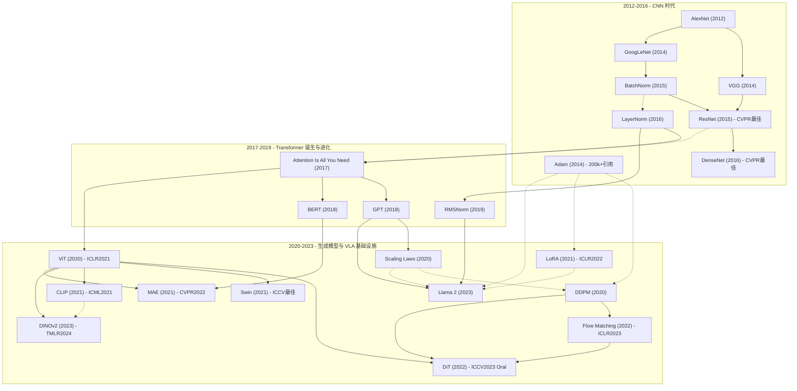

---
tags:
  - 论文
  - 深度学习基础
created: 2026-06-30
updated: 2026-06-30
---

# 深度学习基础 论文总览精讲

按技术发展脉络排列，覆盖从深度学习革命（AlexNet, 2012）到现代 LLM/VLA 训练基础设施（LoRA, 2021）的核心架构演进。共 **23 篇论文**，分为四大主题：**CNN 架构演进**（6 篇）、**归一化技术**（3 篇）、**Transformer 与视觉基础模型**（7 篇）、**生成模型与 VLA 训练基础设施**（7 篇）。

---

## 目录

1. [一、深度学习革命——为什么需要读这些论文](#一深度学习革命为什么需要读这些论文)
2. [二、第一批：CNN 架构演进（2012-2016）——从浅到深的视觉理解](#二第一批cnn-架构演进2012-2016从浅到深的视觉理解)
3. [三、第二批：归一化技术——让深网络能训练](#三第二批归一化技术让深网络能训练)
4. [四、第三批：Transformer 时代——从序列到像素的革命](#四第三批transformer-时代从序列到像素的革命)
5. [五、第四批：生成模型与 VLA 训练基础设施——从理论到实践](#五第四批生成模型与-vla-训练基础设施从理论到实践)
6. [六、跨论文核心洞察](#六跨论文核心洞察)
7. [七、知识图谱——论文间依赖关系](#七知识图谱论文间依赖关系)
8. [八、学习建议——从零到前沿的分级路线](#八学习建议从零到前沿的分级路线)
9. [九、与 VLA 研究的关联全景](#九与-vla-研究的关联全景)

---

## 一、深度学习革命——为什么需要读这些论文

### 1.1 这些论文对 VLA 研究者的意义

VLA（Vision-Language-Action）模型本质上是多个深度学习基础组件的组合：

```
输入图像 → [视觉编码器] → [Transformer骨干/LLM] → [动作解码器] → 机器人动作
              ↑                ↑                    ↑
          CNN/ViT         自注意力/残差连接     Diffusion/Flow
         (Alex→VGG→        (Attention→          Matching
         ResNet→ViT→        BERT/GPT→          (DDPM→Flow Matching
         DINOv2)            Llama 2)            →DiT→π0→GR00T)
                                                    ↑
                                              [LoRA微调]
                                              [AdamW优化]
```

VLA 的每一个关键组件——视觉编码器、LLM 骨干、动作生成头、微调策略、优化器——都直接继承自这 23 篇论文中定义的基础架构和训练基础设施。理解这些论文不是"补充知识"——是**看懂 VLA 架构和训练流程的前提**。

### 1.2 技术时间线速览

```
2012  AlexNet         ─ 第一个 GPU 训练的大规模 CNN，深度学习革命起点
2014  VGG             ─ 极简"3×3 卷积堆叠"设计，证明深度很重要
2014  GoogLeNet       ─ Inception 多尺度分支 + 1×1 卷积降维
2014  Adam            ─ 动量 + 自适应学习率，引用量最高的优化器论文
2015  BatchNorm       ─ Mini-batch 归一化，让深网络可训练
2015  ResNet          ─ 残差连接，152 层网络，CVPR 最佳论文
2016  LayerNorm       ─ 特征维度归一化，RNN/Transformer 的刚需
2016  DenseNet        ─ 密集连接，特征重用，CVPR 最佳论文
2017  Attention       ─ Transformer 问世，QKV 自注意力取代 RNN
2018  GPT             ─ Decoder-only 自回归预训练范式
2018  BERT            ─ MLM 双向预训练 + 微调范式
2019  RMSNorm         ─ LayerNorm 的简化版，Llama 系列的归一化选择
2020  Scaling Laws    ─ 模型性能随规模呈幂律增长，涌现的基础
2020  DDPM            ─ 扩散模型基础，VLA 动作生成的理论基石
2020  ViT             ─ 图像打补丁直接送入 Transformer
2021  CLIP            ─ 图文对比学习，连接视觉和语言的世界
2021  Swin            ─ 层次化 Transformer + 窗口注意力，ICCV 最佳论文
2021  MAE             ─ Mask 75% 图像 patch，BERT 的成功迁移到视觉
2021  LoRA            ─ 低秩适配，让 7B VLA 在消费级 GPU 上可微调
2022  Flow Matching   ─ 确定性的最优传输生成，π0 的动作生成核心
2022  DiT             ─ 扩散 Transformer，π0 Action Expert 的架构蓝本
2023  Llama 2         ─ 开源 LLM 标杆，OpenVLA 的骨干
2023  DINOv2          ─ 通用视觉特征提取器，OpenVLA 的空间编码器
```

---

## 二、第一批：CNN 架构演进（2012-2016）——从浅到深的视觉理解

### 1. [[AlexNet]]（2012，NeurIPS 2012）

**核心地位：深度学习时代的开篇之作**

**背景与动机：** 2012 年以前，计算机视觉的主力是手工设计特征（SIFT、HOG）+ SVM 分类器。ILSVRC 的比赛霸主使用费希尔向量编码 + 多层非线性压缩。没人相信一个纯神经网络的方案能赢——直到 AlexNet 出现。

**核心贡献：**
- 5 卷积层 + 3 全连接层（60M 参数），在 ImageNet 上达到 15.3% top-5 error（第二名 26.2%——差距拉开 10 个百分点以上）
- 首次在大规模 CNN 上使用 ReLU 替代 sigmoid/tanh（训练速度快 6 倍）
- 双 GPU 并行训练 + Dropout 防止过拟合
- 数据增强：随机裁剪、水平翻转、PCA 色彩增强

**为什么对 VLA 重要：** 证明了"大数据+大模型+GPU"范式的可行性。VLA 中的视觉编码器（CNN-based）的源头。ReLU 成为后续所有网络的默认激活函数。

**关键启示：** 深度学习能够自动学习到有用的特征层次——低层学边缘和纹理，中层学形状和部件，高层学语义概念。这个"特征层次自动学习"是 VLA 从像素到动作端到端学习可行性的理论基础。

---

### 2. [[VGG]]（2014，ICLR 2015）

**核心地位：极简设计的经典，证明深度 > 复杂度**

**核心贡献：**
- 全部 3×3 卷积 + 2×2 max pooling 的极简架构
- 两层 3×3 的感受野 = 一层 5×5，但参数少且非线性更强
- VGG-16 (138M) 和 VGG-19 (144M)，ImageNet top-5 error 7.3%

**为什么对 VLA 重要：** "深度+简单 > 浅层+复杂"的哲学被 ResNet 和 Transformer 继承。

**关键启示：** 好的架构不需要复杂——一致性比细节设计更重要。

---

### 3. [[GoogLeNet]]（2014，CVPR 2015）

**核心地位：多尺度分支卷积的开创者，参数仅 AlexNet 的 1/12**

**核心贡献：**
- **Inception 模块**：同一层内并行 1×1, 3×3, 5×5 卷积，让网络自动学习哪个尺度最合适
- **1×1 卷积降维**：在昂贵的 3×3/5×5 卷积前减少通道数（如 256d→64d）
- 仅 5M 参数（AlexNet 60M），性能更优

**为什么对 VLA 重要：** "用更少参数做更多事"是 FLOWER、VLA-Adapter 轻量化 VLA 的哲学先驱。

---

### 4. [[ResNet]]（2015，CVPR 2016 最佳论文）

**核心地位：计算机视觉史上引用量最高的论文，残差连接改变了整个深度学习**

**核心贡献：**
- **残差学习**：`y = F(x) + x`——当最优映射接近恒等时，残差趋近于零，比直接学习恒等容易得多
- 梯度通过 skip connection 直接回流
- ResNet-50/101/152，ImageNet top-5 error 3.57%（ensemble）

**为什么对 VLA 重要：**
- ACT 和 Diffusion Policy 的视觉编码器基于 ResNet
- **残差连接被扩展到 Transformer**（每个子层本质也是 `x + F(x)`）

---

### 5. [[DenseNet]]（2016，CVPR 2017 最佳论文）

**核心地位：将残差连接推向极致——每一层接收所有前置层的特征**

**核心贡献：** 密集连接——第 l 层输入 = 前面所有层的特征图拼接。DenseNet-201 (20M) vs ResNet-152 (60M)，性能相当。

**为什么对 VLA 重要：** 密集连接的思想与 Transformer 的全局自注意力殊途同归。

---

### CNN 五篇的内在脉络

```
AlexNet (2012)          VGG (2014)            GoogLeNet (2014)        ResNet (2015)          DenseNet (2016)
"深度学习能行"          "深度很重要"          "多尺度很重要"          "必须用残差连接"       "多层次连接更好"
8层网络                 16-19层                22层                    152层                   201层 (仅20M参数)
    └───────────────────────┴───────────────────────┴───────────────────────┴──────────────────────┘
                             核心共识：更深 + 更好的梯度流动 = 更强的表征能力
                             这个共识是 Transformer（残差连接 + LayerNorm）成功的前提
```

---

## 三、第二批：归一化技术——让深网络能训练

### 6. [[Adam]]（2014，ICLR 2015）

**核心地位：引用量 ~200,000+ 的优化器论文，几乎所有深度学习模型的默认选择**

**核心贡献：** 结合动量（一阶矩 m_t）和自适应学习率（二阶矩 v_t），每个参数有自己的学习率。
- 更新规则：`m_t = β₁·m_{t-1} + (1-β₁)·g_t`, `v_t = β₂·v_{t-1} + (1-β₂)·g_t²`
- 偏差校正：`m̂_t = m_t/(1-β₁^t)`, `v̂_t = v_t/(1-β₂^t)`
- 最终更新：`θ_t = θ_{t-1} - α·m̂_t/(√v̂_t + ε)`

**为什么对 VLA 重要：** 几乎所有 VLA 都用 AdamW（Adam + 解耦权重衰减）做优化。OpenVLA 学习率 2e-5、Diffusion Policy、RT-2 的 Co-Fine-Tuning——全部是 AdamW。

**关键启示：** Adam 的 v_t（二阶矩）机制解释了为什么 SwiGLU 比 ReLU 需要更小学习率——不同激活函数的梯度分布不同。

---

### 7. [[Batch Normalization]]（2015，ICML 2015）

**核心地位：让训练深网络成为可能的训练技巧**

**核心贡献：** 沿 batch 维度归一化 `x̂ = (x - μ_B) / √(σ²_B + ε)`，允许使用 5 倍更高学习率，大幅降低对初始化敏感度。

**为什么对 VLA 重要：** CNN-based 视觉编码器中广泛使用；打开了归一化技术的大门（BatchNorm→LayerNorm→RMSNorm→AdaLN）。

---

### 8. [[Layer Normalization]]（2016）

**核心地位：Transformer 的必需品——没有它就没有今天的所有 LLM 和 VLA**

**核心贡献：** 沿特征维度归一化，每个样本独立计算 μ 和 σ，训练和推理行为完全一致。

**为什么对 VLA 重要：** 所有 VLA 模型的 Transformer 骨干都在用 LayerNorm 或其变体。

---

### 9. [[RMSNorm]]（2019，NeurIPS 2019）

**核心地位：LayerNorm 的高效简化版——Llama 系列的归一化选择**

**背景与动机：** LayerNorm 需要计算均值 μ 和标准差 σ 两个统计量。RMSNorm 的核心洞察：在残差连接 + 权重衰减的 Transformer 中，re-centering（减均值）对稳定性的贡献极微——去掉它可以加快 ~7-15% 的计算。

**核心贡献：**
- RMSNorm：`y = x / RMS(x) * γ`，其中 `RMS(x) = √(1/d · Σ x_i²)`（仅需计算 RMS，无需均值）
- 仅保留 scale 参数 γ，去掉 shift/bias 参数 β
- 理论上证明 re-centering 在 Transformer 中不必要

**为什么对 VLA 重要：**
- **OpenVLA 的骨干 Llama 2 全部使用 RMSNorm**——每层两个（Attention 前 + FFN 前）
- Llama 3、Qwen2.5 等现代 VLA 常用的 LLM 骨干也使用 RMSNorm
- 理解 RMSNorm 是理解"Pre-Norm"设计的前提

---

### 归一化技术演化链

| | BatchNorm | LayerNorm | RMSNorm | AdaLN |
|---|---|---|---|---|
| 归一化维度 | Batch dim | Feature dim | Feature dim | Feature dim + 条件调制 |
| 适合架构 | CNN | RNN / Transformer | 现代 Transformer (Llama) | DiT / Action Expert |
| 在 VLA 中使用 | CNN 视觉编码器 | 早期 Transformer | OpenVLA 骨干 | π0 / GR00T / FLOWER |
| 是否有条件调制 | 否 | 否 | 否 | **是（γ, β 由条件回归）** |

---

## 四、第三批：Transformer 时代——从序列到像素的革命

### 10. [[Attention Is All You Need]]（2017，NeurIPS 2017）

**核心地位：开启了整个 Transformer 时代，深度学习史上最具影响力的论文之一**

**三大核心创新：**

1. **Scaled Dot-Product Attention**：`Attention(Q, K, V) = softmax(QK^T/√d_k) · V`
2. **Multi-Head Attention**：h=8 个注意力头并行，每个头关注不同子空间
3. **Positional Encoding**：正弦位置编码注入序列位置信息

**为什么对 VLA 重要：一切的基础。** VLA 中所有组件——LLM 骨干（GPT/Llama/PaliGemma/Qwen）、视觉编码器（ViT/DINOv2）、动作生成器（DiT）——都基于 Transformer。

---

### 11. [[BERT]]（2018）——"预训练+微调"范式

**核心贡献：** MLM（随机 mask 15% token，双向预测），在 11 项 NLP 任务上同时刷新 SOTA。

**为什么对 VLA 重要：** "预训练+微调"是所有现代 VLA 的基础范式；MLM 启发了 MAE（图像 mask 预训练）。

---

### 12. [[GPT]]（2018）——自回归预训练的起源

**核心贡献：** 因果语言建模 + 下游微调。将 12 个 NLP 任务统一为相同序列格式。

**为什么对 VLA 重要：** Decoder-only 是 OpenVLA（Llama 2）、RT-2 动作 token 化的架构基础。

---

### 13. [[ViT]]（2020，ICLR 2021）

**核心地位：让 Transformer 统治了 CV**

**核心洞察：** 把图像切成 16×16 patches，线性投影成 token，直接喂给标准 Transformer Encoder。

**为什么对 VLA 重要：** DINOv2、SigLIP 都是 ViT-based；DiT 是 ViT 在生成方向的变体。

---

### 14. [[CLIP]]（2021，ICML 2021）

**核心地位：连接视觉和语言世界的桥梁**

**核心洞察：** 在 400M 图文对上用对比学习训练，将视觉和文本映射到同一 embedding 空间。

**为什么对 VLA 重要：** SigLIP（CLIP 改进版）是 OpenVLA、π0 的语义编码器基础。

---

### 15. [[Swin Transformer]]（2021，ICCV 2021 最佳论文）

**核心贡献：** 层次化架构 + 窗口自注意力（O(N²)→O(N)）+ 相对位置偏置。

**为什么对 VLA 重要：** 多尺度特征对机器人全局+局部感知至关重要。

---

### 16. [[MAE]]（2021，CVPR 2022）

**核心地位：BERT 的 MLM 在视觉上的成功迁移**

**核心洞察：** Mask 75% 的图像 patch（利用图像高度空间冗余），非对称 Encoder-Decoder 架构。

---

### 17. [[DINOv2]]（2023，TMLR 2024）

**核心地位：OpenVLA 的空间编码器——负责"在哪里"**

**最重要的特性：** 同时擅长图像级别（分类）和像素级别（深度估计、分割）。OpenVLA 的双视觉编码器中，DINOv2 负责空间特征（物体位置、形状、姿态），SigLIP 负责语义特征（物体类别、属性）。

---

### Transformer 家族的进化脉络

```
Attention Is All You Need (2017)
    │
    ├──→ BERT (2018) ──────────→ MLM → MAE (2021)
    │    Encoder-only
    │
    ├──→ GPT (2018) ──────────→ GPT-2→GPT-3→GPT-4 → Llama 2 (2023)
    │    Decoder-only              │               OpenVLA 骨干
    │    自回归生成                 │               [RMSNorm + SwiGLU + RoPE + GQA]
    │                              │
    │                        Scaling Laws (2020)
    │                        "越大越好"的数学基础
    │
    └──→ ViT (2020) ──────────→ Swin (2021) ──→ DINOv2 (2023)
             │                  层次化+窗口注意力     通用视觉特征
             │
             ├──→ CLIP (2021) → SigLIP ──→ OpenVLA 语义编码器
             │    图文对比学习
             │
             └──→ DiT (2022) ──→ π0 / GR00T N1 / FLOWER 的动作生成
                  Diffusion Transformer
                  [AdaLN 条件化]
```

---

## 五、第四批：生成模型与 VLA 训练基础设施——从理论到实践

这一批论文直接对应 VLA 训练和推理中的核心组件。与前三批不同，这些论文的实践价值等同于理论价值——它们定义了 VLA 研究者每天使用的工具链。

### 18. [[Scaling Laws]]（2020）

**核心地位：建立了模型性能随规模提升的数学框架，解释了 VLA 中"为什么大就是好"**

**三个核心幂律：**
- 模型规模：`L(N) = (N_c/N)^α_N`
- 数据量：`L(D) = (D_c/D)^α_D`
- 计算量：`L(C_min) = (C^(min)_c/C)^α_C`

**与 Chinchilla 修正的关系：** 原始论文结论"优先增大模型而非数据"被 Chinchilla (2022) 修正为"参数量和 token 数应等比增长"。但这个修正不影响核心洞察——**性能不是线性增长，而是按幂律；足够大的规模会涌现出新能力。**

**为什么对 VLA 重要：**
- 解释了 RT-2 5B→55B 的涌现：规模不仅让模型"更好"，还让它"能做小模型根本不会的事"
- OpenVLA 选 7B 而非 1B 的理论依据
- Open X-Embodiment 的"模型容量是关键"发现（35M vs 55B）是 scaling law 在机器人领域的验证

---

### 19. [[DDPM]]（2020，NeurIPS 2020）

**核心地位：扩散模型的基础论文，VLA 动作生成的理论基石**

**核心思想：** 
- 前向过程（加噪）：`x_t = √(ᾱ_t)·x₀ + √(1-ᾱ_t)·ε`，逐步破坏数据直到纯噪声
- 反向过程（去噪）：学习预测噪声 `ε_θ(x_t, t)`
- 训练目标：`L = E[||ε - ε_θ(x_t, t)||²]`
- **噪声预测网络 ε_θ 实际上在学习数据分布的 score function**：`ε_θ(x_t) ≈ -σ_t·∇_x log p(x_t)`

**为什么扩散策略训练稳定？** 隐式策略（IBC）的麻烦在于归一化常数 Z(o,θ) 的估计。扩散策略直接学习 score function（梯度），Z(o,θ) 的梯度恒为零——score function 的估计**完全独立于归一化常数**。这就是扩散策略训练极度稳定的数学根源。

**为什么对 VLA 重要：**
- Diffusion Policy 直接基于 DDPM
- Octo 使用 DDPM 作为动作解码头
- 所有后续生成模型（Flow Matching, DiT）都在 DDPM 框架上改进

---

### 20. [[Flow Matching]]（2022，ICLR 2023）

**核心地位：π0 动作生成的数学核心——比 DDPM 更快、更直接**

**核心思想：** 学习确定性的最优传输路径——从纯噪声**直线**走向目标数据，而非 DDPM 的随机蜿蜒路径。

- 时变向量场：`dx/dt = v_t(x_t)`
- 训练目标：`L_CFM = E[||v_θ(t, x_t) - (x_1 - x_0)||²]`，`x_t = (1-t)·x_0 + t·x_1`
- Conditional Flow Matching (CFM) 技巧：学习条件向量场而非边际向量场（两者梯度等价）

**vs DDPM 的核心优势：**
| | DDPM | Flow Matching |
|---|---|---|
| 路径 | 随机布朗桥 | 最优传输直线 |
| 推理步数 | ~100 步（DDIM 加速后 10-50）| ~10 步 |
| 适合场景 | 图像生成 | **机器人连续动作（天然适合）** |

**为什么对 VLA 重要：**
- **π0 的整个动作生成系统 = Flow Matching**——Action Expert 在 10 步内生成 50 步连续动作序列
- GR00T N1 的 DiT 动作头使用 Flow Matching
- FLOWER 使用 Rectified Flow（保证路径严格直线）

---

### 21. [[DiT]]（2022，ICCV 2023 Oral）

**核心地位：π0 Action Expert、GR00T System 1、FLOWER Flow Transformer 的架构蓝本**

**核心贡献：**
- 证明 U-Net 不是扩散模型的必需品——Transformer 更好
- AdaLN (Adaptive Layer Normalization)：`AdaLN(h, c) = γ(c)·LN(h) + β(c)`，γ 和 β 由条件 c 的小 MLP 回归得到
- DiT-XL/2 (675M) 在 ImageNet 256×256 上 FID 2.27（当时 SOTA）

**为什么对 VLA 重要：**
- **π0 的 Action Expert (300M) = DiT**——VLM 语义 embedding 通过 AdaLN 注入
- **GR00T N1 的 System 1 = DiT**——Flow Matching Transformer
- **FLOWER 的 Flow Transformer = DiT 变体**——AdaLN + Rectified Flow
- AdaLN 是理解 π0 动作专家内部机制的前提

---

### 22. [[LoRA]]（2021，ICLR 2022）

**核心地位：让 7B VLA 在消费级 GPU 上可微调的关键技术**

**核心假设：** 预训练权重的更新矩阵 ΔW 具有低"内在秩"——可以用低秩分解近似。

**公式：** `h = W₀·x + B·A·x`，A ∈ R^(r×d_in), B ∈ R^(d_out×r)，r << min(d_in, d_out)

**为什么对 VLA 重要：**
- **OpenVLA 的微调 = LoRA (rank=32)**——可训练参数减少到 1.4%，性能接近全量微调
- 4-bit QLoRA 微调 7B 模型：16GB 显卡上 batch_size=1 可行
- VLA-Adapter 与 LoRA 互补——LoRA 微调 VLM 内部，VLA-Adapter 在外部加 Bridge

| 微调方案 | 可训练参数 | 训练 VRAM (7B) | 性能 |
|---------|----------|---------------|------|
| 全量微调 | 100% | ~62GB | 最佳 |
| LoRA (r=32) | ~1.4% | ~22GB (bf16) | 接近全量 |
| 4-bit QLoRA (r=32) | ~1.4% | **~12-16GB** | 略低于 LoRA |

---

### 23. [[Llama 2]]（2023）

**核心地位：OpenVLA 的骨干 LLM——理解它等于理解 OpenVLA 内部机制**

**四大架构特性（全部被 VLA 继承）：**

| 特性 | 作用 | 在 VLA 中的位置 |
|------|------|---------------|
| **RMSNorm** (Pre-Norm) | 每个子层前归一化，训练稳定 | OpenVLA 每层 2 个 RMSNorm |
| **SwiGLU** | 门控激活：`x·σ(W_g·x) ⊙ (W_u·x)` | OpenVLA FFN 层 |
| **RoPE** | 旋转位置编码，相对位置 | OpenVLA 注意力层的 QK |
| **GQA** (70B) | 多 Q 头共享一组 KV，减少 KV cache | VLA 推理效率优化 |

**为什么对 VLA 重要：** OpenVLA 直接使用 Llama 2 7B——覆写 256 个最不常用 token 做动作 token 化。理解 SwiGLU→理解为什么用 AdamW 优化；理解 RoPE→理解动作序列的位置编码；理解 GQA→理解推理时 KV cache 优化。

---

### 生成模型演进全景

```
DDPM (2020)                       LoRA (2021)               Llama 2 (2023)
扩散模型基础                      低秩微调                   开源 LLM 标杆
    │                                 │                         │
    ├──→ Flow Matching (2022)         │                         ├─→ OpenVLA 骨干
    │    最优传输直线                 ├─→ OpenVLA 微调           │    [RMSNorm+SwiGLU+RoPE]
    │        │                        │   LoRA rank=32          │
    │        ├──→ π0 动作生成          │                         └─→ SmolVLA / BitVLA
    │        ├──→ GR00T N1 Flow       ├─→ QLoRA
    │        └──→ FLOWER Rectified    │   4-bit 消费级可训
    │                                  │
    └──→ DiT (2022)                   ├─→ VLA-Adapter
         Diffusion Transformer         │   (互补方案)
         [AdaLN]                       │
              │                        └─→ FLOWER prompt tuning
              ├──→ π0 Action Expert
              ├──→ GR00T System 1
              └──→ FLOWER Flow Transformer
```

---

## 六、跨论文核心洞察

### 6.1 架构设计的收敛方向

1. **"越深越好"需要条件**（ResNet → Transformer）——更深需要更好的梯度流动（残差连接 + LayerNorm/RMSNorm）
2. **Transformer 成为统一架构**（NLP → CV → 多模态 → 机器人 → 扩散生成）
3. **归一化从辅助变为核心**（BatchNorm→LayerNorm→RMSNorm→AdaLN）——归一化策略随架构升级而进化
4. **预训练→微调成为默认范式**（BERT→GPT→ViT→CLIP→MAE→DINOv2→Llama 2）
5. **参数效率成为独立研究方向**（LoRA → QLoRA → VLA-Adapter → FLOWER）
6. **生成式 AI 与判别式融合**（DDPM → Flow Matching → DiT——生成模型被用作策略/规划器）

### 6.2 四条设计主线的交汇

```
CNN 主线                    归一化主线                Transformer 主线           训练基础设施
Alex→VGG→GoogleNet      BN→LN→RMSNorm→AdaLN       Attention→BERT/GPT        Adam→ScalingLaws
    ↓                        ↓                           ↓                       ↓
ResNet                                                      ViT→CLIP→DINOv2      LoRA→QLoRA
    │                        │                           │                       │
    └────────────────────────┴───────────────────────────┴───────────────────────┘
                                          ↓
                             现代 VLA 的每一层都有这四条线的痕迹
```

### 6.3 "简单即强大"——反复验证的设计哲学

- VGG：全部 3×3 卷积 > 多尺度大卷积核
- ResNet：一个 skip connection 解决了深层训练难题
- Attention Is All You Need：丢掉 RNN，只留 attention
- RMSNorm：去掉 LayerNorm 的 mean centering，仅快 7-15%
- ViT：丢掉 CNN 的卷积核，只留 Transformer
- LoRA：`W₀·x + B·A·x`，一个低秩分解，10,000 倍参数减少
- Flow Matching：丢掉 DDPM 的随机路径，只走直线

**最好的设计往往是最简单的。** FLOWER 砍掉 VLM 30% 层、VLA-Adapter 冻住 VLM 只加 Bridge——这些 VLA 创新都在延续"删不必要的东西"这一设计哲学。

### 6.4 从理论到 VLA 实践的完整知识链

```
理论层：     Attention → BERT/GPT → DDPM → Flow Matching → Scaling Laws
                 ↓            ↓         ↓           ↓              ↓
架构层：     ViT/CLIP    Llama 2    DiT        π0         OpenVLA 7B vs 1B
                 ↓            ↓         ↓           ↓              ↓
训练层：     DINOv2      RMSNorm    AdaLN    Flow Action    LoRA/QLoRA
                 ↓            ↓         ↓           ↓              ↓
VLA 落地：  OpenVLA     OpenVLA    π0/GR00T   π0/GR00T     OpenVLA 微调
            空间编码器    LLM骨干   Action Expert 动作生成   消费级 GPU 可训
```

---

## 七、知识图谱——论文间依赖关系



**实线箭头** = 直接继承/依赖关系；**虚线箭头** = 思想层面的影响

---

## 八、学习建议——从零到前沿的分级路线

### Level 1：构建直觉（必须先读，约 2 周）

1. **AlexNet** — 理解"为什么深度学习会赢"
2. **VGG** — 理解"深度很重要"，感受极简设计
3. **ResNet** — **最重要的深度学习概念之一**——残差连接
4. **BatchNorm** — 让深网络可训练的关键
5. **Attention Is All You Need** — **花最多时间**——自注意力、多头、位置编码、LayerNorm

**学完 Level 1 你应该能回答：**
- 残差连接为什么有效？（梯度流动 + 恒等映射的直觉）
- 自注意力和 CNN 卷积的本质区别？
- BatchNorm 和 LayerNorm 分别在什么维度上归一化？为什么 Transformer 必须用 LayerNorm？

### Level 2：理解预训练范式与优化基础设施（约 1-2 周）

6. **Adam** — 为什么所有模型都在用？动量和自适应学习率怎么配合？
7. **BERT** — MLM 和"预训练+微调"范式
8. **GPT** — 自回归和 Decoder-only，BERT vs GPT 的根本区别
9. **Scaling Laws** — 为什么模型越大能力越强？涌现的数学基础
10. **RMSNorm** — LayerNorm→RMSNorm 的演化逻辑

**学完 Level 2 你应该能回答：**
- Adam 的二阶矩 v_t 做了什么？为什么 SwiGLU 比 ReLU 需要更小学习率？
- "预训练+微调"为什么有效？MLM 和因果LM 各自适合什么场景？
- Scaling law 的幂律指数 α 大约是多少？这意味着什么？

### Level 3：视觉基础模型 + 生成模型（约 2 周）

11. **ViT** — Transformer 怎么进入 CV，为什么需要大数据预训练？
12. **CLIP** — 视觉和语言怎么对齐到同一空间？
13. **DDPM** — 扩散模型的前向/反向过程，score function 的直觉
14. **Flow Matching** — 从随机路径到最优传输直线，为什么更快？
15. **DiT** — Transformer 怎么做扩散生成？AdaLN 是什么？
16. **DINOv2** — **重点读**——OpenVLA 的空间编码器

**学完 Level 3 你应该能回答：**
- DDPM 的 score function 为什么绕过了归一化常数估计？这对训练稳定性意味着什么？
- Flow Matching 和 DDPM 的本质区别（确定性 vs 随机，直线 vs 蜿蜒）？
- AdaLN 和普通 LayerNorm 的区别？条件信息怎么注入的？

### Level 4：深入 VLA 训练基础设施（约 1 周）

17. **Swin Transformer** — 层次化架构 + 窗口注意力
18. **MAE** — 图像上 mask 75%，为什么比 BERT 高？
19. **Llama 2** — **必读**——理解 OpenVLA 的每层内部结构（RMSNorm + SwiGLU + RoPE + GQA）
20. **LoRA** — **必读**——理解你为什么能在 16GB 显卡上微调 7B VLA
21. **GoogLeNet** — 多尺度分支的思想来源
22. **DenseNet** — 特征重用的极致探索
23. **LayerNorm** — 回顾归一化，理解从 LN→RMSNorm→AdaLN 的完整演化

**学完 Level 4 你应该能回答：**
- Llama 2 的四个架构特性分别解决了什么问题？
- LoRA 的秩 r 选 8、32 还是 64？各自的权衡是什么？
- 为什么 DINOv2 的特征能同时做分类和深度估计？

---

## 九、与 VLA 研究的关联全景

### 每一篇 VLA 论文背后的基础组件——更新版

| VLA 论文 | 依赖的基础架构 | 对应的基础论文 |
|----------|-------------|-------------|
| RT-2 | PaLI-X (ViT + UL2)，离散 token 动作 | **ViT**, **Attention**, **ResNet** |
| OpenVLA | DINOv2 + SigLIP + Llama 2 + LoRA 微调 | **DINOv2**, **CLIP**, **Llama 2**, **Attention**, **LayerNorm**, **RMSNorm**, **LoRA** |
| π0 | PaliGemma + DiT + Flow Matching | **ViT**, **Attention**, **DiT**, **Flow Matching**, **DDPM**, **Adam** |
| Diffusion Policy | CNN Encoder + DDPM/DDIM 去噪 | **ResNet**, **BatchNorm**, **DDPM** |
| ACT | ResNet Encoder + CVAE | **ResNet**, **BatchNorm**, **Adam** |
| GR00T N1 | Cosmos-Reason + DiT (Flow Matching) | **ViT**, **GPT**, **DiT**, **Flow Matching**, **Adam** |
| FLOWER | Florence-2 + Rectified Flow + AdaLN | **ViT**, **ResNet**, **DiT**, **Flow Matching**, **LayerNorm** |
| VLA-Adapter | Qwen2.5 + Bridge Encoder | **GPT**, **Attention**, **Llama 2** |
| SimpleVLA-RL | OpenVLA + GRPO | **Llama 2**, **LoRA**, **Adam**, **Scaling Laws** |
| Cosmos Policy | Cosmos-Predict2 (Video DiT) | **ViT**, **DiT**, **DDPM**, **Flow Matching** |
| MolmoAct | VLM + 三阶段推理链 | **ViT**, **CLIP**, **Attention**, **Adam** |

### 建议的学习路径

```
深度学习基础 (本文件夹 23 篇)
    ↓
    ├── Level 1-2: CNN + 归一化 + Transformer 基础
    │   AlexNet→ResNet→BatchNorm→LayerNorm→Attention→Adam→ScalingLaws
    │
    ├── Level 3: 视觉基础模型 + 生成模型
    │   ViT→CLIP→DDPM→Flow Matching→DiT→DINOv2
    │
    └── Level 4: VLA 训练基础设施
        RMSNorm→Llama 2→LoRA→Swin→MAE
            ↓
动作生成基础（01_embodied AI 中）
    → Diffusion Policy (扩散模型做动作生成)
    → ACT (双手操作 + CVAE)
    ↓
VLA 入门
    → RT-2 (VLA 概念诞生)
    → OpenVLA (开源 VLA 里程碑)
    ↓
VLA 前沿
    → π0 (Flow Matching + 双系统)
    → MolmoAct (可解释 ARM)
    → FLOWER / VLA-Adapter (轻量 VLA)
    → SimpleVLA-RL (RL 微调)
    ↓
WAM (世界动作模型)
    → Motus / FastWAM / Cosmos Policy / LDA-1B
```

---

