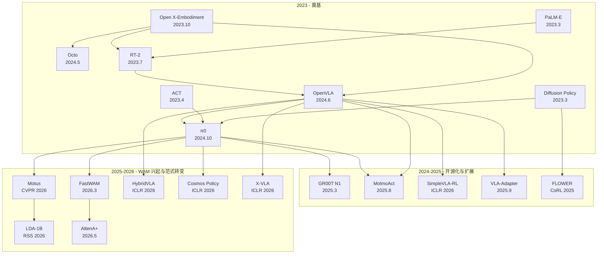

---
tags:
  - 论文
  - VLA
  - MOC
created: 2026-06-30
updated: 2026-06-30
---

# VLA 论文精讲

按发表时间线排列，展示 VLA 领域从概念提出（2023）到最新前沿（2026）的完整演进脉络。

## 第一批：奠基篇（2023-2024）—— 概念起源与开源化

| # | 论文 | 年份 | 核心地位 |
|---|------|------|----------|
| 1 | [[Open X-Embodiment & RT-X]] | 2023.10 | VLA 的"数据地基"，全球 21 机构联合，定义了 OXE 数据集 |
| 2 | [[PaLM-E]] | 2023.3 | 首次将 LLM 与机器人传感器直接融合，RT-2 的前身 |
| 3 | [[RT-2]] | 2023.7 | **提出"VLA"概念**，证明动作可以是"另一种语言" |
| 4 | [[Diffusion Policy]] | 2023.3 | 定义"怎么做动作生成"，当前几乎所有 VLA 动作头的基础 |
| 5 | [[ACT]] | 2023.4 | 定义"怎么做细粒度双手操作"，ALOHA 系统成为社区标配 |
| 6 | [[Octo]] | 2024.5 | 第一个开源通用机器人策略，为 OpenVLA 奠定基础 |
| 7 | [[OpenVLA]] | 2024.6 | **开源 VLA 的里程碑**，7B 参数击败 55B 的 RT-2-X |
| 8 | [[π0]] | 2024.10 | 当前最强 VLA，Flow Matching 架构，50Hz 实时控制 |
| 9 | [[GR00T N1]] | 2025.3 | NVIDIA 正式入场，专门面向人形机器人的 VLA |
| 10 | [[MolmoAct]] | 2025.8 | **VLA 的未来方向**：从黑盒端到端走向可解释空间推理 |

## 第二批：前沿篇（2025-2026）—— RL 微调、轻量化与 WAM 兴起

| # | 论文 | 年份/录用 | 核心地位 |
|---|------|---------|----------|
| 11 | [[SimpleVLA-RL]] | 2025.9 / **ICLR 2026** | RL 微调 VLA 的标杆——1 条演示 + RL 从 17% 飙升到 92%。发现"Pushcut"现象 |
| 12 | [[FLOWER]] | 2025.9 / **CoRL 2025** | 950M 参数的轻量 VLA，预训练仅 ~200 H100h（OpenVLA 的 1%），190 个任务 SOTA |
| 13 | [[X-VLA]] | 2025.3 / **ICLR 2026** | Soft Prompt 跨形态方案——仅 0.04% 额外参数，0.9B 横扫 LIBERO。IROS 2025 冠军 |
| 14 | [[Motus]] | 2025.12 / **CVPR 2026** | **大一统世界动作模型 (WAM)**——MoT 架构融合 5 种范式。比 π0.5 高 45% |
| 15 | [[HybridVLA]] | 2025.3 / **ICLR 2026** | 扩散+自回归统一在同一 LLM 中——自适应融合，+17% 仿真成功 |
| 16 | [[FastWAM]] | 2026.3 / 清华 MARS | **WAM 不需要推理时想象未来**——训练时视频 co-training 才是关键。4× 加速 |
| 17 | [[VLA-Adapter]] | 2025.9 | **0.5B 模型 LIBERO 98.5%**——Bridge Attention 桥接 VLM 与动作空间，~10GB 可训 |
| 18 | [[Cosmos Policy]] | 2026.1 / **ICLR 2026** | 视频基础模型 → 机器人策略。NVIDIA+Stanford。ALOHA 93.6% |
| 19 | [[AttenA+]] | 2026.5 | 即插即用的逆速度场重加权——零架构修改、零额外参数 |
| 20 | [[LDA-1B]] | 2026.2 / **RSS 2026** | "完美数据迷信"的终结者——混入 30% 低质数据 +10%。全域数据利用范式 |

---

## 知识图谱



---

## 2025-2026 年四大趋势

### 趋势 1：从 VLA 到 WAM（世界动作模型）

**Motus (CVPR 2026)**、**FastWAM**、**Cosmos Policy (ICLR 2026)**、**LDA-1B (RSS 2026)** 代表了从"条件反射式 VLA"到"有物理理解的世界模型"的转变。

核心发现：**训练时做视频预测（学到更好的物理表征）是关键，推理时不一定要生成未来帧**（FastWAM 的核心贡献）。NVIDIA 的 Jim Fan 在 2026 年 4 月公开宣称"VLA is dead, WAM should rise"——但这仍有争议。

### 趋势 2："小即是大"——轻量模型超越大模型

**VLA-Adapter (0.5B, LIBERO 98.5%)**、**FLOWER (950M)**、**X-VLA (0.9B)** 都证明了架构设计的价值远超盲目扩大参数。VLA-Adapter 的 0.5B 模型超越了 7B 的 OpenVLA-OFT。核心启示：**如何连接 VLM 表征和动作空间，比 VLM 有多大更重要。**

### 趋势 3：RL 微调取代纯 BC（行为克隆）

**SimpleVLA-RL (ICLR 2026)** 是这一趋势的旗帜——用 1 条演示 + 纯结果奖励（0/1）+ GRPO，将成功率从 17.3% 提升到 91.7%。发现的 "Pushcut" 现象（RL 发现演示数据之外的更优策略）表明：BC 只能复制，RL 可以超越。

### 趋势 4：打破"完美数据迷信"

**LDA-1B (RSS 2026)** 证明了低质量数据 + 无标签人类视频的"全域"组合比纯精选数据更强大——混入 30% 低质数据反而提升 10%。**AttenA+** 则从另一个角度证明了"不是所有动作步骤都同等重要"——低速精细操作值得更高训练权重。

---

## 对我最相关的论文（按硬件适配排序）

> 硬件: RTX 4070 Ti Super 16GB

### ✅ 16GB 可完整训练

| 论文 | VRAM | 训练时间 | 推荐理由 |
|------|------|---------|---------|
| [[ACT]] | 2-6 GB | 数小时 | 最简单的入门算法，LeRobot 原生支持 |
| [[Diffusion Policy]] | 8-14 GB | 数小时 | VLA 动作头的理论基础 |
| [[VLA-Adapter]] | **~10 GB** | **~8 小时** | **0.5B 模型 LIBERO 98.5%——最推荐** |
| [[FLOWER]] | ~10 GB | 数天 | 950M VLA 预训练 + 微调 |

### ⚠️ 16GB 可推理 / QLoRA 微调

| 论文 | 方案 |
|------|------|
| [[OpenVLA]] | 4-bit QLoRA 微调 (batch=1) |
| [[SmolVLA]] | 450M，全量微调可行 |
| [[MolmoAct]] | 7B 模型，推理可行 |

### 💡 思想可借鉴（训练需 8×GPU+，但方法可迁移）

| 论文 | 可借鉴的思想 |
|------|------------|
| [[SimpleVLA-RL]] | 1条演示+RL > 100条演示BC；Pushcut 现象 |
| [[AttenA+]] | 逆速度场重加权损失——零成本集成 |
| [[LDA-1B]] | 不要丢弃低质量数据；在 DINO 语义空间做预测 |
| [[FastWAM]] | 视频 co-training 作为辅助损失 |
| [[X-VLA]] | Soft Prompt 做跨数据源适配 |
| [[HybridVLA]] | 扩散+自回归自适应融合 |

---

## 推荐研究路径（针对 16GB 硬件）

```
Phase 1: 上手
  ├─ LeRobot + ACT/Diffusion Policy（理解"动作生成"基础）
  └─ VLA-Adapter（0.5B, 8h 训练，LIBERO 98.5%）

Phase 2: 深入 VLA
  ├─ FLOWER 预训练 + 微调（950M 跨形态 VLA）
  ├─ OpenVLA 4-bit QLoRA 微调（理解大规模 VLA）
  └─ 集成 AttenA+ 的逆速度加权（零成本提升）

Phase 3: 前沿探索
  ├─ 借鉴 SimpleVLA-RL 的 RL 微调思路
  ├─ 实验 LDA-1B 的"全域数据利用"
  ├─ 探索 FastWAM 的视频 co-training
  └─ 研究 MolmoAct 的空间推理范式
```

---

## 相关 MOC

- [[../VLA训练框架推荐报告|VLA训练框架推荐]]
