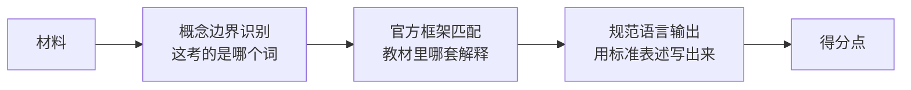

# 01 总论 · 应试本质

> [!abstract] 本笔记导航
> [[考研政治 MOC|总地图]] · **01 总论 · 应试本质**（当前） · [[政治02 选择题方法论]] · [[政治03 材料分析题方法论]] · [[政治04 分模块命题逻辑]] · [[政治05 三层思维法与笔记模板]]
>
> 这篇解决「为什么」：考研政治不是开放式政治学讨论，而是一个高度标准化的考试体系。它要求你在给定的**理论框架、历史叙事和政策语言**中完成任务。先把这一层想通，后面所有技巧才不是玄学。

---

## 一、表面上考五门，机制上只考三种能力

表面上它考：马原 · 毛中特 / 新思想 · 史纲 · 思修法治 · 时政。

但从命题机制上看，它真正反复考的是三种能力：

> [!important] 政治的底层公式
> **概念边界识别 ＋ 官方解释框架匹配 ＋ 规范政治语言输出**

也就是说，命题人并不主要想知道：

> 你个人怎么看这个问题？

而是想知道：

> ==**面对这个材料，你能不能识别出它属于教材中的哪套解释系统。**==

---

## 二、两个世界：现实世界与教材世界

一道政治题通常有两个世界。

| | 现实世界 | 教材世界 |
|---|---|---|
| 状态 | 非常复杂，可讨论几十件事 | 已把现实压缩成**某种矛盾 / 某条规律 / 某项制度 / 某个政策目标 / 某个历史结论** |
| 你的任务 | ~~重新研究现实~~ | ==识别这个材料该被归入教材里的哪个框== |

举例：材料说「某地通过数字技术改造传统制造业，提高生产效率」。

现实中可以讨论：人工智能、自动化、就业替代、企业利润、数字鸿沟、产业升级、资本投入……

但考研命题人如果把它放在**新质生产力**背景下，他实际上是在提示你：

> [!important] 命题人给的暗号
> **技术创新 → 新质生产力 → 高质量发展**

你做题时不需要重新发明一个解释，而是要识别：

> ==命题人准备把这个材料送进哪个「知识抽屉」？==

---

## 三、政治与数学的根本差异：政治考的是「分类」

| | 数学 | 政治 |
|---|---|---|
| 结果的来源 | 结果**由逻辑推出** | 结果**往往先存在于理论体系中** |
| 你的动作 | 现场推演、创造答案 | 识别题目**在调用哪条理论** |
| 本质 | 计算 / 证明 | ==**分类**== |

所以政治做题的核心不是「现场创造答案」，而是**分类**。这也是为什么「站在出题人角度」特别有效——你不是在猜，而是在**认框**。

---

## 四、体系一致性原则：正确选项要同时满足四条

> [!important] 选项成立的四要件
> **事实基本正确 ＋ 教材概念正确 ＋ 政治方向正确 ＋ 表述边界正确**
>
> 少一个都可能错——这是政治和普通常识题最大的区别。

反例：

> 科技创新决定社会发展的一切方面。

方向上「科技创新很重要」没问题，但 ==**决定一切**== 把作用无限扩大。
马原要求你理解社会发展的**多因素联系**以及**主要矛盾**，不允许随便把一个因素绝对化。

> [!warning] 结论（后面会反复用到）
> **政治选择题非常喜欢「方向正确、程度错误」。**

🎯 自测：遮住上面，先自己默写

1. 考研政治机制上反复考的三件事是什么？
2. 「现实世界」与「教材世界」的差别是什么？做题时你真正在做什么动作？
3. 政治与数学在「结果来源」上的根本差别？
4. 正确选项必须同时满足的四个条件？

---

## 五、整套方法的正确顺序，以及唯一红线

> [!important] 顺序不能倒
> **知识 → 理解命题逻辑 → 提高判断速度**
>
> 不能是：~~我觉得国家应该支持这个 → 所以选它~~

因为政治题里经常有：两个选项政治方向都完全正确，但只有一个回答题目。

> A. 坚持党的领导
> B. 推动高质量发展

两句都正确。材料如果在讲产业升级，可能选 B 而不是 A。

> [!danger] 铁律
> ==**题干限定 > 一般政治正确。**==

---

## 六、考场角色扮演：理解在体系外，答题在体系内

考试当天你暂时不是「政治学研究者」，而是：

> [!important] 你的考场身份
> **一个熟练掌握课程理论体系的答题者。**

任务不是「对中国政治制度做原创性评价」，而是：

> ==**证明你知道这个理论体系如何解释材料。**==

所以：

> [!tip] 两句话记住
> **理解时可以站在体系之外，答题时必须回到体系之内。**
>
> 而且——**你越知道「为什么教材这样说」，反而越不需要死背。**

🎯 自测：把这一节压成一句话

答：做题是**认框**，不是**发明解释**；考场身份是**体系内的答题者**，不是体系外的评论者。

---

> [!abstract] 继续阅读
> [[政治02 选择题方法论]] · [[考研政治 MOC|总地图]]
