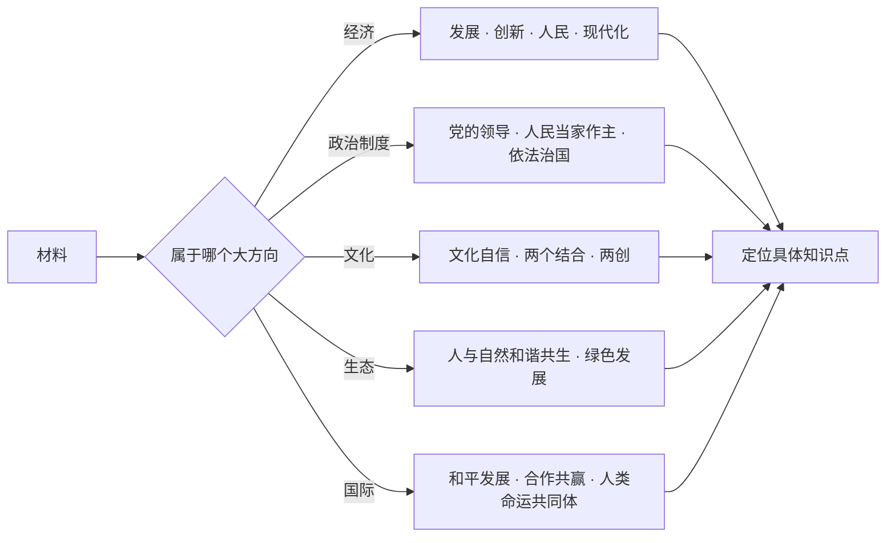
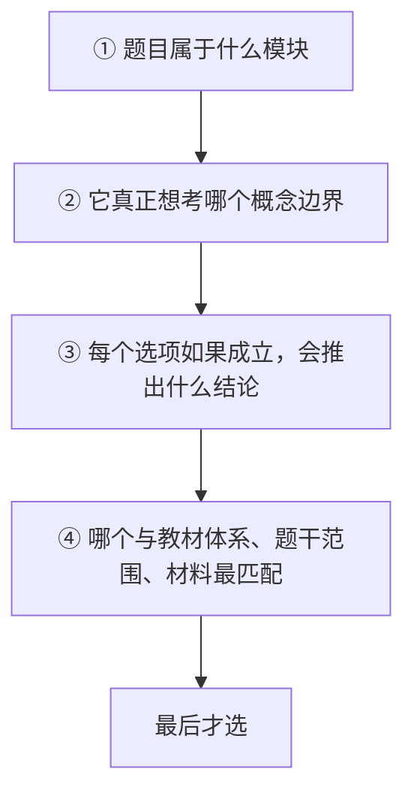

# 02 选择题方法论

> [!abstract] 本笔记导航
> [[考研政治 MOC|总地图]] · [[政治01 总论 · 应试本质]] · **02 选择题方法论**（当前） · [[政治03 材料分析题方法论]] · [[政治04 分模块命题逻辑]] · [[政治05 三层思维法与笔记模板]]
>
> 选择题真正考的是**概念边界**，不是深奥理论。本篇给你一套可复用的排查动作：换起手式 → 认陷阱 → 查后果 → 排偷换 → 走流程。

---

## 一、换个起手式：不要先问「这句话有没有道理」

以后看到一道选择题，先不要问：

> ~~这个选项现实中有没有道理？~~

先问：

> [!important] 选择题第一问
> **如果命题人把它判为正确，他实际上承认了什么教材结论？**

例：

> 市场在资源配置中发挥全部作用。

现实中你可能觉得「市场确实很重要」。但命题人看到「全部」两个字，马上会想到 ==**否定政府作用**==，这违反了教材中的：

> [!important] 标准表述
> **市场在资源配置中起决定性作用 ＋ 更好发挥政府作用**

所以错。

> [!tip] 你做的其实不是一般语义判断
> 而是 ==**理论兼容性检查**==。

---

## 二、陷阱一：把正确观点说过头

这是考研政治最常见的陷阱。

> [!warning] 见到这些词，警觉度拉满
> `唯一` · `全部` · `任何` · `彻底` · `完全` · `只要` · `必然` · `直接决定`

但它们**不是**见到就判错。它们的真正含义是：

> ==这个选项承担了更高的证明责任。==

举例：

- 「实践是认识的来源。」—— 正确。
- 「实践是认识的**唯一**来源。」—— 教材中仍可成立，因为这里的「来源」有严格哲学含义。

所以关键不是「唯一」一定错，而是：

> [!important] 判断标准
> **这个绝对程度，是不是教材原句允许的。**
>
> 这也是为什么政治一定要**熟悉标准表述**。

---

## 三、陷阱二：把上下位概念偷换

考研政治极喜欢这种题。

> [!warning] 两个长得像、层级不同的概念
> **公有制经济 → 主体** ／ **国有经济 → 主导**

出题人写：

> 国有经济在我国基本经济制度中占**主体**地位。

普通人读起来甚至觉得差不多。但命题人实际上在考：

> ==你知不知道两个概念的精确层级。==

所以政治选择题大量是 **概念边界考试**，而不是深奥理论考试。

> [!warning] 这些词本身就是考点
> `根本` · `基本` · `主体` · `主导` · `核心` · `本质` · `首要` · `第一` · `基础` · `保障`

---

## 四、命题人的关键词配对系统

政治里面有大量固定搭配，命题人最简单的出题方式就是：==**把 A 的帽子戴到 B 身上。**==

| 名词 | 固定搭配 |
|---|---|
| 民族精神 | 核心 = **爱国主义** |
| 时代精神 | 核心 = **改革创新** |
| 根本政治制度 | = **人民代表大会制度** |
| 首要任务 | = **高质量发展** |

所以复习政治时，只背长篇段落效率其实不高。你应该大量整理：

> [!important] 最该大量整理的形式
> **「名词—属性—地位—功能」四元组**

| 名词 | 属性 / 地位 | 主要功能 |
|---|---|---|
| 公有制经济 | 主体 | 社会主义经济制度基础 |
| 国有经济 | 主导 | 控制重要行业和关键领域 |
| 人大制度 | 根本政治制度 | 保证人民当家作主 |
| 改革 | 强大动力 | 完善和发展制度 |
| 高质量发展 | 首要任务 | 现代化建设要求 |

这比背整段有效得多。

---

## 五、逆向制度审查法：由后果检查选项

尤其用于毛中特 / 新思想。看到选项后问：

> [!important] 一句话动作
> **如果这句话是对的，会不会推导出一个教材明确反对的结论？**

例一：

> 市场能够自动解决资源配置中的所有问题。
>
> ⇒ 政府完全不必要 ⇒ 教材明确不是这个立场 ⇒ ==排除==

例二：

> 改革就是否定原有社会主义制度。
>
> ⇒ 改革目标是制度替代 ⇒ 与教材定义冲突 ⇒ ==排除==

教材定义：

> [!important] 改革的定义
> **社会主义制度的自我完善和发展。**

---

## 六、反定义清单：A ≠ C

政治很多分数来自这种**反定义**。命题人爱考的就是「不是 A，而是 B」中的偷换。

例如：**改革不是改变根本制度，而是完善制度。** 命题人可以偷换成：

> ~~改革的根本目的是改变社会主义基本制度。~~ ⇒ 错

所以复习时不要只背 `A = B`，还要专门整理 `A ≠ C`。

| 是 | 不是 |
|---|---|
| 共同富裕 | **≠** 平均主义 |
| 市场决定性作用 | **≠** 市场万能 |
| 改革 | **≠** 改旗易帜 |
| 文化自信 | **≠** 文化排外 |
| 独立自主 | **≠** 闭关自守 |

> [!tip] 这类特别值得单独建一张表
> 每学一章就往里添条目，考前只看这张表。

---

## 七、政治方向守恒：材料在变，落点不变

很多题的材料虽然变，但最终落点非常稳定。

| 材料类型 | 稳定落点 |
|---|---|
| 经济 | 发展 ＋ 创新 ＋ 人民 ＋ 现代化 |
| 政治制度 | 党的领导 ＋ 人民当家作主 ＋ 依法治国 |
| 文化 | 文化自信 ＋ 两个结合 ＋ 创造性转化创新性发展 |
| 生态 | 人与自然和谐共生 ＋ 绿色发展 |
| 国际 | 和平发展 ＋ 合作共赢 ＋ 人类命运共同体 |

这意味着你看到材料以后，可以先判断它所属的**大方向**，再从大方向定位具体知识点。

---

## 八、选择题四步心理流程

不要一眼「感觉」。而是：

这样你会明显减少这种困惑：

> ~~「这句话明明感觉也对啊？」~~

因为：

> [!important] 记住这一句
> **政治选择题不是问哪句话孤立看正确，而是问 ==哪句话在这里正确==。**

🎯 自测：五组边界词，你能分清几组

| 组 | 正确 | 错误干扰 |
|---|---|---|
| 1 | 市场起**决定性**作用 | ~~市场起**全部**作用~~ |
| 2 | 公有制经济是**主体** | ~~国有经济是**主体**~~ |
| 3 | 改革是制度的**自我完善和发展** | ~~改革就是否定原有制度~~ |
| 4 | 民族精神核心 = **爱国主义** | ~~民族精神核心 = 改革创新~~ |
| 5 | 实践是认识的**来源** | ~~实践是认识的**唯一**来源~~（需看教材原句是否允许） |

---

> [!abstract] 继续阅读
> [[政治03 材料分析题方法论]] · [[政治04 分模块命题逻辑]] · [[考研政治 MOC|总地图]]
