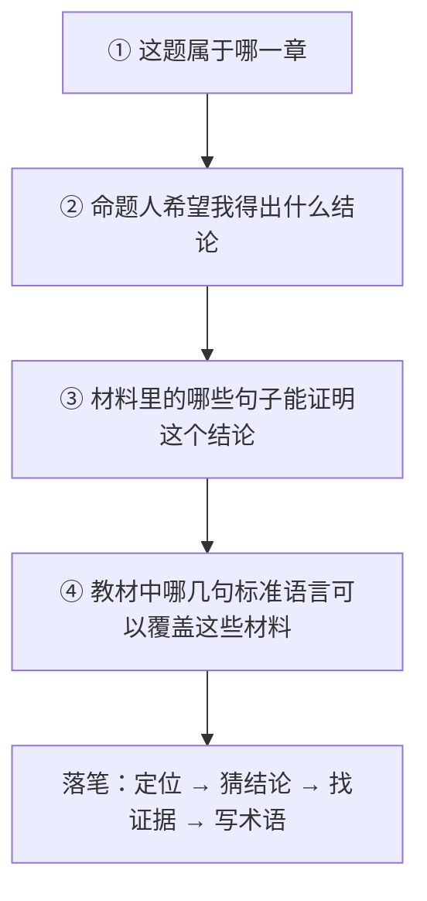
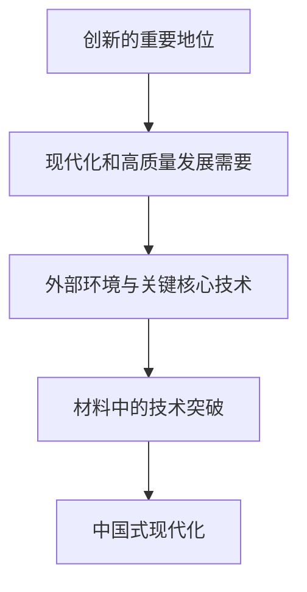

# 03 材料分析题方法论

> [!abstract] 本笔记导航
> [[考研政治 MOC|总地图]] · [[政治01 总论 · 应试本质]] · [[政治02 选择题方法论]] · **03 材料分析题方法论**（当前） · [[政治04 分模块命题逻辑]] · [[政治05 三层思维法与笔记模板]]
>
> 选择题考「哪个选项在这里正确」，大题考的是另一件事：**你能不能把日常语言翻译成教材语言，并按踩点结构写出来。**

---

## 一、大题的本质：官方语言翻译考试

材料使用日常语言，你要翻译成教材语言。

| 材料里的日常说法 | 你该翻译成 |
|---|---|
| 某村让群众一起商量事情 | **基层群众自治 / 全过程人民民主** |
| 东西部协作、公共服务均等化 | **协调发展 / 共同富裕** |
| 技术突破、产业升级 | **创新驱动 / 新质生产力 / 高质量发展** |

> [!important] 翻译公式
> **普通语言 → 教材语言**

---

## 二、先问：命题人希望这段材料证明什么

大题最重要的不是「我怎么看」，而是「命题人希望材料证明什么」。

分析题材料往往已经有 ==**预设结论**==，材料只是**证据**。

举例：材料整篇都在讲科技企业如何突破关键技术、传统产业如何智能化升级。
题目问：如何理解科技创新对现代化建设的重要作用？

这时你真正要做的是：==**从材料中找到支持标准结论的证据。**==

> [!danger] 考试里的严重跑题
> ~~「科技创新也可能造成失业，所以……」~~
> 现实讨论当然可以，考试里这是跑题。

---

## 三、「为什么现在出这道题」：时政的选题逻辑

命题人往往不会随机选材料——某次重大会议、某项重大纪念、某项战略部署、某个周年。

所以拿到大题材料，可以先问：

> [!important] 一个很强的应试问题
> **今年政治教育最想强化的几个主题是什么？**

然后材料往往会主动向这些主题靠拢。所以时政复习不能只背新闻，要把新闻变成：

---

## 四、结论先行：阅卷老师在找踩点

政治阅卷不是散文比赛。阅卷老师在寻找：

> [!important] 两个字
> ==**踩点。**==

所以不要：

> ~~随着时代的不断发展……~~（写半页才到观点）

最好：

> [!tip] 答题句式
> **关键词 ＋ 理论判断 ＋ 材料对应**

示例：

> 科技创新是发展新质生产力的核心要素。材料中企业通过关键技术突破推动传统产业数字化升级，说明科技创新能够促进生产要素创新性配置和产业结构升级，为高质量发展提供新动能。

拆开看就是：

> [!important] 三段结构
> **理论 ＋ 材料 ＋ 结论**

---

## 五、套话得分的真相：对应性 > 正确性

大题为什么经常能「套话得分」？因为评分机制决定了：

> **关键词匹配** 非常重要。

但这不意味着什么套话都能得分。真正有效的是：==**与题目对应的套话。**==

反例：题目问**文化自信**，你写——

> 「全面深化改革是决定当代中国命运的关键一招。」

这句话本身完全正确，但 ==**不回答问题**==，所以不得关键分。

> [!warning] 大题最忌讳的
> 不是套话，而是 ==**无差别套话**==。

---

## 六、按题干动词判断任务

一定看题干的动词。不同动词意味着不同任务。

| 问法 | 命题人真正要什么 |
|---|---|
| 为什么 | 原因、依据、必要性 |
| 如何理解 | 含义 ＋ 原理 ＋ 意义 |
| 如何认识 | 性质判断 ＋ 原因 ＋ 评价 |
| 说明了什么 | 从材料上升到理论 |
| 有何意义 | 作用、价值、影响 |
| 为什么能够 | 条件、优势、原因 |
| 如何做到 | 路径、措施 |
| 启示 | 原理 ＋ 方法论 |

> [!warning] 最常见的丢分动作
> 看到「**意义**」却写一堆「**措施**」——即使知识点正确，也容易丢分。

---

## 七、大题四步法

拿到材料以后，脑内这样走：

> [!important] 压缩版
> **定位 → 猜结论 → 找证据 → 写术语**
>
> 这比「看材料想到什么写什么」稳定得多。

### 大题的答题心理流程

材料读完以后，不急着抄材料，先在草稿里想：

1. **命题人为什么给我这段材料？**
2. **他希望这段材料证明教材里的哪几个结论？**

然后答案形成：

> [!important] 大题答案骨架
> **标准结论 ＋ 教材依据 ＋ 材料证明 ＋ 意义 / 落点**

---

## 八、完整示例：为什么要推进科技自立自强

答案框架会自然浮现成这样一条闭合逻辑：

对照上面的骨架：**结论（创新地位）＋ 依据（现代化需要）＋ 材料证明（技术突破）＋ 落点（中国式现代化）**。

> [!question]- 🎯 自测：给一个题干动词，说出任务
> | 题干 | 任务 |
> |---|---|
> | 为什么…… | 原因 / 依据 / 必要性 |
> | 如何理解…… | 含义 ＋ 原理 ＋ 意义 |
> | 说明了什么 | 从材料上升到理论 |
> | 有何意义 | 作用 / 价值 / 影响 |
> | 启示 | 原理 ＋ 方法论 |
>
> 答不出 3 个以上，就回第六节重看动词表。

---

> [!abstract] 继续阅读
> [[政治04 分模块命题逻辑]] · [[政治05 三层思维法与笔记模板]] · [[考研政治 MOC|总地图]]
