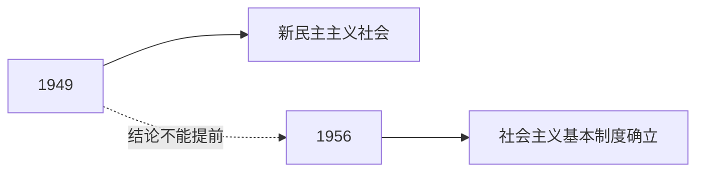

# 04 分模块命题逻辑

> [!abstract] 本笔记导航
> [[考研政治 MOC|总地图]] · [[政治01 总论 · 应试本质]] · [[政治02 选择题方法论]] · [[政治03 材料分析题方法论]] · **04 分模块命题逻辑**（当前） · [[政治05 三层思维法与笔记模板]]
>
> 「命题人视角」不是一套万能键。每个模块的命题习惯不一样：**马原防绝对化，史纲看时间边界与「肯定 + 局限」，新思想用政策目的反推。**

---

## 一、马原：不能用「政治正确猜答案」替代真正理解

这是全套方法里最重要的一个**例外**。

站到出题人角度是对的，但马原尤其**不能**只靠「哪个选项听起来更正能量」。因为马原经常纯粹考哲学关系：

- 物质 与 意识
- 实践 与 认识
- 必然 与 偶然
- 原因 与 结果

这里最重要的是：

> [!important] 马原的判据
> **概念关系严格成立**，而不是政治表态。

所以马原的「出题人视角」应该换成：

> ==**命题人正在考我有没有把辩证关系误解成单向、静止、绝对关系。**==

---

## 二、马原命题人的惯用手法：砍掉辩证关系的一半

教材写的是：

> [!important] 标准表述
> **实践决定认识，认识反作用于实践**

错误选项通常有两种做法：

| 手法 | 错误选项 | 问题 |
|---|---|---|
| 删掉一半 | 「认识对实践没有作用」 | 把**反作用**删掉 |
| 夸成决定 | 「正确认识能够直接决定实践结果」 | 把**反作用**夸成决定作用 |

> [!important] 马原做题核心思维（四步）
> **找关系 → 找主次 → 找条件 → 防绝对化**

---

## 三、史纲：考的是「为什么这条道路可行」

史纲不是普通历史考试。命题人通常不是考：

> ~~某年发生了什么？~~

而是在考：

> [!important] 史纲的真问题
> **为什么某种道路不行，为什么后来那条道路能够成功。**

所以史纲题几乎都可以套进：

> [!important] 通用结构
> **历史任务 → 某种方案 → 局限 → 新方案解决问题**

### 例：辛亥革命

不要只背「1911 年」。你要知道命题人为什么喜欢它：因为它正好能说明两件事——

| 一面 | 另一面 |
|---|---|
| 资产阶级革命有**重大进步意义** | **未完成**反帝反封建任务 |

所以命题人要你形成的认知不是「辛亥革命失败了」，而是：

> ==**既肯定历史贡献，又说明其阶级和历史局限。**==

> [!tip] 这种「肯定 + 局限」结构
> 是史纲非常典型的**命题逻辑**。

---

## 四、史纲的「时间边界」

史纲很多题其实是在考：

> [!important] 一句话
> **历史结论有没有提前或滞后。**

例如 1949 年。如果选项说「社会主义基本制度已经确立」，你要立刻想到 ==**1956**==。因为出题人必须维护教材中的阶段划分：

> [!warning] 这叫「时间边界」
> 政治题里非常重要，尤其史纲选择题。

---

## 五、新思想：政策目的反推法

这是「站到出题人角度」最有价值的地方。

看到一项政策，不要第一时间背定义。先问：

> [!important] 反推第一问
> **国家为什么现在特别强调它？**

---

## 六、示范一：高质量发展

为什么强调？

| | 过去 | 现在 |
|---|---|---|
| 主要解决 | 发展**速度和总量** | 发展==**质量、结构、效率和可持续性**== |

所以材料如果出现：产业升级 · 创新 · 绿色 · 质量 · 效率

你就知道命题人希望的是：

> [!important] 落点
> **高质量发展**

---

## 七、示范二：共同富裕

不要只记定义，问：为什么现在强调？

因为发展之后，问题从 ==**「有没有」**== 进一步变成 ==**「分得是否更合理、机会是否更加公平」**==。

因此只要材料出现：城乡差距 · 公共服务 · 收入分配 · 社会保障 · 区域差距

出题人的潜台词通常是：

> **发展成果如何更公平惠及全体人民**

于是答案往这三个词靠：

> [!important] 落点
> **共同富裕 / 共享发展 / 以人民为中心**

🎯 自测：三模块各记一条做题铁律

| 模块 | 铁律 |
|---|---|
| 马原 | 找关系 → 找主次 → 找条件 → **防绝对化**（警惕被砍掉一半的辩证关系） |
| 史纲 | **肯定 + 局限**；结论不许提前或滞后（时间边界） |
| 新思想 | **政策目的反推**：先问「为什么现在强调它」 |

---

> [!abstract] 继续阅读
> [[政治05 三层思维法与笔记模板]] · [[考研政治 MOC|总地图]]
