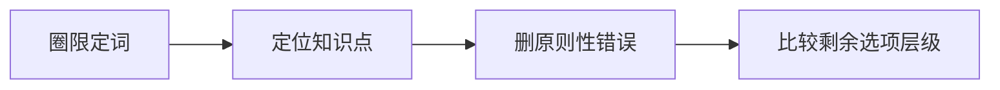
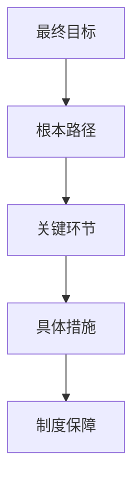
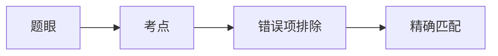

# 06 选择题完整做题方法

> [!abstract] 本笔记导航
> [[考研政治 MOC|总地图]] · [[政治01 总论 · 应试本质]] · [[政治02 选择题方法论|02 速查版]] · [[政治03 材料分析题方法论]] · [[政治04 分模块命题逻辑]] · [[政治05 三层思维法与笔记模板]] · **06 选择题完整做题方法**（当前）
>
> 这一篇是**选择题的总方法论**：从「为什么命题人希望你这样回答」出发的完整算法，含 **13 道真题**（**6 道单选 ＋ 4 道多选 ＋ 3 道单选**）。
> [[政治02 选择题方法论]] 是它的**精简速查版**（只留边界词与坑，考前翻）；本篇是**全量版**（含真题、科目算法、干扰项制造方式、错题标签系统）。

> [!info] 关于真题
> 下面涉及历年真题时，尽量完整保留题干信息、A/B/C/D 选项结构与正确答案，但采用**忠实转述**而非逐字复刻 —— 既能完整训练做题，又能突出真正的命题逻辑。
>
> ==每道题都标了 **【单选】** 或 **【多选】**，答案与解析全部收在折叠块里== —— 先盲做，再点开。

## 目录

| 部分 | 内容 |
|---|---|
| 速览 | 13 道真题一览：年份 · 题型 · 考点 · 所在位置 |
| 一 | 总认识：选择题究竟在考什么 |
| 二 | 最重要的总原则：题干限定 ＞ 教材标准结论 ＞ 一般政治正确 |
| 三 | 政治选择题实际上只有四种判断任务 |
| 四 | **单选题**：七大技巧 + 真题 ①–⑥（全为【单选】） |
| 五 | **多选题**：第一原则 + 七大技巧 + 真题 ⑦–⑩（全为【多选】） |
| 六 | 分科目专属算法（真题 ⑪–⑬，均为【单选】） |
| 七 | 干扰项「十二种标准制造方式」+ 致命词扫描 |
| 八 | 考场算法：单选五步 / 多选六步 / 纠结四问 |
| 九 | 错题本、标签系统与真题三遍法 |
| 十 | 口诀、检查表与总公式 |

---

## 真题速览（13 道）

| # | 年份 | 题型 | 考点 / 陷阱 | 位置 |
|:---:|:---:|:---:|---|---|
| ① | 2026 | **单选** | 生态治理「治本之策」——**层级错位**（措施冒充根本） | 技巧 1 |
| ② | 2019 | **单选** | 「橘生淮南」——**选准不选大** | 技巧 2 |
| ③ | 2024 | **单选** | 厄尔尼诺与偶然性——**程度拔高 / 程度降低** | 技巧 3 |
| ④ | 2026 | **单选** | 遵义会议——**时间错位** | 技巧 4 |
| ⑤ | 2026 | **单选** | 三大战役——**阶段强度**（阶段性成果 ≠ 最终完成） | 技巧 4 |
| ⑥ | 2018 | **单选** | 「白马非马」——共性与个性 | 技巧 6 |
| ⑦ | 2022 | **多选** | 「有多少汤泡多少馍」——尊重客观条件 ≠ 消极等待 | 原则一 |
| ⑧ | 2022 | **多选** | AI 辅助研发新材料——**任意** / 工具 ≠ 认识主体 | 技巧 2 |
| ⑨ | 2022 | **多选** | 共同富裕 2035 目标——**阶段提前** | 技巧 4 |
| ⑩ | 2019 | **多选** | 虚拟现实技术——**底线审查** | 技巧 7 |
| ⑪ | 2021 | **单选** | 历史规律的客观性——偷换规律 / 循环论 / 绝对化 | Ⅰ 马原 |
| ⑫ | 2026 | **单选** | 制度体系中的统领地位——**帽子匹配** | Ⅱ 毛中特 / 新思想 |
| ⑬ | 2022 | **单选** | 南昌起义的历史意义——真史实 + 错时间 | Ⅲ 史纲 |

> [!tip] 怎么用这张表
> **多选集中在前半（⑦–⑩），单选贯穿全篇。** 做完一道就在题型栏打个勾，两轮下来就知道自己哪一类错得多。

---

## 一、总认识：选择题究竟在考什么

考研政治本身就是**政治教育体系的一部分**。因此做题时不要只问：

> ~~「现实中这句话有没有道理？」~~

而应该进一步问：

> [!important] 真正的起手式
> **「在考研政治这套理论体系中，命题人为什么希望我作出这个判断？」**

因此政治选择题的本质不是纯粹的事实判断，而是：

你真正需要训练的是：

> [!important] 一句话
> **把现实语言翻译成考研政治语言。**

---

## 二、最重要的总原则

做任何一道政治选择题，都遵循：

> [!important] 三层优先级（不可倒置）
> **题干限定 ＞ 教材标准结论 ＞ 一般意义上的「政治正确」**

什么意思？假设四个选项里：

- A. 坚持党的领导
- B. 推动高质量发展
- C. 坚持文化自信
- D. 全面依法治国

四句话**全对**。但材料如果讲：

> 数字技术改造传统制造业，提高全要素生产率。

那么命题人显然主要想让你想到 ==**高质量发展 / 创新驱动**==，而不是因为「党的领导最重要」就无条件选 A。

> [!warning] 两条关键区分
> **正确观点 ≠ 正确选项**
> **必须「正确 ＋ 切题」**

---

## 三、政治选择题实际上只有四种判断任务

你看到一道题，先判断它属于哪一种。

| 判断任务 | 它在问 | 重点防 |
|---|---|---|
| **① 概念判断** | A 到底是什么？（国体 / 共同富裕 / 实践） | **概念偷换** |
| **② 地位判断** | 谁是根本、核心、主体、主导、首要？ | **帽子戴错** |
| **③ 因果判断** | 为什么会发生 A？A 说明什么？ | 因果倒置、程度拔高、单因素决定 |
| **④ 历史定位判断** | 谁首次提出？什么事件标志？哪个阶段完成？ | **真知识 ＋ 错时间** |

---

## 四、单选题：七大技巧与真题 ①–⑥

> [!note] 本部分真题题型
> 6 道真题**全部是单选**（每题 1 分）。

先行记住题型结构：仍采用 **16 道单选 ＋ 17 道多选**；单选每题 1 分，多选每题 2 分。

### 4.0 单选题的本质

单选题最容易出现：==**两个甚至三个选项本身都没错**==。真正区分它们的是：

> [!important] 唯一的区分标准
> **谁最精确回答题干。**

所以单选算法是：

---

### 技巧 1：先圈「限定词」

看到下面这些词，**必须减速**：

> [!warning] 单选减速词
> `根本` · `本质` · `核心` · `关键` · `首要` · `基础` · `主要` · `标志` · `首次`

因为命题人经常给你四个 ==**都正确、但地位不同**==的选项。

> [!example] 真题 ①【单选】｜2026 · 生态问题的「治本之策」
> 随着绿色发展理念深入生产和生活，过去很多工业废弃物逐渐通过循环利用变成可利用资源；消费者也越来越多选择外卖不使用一次性餐具、共享单车和一级能效家电。上述变化表明，要从系统上解决生态环境问题，**治本之策**是：
>
> **A.** 进一步优化国土空间开发格局
> **B.** 推动经济发展方式和生活方式发生绿色转变
> **C.** 不断健全生态文明制度体系
> **D.** 加强山水林田湖草沙一体化保护和治理

> [!success]- ✅ 答案与解析 · 点击展开
> **答案：B。**
>
> **命题人到底在考什么？** 题眼不是「生态文明」，而是 ==**治本之策**==。
>
> A、C、D 是不是错？**不是**。它们都是生态文明建设的重要内容。但是：
>
> > [!important] 关键区分
> > **重要措施 ≠ 治本之策**
>
> 材料前半段是「企业改变生产方式」，后半段是「居民改变生活方式」——**命题人已经把 B 写在材料里面了**：
>
> > **材料核心 = 生产方式变化 ＋ 生活方式变化**

---

### 技巧 1 补：分清「目的—根本—关键—措施—保障」

以后见到一道题，可以在脑中画这条链：

命题人最喜欢：==**用一个正确的「措施」冒充「根本」。**==

---

### 技巧 2：选「最精确」，不要选「最大」

考研政治很容易让人产生一种坏习惯：

> ~~越宏大、越政治正确，越可能是答案。~~

错误。很多时候：

> [!important] 反直觉但正确
> **范围越大的选项，反而越不准确。**

> [!example] 真题 ②【单选】｜2019 ·「橘生淮南则为橘」
> 古人说，同一种橘树生长在淮河南边能够结出橘子，移植到淮河北边以后，其果实的性状和味道却发生变化，其原因在于当地水土条件不同。这主要说明：
>
> **A.** 事物的发展变化受到一定时间、地点和条件的制约
> **B.** 事物之间的普遍联系都必须通过中介才能发生
> **C.** 一切具体事物都是普遍联系网络中的一个节点
> **D.** 一切事物的变化发展都表现为一个连续过程

> [!success]- ✅ 答案与解析 · 点击展开
> **答案：A。**
>
> C 错吗？「事物处于普遍联系之中」作为哲学观点当然没错。但题目具体强调的是：
>
> > **水土改变 → 结果改变**
>
> 所以最直接证明的是 ==**条件性**==，而不是泛泛而谈「普遍联系」。
>
> > [!tip] 口诀
> > **单选选小而准，不选大而泛。**

---

### 技巧 3：警惕「正确观点说过头」

> [!warning] 最典型危险词
> `完全` · `唯一` · `全部` · `任何` · `必然` · `彻底` · `同步` · `取代`

注意：==**不是见绝对词必错**==。因为有些教材结论本身就是「实践是认识的**唯一**来源」。

所以真正原则是：

> [!important] 判断标准
> **绝对化表述必须有教材原理明确支撑。**

> [!example] 真题 ③【单选】｜2024 · 厄尔尼诺与偶然性
> 一个地区的气候状态通常受到纬度、海陆位置、地形、大气环流以及洋流等因素共同影响。其中一些条件相对稳定，但大气环流或洋流突然发生异常时，可能诱发厄尔尼诺，并造成大范围极端天气。这说明偶然因素：
>
> **A.** 决定着事物发展的根本方向
> **B.** 对事物发展的实际过程无足轻重
> **C.** 可能成为事物发展中不可忽视的影响因素
> **D.** 本身实际上就是确定不变的必然因素

> [!success]- ✅ 答案与解析 · 点击展开
> **答案：C。**
>
> 可以把四个选项压成：
>
> | 选项 | 实质 |
> |---|---|
> | A | **100%**（拔高为决定） |
> | B | **0%**（贬为无足轻重） |
> | C | **合理作用** ✓ |
> | D | **偷换概念**（偶然 → 必然） |

---

### 技巧 3 补：一根「程度轴」

以后遇到「A 对 B 有什么作用？」，脑中放一根轴：

> [!important] 程度轴（向右递增）
> **无作用 ＜ 影响 ＜ 重要影响 ＜ 决定作用 ＜ 唯一决定**

命题人特别爱：==**把「影响」偷偷升级成「决定」**==。

例如「意识反作用于物质」不能偷换成「**意识决定物质**」。

---

### 技巧 4：看到历史题，先问「发生在什么时候」

史纲选择题最可怕的不是假知识，而是：

> [!warning] 最高频陷阱
> **真知识 ＋ 错时间**

> [!example] 真题 ④【单选】｜2026 · 遵义会议为什么是伟大转折
> 遵义会议纠正了当时党内严重的「左」倾错误，使党和红军逐步走出危机。之所以说它实现了中国共产党历史上生死攸关的转折，最准确的是：
>
> **A.** 在这次会议上完整制定了抗日民族统一战线政策
> **B.** 在这次会议上首次形成马克思主义建党建军基本原则
> **C.** 从此正式开创农村包围城市、武装夺取政权道路
> **D.** 从此开启党独立自主解决中国革命实际问题的新阶段

> [!success]- ✅ 答案与解析 · 点击展开
> **答案：D。**
>
> A、B、C 是不是中国革命史知识？**是**。所以它们特别有迷惑性。错误原因是：
>
> > ==**历史位置错位。**==
>
> 因此：==**史纲不能只背「发生过什么」，必须背「什么时候发生」。**==

#### 史纲六类时间词（出现时宁愿慢 5 秒）

> [!warning] 时间词警报
> `开始` · `标志` · `首次` · `基本完成` · `根本转折` · `正式确立`

> [!example] 真题 ⑤【单选】｜2026 · 三大战役究竟意味着什么
> 1948 年秋以后，中国人民解放军先后发动辽沈、淮海和平津三大战役，经过四个多月作战取得决定性胜利。这一结果最直接说明：
>
> **A.** 国民党的主要军事力量已经基本被摧毁
> **B.** 中国革命的工作重心已经完成由乡村向城市转移
> **C.** 国民党在全国长达二十多年的统治已经在此时彻底覆灭
> **D.** 人民解放军直到此时才具备转入全国战略反攻的条件

> [!success]- ✅ 答案与解析 · 点击展开
> **答案：A。**
>
> 为什么 C 不行？三大战役之后确实==**主要军事力量基本被摧毁**==，但南京国民政府的覆灭==**还有后续历史过程**==。
>
> > [!important] 典型区分
> > **阶段性成果 ≠ 最终完成**

#### 史纲的「阶段强度表」

> [!important] 阶段强度表（向右递增）
> **出现 ＜ 开始 ＜ 形成 ＜ 发展 ＜ 基本完成 ＜ 完成**

题目只支持「开始」，选项却说「完成」→ ==**直接删。**==

---

### 技巧 5：概念不能望文生义

政治术语往往不是普通汉语含义。例如：

`半殖民地` · `半封建` · `人民民主专政` · `社会主义初级阶段` · `共同富裕` · `新民主主义革命`

必须用**教材定义**，而不能==**看字面猜**==。

---

### 技巧 6：马原先找「关系」，不要先看故事

马原材料可以包装成 AI、量子力学、气候、植物、医学、航天、古诗、寓言……但最终高频就是这些关系：

| | 高频辩证关系 |
|---|---|
| 1 | 物质 ↔ 意识 |
| 2 | 规律 ↔ 能动性 |
| 3 | 实践 ↔ 认识 |
| 4 | 共性 ↔ 个性 |
| 5 | 必然 ↔ 偶然 |
| 6 | 真理尺度 ↔ 价值尺度 |
| 7 | 原因 ↔ 结果 |

> [!tip] 口诀
> **先删故事，再找关系。**

> [!example] 真题 ⑥【单选】｜2018 ·「白马非马」
> 古代名辩中有人认为：「马」描述的是形体类别，「白」描述的是颜色；既然命名颜色与命名形体不同，因此「白马」不能等同于「马」。从辩证法角度看，这种观点的主要错误是：
>
> **A.** 把事物的个性完全归结为共性
> **B.** 否认了不同事物之间存在任何差异
> **C.** 割裂了个别与一般、个性与共性的联系
> **D.** 把事物内部的矛盾理解成外部矛盾

> [!success]- ✅ 答案与解析 · 点击展开
> **答案：C**（对应考点：「白马非马」与矛盾普遍性、特殊性关系）。
>
> 表面是古代哲学，实际上：
>
> > **白马 = 个性** ／ **马 = 共性** → ==**割裂共性与个性**==
>
> 故事瞬间消失。

---

### 技巧 7：找「命题人真正希望建立的认知」

这就是「出题人视角」的核心。例如命题人反复出「**改革**」，并不是只让你知道「改革很好」，而是希望你区分：

> [!important] 改革
> **改革 ≠ 否定根本制度**，而是==**制度的自我完善和发展**==

再比如「**共同富裕**」，命题人不只是希望你赞成它，更重要的是排除：

> **共同富裕 ≠ 平均主义**
> **共同富裕 ≠ 同步富裕**

> [!important] 结论
> **政治选择题常常是在考「一个正确立场的边界」。**

> [!question]- 🎯 自测：读出题眼，说出它考哪种判断任务
> | 题眼词 | 判断任务 | 重点防 |
> |---|---|---|
> | 治本之策 / 根本 | 地位判断 | 措施冒充根本 |
> | 主要说明 | 因果判断 | 程度拔高、单因论 |
> | 首次 / 标志 / 基本完成 | 历史定位判断 | 真知识 + 错时间 |
> | 什么是…… | 概念判断 | 概念偷换 |

---

## 五、多选题：第一原则与七大技巧

> [!note] 本部分真题题型
> 4 道真题**全部是多选**（每题 2 分）。多选的关键是**把四个选项当四道独立判断题**，不要做成「组合题」。

### 5.0 多选题必须换脑子

多选题不是「从四个里面找一组最好的」，而是：

> [!important] 本质
> **四道独立的判断题**
>
> A：对 / 错 　 B：对 / 错 　 C：对 / 错 　 D：对 / 错
>
> 最后==**把所有真的组合起来**==。

---

### 原则一：绝对不能猜答案数量

不要想：

> ~~「已经三个了，D 大概就不能选了。」~~
> ~~「ABCD 全选肯定有诈。」~~

2022「有多少汤泡多少馍」的真题就是 **ABCD 全选**。所以：

> [!important] 铁律
> **答案数量没有可靠规律。**

> [!example] 真题 ⑦【多选】｜2022 ·「有多少汤泡多少馍」
> 在推动黄河流域生态保护和高质量发展时，材料强调，要按照水资源实际承载能力决定区域发展、土地利用、人口规模和产业布局，好比吃羊肉泡馍时「有多少汤泡多少馍」，不能脱离水资源条件安排过大的发展规模。这体现：
>
> **A.** 在尊重客观条件的前提下积极创造条件、发挥人的主观能动性
> **B.** 坚持一切从实际出发、实事求是
> **C.** 根据不同地区和不同时间的具体情况采取相应办法
> **D.** 尊重客观规律，同时正确把握事物发展的度

> [!success]- ✅ 答案与解析 · 点击展开
> **答案：ABCD。**
>
> **为什么这题容易错？** 很多人想：「B、C、D 肯定对，A 是不是硬凑的？」但题目不仅要求「不能超出水资源条件」，还要求「在条件范围内合理利用资源、推动发展」。因此：
>
> > [!important] 关键区分
> > **尊重客观条件 ≠ 消极等待** —— 仍需要==**发挥能动性**==。

---

### 技巧 2：一句话 99% 正确，一个词也能把整句毁掉

> [!warning] 逐字扫描
> `任意` · `完全` · `全部` · `永远` · `取代` · `唯一`

> [!example] 真题 ⑧【多选】｜2022 · 人工智能辅助研发新材料
> 人工智能和机器学习可以利用大量数据预测候选材料的物理化学性质，通过描述符生成、模型建立与验证、材料预测和实验验证等过程，提高新材料研发效率。这一过程说明：
>
> **A.** 科学研究能够根据人的需要任意改变物质的性质和结构
> **B.** 随着人工智能发展，机器可以取代人类对物质世界进行认识
> **C.** 人类对客观物质世界的认识能够在实践过程中不断深化
> **D.** 某种具体物质的性质结构发生改变，并不会改变整个世界的物质性

> [!success]- ✅ 答案与解析 · 点击展开
> **答案：CD。**
>
> A 只错一个词：==**任意**== —— 人可以改变物质，但**必须遵循客观规律**。
> B 只错一个核心关系：==**工具 ≠ 认识主体**==。

---

### 技巧 3：警惕「取代论」

命题人非常喜欢这条非法推理：

> **A 越来越重要 → A 取代 B**

| 前提 | 推不出 |
|---|---|
| 数字经济发展 | ~~数字经济取代实体经济~~ |
| 人工智能发展 | ~~人工智能取代人的主体地位~~ |
| 市场发挥决定性作用 | ~~市场取代政府~~ |

---

### 技巧 4：警惕「同步论、同等论」

如果政策目标是==**共同**==，命题人特别喜欢偷换成==**同步**==。

> **共同富裕 ≠ 所有人同一时间达到同一财富水平**
> **区域协调 ≠ 所有地区发展完全一样**

> [!example] 真题 ⑨【多选】｜2022 · 共同富裕 2035 年目标
> 共同富裕是社会主义的本质要求，也是中国式现代化的重要特征。根据当时关于 2035 年远景目标的部署，到 2035 年共同富裕应达到：
>
> **A.** 全体人民共同富裕已经基本实现
> **B.** 全体人民共同富裕取得更加明显的实质性进展
> **C.** 全体人民共同富裕已经全面完成
> **D.** 所有地区和所有社会成员同步实现共同富裕

> [!success]- ✅ 答案与解析 · 点击展开
> **答案：B。**
>
> 这题四个选项本质是==**阶段程度判断**==：
>
> | 选项 | 宣称的程度 |
> |---|---|
> | B | 明显实质性进展 ✓ |
> | A | 基本实现 |
> | C | 全面完成 |
> | D | 同步实现 |
>
> 你必须知道：==**目标是分阶段推进的。**==

---

### 技巧 5：主体范围不能随意扩大

教材说「**中国共产党**具有某种特征」，选项改成「**所有政党**都具有这种特征」→ 立刻警觉。

> [!important] 非法推理
> **特定主体结论 ⇏ 普遍主体结论**

检查选项第一件事其实应该是：==**主语是谁？**==

---

### 技巧 6：阶段性成绩不能偷换成「最终解决」

政治时政题尤其爱：

| 原文 | 偷换成 |
|---|---|
| 取得进展 | **彻底解决** |
| 影响力上升 | **已经取得主导权** |

因此看到这些词要**二次审查**：

> [!warning] 二次审查词
> `最终` · `彻底` · `已经完全` · `普遍` · `全面解决`

---

### 技巧 7：马原可以先做「底线审查」

有些选项不用研究材料就能杀。例如违反以下基本原则：

> [!warning] 马原五条底线
> 1. **世界的本原是物质**
> 2. **意识不能脱离物质独立存在**
> 3. **规律具有客观性**
> 4. **实践是认识发展的动力**
> 5. **人不能任意创造或消灭规律**

出现违反这些底线的话 → ==**直接删。**==

> [!example] 真题 ⑩【多选】｜2019 · 虚拟现实技术
> 虚拟现实技术通过计算机系统创造出具有视觉、听觉乃至动作交互效果的三维环境，使使用者产生沉浸式体验。虚拟现实环境的产生说明：
>
> **A.** 随着虚拟世界形成，物质世界不再具有客观实在性
> **B.** 物质世界可以具有多种多样的具体存在形式
> **C.** 信息已经成为独立于物质和意识之外的第三种基本存在
> **D.** 人可以通过实践创造自然界原来没有的新的现实状态

> [!success]- ✅ 答案与解析 · 点击展开
> **答案：BD。**
>
> - A 直接违反==**物质的客观实在性**==
> - C 直接创造==**第三种哲学本原**==
>
> 因此根本不用纠结。

---

### 技巧 8：有「既……又……」，优先想到辩证统一

比如材料说：「AI 有巨大价值，但必须进行伦理规范。」命题人常考：

> **规律性 ＋ 目的性**　 或　 **真理尺度 ＋ 价值尺度**

而错误选项往往让你**只选一边**。

> [!question]- 🎯 自测：多选八大技巧名，能默出几个
> 1. 四道独立判断题（不是组合题）
> 2. 禁猜答案数量
> 3. 一个词毁掉整句
> 4. 警惕取代论
> 5. 警惕同步论 / 同等论
> 6. 主体范围不能扩大
> 7. 阶段成绩 ≠ 最终解决
> 8. 马原先做底线审查；「既…又…」→ 辩证统一

---

## 六、分科目专属算法

> [!note] 本部分真题题型
> 真题 ⑪–⑬ **均为单选**。

### Ⅰ. 马原：先找「关系」

马原几乎可以形成固定算法：

#### 马原五大高频错误

| # | 错误类型 | 表现 |
|---|---|---|
| 1 | **单因素决定** | A＋B＋C → X 被说成 **A 单独决定 X** |
| 2 | **反作用拔高为决定** | 「社会意识**反作用于**社会存在」→ ~~「社会意识**决定**社会存在」~~ |
| 3 | **否认客观规律** | ~~「人可以任意改变规律」~~ |
| 4 | **割裂两端** | ~~「只有共性，没有个性」~~ |
| 5 | **辩证关系改成静态绝对** | ~~「任何时候矛盾主要方面永远不变」~~ |

> [!example] 真题 ⑪【单选】｜2021 · 为什么可以从历史中吸取经验
> 人类能够研究以往历史，并从历史经验和历史教训中获得对现实的启发，其根本原因在于：
>
> **A.** 历史规律与自然规律完全相同
> **B.** 人类社会的发展存在不以人的主观意志为转移的客观规律
> **C.** 历史始终以完全相同的形式循环重演
> **D.** 人类目前已经彻底掌握了所有社会历史规律

> [!success]- ✅ 答案与解析 · 点击展开
> **答案：B。**
>
> 三个错误选项几乎覆盖三类经典陷阱：
>
> | 选项 | 陷阱 |
> |---|---|
> | A | **偷换两种规律** |
> | C | **循环论** |
> | D | **「完全掌握」绝对化** |

---

### Ⅱ. 毛中特 / 新思想：核心是「地位词 ＋ 政策边界」

这部分不要只背「是什么」，尤其要背：

> [!important] 四问
> **是什么 ＋ 为什么 ＋ 什么地位 ＋ 不能等于什么**

| 概念 | 必须记住的帽子 |
|---|---|
| 高质量发展 | **首要任务** |
| 创新 | 第一动力等相应规范表述 |
| 公有制经济 | **主体** |
| 国有经济 | **主导力量** |
| 人民代表大会制度 | **根本政治制度** |
| 党的领导制度 | 中国特色社会主义制度体系中具有**统领地位** |
| 改革 | 强大动力 / 制度自我完善发展 |
| 教育科技人才 | **基础性、战略性支撑** |

> [!example] 真题 ⑫【单选】｜2026 · 哪项制度具有统领地位
> 在中国特色社会主义制度体系中，处于统领地位的是：
>
> **A.** 民族区域自治制度
> **B.** 党的领导制度
> **C.** 社会主义基本经济制度
> **D.** 全过程人民民主相关制度体系

> [!success]- ✅ 答案与解析 · 点击展开
> **答案：B。**
>
> 这题没有复杂逻辑，就是==**帽子匹配**==。所以这部分复习必须建立：==**名词—地位表**==。

---

### Ⅲ. 史纲：时间轴 ＋ 主体 ＋ 意义强度

史纲做题固定检查四件事：

> [!important] 史纲四查
> **时间 ＋ 主体 ＋ 历史任务 ＋ 意义程度**

尤其：==**「正确的史实放在错误的时间」是最高频陷阱之一。**==

> [!example] 真题 ⑬【单选】｜2022 · 南昌起义
> 大革命失败后，中国共产党认识到没有革命武装就不能战胜武装反革命。南昌起义打响了武装反抗国民党反动派的第一枪。它最重要的历史意义是：
>
> **A.** 标志着党正式开始实施土地革命和武装起义总方针
> **B.** 标志着无产阶级领导的新型人民军队已经完成建设
> **C.** 标志着工农武装割据道路已经正式形成
> **D.** 标志着党独立领导革命战争、创建人民军队和武装夺取政权的开端

> [!success]- ✅ 答案与解析 · 点击展开
> **答案：D。**
>
> A 对应「八七会议后的相关部署」，B、C 也涉及后续不同阶段。所以：
>
> > ==**四个选项都是革命史语言，只有一个时间对应。**==

---

### Ⅳ. 思修法治：最容易考「层次错位」

例如价值层面：**国家层面 / 社会层面 / 个人层面**；又如：道德 / 法律 / 理想 / 爱国 / 人生价值。

不要因为词听起来都很好就选。核心是：

> [!important] 判据
> **材料在谈哪一个层面。**

---

### Ⅴ. 时政：事实 ＋ 官方定位

时政选择题不能主要靠逻辑推，必须记：

> [!important] 五要素
> **事件 ＋ 时间 ＋ 地点 ＋ 主体 ＋ 官方定位**

尤其注意这些表述：`首次` · `最大` · `主题` · `通过` · `发布`。

---

## 七、干扰项「十二种标准制造方式」

> [!important] 整篇最值得背的一张表
> 十二种制造方式，考前过一遍。

| # | 类型 | 命题人怎么骗你 | 例子 |
|---|---|---|---|
| ① | **绝对化** | 重要 → 唯一 | 「完全决定」 |
| ② | **程度拔高** | 影响 → 决定 | 偶然性决定趋势 |
| ③ | **程度降低** | 重要影响 → 没有作用 | 偶然性可忽略 |
| ④ | **主体扩大** | 某主体 → 所有主体 | 「所有政党」 |
| ⑤ | **范围扩大** | 部分 → 全部 | 「一切领域」 |
| ⑥ | **时间错位** | 真知识放错时期 | 遵义会议套其他事件 |
| ⑦ | **阶段提前** | 正在推进 → 已经完成 | 共同富裕全面实现 |
| ⑧ | **层级错位** | 措施 → 根本 | 制度保障冒充治本 |
| ⑨ | **因果倒置** | A→B 变成 B→A | 经济基础 / 上层建筑 |
| ⑩ | **单因论** | 多因素 → 一个因素 | 树叶只由外部决定 |
| ⑪ | **取代论** | A 发展 → A 消灭 B | AI 取代人 |
| ⑫ | **正确但无关** | 话没错但没回答题干 | 单选最危险 |

### 致命词扫描：不要匀速读选项

> [!warning] 🔴 红灯词（看到就问：教材真的支持这么强的结论吗）
> `任意` · `完全` · `一切` · `任何` · `唯一` · `彻底` · `同步` · `同等` · `取代` · `最终`

> [!tip] 🟡 黄灯词（不是错误，而是提示「此处正在考帽子」）
> `根本` · `核心` · `主体` · `主导` · `决定` · `首要` · `基础` · `关键`

---

### 为什么「站在出题人角度」特别有效

因为命题人的任务不是随机写四句话。他必须制造：

> **1 个正确项 ＋ 3 个「看起来像正确答案」的干扰项**

所以你看到正确项以后，进一步问：

> [!question] 自问
> **如果我是命题人，我怎样把它改一个字变成错项？**

| 原结论 | 命题人制造的错项 |
|---|---|
| 共同富裕 | **同步**共同富裕 |
| 市场起决定性作用 | 市场解决**一切**问题 |
| 意识具有能动作用 | 意识**决定**物质 |
| 科技越来越重要 | 科技**决定社会一切**发展 |

训练到最后，你应该能：==**看到材料以后预判错误选项。**==

### 「命题人为什么想让我选这个？」的三层回答

每次刷题都可以问三层：

| 层 | 问 | 例 |
|---|---|---|
| **第一层：知识层** | 这道题考什么？ | 实践与认识 |
| **第二层：边界层** | 它希望我**不要**误解成什么？ | 发挥主观能动性 ≠ 任意改变客观规律 |
| **第三层：政治教育层** | 为什么教材特别强调这个边界？ | 改革：既要建立「改革必要」，又要建立「改革不是根本制度替代」 |

所以你理解命题立场以后，很多错误项甚至可以**预判**。

### 限制：政治选择题不能只靠「政治立场猜题」

比如 A. 坚持党的领导 / B. 高质量发展，二者都符合考试体系。因此不能：

> ~~「A 地位最高，所以永远选 A。」~~

必须遵守：==**题干限定 ＞ 一般政治立场**==。

所以「命题人思维」的正确用法是：

> **知识基础 ＋ 命题逻辑**，而不是==**猜命题人喜欢哪句话**==。

---

## 八、考场算法

### 单选五步算法

| Step | 动作 | 例 |
|---|---|---|
| 1 | **圈题眼** | 根本 / 主要 / 说明 / 原因 / 首次 / 标志 |
| 2 | **删掉材料外壳** | 「厄尔尼诺」→ 翻译为「偶然因素影响发展」 |
| 3 | **定位教材命题** | 必然性与偶然性 |
| 4 | **删除原则性错误** | 「偶然性决定根本趋势」→ 删 |
| 5 | **在剩余正确观点中选最切题** | 精确匹配 |

### 多选六步算法

| Step | 动作 |
|---|---|
| 1 | 先判断：考哪个知识模块 |
| 2–5 | A / B / C / D **分别独立判断** |
| 6 | 重新检查：**主体 ＋ 范围 ＋ 程度 ＋ 时间**，最后组合 |

### 多选最大的错误习惯：把它做成「组合题」

> [!danger] 错误方法
> ~~「我感觉答案应该是 ABC。」~~ 然后你会下意识去**证明** ABC。

> [!important] 正确方法
> **A ＝ ✓/✗　B ＝ ✓/✗　C ＝ ✓/✗　D ＝ ✓/✗** → 最后再组合。

### 两个选项纠结怎么办？固定问四个问题

| # | 问 |
|---|---|
| ① | 谁**更直接**回答题干？ |
| ② | 谁的**范围**更准确？ |
| ③ | 谁有没有偷偷**升级程度**？ |
| ④ | 谁用了教材明确的**固定表述**？ |

单选中，通常==**精确教材表述**==胜过==**宽泛正确观点**==。

---

## 九、错题本、标签系统与真题三遍法

### 错题必须区分两种类型

| 类型 | 表现 | 解决方法 |
|---|---|---|
| **A 类：知识不会** | 不知道南昌起义的历史意义 | ==**回教材背**== |
| **B 类：知识会，但被干扰项骗** | 知道共同富裕不能平均主义，却仍选「同步实现共同富裕」 | ==**记录「同步」这个陷阱**==，而不是重背整章 |

> [!warning] 两类错误绝对不要混
> A 类（知识不会）要**回去背**；B 类（被干扰项骗）要**回去记陷阱**。二者的复习动作完全不同。

### 错题本应该长这样

不要只写「2022 第 5 题 B」。应该写：

| 项 | 内容 |
|---|---|
| 【错题】 | 共同富裕 2035 目标 |
| 【题型】 | 多选 |
| 【正确答案】 | B |
| 【我的错误】 | 选 A |
| 【我为什么错】 | 把「取得明显实质性进展」误判为「基本实现」 |
| 【命题陷阱】 | **阶段程度提前** |
| 【以后看到什么报警】 | `基本` · `全面` · `同步` · `彻底` |

> [!tip] 只有这种错题本才有用
> 记「命题陷阱」而不只记「我选错了」，下一次才不会在同一种制造方式上再错。

### 错误选项标签系统

以后错题旁边只需要标代码：

| 代码 | 陷阱 | 代码 | 陷阱 |
|---|---|---|---|
| **J1** | 绝对化 | **J7** | 帽子错配 |
| **J2** | 程度拔高 | **J8** | 因果倒置 |
| **J3** | 主体扩大 | **J9** | 单因论 |
| **J4** | 范围扩大 | **J10** | 取代论 |
| **J5** | 时间错位 | **J11** | 正确但无关 |
| **J6** | 阶段提前 | **J12** | 望文生义 |

刷几十道之后统计一下，就是**诊断书**：

| 统计结果 | 说明什么 |
|---|---|
| J5 特别多 | 史纲**时间轴**差 |
| J11 特别多 | 你经常选「正确但不切题」 |
| J2 特别多 | 你对**程度词**不敏感 |

这比单纯统计正确率有用得多。

### 刷真题的正确顺序：三遍

> [!warning] 不要
> ~~做一遍 → 对答案 → 结束~~

| 遍 | 做法 | 测什么 |
|---|---|---|
| **第一遍** | 正常做 | **知识水平** |
| **第二遍** | 研究错误项：命题人是如何从正确理论制造这个错误选项的？ | **命题理解** |
| **第三遍** | 只看题干，**预测陷阱**（题干出现「共同富裕」→ 自己先写「同步富裕」「平均主义」），再看选项 | **命题预测能力** |

> [!tip] 本篇的折叠设计正是为这三遍服务的
> 题干与选项**始终可见**，答案与解析**折叠**——第一遍盲做可以直接在这里做，不用另找题。

这才是真题的最高价值。

> [!question]- 🎯 自测：三种统计结果分别说明什么
> - J5 多 → 史纲时间轴差
> - J11 多 → 常选「正确但不切题」
> - J2 多 → 对程度词不敏感

---

## 十、口诀、检查表与总公式

### 各科口诀

> [!important] 马原
> **先找关系，再看故事。**
> **找决定作用，别忘反作用。**
> **防单因、防绝对、防主观决定客观。**

> [!important] 毛中特 / 新思想
> **先找帽子，再看政策。**
> 重点词：`根本` · `首要` · `核心` · `主体` · `主导` · `基础` · `保障`

> [!important] 史纲
> **真史实 ＋ 错时间 ＝ 错。**
> 重点：**谁 ＋ 什么时候 ＋ 做什么 ＋ 标志什么**

> [!important] 思修法治
> **先定价值层级，再选对应概念。**

> [!important] 时政
> **时间 ＋ 主体 ＋ 事件 ＋ 官方定位。**

---

### 考场最后一张检查表

**做完一道单选，快速问：**

| # | 自问 |
|---|---|
| ① | 题干到底问什么？ |
| ② | 有没有根本 / 首要 / 关键等限定？ |
| ③ | 这个选项本身正确，还是「在这里」正确？ |
| ④ | 有没有程度扩大？ |
| ⑤ | 有没有时间、主体、层级偷换？ |

**做完一道多选，再问：**

| # | 自问 |
|---|---|
| ①–④ | A / B / C / D 是否**独立**成立？ |
| ⑤ | 有没有**一个词**把整句毁掉？ |

---

### 最终总公式

> [!important] 单选
> **题干限定 → 考点定位 → 教材边界 → 干扰项排除 → 选择最精确项**

> [!important] 多选
> **定位考点 → A/B/C/D 分别判定 → 扫描致命词 → 检查主体范围程度时间 → 组合**

> [!important] 更高一级的「命题人视角」
> 不要只问：**为什么这个答案对？**
> 还要问：**命题人为什么希望我形成这个认识？**
> 以及：**他怎样把这个正确认识改一个词，制造成错误选项？**

最终你应该训练到：材料刚读完、选项还没看，你已经大概知道正确理论是什么，甚至能够预测命题人会拿「同步、完全、唯一、取代、决定、已经完成」等词来骗你。

到这个阶段，考研政治选择题就不再是「背了多少就会多少」，而变成：

> [!important] 三者共同决定正确率
> **知识储备 ＋ 命题逻辑 ＋ 语言边界判断**

---

> [!tip] 下一步
> 拿近 10 年真题按这套方法**逐年拆**：每一道不仅标正确答案，还标记它属于哪一种「干扰项制造方式」。
> 这样最后会形成你自己的==**命题人陷阱统计表**==。

---

> [!abstract] 继续阅读
> [[政治02 选择题方法论|02 速查版]] · [[政治03 材料分析题方法论]] · [[政治04 分模块命题逻辑]] · [[考研政治 MOC|总地图]]
