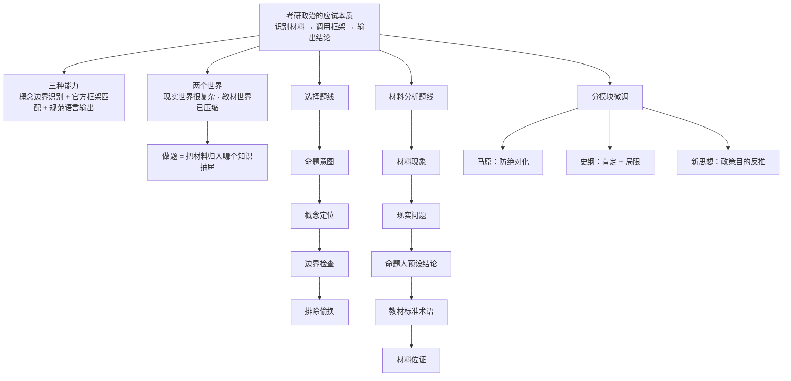

# 考研政治 · 命题人视角 MOC

> [!important] 🧭 全场最高的一个提问
> **不要只问「正确答案是什么」，而要问「为什么在这套考试体系里，它必须成为正确答案」。**

> [!info] 专题定位
> 本专题把考研政治从「大量零散背诵」改造成一套**逆向命题人思维**：先认命题逻辑 → 再加速判断。
> 它不替代知识点，而是给知识点装上**检索路径**与**判卷规则**。
>
> 两层用法，正好对应我们常说的「透过现象看本质」：
> **考场外** —— 你分析这套政治叙事为什么存在；
> **考场内** —— 你利用对这套叙事目标的理解，高效预测命题人需要的答案。

> [!abstract] 三条铁律（读完整套只留三句的话）
> 1. 政治考的是**识别题目在调用哪条理论**，不是现场创造答案。
> 2. 数学是**结果由逻辑推出**；政治是**结果先存在于理论体系中**。
> 3. 所以政治的核心动作不是「回答」，而是 ==**分类**==。

---

## 专题索引（建议阅读顺序）

| 顺序 | 文件 | 一句话定位 |
|:---:|---|---|
| 0 | **本页** | 总地图：为什么这么做、读哪篇、总公式在哪 |
| 1 | [[政治01 总论 · 应试本质]] | 政治到底在考什么：三种能力、两个世界、体系一致性原则 |
| 2 | [[政治02 选择题方法论]] | 两类陷阱、关键词配对、逆向制度审查、反定义清单 |
| 3 | [[政治03 材料分析题方法论]] | 官方语言翻译题：动词表、四步法、结论先行 |
| 4 | [[政治04 分模块命题逻辑]] | 马原 / 史纲 / 新思想各自的命题习惯 |
| 5 | [[政治05 三层思维法与笔记模板]] | 把知识点改造成「命题人视角笔记」的模板与总公式 |

---

## 全景：这套方法长什么样

---

## 三句话理解整套逻辑

> [!question] 为什么要「站到出题人角度」
> 因为一道政治题有两个世界。**现实世界**可以讨论几十件事；**教材世界**已经把现实压缩成某种矛盾、某条规律、某项制度、某个政策目标、某种历史结论。
> 考试不是让你重新研究现实，而是问：**这个现实材料应该被归入教材里的哪个框？**

> [!warning] 唯一红线：别把「出题人思维」变成纯猜题
> 正确顺序是 **知识 → 理解命题逻辑 → 提高判断速度**。
> 绝不能反过来：~~我觉得国家应该支持这个 → 所以选它~~。
> 政治题里经常有两个选项政治方向都完全正确，但只有一个回答题目。
> ==**题干限定 > 一般政治正确。**==

> [!tip] 复习时怎么用它
> 每学一个知识点，就地补一张 [[政治05 三层思维法与笔记模板|命题人视角笔记]]：表层知识 / 现实问题 / 希望建立的认识 / 常见材料 / 答题关键词 / 常见错误 / 边界。
> 这比「知识点摘抄」有效得多。

---

> [!abstract] 继续阅读
> [[政治01 总论 · 应试本质]]
