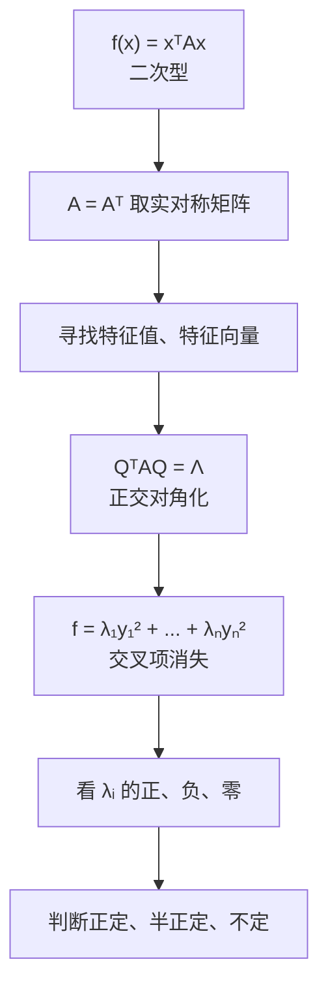

# 二次型（本质理解）

> [!info] 归属
> 线代大观 · 二次型专题 · **本质理解篇**。这是整个线代知识网的**汇合点**：把 [[相似对角化与实对称矩阵（本质理解）]]、[[特征值与特征向量（核心思想）]]、[[半定矩阵（本质理解）]]、[[矩阵的秩（本质直觉）]] 全部收拢在一起。

> [!important] 核心一句话（全文总纲）
> $$\boxed{\text{二次型}}\longleftrightarrow\boxed{\text{实对称矩阵}}\longleftrightarrow\boxed{\text{正交对角化}}\longleftrightarrow\boxed{\text{特征值}}\longleftrightarrow\boxed{\text{正定性}}$$
> 二次型本质上是在研究：**一个实对称矩阵在不同方向上，对向量产生多大的"平方量"，以及这些方向上这个量是正、负还是零。**
> 而所谓"化二次型为标准形"，本质就是：
> $$\boxed{\text{找到一组最自然的坐标轴，把各个方向之间的交叉干扰消掉}}$$

---

## 一、二次型到底是什么？

最简单的二次型，比如 $f(x_1,x_2)=x_1^2+2x_1x_2+3x_2^2$，特点是每一项都是变量的**二次项**。推广到 $n$ 个变量：
$$f(x_1,\cdots,x_n)=\sum_{i,j}a_{ij}x_ix_j.$$
但线性代数真正重要的一步，是把它写成矩阵形式：
$$\boxed{f(x)=x^TAx}$$
其中 $A$ 可以取成一个**实对称矩阵**。

例如 $f(x_1,x_2)=2x_1^2+2x_1x_2+3x_2^2$ 对应
$$A=\begin{pmatrix}2&1\\1&3\end{pmatrix},$$
因为
$$x^TAx=\begin{pmatrix}x_1&x_2\end{pmatrix}\begin{pmatrix}2&1\\1&3\end{pmatrix}\begin{pmatrix}x_1\\x_2\end{pmatrix}=2x_1^2+2x_1x_2+3x_2^2.$$

> [!warning] 考研特别容易丢分的地方
> $$\boxed{x_1x_2\text{ 的系数}\ =\ 2a_{12}}$$
> 所以看到 $6x_1x_2$，矩阵里对应的是 $a_{12}=a_{21}=3$（注意**对半分**）。

---

## 二、为什么二次型一定要和"实对称矩阵"联系起来？

因为在 $x^TAx$ 中，$a_{ij}$ 和 $a_{ji}$ 最终都会乘到同一个 $x_ix_j$ 上。例如二维 $A=\begin{pmatrix}a&b\\c&d\end{pmatrix}$，那么
$$x^TAx=ax_1^2+(b+c)x_1x_2+dx_2^2.$$
你会发现真正起作用的是 $b+c$，而不是分别的 $b,c$。所以完全可以把它改写成对称矩阵：
$$\begin{pmatrix}a&\frac{b+c}{2}\\\frac{b+c}{2}&d\end{pmatrix}.$$

> [!important] 因此研究二次型时，我们总可以只研究 $A=A^T$
> 这一步非常关键，因为你上一问已经知道：**实对称矩阵一定能够正交对角化**，于是二次型就有救了。

---

## 三、二次型真正让我们头疼的是什么？——交叉项

例如 $f(x_1,x_2)=2x_1^2+2x_1x_2+2x_2^2$ 中，$2x_1x_2$ 把 $x_1,x_2$ 两个方向纠缠在了一起。如果没有交叉项，比如 $f=3y_1^2+y_2^2$，就特别好理解：在 $y_1$ 方向对应系数 $3$，$y_2$ 方向对应系数 $1$，两个方向互不干扰。

> [!important] 化二次型的根本目标
> $$\boxed{\text{想办法消掉 }x_ix_j\ (i\ne j)\text{ 这样的交叉项}}$$
> 使它变成
> $$\boxed{f=\lambda_1y_1^2+\lambda_2y_2^2+\cdots+\lambda_ny_n^2}$$
> 这就是所谓的**标准形**。

---

## 四、为什么换坐标能够消掉交叉项？——最关键的一步

原来 $f(x)=x^TAx$。现在做变量替换 $\boxed{x=Cy}$（$C$ 可逆），那么
$$f=x^TAx=(Cy)^TA(Cy)=y^TC^TACy.$$
所以换元之后，二次型对应的矩阵从 $A$ 变成了
$$\boxed{C^TAC}.$$
于是我们真正的问题变成：**能不能选择一个合适的 $C$，使得 $C^TAC$ 变成对角矩阵？** 如果能，那么二次型就没有交叉项了。

---

## 五、这里一定要和"相似对角化"区别开

你上一问刚学过：线性变换换基时出现的是 $P^{-1}AP$（**相似变换**）。但是二次型换元出现的是 $C^TAC$（**合同变换**）。所以一定记住：
$$\boxed{ \begin{aligned} \text{矩阵相似：}&\quad P^{-1}AP,\\ \text{二次型换元：}&\quad C^TAC. \end{aligned}}$$

> [!note] 为什么不一样？
> 因为二次型有两个 $x$：$x^TAx$。代入 $x=Cy$ 以后，一个 $C$ 出现在右边，另一个自然因为转置出现在左边：$(Cy)^T=y^TC^T$。于是必然得到 $C^TAC$。**这不是人为规定出来的，而是从 $x^TAx$ 自然算出来的。**

---

## 六、实对称矩阵为什么让这一切突然变简单？

因为 $A$ 是实对称矩阵，所以一定存在正交矩阵 $Q$，使 $\boxed{Q^TAQ=\Lambda}$，其中 $\Lambda=\mathrm{diag}(\lambda_1,\ldots,\lambda_n)$。现在令 $x=Qy$，于是
$$f(x)=x^TAx=y^TQ^TAQy=y^T\Lambda y.$$
因此：
$$\boxed{f=\lambda_1y_1^2+\lambda_2y_2^2+\cdots+\lambda_ny_n^2}$$
交叉项全部消失。

> [!important] 特别重要的事实
> $$\boxed{\text{二次型正交化后的各平方项系数，就是对应实对称矩阵的特征值}}$$

---

## 七、这就是二次型最核心的"本质"

原来的二次型可能长这样 $2x_1^2+2x_1x_2+2x_2^2$，两个变量纠缠在一起。对应矩阵 $A=\begin{pmatrix}2&1\\1&2\end{pmatrix}$，特征值是 $3,\ 1$，对应两个相互正交的特征方向 $\begin{pmatrix}1\\1\end{pmatrix},\ \begin{pmatrix}1\\-1\end{pmatrix}$。单位化后取 $q_1=\frac1{\sqrt2}\begin{pmatrix}1\\1\end{pmatrix},\ q_2=\frac1{\sqrt2}\begin{pmatrix}1\\-1\end{pmatrix}$，令 $Q=(q_1,q_2)$，那么 $Q^TAQ=\begin{pmatrix}3&0\\0&1\end{pmatrix}$，换坐标后：
$$\boxed{f=3y_1^2+y_2^2}$$

什么意思？原来的 $x_1,x_2$ 其实并不是这个二次型最自然的两个方向。真正天然的方向是 $x_1=x_2$ 和 $x_1=-x_2$，只不过原坐标轴没沿着这两个方向放，所以出现了 $x_1x_2$ 交叉项。一旦把坐标轴旋转到正确方向：
$$\boxed{\text{交叉项自然消失}}$$

> [!tip] 理解交叉项的根源
> 交叉项**不是二次型本身一定"复杂"**，而往往是你选择的坐标轴没有沿着它的天然方向。这和你上一问理解相似对角化时的思想完全一样。

---

## 八、特征向量和特征值在二次型里分别意味着什么？

对于 $Aq_i=\lambda_iq_i$（$q_i$ 是单位特征向量），如果我们只沿着 $q_i$ 方向取 $x=tq_i$，那么
$$x^TAx=(tq_i)^TA(tq_i)=t^2q_i^TAq_i=t^2q_i^T(\lambda_iq_i)=\lambda_it^2.$$
所以沿着特征向量方向，二次型变成最简单的 $\boxed{\lambda_it^2}$。

> [!important] 含义
> $$\boxed{\text{特征向量告诉你二次型的天然方向}}$$
> $$\boxed{\text{特征值告诉你这个方向上二次型的正负和大小}}$$
> 这就是为什么二次型和特征值结合得如此紧密。

---

## 九、为什么二次型最终特别关心"正、负、零"？

因为平方 $y_i^2\ge0$。标准形 $f=\lambda_1y_1^2+\cdots+\lambda_ny_n^2$ 中，真正决定性质的是 $\lambda_i$ 的**符号**：

| 特征值情况 | 二次型性质 | 含义 |
|-----------|-----------|------|
| 所有 $\lambda_i>0$ | **正定** | 只要 $y\ne0$ 一定有 $f>0$ |
| 所有 $\lambda_i\ge0$ | **半正定** | $f\ge0$，可能有非零向量使 $f=0$ |
| 既有正又有负（如 $f=y_1^2-y_2^2$） | **不定** | 有时 $f>0$，有时 $f<0$ |

于是我们刚学的半正定矩阵就自然出来了：
$$\boxed{A\text{ 半正定} \iff x^TAx\ge0 \iff \lambda_i\ge0}$$

> [!note] 正定矩阵实际上就是从二次型的角度定义出来的。

---

## 十、零特征值意味着什么？

例如 $f=3y_1^2+2y_2^2+0y_3^2$。如果我们沿着 $y_3$ 方向移动（$y_1=y_2=0,\ y_3\ne0$），仍然有 $f=0$。也就是说这个二次型在 $y_3$ 方向上"完全不起作用"。矩阵角度看就是 $\lambda_3=0$。

> [!note] 与半正定衔接
> 你之前理解半正定时说的"存在一个被压成零的方向"，现在在二次型里变成：
> $$\boxed{\text{存在一个非零方向，使二次型恒等于 }0}$$

---

## 十一、二次型的秩到底是什么？

假设标准形为 $f=\lambda_1y_1^2+\cdots+\lambda_ry_r^2$，其中 $\lambda_1,\ldots,\lambda_r\ne0$，剩下系数全为 $0$。那么二次型的秩就是 $\boxed{r}$，这其实就是矩阵 $A$ 的秩：
$$\boxed{r(f)=r(A)}$$

> [!tip] 本质理解
> 秩告诉你这个二次型真正"有效"的独立方向有几个。如果一个三元二次型最后变成 $y_1^2+2y_2^2$ 而完全没有 $y_3^2$，那么虽然有三个变量，但真正有效的方向只有两个，所以 $r=2$。

> [!note] 衔接 [[矩阵的秩（10条性质）]]
> 第⑩条"可相似对角化 ⟹ 秩 = 非零特征值个数"，与这里"二次型秩 = 非零系数个数"完全一致。

---

## 十二、标准形和规范形有什么区别？

> [!warning] 考研这里经常容易混

- **标准形**：经过变换后得到 $d_1y_1^2+d_2y_2^2+\cdots+d_ry_r^2$，**没有交叉项**。例如 $3y_1^2-5y_2^2+2y_3^2$。
- **规范形**：进一步把非零系数都化成 $1$ 或 $-1$，得到 $z_1^2+\cdots+z_p^2-z_{p+1}^2-\cdots-z_r^2$。例如令 $z_1=\sqrt3y_1,\ z_2=\sqrt5y_2,\ z_3=\sqrt2y_3$，把 $3y_1^2-5y_2^2+2y_3^2$ 变成 $\boxed{z_1^2-z_2^2+z_3^2}$。

> [!important] 规范形最终只保留三种信息
> $$+1,\qquad -1,\qquad 0$$
> 到了最本质的层面，我们并不在乎原来的系数究竟是 $3$、$100$ 还是 $0.2$，而特别关心：
> $$\boxed{\text{有多少个正方向、多少个负方向、多少个零方向}}$$

---

## 十三、为什么不同方法得到的标准形系数可能不一样？

假设使用**正交变换** $x=Qy$，那么 $Q^TAQ=\Lambda$，标准形系数一定就是矩阵的特征值 $\lambda_1,\ldots,\lambda_n$。但如果使用一般的**可逆线性替换**（如配方法），本质是 $x=Cy$，此时 $C^TAC=D$ 虽然也是对角矩阵，但它的对角元**不一定等于特征值**。

为什么？因为一般情况下 $C^T\ne C^{-1}$——这是**合同变换**，不是相似变换。

> [!important] 但有一个东西不会变
> $$\boxed{\text{正项的个数、负项的个数、零项的个数不会变}}$$
> 因此，不管你用配方法还是正交变换，只要过程正确，最后关于正负项数量的结论一定相同。这也是为什么**正定性不会因为换元而改变**。

---

## 十四、配方法的本质又是什么？

比如 $f=x_1^2+2x_1x_2+2x_2^2$，我们会配方：
$$f=(x_1+x_2)^2+x_2^2.$$
令 $y_1=x_1+x_2,\ y_2=x_2$，就得到 $f=y_1^2+y_2^2$。

表面看是在"配平方"，但从矩阵角度看，你其实是在做**一次可逆的线性变量替换**，从而把 $A$ 通过 $C^TAC$ 变成对角矩阵。

> [!important] 配方法不是另一个独立知识点
> 它只是寻找合适坐标的一种具体算法。正交变换也是寻找合适坐标。**二者目标一样：消掉交叉项。只是选坐标的方法不同。**

---

## 十五、为什么正交变换尤其漂亮？

因为 $Q^TQ=E$。令 $x=Qy$，则
$$x^Tx=y^TQ^TQy=y^Ty,$$
也就是 $\boxed{\|x\|=\|y\|}$。所以正交变换只是坐标轴的旋转或方向改变，并没有把坐标系拉伸变形。

> [!tip] 重要理解
> 利用实对称矩阵的特征向量做正交变换，可以理解成：**我们只是把坐标轴转到二次型真正天然的方向上，然后交叉项就消失了。** 这个思想比"机械算特征值"重要得多。

---

## 十六、把二次型和你前面的知识完整串起来

> [!important] 完整逻辑链
> $$\boxed{f(x)=x^TAx}\ \Rightarrow\ \boxed{A=A^T}\ \Rightarrow\ \boxed{\text{寻找特征值、特征向量}}\ \Rightarrow\ \boxed{Q^TAQ=\Lambda}\ \Rightarrow\ \boxed{f=\lambda_1y_1^2+\cdots+\lambda_ny_n^2}\ \Rightarrow\ \boxed{\text{看 }\lambda_i\text{ 的正负零}}\ \Rightarrow\ \boxed{\text{判断正定、半正定、不定}}$$
> - **特征向量**告诉你应该把坐标轴放在哪里；
> - **特征值**告诉你沿这些方向二次型是什么性质；
> - **正定、半正定、不定**就是在研究这些特征值的符号。

---

## 十七、最后给你一个真正值得记住的"本质图像"

以后不要把 $x_1^2+4x_1x_2+7x_2^2$ 看成"好多需要配方的项"，你应该立刻想到 $\boxed{x^TAx}$，然后问三个问题：

> [!important] 二次型三问
> **第一问**：这个二次型真正天然的方向在哪里？——答案由 $\boxed{\text{特征向量}}$ 告诉你。
> **第二问**：在每个天然方向上，它的作用是正的、负的还是零？——答案由 $\boxed{\text{特征值}}$ 告诉你。
> **第三问**：为什么会出现交叉项？——因为当前的 $x_1,x_2,\ldots,x_n$ 坐标轴没有沿着这些天然方向。一旦换到天然坐标：
> $$\boxed{x^TAx\longrightarrow\lambda_1y_1^2+\cdots+\lambda_ny_n^2}$$
> 整个结构就暴露出来了。

> [!important] 最终压缩成一句
> $$\boxed{\text{二次型就是用实对称矩阵描述"不同方向上的平方作用"；化标准形，就是寻找它的天然坐标轴}}$$

> [!tip] 至此，整个知识网成形
> 你目前学过的相似对角化、实对称矩阵、二次型、正定矩阵，到这里已经完全连成了一张知识网。

## 相关链接

- [[线代大观 MOC]]
- [[相似对角化与实对称矩阵（本质理解）]]（$Q^TAQ=\Lambda$ 与 $A=Q\Lambda Q^T$ 的基础）
- [[半定矩阵（本质理解）]]（正定/半正定由特征值符号决定）
- [[特征值与特征向量（核心思想）]]（特征方向与伸缩倍数）
- [[矩阵的秩（本质直觉）]]（二次型秩 = 有效独立方向数）
- [[矩阵的秩（10条性质）]]（第⑩条"秩 = 非零特征值个数"）
- [[🌟A可逆的等价命题]]（正定 ⟹ 可逆）
- [[可对角化矩阵]]（教材级长笔记）
- [[🧵3.矩阵和向量组]]（教材级长笔记）
