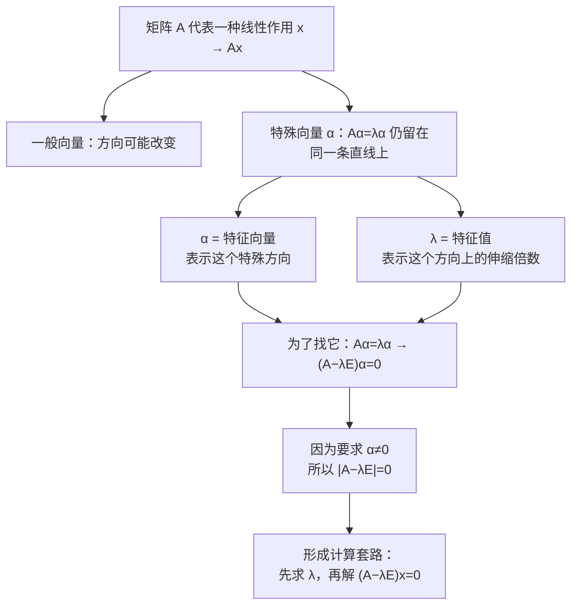

# 特征值与特征向量（核心思想）

> [!info] 归属
> 线代大观 · 特征值特征向量专题。本文是**特征理论入门笔记**，核心不是背诵 $|A-\lambda E|=0$，而是先搞清楚：**我们为什么要找这个东西？它在描述矩阵的什么性质？**

> [!important] 核心一句话（全文总纲）
> $$\boxed{ \text{特征向量 = 经过 }A\text{ 作用后方向没被"扭走"的特殊方向} }$$
> $$\boxed{ \text{特征值 = 矩阵在这个特殊方向上的伸缩倍数} }$$

---

## 一、先忘掉行列式：矩阵 $A$ 到底在干什么？

设
$$A=\begin{pmatrix}a&b\\c&d\end{pmatrix},\qquad x=\begin{pmatrix}x_1\\x_2\end{pmatrix}.$$
矩阵乘向量 $Ax$ 可以理解为：**矩阵 $A$ 对向量 $x$ 进行一次线性作用，把 $x$ 变成另一个向量**。

比如 $x=\begin{pmatrix}1\\1\end{pmatrix}$，经过 $A$ 以后可能变成 $Ax=\begin{pmatrix}5\\2\end{pmatrix}$。

通常情况下：
- **长度可能变**；
- **方向也可能变**。

所以普通向量经过矩阵作用以后，经常被"扭到别的方向"。

> [!note] 记忆锚点
> $A$ 是一个**线性变换**（映射）：$x\mapsto Ax$。普通向量进去，方向常常被改变。

---

## 二、但是有些方向非常特殊

我们想问：**有没有某个非零向量 $\alpha$，经过 $A$ 作用以后，虽然长度可能变化，但仍然落在原来的那条直线上？**

如果有，就意味着 $A\alpha$ 一定是 $\alpha$ 的某个倍数。于是：
$$\boxed{A\alpha=\lambda\alpha}$$
这就是整个特征值、特征向量理论的源头。

这里：
- $\boxed{\alpha\ne0}$ 叫做 $A$ 的**特征向量**；
- 对应的数 $\boxed{\lambda}$ 叫做 $A$ 的**特征值**。

---

## 三、所以"本质"到底是什么？

把 $A\alpha=\lambda\alpha$ 翻译成人话：

- 左边 $A\alpha$：表示"矩阵 $A$ 作用一次"；
- 右边 $\lambda\alpha$：表示"只是把原向量乘了一个数"。

于是这个等式就在说：**矩阵 $A$ 对 $\alpha$ 做的复杂作用，在 $\alpha$ 这个特殊方向上，竟然退化成了最简单的"乘一个数"。**

$$\boxed{ \text{复杂的矩阵作用}\;\xrightarrow{\text{找到特殊方向}}\;\text{简单的数乘} }$$

---

## 四、特征值 $\lambda$ 究竟在告诉我们什么？

既然 $A\alpha=\lambda\alpha$，那么 $\lambda$ 就告诉我们 $A$ 在特征向量 $\alpha$ 这个方向上做了什么。

| $\lambda$ | 几何含义 | 图示 |
|---|---|---|
| $\lambda=3$ | 方向不变，拉伸为原来的 3 倍 | $A\alpha=3\alpha$ |
| $\lambda=\frac12$ | 方向不变，压缩到原来的 $\frac12$ | $A\alpha=\frac12\alpha$ |
| $\lambda=-2$ | 箭头方向反过来，但仍**在同一直线上** | $A\alpha=-2\alpha$ |
| $\lambda=0$ | 直接把这个非零方向**压成零向量** | $A\alpha=0$ |

所以更严谨地说，特征向量描述的是：
$$\boxed{\text{经过 }A\text{ 作用后仍留在原直线上的方向}}$$
而不一定是箭头朝向完全相同（$\lambda<0$ 时方向反过来了，但直线没变）。

> [!warning] $\lambda=0$ 的情况考研特别重要
> $A\alpha=0,\ \alpha\ne0$ 说明齐次方程 $Ax=0$ 存在非零解。因此对 $n$ 阶方阵：
> $$\boxed{ 0\text{ 是 }A\text{ 的特征值} \iff |A|=0 \iff r(A)<n }$$
> 这个结论以后会反复出现。

---

## 五、一个特别直观的例子

设
$$A=\begin{pmatrix}2&0\\0&3\end{pmatrix}.$$

**看 $\alpha_1=\begin{pmatrix}1\\0\end{pmatrix}$：**
$$A\alpha_1=\begin{pmatrix}2&0\\0&3\end{pmatrix}\begin{pmatrix}1\\0\end{pmatrix}=\begin{pmatrix}2\\0\end{pmatrix}=2\begin{pmatrix}1\\0\end{pmatrix}.$$
所以 $\boxed{\lambda_1=2}$，$\begin{pmatrix}1\\0\end{pmatrix}$ 是对应特征向量。
含义：**$A$ 在 $x$ 轴方向上，把向量扩大 2 倍。**

**看 $\alpha_2=\begin{pmatrix}0\\1\end{pmatrix}$：**
$$A\alpha_2=\begin{pmatrix}0\\3\end{pmatrix}=3\begin{pmatrix}0\\1\end{pmatrix}.$$
所以 $\boxed{\lambda_2=3}$。
含义：**$A$ 在 $y$ 轴方向上扩大 3 倍。**

所以这个矩阵真正干的事情其实非常简单：
$$\boxed{ x\text{ 轴方向扩大 2 倍，}\qquad y\text{ 轴方向扩大 3 倍} }$$
而特征值和特征向量恰好把矩阵这种隐藏的作用方式给找了出来。

> [!tip] 理解升华
> 对角矩阵的特征值就是主对角元，特征向量就是标准单位坐标向量。**"找到特征方向" = "找到一种坐标，让矩阵作用变成各方向分别伸缩"。**

### 补充：为什么说「找到特征方向」=「换一套坐标」？

这句话拆成两层来读：

**① 正着读：对角矩阵是最平凡的答案。** 对角矩阵作用在单位坐标向量上，第 $i$ 个坐标只被第 $i$ 个对角元乘一下，别的坐标"碰不到"它，所以 $De_i=d_ie_i$ 是"白给"的：
$$\boxed{\text{对角矩阵}\ \Rightarrow\ \text{特征值}=主对角元,\quad \text{特征向量}=单位坐标向量}$$

**② 反着读：这才是本质。** 一般矩阵看起来"爱扭方向"，是因为我们站在了跟它"天然方向"错位的坐标系里看它。一旦把坐标轴对准特征方向，矩阵的作用就退化成"各方向分别伸缩"：
$$\boxed{\text{可对角化矩阵}\ \Rightarrow\ \text{换到特征方向坐标后}\ =\ \text{对角矩阵}}$$
（即 $P^{-1}AP=D$：$D$ 的主对角元就是特征值，$P$ 的列向量就是"新坐标系里的单位向量"。完整推导见第九节。）

**用一个"不平凡"的例子验证 ②。** 看
$$A=\begin{pmatrix}2&1\\1&2\end{pmatrix}$$
在标准坐标下 $A\begin{pmatrix}1\\0\end{pmatrix}=\begin{pmatrix}2\\1\end{pmatrix}$，方向被扭走了。但它的特征值是 $\lambda_1=3,\ \lambda_2=1$，对应方向分别是
$$\begin{pmatrix}1\\1\end{pmatrix},\qquad \begin{pmatrix}1\\-1\end{pmatrix}.$$
把坐标轴换成这两条斜的方向之后，$A$ 就变成
$$\begin{pmatrix}3&0\\0&1\end{pmatrix}\ :\ \text{一个方向拉长 3 倍，另一个方向不动，完全没有扭动。}$$
之前看到的"搅和"，纯粹是因为标准坐标轴跟这两个方向"没对齐"。

> [!tip] 直观想象
> 一块弹性布料沿**纹理方向**拉伸，处处均匀、不会扭曲；若斜着描述这个拉伸，就得处理交叉项，显得复杂。特征方向就是布的"纹理"，标准坐标只是我们习惯拿的那把"斜尺子"。

> [!warning] 别理解过头
> 1. 并非所有矩阵都能"完全扳直"：凑不出 $n$ 个线性无关特征向量时，只能退到约当标准形，思想一脉相承——**尽力找一套让矩阵最简单的坐标**。
> 2. "标准单位坐标向量"应理解为"特征方向上的单位向量"：对对角矩阵二者恰好重合；对一般可对角化矩阵，特征方向是斜的，它的"单位向量"就是特征向量 $\alpha$。

---

## 六、那为什么偏偏要解 $|A-\lambda E|=0$？

现在再看课本公式，就不会觉得它是凭空冒出来的了。

从定义 $A\alpha=\lambda\alpha$ 开始，移到一边：
$$A\alpha-\lambda\alpha=0.$$
因为 $\alpha=E\alpha$，所以
$$A\alpha-\lambda E\alpha=0.$$
提取 $\alpha$：
$$\boxed{(A-\lambda E)\alpha=0}.$$
但是注意特征向量要求 $\boxed{\alpha\ne0}$，所以齐次线性方程组 $(A-\lambda E)x=0$ 必须存在非零解。

你之前学过：$Bx=0$ 要存在非零解，对于 $n$ 阶方阵 $B$，就必须 $|B|=0$。所以：
$$\boxed{|A-\lambda E|=0}.$$

> [!important] 关键认知
> $$\boxed{|A-\lambda E|=0}\ \text{ 并不是特征值的"本质"}$$
> 它**只是为了寻找满足 $A\alpha=\lambda\alpha$ 的 $\lambda$，而得到的一种计算手段**。

---

## 七、为什么先求特征值，再求特征向量？

因为要解决 $A\alpha=\lambda\alpha$，这里有两个未知的东西：$\lambda$ 和 $\alpha$。

于是**先**通过 $|A-\lambda E|=0$ 把 $\lambda$ 找出来；得到某个 $\lambda=\lambda_1$ 以后，**再**代回 $(A-\lambda_1E)x=0$，这个齐次方程的非零解就是 $\lambda_1$ 对应的特征向量。

标准流程：
$$\boxed{|A-\lambda E|=0}\ \xrightarrow{\text{先求}}\ \boxed{\lambda}\ \xrightarrow{\text{再解}}\ \boxed{(A-\lambda E)x=0}\ \xrightarrow{\text{得到}}\ \boxed{\text{特征向量}}$$

但你要知道，整个流程的源头只有：
$$\boxed{A\alpha=\lambda\alpha}.$$

---

## 八、为什么我们费这么大劲找这些"特殊方向"？

因为对于普通向量 $x$，算 $Ax,\ A^2x,\ A^3x,\cdots$ 可能越来越复杂。但如果 $\alpha$ 是特征向量：
$$A\alpha=\lambda\alpha.$$
那么
$$A^2\alpha=A(A\alpha)=A(\lambda\alpha)=\lambda A\alpha=\lambda^2\alpha.$$
继续：$A^3\alpha=\lambda^3\alpha$，所以：
$$\boxed{A^k\alpha=\lambda^k\alpha}$$

你看，本来是**矩阵的高次幂**，到了特征向量方向上，直接变成 $\boxed{\lambda^k}$ 这么简单。这就是特征理论如此重要的原因之一：**把矩阵运算变成普通数字运算**。

> [!tip] 考研考点
> $A^k\alpha=\lambda^k\alpha$ 是"已知特征向量/特征值求高次幂作用"一类题的核心工具。

---

## 九、这其实就是"相似对角化"的思想来源

如果 $n$ 阶矩阵 $A$ 有 $n$ 个线性无关的特征向量 $\alpha_1,\alpha_2,\cdots,\alpha_n$，设 $P=(\alpha_1,\alpha_2,\cdots,\alpha_n)$，那么：
$$P^{-1}AP=\begin{pmatrix}\lambda_1&&&\\&\lambda_2&&\\&&\ddots&\\&&&\lambda_n\end{pmatrix}.$$

为什么右边能变成对角矩阵？因为我们故意选了这些最特殊的方向作为"坐标方向"：

- 在第一个特征向量方向上：$A\alpha_1=\lambda_1\alpha_1$；
- 在第二个方向上：$A\alpha_2=\lambda_2\alpha_2$；
- ……

所以在这些特殊方向看来，矩阵根本没有那么复杂，它只是在每个方向上分别乘一个数：
$$\boxed{ \alpha_1\text{ 方向乘 }\lambda_1,\quad \alpha_2\text{ 方向乘 }\lambda_2,\quad\cdots }$$
这就是对角矩阵。

> [!important] 相似对角化的本质
> 找到一组最适合观察矩阵 $A$ 的**坐标方向**，使矩阵的作用变成"**各个方向分别乘一个数**"。

---

## 十、为什么一个特征值对应的特征向量有无穷多个？

假如 $A\alpha=\lambda\alpha$，那么取任意 $k\ne0$，都有
$$A(k\alpha)=kA\alpha=k\lambda\alpha=\lambda(k\alpha).$$
所以 $2\alpha,\ -3\alpha,\ \frac12\alpha$ 全部都是同一个特征值 $\lambda$ 的特征向量。

这是很自然的，因为我们真正关心的是**方向**，而不是某一支具体多长的箭头。例如
$$\begin{pmatrix}1\\2\end{pmatrix},\quad \begin{pmatrix}2\\4\end{pmatrix},\quad \begin{pmatrix}-3\\-6\end{pmatrix}$$
本质上都描述同一条直线方向。

> [!note] 联系
> 特征值 $\lambda$ 对应的全部特征向量 + 零向量，构成特征子空间（$(A-\lambda E)x=0$ 的解空间），维数 $=n-r(A-\lambda E)$。

---

## 十一、为什么零向量不能叫特征向量？

因为对于零向量，$A0=0$，同时对任何 $\lambda$ 都有 $\lambda0=0$，所以 $A0=\lambda0$ 对所有 $\lambda$ 都成立。这样它就无法反映矩阵的任何特殊性质。

所以定义中特别强调：
$$\boxed{\alpha\ne0}$$
考试里一定不能忘。

> [!warning] 易错点
> 求特征向量时，**解集要排除零向量**，只取 $(A-\lambda E)x=0$ 的**非零解**。

---

## 十二、把前面学的"秩"和现在的"特征值"联系起来

如果 $\lambda=0$ 是 $A$ 的特征值，那么存在 $\alpha\ne0$ 使 $A\alpha=0$，说明 $Ax=0$ 有非零解，因此 $r(A)<n$。所以：
$$\boxed{ 0\text{ 是特征值} \iff A\text{ 不可逆} \iff |A|=0 \iff r(A)<n }$$
反过来：
$$\boxed{ 0\text{ 不是特征值} \iff A\text{ 可逆} \iff |A|\ne0 \iff r(A)=n }$$
这一串在考研线代里非常重要。

> [!note] 与 [[矩阵的秩（10条性质）]] 的衔接
> 第⑩条"可相似对角化 ⟹ 秩 = 非零特征值个数"与此处 $\lambda=0 \iff r(A)<n$ 相互印证，是"秩"和"特征值"两个专题的桥梁。

---

## 十三、核心脑图

> [!important] 以后看到"特征值、特征向量"，脑子不要先想到行列式，而应按照这个顺序：

---

## 一句话总结（建议牢牢记住）

$$\boxed{ \text{特征值、特征向量不是为了解 }|A-\lambda E|=0\text{ 而创造出来的} }$$

恰恰相反：我们想寻找**矩阵作用下保持在原直线上的特殊方向**，才提出 $A\alpha=\lambda\alpha$；为了把这些方向找出来，最后才不得不求 $|A-\lambda E|=0$。

真正的逻辑链是：
$$\boxed{ \text{寻找不变方向} \Rightarrow A\alpha=\lambda\alpha \Rightarrow (A-\lambda E)\alpha=0 \Rightarrow |A-\lambda E|=0 }$$

> [!tip] 后续展望
> 把这条逻辑真正吃透，后面的特征值性质、重根、特征向量、相似对角化、实对称矩阵都会顺很多。

## 相关链接

- [[线代大观 MOC]]
- [[矩阵的秩（10条性质）]]（第⑩条"秩 = 非零特征值个数"与 λ=0 判定衔接）
- [[行满秩（6条核心结论）]]（满射/单射视角理解特征方向）
- [[🌟A可逆的等价命题]]（可逆 ⇔ 满秩 ⇔ 0 不是特征值）
- [[可对角化矩阵]]（第⑨节相似对角化的前置知识）
- [[🧵3.矩阵和向量组]]（教材级长笔记）
