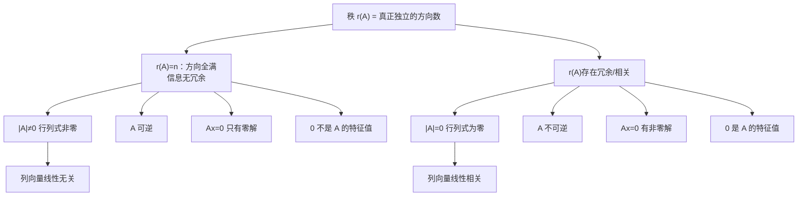

# 矩阵的秩（本质直觉）

> [!info] 归属
> 线代大观 · 矩阵的秩专题 · **本质理解篇**。与 [[矩阵的秩（10条性质）]]（性质/公式视角）互补——本文从**"独立方向/信息量"**的直觉出发，建立秩的本质，再回看行变换、满秩、行列式、齐次方程、特征值等如何连成一张网。

> [!important] 核心一句话（全文总纲）
> $$\boxed{ \text{矩阵的秩}=\text{这个矩阵中真正独立、不能互相替代的信息有多少份} }$$
> 在线性代数的语言里：
> $$\boxed{ r(A)=\text{矩阵列向量组中线性无关向量的最大个数} }$$
> 也等于行向量组中线性无关向量的最大个数。

> [!warning] 与"10条性质"的分工
> - [[矩阵的秩（10条性质）]]：**秩"是什么性质"**——10 条公式/不等式；
> - 本文：**秩"本质是什么"**——独立方向/信息量直觉，以及为什么满秩、行列式、齐次方程、特征值全都在讲同一件事。

---

## 一、先从"列向量"看矩阵

设 $A=(\alpha_1,\alpha_2,\cdots,\alpha_n)$。你完全可以把矩阵 $A$ 看成：
$$\boxed{\text{一堆列向量放在一起}}$$
所以研究矩阵的秩，本质上就是研究：**这一堆向量里面，到底有几个方向是"真正新出现的"？**

### 例子：只有一个方向

考虑
$$A=\begin{pmatrix}1&2&3\\2&4&6\\3&6&9\end{pmatrix}.$$
三列分别是 $\alpha_1=\begin{pmatrix}1\\2\\3\end{pmatrix}$，且 $\alpha_2=2\alpha_1,\ \alpha_3=3\alpha_1$。

看起来有三列，但后两列根本没有提供新的东西——知道第一列以后，$\alpha_2,\alpha_3$ 都能推出来。所以真正独立的信息只有 **1 份**：
$$\boxed{r(A)=1}.$$
这就是你前面学到的：$r(A)=1$ 时所有列都可以写成同一个非零向量的倍数。

---

## 二、"线性无关"为什么是秩的核心？

比如两个向量 $\alpha_1=\begin{pmatrix}1\\0\end{pmatrix},\ \alpha_2=\begin{pmatrix}0\\1\end{pmatrix}$，谁也不能由另一个表示，所以它们提供了两个真正不同的方向。于是 $A=\begin{pmatrix}1&0\\0&1\end{pmatrix}$ 有
$$\boxed{r(A)=2}.$$
但如果换成 $A=\begin{pmatrix}1&2\\2&4\end{pmatrix}$，第二列是第一列的 2 倍——虽然有两列，但实际上只有一个方向：
$$\boxed{r(A)=1}.$$

> [!tip] 朴素认识
> 列数是**"表面上有多少向量"**，秩是**"实际上有多少个独立方向"**。

---

## 三、秩不是"非零向量的个数"

这是初学时特别容易混淆的地方。比如 $\alpha_1=\begin{pmatrix}1\\0\end{pmatrix},\ \alpha_2=\begin{pmatrix}0\\1\end{pmatrix},\ \alpha_3=\begin{pmatrix}1\\1\end{pmatrix}$，三个向量都非零。但
$$\alpha_3=\alpha_1+\alpha_2,$$
第三个向量虽然不是零向量，却没有提供新的独立信息。因此
$$\boxed{r(\alpha_1,\alpha_2,\alpha_3)=2},\qquad \text{不是 3}.$$
所以秩关心的是**独立性**，而不是**是不是非零**：
$$\boxed{\text{秩}\ \leftrightarrow\ \text{独立性}}\qquad \boxed{\text{非零个数}\ \nrightarrow\ \text{秩}}$$

---

## 四、什么叫"独立方向"？用二维空间理解最直观

在平面里，假设只有一个非零向量 $\alpha_1$，那么它的所有倍数 $k\alpha_1$ 只能落在同一条直线上，所以只有一个独立方向：
$$\boxed{r=1}.$$
如果再来一个向量 $\alpha_2$，它**不在原来的那条直线上**，那么 $\alpha_1,\alpha_2$ 可以表示平面上的任意向量 $x=k_1\alpha_1+k_2\alpha_2$，这时候就有两个独立方向：
$$\boxed{r=2}.$$

所以二维情况下特别好理解：
$$\boxed{ r=1\ \Rightarrow\ \text{所有列都挤在一条直线上} }$$
$$\boxed{ r=2\ \Rightarrow\ \text{存在两个不共线的独立方向} }$$

---

## 五、三维也是同样的道理

- 所有向量都在同一条直线上：$\boxed{r=1}$；
- 不全在一条直线上，但都能由两个独立向量表示（处在某两个方向确定的平面/范围内）：$\boxed{r=2}$；
- 有三个线性无关的向量：$\boxed{r=3}$。

> [!important] 一句话直觉
> $$\boxed{ \text{秩}=\text{真正需要几个独立方向，才能把所有列表示出来} }$$
> 这句话非常接近本质。

---

## 六、为什么定义里讲"极大线性无关组"？

例如 $\alpha_3=\alpha_1+\alpha_2$，且 $\alpha_1,\alpha_2$ 线性无关。那么向量组 $\alpha_1,\alpha_2,\alpha_3$ 里面，可以挑出 $\alpha_1,\alpha_2$ 作为**极大线性无关组**。为什么？

- $\alpha_1,\alpha_2$ 本身线性无关；
- 剩下的 $\alpha_3$ 可以由它们线性表示。

所以真正不可替代的向量只有 2 个：
$$\boxed{r(\alpha_1,\alpha_2,\alpha_3)=2}.$$

> [!tip] 极大线性无关组的作用
> 把重复的、可以由别人表示的信息**全部扔掉**，剩下最精简的一套。**它包含几个向量，秩就是几。**

---

## 七、一个特别重要的理解：秩 = 最少需要多少个"基础向量"

比如
$$\alpha_3=2\alpha_1-\alpha_2,\qquad \alpha_4=3\alpha_1+5\alpha_2,\qquad \alpha_5=-\alpha_1+7\alpha_2.$$
虽然有五个向量，但如果 $\alpha_1,\alpha_2$ 线性无关，那么后面三个都能由它们表示。也就是说：
$$\boxed{\text{只需要保存 }\alpha_1,\alpha_2},\qquad \text{剩下的都能重建出来}\ \Rightarrow\ \boxed{r=2}.$$

> [!important] 信息压缩视角
> $$\boxed{ \text{秩}=\text{描述这一组向量，最少需要保留多少个独立的基础向量} }$$
> 这本质上是**数据压缩**：冗余信息全被丢掉，只保留能重建一切的核心骨架。

---

## 八、为什么"行秩 = 列秩"这么重要？

矩阵既可以按列看 $A=(\alpha_1,\cdots,\alpha_n)$，也可以按行看。神奇的地方在于：
$$\boxed{ \text{列向量组的秩}\ =\ \text{行向量组的秩} }$$
所以我们干脆统一叫 $r(A)$。考研里通常直接使用这个结论即可。

> [!tip] 含义
> 不管你从"列之间有多少独立信息"看，还是从"行之间有多少独立信息"看，最后得到的数量**一样**。这说明"独立信息量"是矩阵的**内在固有属性**，与观察角度无关。

---

## 九、那为什么初等行变换可以求秩？

比如
$$A=\begin{pmatrix}1&2&3\\2&4&6\\1&1&1\end{pmatrix}.$$
进行初等行变换：第二行减去第一行的 2 倍、第三行减第一行：
$$\begin{pmatrix}1&2&3\\0&0&0\\1&1&1\end{pmatrix}\ \longrightarrow\ \begin{pmatrix}1&2&3\\0&0&0\\0&-1&-2\end{pmatrix}.$$
最后有两个非零行，所以 $\boxed{r(A)=2}$。

为什么？因为**初等变换虽然改变了矩阵的具体数字，却没有改变其中"真正独立的信息量"**。可以理解成：我们只是把原来纠缠在一起的信息重新整理，让哪些行是重复的、哪些是真正独立的**显现**出来。

$$\boxed{\text{阶梯形矩阵中非零行数}\ =\ \text{矩阵的秩}}$$

---

## 十、为什么零行不算？

比如经过行变换：
$$A\longrightarrow\begin{pmatrix}1&2&3\\0&1&4\\0&0&0\end{pmatrix}.$$
最后一行 $(0,0,0)$ 显然没有提供任何新信息，所以只剩两个有效的独立行：
$$\boxed{r(A)=2}.$$
因此阶梯形里：**非零行有几个，秩就是几**——本质上就是在"数还有多少份真正独立的信息"。

> [!tip] 与初等变换的联系
> 初等行变换 = "信息重组"（不改变信息量）；阶梯形 = "把重复行显性化为零行"。所以数非零行 = 数独立信息份数。

---

## 十一、现在理解"满秩"就很简单了

假设 $A$ 是 $n$ 阶方阵。最多能有多少个线性无关的列向量？最多 $n$ 个，因此 $r(A)\le n$。如果 $r(A)=n$，说明 $n$ 个列向量全部线性无关——没有任何一列可以由其他列线性表示。这就是**满秩**。

对于 $n$ 阶方阵：
$$\boxed{ r(A)=n \iff A\text{ 的列向量线性无关} }$$
进一步：
$$\boxed{ r(A)=n \iff |A|\ne0 \iff A\text{ 可逆} }$$

> [!important] 为什么"满"？
> "满秩" = 独立方向数已经达到**理论上限**（$n$ 个列全部独立）。信息完全无冗余，于是矩阵"信息不缺失"，故可逆。

---

## 十一·补：为什么"满秩就可逆"？

设 $A$ 是 $n$ 阶方阵。

### 本质

$$\boxed{r(A)=n}$$

表示 $A$ 的 $n$ 个列向量**线性无关**，所以

$$Ax=0$$

只有零解：

$$\boxed{x=0}$$

也就是说，矩阵 $A$ 不会把两个不同的向量变成同一个结果，因此信息没有丢失，可以唯一地"逆回来"。

所以：

$$\boxed{A\text{ 可逆}}$$

### 代数推导

$$r(A)=n \iff |A|\ne0 \iff A^{-1}\text{ 存在}$$

因此：

$$\boxed{\text{满秩}\iff\text{可逆}}$$

> [!note] 注意
> 这里说的是 **$n$ 阶方阵**。

### 一条结论链

$$\boxed{r(A)=n \iff \text{列向量线性无关} \iff Ax=0\text{ 只有零解} \iff |A|\ne0 \iff A\text{ 可逆}}$$

**一句话记忆：**

$$\boxed{\text{满秩}=\text{没有信息丢失}=\text{可以逆回来}}$$

> [!tip] 与下一节的衔接
> 上面"代数推导"里 $|A|\ne0\iff r(A)=n$ 这一步，其理由见下一节。

---

## 十二、为什么行列式不为 0 就意味着满秩？

对于 $n$ 阶矩阵 $A$：$|A|\ne0$ 意味着 $A$ 本身就是一个 $n$ 阶**非零子式**。而秩的另一个定义是"最高阶非零子式的阶数"。既然已经有 $n$ 阶非零子式，而 $n$ 阶矩阵又不可能有超过 $n$ 阶的子式，所以 $r(A)=n$。

反过来：$r(A)<n$ 意味着不存在 $n$ 阶非零子式，而唯一的 $n$ 阶子式就是 $|A|$，因此 $|A|=0$。于是：
$$\boxed{ r(A)=n\iff |A|\ne0 }$$
$$\boxed{ r(A)<n\iff |A|=0 }$$

---

## 十三、秩和齐次方程 $Ax=0$ 的本质联系

考虑 $Ax=0$，设 $A$ 是 $m\times n$ 矩阵，有 $n$ 个未知数。

- 如果 $r(A)=n$，说明所有 $n$ 列都线性无关，于是 $x_1\alpha_1+\cdots+x_n\alpha_n=0$ 只有 $x_1=\cdots=x_n=0$：
$$\boxed{ r(A)=n \Rightarrow Ax=0\text{ 只有零解} }$$
- 反之，如果 $r(A)<n$，说明 $n$ 个列向量线性相关，就存在一组不全为零的数 $x_1,\cdots,x_n$ 使得线性组合为 $0$，这正是 $Ax=0$ 的非零解：
$$\boxed{ Ax=0\text{ 有非零解} \iff r(A)<n }$$

> [!important] 不是两条孤立知识
> 这两条是**同一件事情的两种说法**：列向量线性相关 ⟺ 齐次方程有非零解 ⟺ 秩没满。

---

## 十四、你可以这样理解 $n-r(A)$

设 $A$ 有 $n$ 列，$r(A)=r$，说明真正独立的列有 $r$ 个。但总共有 $n$ 个未知数，因此有 $n-r$ 个"可以自由变化的量"。于是齐次方程组基础解系中解向量的个数是：
$$\boxed{n-r(A)}.$$

> [!tip] 一句直觉记
> $$\boxed{ \text{未知数个数}-\text{独立约束个数}\ =\ \text{自由程度} }$$
> $n-r(A)$ 在解方程部分特别重要。

---

## 十五、秩和特征值也能连起来

你刚刚学过：如果 $A$ 是 $n$ 阶矩阵，$0$ 是 $A$ 的特征值，就意味着存在 $\alpha\ne0$ 使得 $A\alpha=0$，也就是 $Ax=0$ 存在非零解，于是 $r(A)<n$。所以：
$$\boxed{ 0\text{ 是 }A\text{ 的特征值} \iff r(A)<n }$$
$$\boxed{ 0\text{ 不是 }A\text{ 的特征值} \iff r(A)=n }$$

> [!important] 你会发现
> **秩、行列式、可逆性、齐次方程、特征值，其实全部连在一起。** 这是线性代数最漂亮的一张网。

---

## 十六、你前面学的秩 1 矩阵，现在应该能更深地理解

如果 $r(A)=1$，这不只是一个数字。它告诉你：整个矩阵虽然可能有很多行很多列，但真正独立的信息**只有一个方向**。所以所有列一定都是某一个非零列向量 $\alpha$ 的倍数：
$$A=(b_1\alpha,b_2\alpha,\cdots,b_n\alpha)=\alpha\begin{pmatrix}b_1&b_2&\cdots&b_n\end{pmatrix}.$$
也就是：
$$\boxed{A=\alpha\beta^T}$$

> [!note] 为什么天然对应？
> 因为整个矩阵里只存在**一个独立方向**，所以一定能拆成"一个列向量 × 一个行向量"的外积。参见 [[🌟秩为1的矩阵]]。

---

## 十七、三个极端情况一定要建立感觉

| 情况 | 含义 | 特征 |
|------|------|------|
| ① $r(A)=0$ | 没有任何非零信息 | $\boxed{A=O}$ 唯一情况 |
| ② $r(A)=1$ | 整个矩阵只有一个独立方向 | 所有列互相成比例：$\boxed{A=\alpha\beta^T}$ |
| ③ $n$ 阶矩阵 $r(A)=n$ | 所有列全部独立，无冗余 | $\boxed{\vert A\vert\ne0}$，因此可逆 |

---

## 十八、为什么秩还有"最高阶非零子式"这个定义？

这个定义初看最难理解，其实它也是在检测**"最多能找到多少个真正独立的行和列"**。例如存在某个二阶子式
$$\begin{vmatrix}a&b\\c&d\end{vmatrix}\ne0,$$
那么对应的两个列向量至少在这两行上表现出了线性无关性，所以至少有两个独立方向：$r(A)\ge2$。如果所有三阶子式全部为 0，却存在二阶非零子式，那么 $\boxed{r(A)=2}$。

> [!tip] 本质
> $$\boxed{ \text{最高阶非零子式} }\ \text{也是另一种检测"最大独立信息量"的工具}$$

---

## 十九、所以三种求秩方式，本质完全相同

| 方法 | 做法 | 结果 |
|------|------|------|
| 方法一：极大线性无关组 | 找最大线性无关向量个数 | $r(A)=r$ |
| 方法二：最高阶非零子式 | 找最高阶非零子式的阶数 | $r(A)=r$ |
| 方法三：初等变换化阶梯形 | 数非零行 | $r(A)=r$ |

它们不是三个互不相关的定义，它们都在回答同一个问题：
$$\boxed{ \text{这个矩阵里，最多有多少份互相不能替代的独立信息？} }$$

---

## 二十、脑中应形成这样一条主线

以后看到矩阵 $A=(\alpha_1,\alpha_2,\cdots,\alpha_n)$，第一反应应该是：
$$\boxed{\text{它其实就是一个列向量组}}$$
然后问：这些列中有几个真正独立？把能够被其他向量表示的列去掉，最后留下 $\alpha_{i_1},\alpha_{i_2},\cdots,\alpha_{i_r}$ 构成极大线性无关组。所以 $\boxed{r(A)=r}$。

> [!important] 整个"秩"的知识都可以从一句话生长出来
> $$\boxed{ \text{秩}=\text{最大线性无关向量个数}\ =\text{真正独立的信息量} }$$

---

## 最后：把考研最重要的关系全部串起来

> [!important] 对 $n$ 阶矩阵 $A$，以下六条等价：
> $$\boxed{ r(A)=n }\iff\boxed{\text{列向量线性无关}}\iff\boxed{|A|\ne0}\iff\boxed{A\text{ 可逆}}\iff\boxed{Ax=0\text{ 只有零解}}\iff\boxed{0\text{ 不是 }A\text{ 的特征值}}$$

> [!warning] 对 $n$ 阶矩阵 $A$，以下六条等价：
> $$\boxed{ r(A)<n }\iff\boxed{\text{列向量线性相关}}\iff\boxed{|A|=0}\iff\boxed{A\text{ 不可逆}}\iff\boxed{Ax=0\text{ 有非零解}}\iff\boxed{0\text{ 是 }A\text{ 的特征值}}$$

> [!tip] 你如果把这一整串理解成同一件事情从不同角度描述，线性代数会突然从很多零散公式变成一张完整的网。其中最值得刻进脑子的一句话：
> $$\boxed{ \textbf{秩不是"矩阵里面有多少非零数"，而是"矩阵里面到底有多少个真正独立的方向"。} }$$

这也是后面理解**方程组为什么有解、基础解系为什么有 $n-r(A)$ 个向量、相似矩阵为什么秩不变、秩一矩阵为什么能写成 $\alpha\beta^T$** 的共同出发点。

### 关系网：同一件事的五种说法

> [!note] 看这张图的方式
> 以"秩有没有满"为分水岭，左右两列分别是**同一件事**的正面与反面。考研里出现任何一个说法，都能立刻换写成其他几种。

## 相关链接

- [[线代大观 MOC]]
- [[矩阵的秩（10条性质）]]（性质/公式视角，与本文本质视角互补）
- [[行满秩（6条核心结论）]]（$r(A)=m$ 时行向量独立、列向量生成 $\mathbb R^m$）
- [[特征值与特征向量（核心思想）]]（$\lambda=0\iff r(A)<n$，秩与特征值的桥梁）
- [[🌟A可逆的等价命题]]（满秩 ⇔ 可逆等价链）
- [[🌟秩为1的矩阵]]（$A=\alpha\beta^T$ 的本质理解）
- [[🌟基础解系和极大线性无关组]]（$n-r(A)$ 与解空间维数）
- [[🌟两个矩阵秩相同拥有的性质]]
- [[🧵3.矩阵和向量组]]（教材级长笔记）
- [[🧵6.【‼️】线性方程组]]（有解判定 $r(A)=r(A,b)$）
