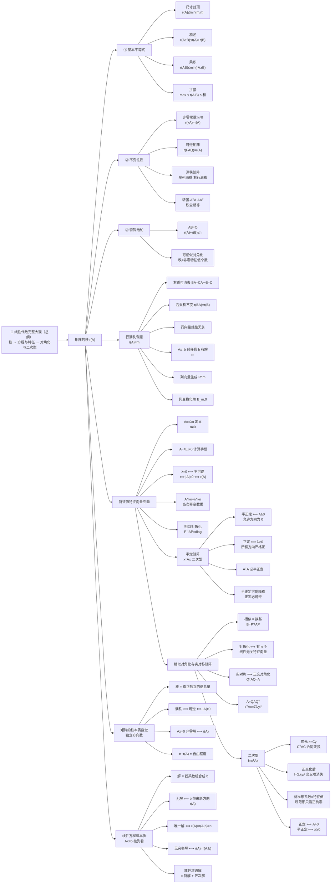

# 线代大观 MOC

> [!important] 📌 从哪开始读
> **先读 [[线性代数完整大观（总纲）]]**：把整个考研线代压成一条逻辑链（秩 → 方程与特征 → 对角化与二次型），是所有专题的总地图。读完全局再进下面的专题看细节。

> [!info] 专题定位
> 本专题以**「公式 → 直观理解 → 为什么 → 考研怎么用」**的方式系统性整理考研线性代数核心知识点。当前已收录：**矩阵的秩（10 条性质）**、**行满秩**、**特征值**、**二次型**、**总纲**等，后续将按专题扩充（行列式、向量组等）。
>
> 定位：**专题速记库**，与 `01_数学/线性代数/` 下的教材级长笔记（🧵 系列）互为补充——本库侧重"口诀化、体系化、可检索"。

## 知识结构总览

## 矩阵的秩：10 条性质导航

| 分类 | 性质 | 口诀 | 笔记 |
|------|------|------|------|
| 基本不等式 | ① 秩 ≤ 行数/列数 | 尺寸封顶 $r(A)\le\min(m,n)$ | [[矩阵的秩（10条性质）]] |
| 基本不等式 | ② 和差的秩 | 相加不超过秩之和 | [[矩阵的秩（10条性质）]] |
| 基本不等式 | ③ 乘积的秩 | 越乘秩越小 | [[矩阵的秩（10条性质）]] |
| 基本不等式 | ④ 拼接矩阵的秩 | 越拼秩越大 | [[矩阵的秩（10条性质）]] |
| 不变性质 | ⑤ 乘非零常数 | $r(kA)=r(A),\ k\ne0$ | [[矩阵的秩（10条性质）]] |
| 不变性质 | ⑥ 乘可逆矩阵 | 左乘可逆、右乘可逆，秩都不变 | [[矩阵的秩（10条性质）]] |
| 不变性质 | ⑦ 乘满秩矩阵 | 左乘列满秩、右乘行满秩，秩不变 | [[矩阵的秩（10条性质）]] |
| 不变性质 | ⑧ 转置与 $A^TA,AA^T$ | 秩全相等 | [[矩阵的秩（10条性质）]] |
| 特殊结论 | ⑨ $AB=O$ | 秩的和 ≤ 相邻维数 | [[矩阵的秩（10条性质）]] |
| 特殊结论 | ⑩ 可相似对角化 | 秩 = 非零特征值个数 | [[矩阵的秩（10条性质）]] |

## 行满秩：6 条核心结论导航

> [!important] 固定总前提
> $A\in\mathbb R^{m\times n},\ r(A)=m$（$A$ 行满秩），尤其关注 $m<n$。所有 6 条均由 $r(A)=m$ 推出。

| # | 结论 | 口诀/手段 | 笔记 |
|---|------|-----------|------|
| 1 | 右乘行满秩可消去 | $BA=CA\Rightarrow B=C$（$AP=E_m$） | [[行满秩（6条核心结论）]] |
| 2 | 右乘行满秩，秩不变 | $r(BA)=r(B)$ | [[行满秩（6条核心结论）]] |
| 3 | 行向量组线性无关 | 行满秩 ⟺ 所有行向量线性无关 | [[行满秩（6条核心结论）]] |
| 4 | $Ax=b$ 对任意 $b$ 有解 | $m<n$ 时为无穷多解 | [[行满秩（6条核心结论）]] |
| 5 | 列向量可表示任意 $m$ 维向量 | 但列向量可能线性相关 | [[行满秩（6条核心结论）]] |
| 6 | 列变换化为 $(E_m,0)$ | 左 $E$，右 $0$ | [[行满秩（6条核心结论）]] |

> [!tip] 考研核心版（抓两个核心，不硬背 6 条）
> $$\text{① } r(A)=m \qquad\qquad \text{② 行满秩}\Rightarrow \exists P,\ AP=E_m$$
> 第 3、4、5、6 条从 $r(A)=m$ 理解；第 1、2 条用 $AP=E_m$ 秒杀。

## 特征值与特征向量：核心思想导航

> [!important] 核心一句话
> 特征向量 = 经过 $A$ 作用后方向没被"扭走"的特殊方向；特征值 = 这个方向上的伸缩倍数。

| # | 主题 | 要点 | 笔记 |
|---|------|------|------|
| 定义 | 什么是特征向量/特征值 | $A\alpha=\lambda\alpha,\ \alpha\ne0$ | [[特征值与特征向量（核心思想）]] |
| 本质 | 复杂矩阵作用 → 简单数乘 | $\lambda$ 表示该方向上伸缩倍数 | [[特征值与特征向量（核心思想）]] |
| 计算 | 为什么解 $\vert A-\lambda E\vert=0$ | 只是找 $\lambda$ 的计算手段，非本质 | [[特征值与特征向量（核心思想）]] |
| 流程 | 先求 $\lambda$，再解方程 | $(A-\lambda E)x=0$ 的非零解 | [[特征值与特征向量（核心思想）]] |
| 高次幂 | $A^k\alpha=\lambda^k\alpha$ | 矩阵运算变成数字运算 | [[特征值与特征向量（核心思想）]] |
| 对角化 | $P^{-1}AP=\mathrm{diag}$ | 选特殊方向作坐标方向 | [[特征值与特征向量（核心思想）]] |
| 判定 | $\lambda=0 \iff \vert A\vert=0 \iff r(A)<n$ | 与秩专题衔接 | [[特征值与特征向量（核心思想）]] |

> [!warning] 两个易错点
> ① $\alpha\ne0$（零向量不能算特征向量）；② 特征向量只关心方向，不关心具体长度。

## 矩阵的秩：本质直觉导航

> [!important] 核心一句话
> $$\boxed{\text{秩}=\text{最大线性无关向量个数}=\text{真正独立的信息量}}$$
> 秩不是"矩阵里有多少非零数"，而是"矩阵里到底有多少个真正独立的方向"。

| # | 主题 | 要点 | 笔记 |
|---|------|------|------|
| 一~五 | 从列向量看秩 / 独立方向直觉 | 列数是表面，秩是实际独立方向数 | [[矩阵的秩（本质直觉）]] |
| 六~七 | 极大线性无关组 = 最少基础向量 | 扔掉冗余，剩最精简的一套 | [[矩阵的秩（本质直觉）]] |
| 八~十 | 行秩=列秩 / 初等行变换求秩 | 数非零行 = 数独立信息份数 | [[矩阵的秩（本质直觉）]] |
| 十一~十二 | 满秩与行列式 | $r(A)=n\iff\vert A\vert\ne0\iff A$ 可逆 | [[矩阵的秩（本质直觉）]] |
| 十三~十四 | 秩与 $Ax=0$ | 非零解 $\iff r(A)<n$；基础解系 $n-r(A)$ | [[矩阵的秩（本质直觉）]] |
| 十五 | 秩与特征值 | $0$ 是特征值 $\iff r(A)<n$ | [[矩阵的秩（本质直觉）]] |
| 十六~十九 | 秩 1 矩阵 / 三种求秩方式 | 本质完全相同，同一问题三种做法 | [[矩阵的秩（本质直觉）]] |
| 总结 | 六条等价链 | 秩、行列式、可逆、齐次方程、特征值一张网 | [[矩阵的秩（本质直觉）]] |

> [!tip] 一句话出发点
> $$\boxed{ \text{秩}=\text{最大线性无关向量个数}=\text{真正独立的信息量} }$$
> 后面理解方程组有解、基础解系 $n-r(A)$、相似矩阵秩不变、秩一矩阵 $\alpha\beta^T$ 的共同出发点。

## 线性方程组：本质理解导航

> [!important] 核心一句话
> $$\boxed{\text{解方程组}\ =\ \text{寻找一组系数，使列向量线性组合成 }b}$$
> 也是**寻找同时满足若干个线性约束的未知量**（按列看 / 按行看两个角度）。

| # | 主题 | 要点 | 笔记 |
|---|------|------|------|
| 一~二 | 方程组 = 约束的公共部分 | 几何：两直线交/平行/重合 → 唯一/无/无穷多解 | [[线性方程组（本质理解）]] |
| 三~六 | $Ax=b$ 按列拆开 | $Ax=x_1\alpha_1+\cdots+x_n\alpha_n$，解 = 找组合系数 | [[线性方程组（本质理解）]] |
| 七~十 | 无解与有解条件 | $b$ 不能由列表示 ⟺ 无解；$r(A)=r(A,b)$ 本质是"$b$ 没带来新信息" | [[线性方程组（本质理解）]] |
| 十一~十四 | 唯一解 vs 无穷多解 | 列向量无关 → 唯一；列向量相关 → 无穷多 | [[线性方程组（本质理解）]] |
| 十五~十八 | 消元与阶梯形 | 初等行变换不改变解；$n-r(A)$ = 自由程度 | [[线性方程组（本质理解）]] |
| 十九~二十 | 齐次方程与基础解系 | 永远有解；$Ax=0$ 非零解 ⟺ $r(A)<n$ | [[线性方程组（本质理解）]] |
| 二十一~二十三 | 非齐次通解 | $x=x^*+\eta$，特解 + 齐次全部解 | [[线性方程组（本质理解）]] |
| 二十四~二十八 | 秩与方程组连成网 | 独立约束数、方程多≠约束多、三层次、总主线 | [[线性方程组（本质理解）]] |

> [!warning] 解的三种情况（翻译成人话）
> - $r(A)<r(A,b)$：$b$ 带来新独立方向 → **无解**
> - $r(A)=r(A,b)=n$：$b$ 能拼出且无冗余 → **唯一解**
> - $r(A)=r(A,b)<n$：$b$ 能拼出但有冗余 → **无穷多解**

## 半定矩阵：本质理解导航

> [!important] 核心一句话
> $$\boxed{\text{半正定}=\text{不出现负值}+\text{允许某些方向取到 }0}$$
> 正定与半正定之差 = **是否允许零特征值**。

| # | 主题 | 要点 | 笔记 |
|---|------|------|------|
| 1~2 | 矩阵与正负 | 真正讨论的是 $x^TAx$；正定 vs 半正定差在"允许零值吗" | [[半定矩阵（本质理解）]] |
| 3~4 | 特征值决定定性 | $x^TAx=\sum\lambda_iy_i^2$；半正定 ⟺ 全部 $\lambda_i\ge0$ | [[半定矩阵（本质理解）]] |
| 5~6 | 三个矩阵对比 | 正定/半正定/不定；0 意味着该方向"无二次作用" | [[半定矩阵（本质理解）]] |
| 7 | 与秩衔接 | 正定必可逆；半正定可能降秩 | [[半定矩阵（本质理解）]] |
| 8 | 含负数却半正定 | $A=\begin{pmatrix}1&-1\\-1&1\end{pmatrix}$ 有 $(x_1-x_2)^2$ | [[半定矩阵（本质理解）]] |
| 9 | $A^TA$ 必半正定 | $(Ax)^T(Ax)\ge0$；正定 ⟺ $Ax=0$ 只有零解 | [[半定矩阵（本质理解）]] |
| 10 | 考研易错 | 半正定用**所有**主子式 $\ge0$，不是顺序主子式 | [[半定矩阵（本质理解）]] |
| 11 | 统一认识 | 定性完全由特征值符号决定 | [[半定矩阵（本质理解）]] |

> [!tip] 五种定性速查
> $\lambda_i>0$ → 正定；$\lambda_i\ge0$ → 半正定；$\lambda_i<0$ → 负定；$\lambda_i\le0$ → 半负定；既有正又有负 → 不定。

## 相似对角化与实对称矩阵：本质理解导航

> [!important] 核心逻辑链
> $$\boxed{\text{矩阵}}\to\boxed{\text{换坐标}}\to\boxed{\text{相似}}\to\boxed{\text{特征向量作坐标轴}}\to\boxed{\text{对角化}}$$
> 实对称矩阵更强：能找到两两正交的单位特征向量 ⟹ $Q^TAQ=\Lambda,\ Q^TQ=E$。

| # | 主题 | 要点 | 笔记 |
|---|------|------|------|
| 一~二 | 矩阵本质与相似 | 矩阵 = 线性变换在基下的表示；相似 = 换基 | [[相似对角化与实对称矩阵（本质理解）]] |
| 三~五 | 为什么要对角化 | 特征方向作坐标轴；$P$ 的每列是特征向量 | [[相似对角化与实对称矩阵（本质理解）]] |
| 六~七 | 能否对角化的判定 | 需要 $n$ 个线性无关特征向量；特征值互异 ⟹ 可对角化（反之不成立） | [[相似对角化与实对称矩阵（本质理解）]] |
| 八~十一 | 实对称的特殊性 | 正交对角化；不同特征值特征向量必正交（用 $A^T=A$ 证） | [[相似对角化与实对称矩阵（本质理解）]] |
| 十二~十三 | $A=Q\Lambda Q^T$ | 换轴→伸缩→换回；完整例子 | [[相似对角化与实对称矩阵（本质理解）]] |
| 十四~十五 | 与二次型/半正定相连 | $x^TAx=\sum\lambda_iy_i^2$；相似 $P^{-1}$ vs 二次型 $P^T$ 在正交时统一 | [[相似对角化与实对称矩阵（本质理解）]] |
| 十六~十七 | 三个层次与总结 | 一般→相似→正交相似；四句本质总结 | [[相似对角化与实对称矩阵（本质理解）]] |

> [!tip] 三层次速记
> 一般矩阵（可能不能对角化）→ 有 $n$ 个线性无关特征向量（可相似对角化 $P^{-1}AP=\Lambda$）→ 实对称（可正交相似对角化 $Q^TAQ=\Lambda$）。

## 二次型：本质理解导航

> [!important] 核心一句话
> $$\boxed{\text{二次型就是用实对称矩阵描述"不同方向上的平方作用"；化标准形，就是寻找它的天然坐标轴}}$$

| # | 主题 | 要点 | 笔记 |
|---|------|------|------|
| 一~二 | 二次型是什么 | $f(x)=x^TAx$；交叉项系数 $=2a_{12}$（对半分）；总取 $A=A^T$ | [[二次型（本质理解）]] |
| 三~五 | 目标与换元 | 消交叉项；$x=Cy$ 后得 $C^TAC$（合同变换，区别于相似 $P^{-1}AP$） | [[二次型（本质理解）]] |
| 六~八 | 正交化的威力 | $f=\sum\lambda_iy_i^2$，系数就是特征值；特征向量=天然方向，特征值=正负大小 | [[二次型（本质理解）]] |
| 九~十一 | 正负零与秩 | 正定/半正定/不定由 $\lambda_i$ 符号决定；$r(f)=r(A)$ | [[二次型（本质理解）]] |
| 十二~十三 | 标准形 vs 规范形 | 规范形只留 $+1,-1,0$；不同方法系数可不同但正负项个数不变 | [[二次型（本质理解）]] |
| 十四~十五 | 配方法与正交变换 | 都是"找坐标消交叉项"的算法；正交变换保长度 $\vert x\vert=\vert y\vert$ | [[二次型（本质理解）]] |
| 十六~十七 | 知识网收束 | 完整逻辑链 + 本质三问 | [[二次型（本质理解）]] |

> [!warning] 易混点：相似 vs 合同
> 矩阵相似：$P^{-1}AP$（换基）；二次型换元：$C^TAC$（合同）。一般 $P^{-1}\ne P^T$，只有正交矩阵时二者统一。

## 核心考点速查

> [!important] 秩的三层理解
> 秩 = **最大线性无关行的个数** = **最大线性无关列的个数**（行秩 = 列秩）。
> 几何上：秩 = 行/列向量张成的**子空间维数** = "矩阵能产生的独立方向数"。

> [!tip] 秩的核心口诀（10 条压缩版）
> 1. **尺寸封顶**：$r(A)\le\min(m,n)$
> 2. **相加不超过秩之和**：$r(A\pm B)\le r(A)+r(B)$
> 3. **越乘秩越小**：$r(AB)\le\min\{r(A),r(B)\}$
> 4. **越拼秩越大**：$\max\{r(A),r(B)\}\le r(A\ B)\le r(A)+r(B)$
> 5. **乘非零常数，秩不变**：$r(kA)=r(A),\ k\ne0$
> 6. **乘可逆矩阵，秩不变**：$r(PAQ)=r(A)$
> 7. **左乘列满秩、右乘行满秩，秩不变**：$r(A)=n\Rightarrow r(AB)=r(B)$；$r(A)=m\Rightarrow r(CA)=r(C)$
> 8. **转置、$A^TA$、$AA^T$，秩都不变**：$r(A)=r(A^T)=r(A^TA)=r(AA^T)$
> 9. **乘积为零，秩的和不超过中间维数**：$AB=O\Rightarrow r(A)+r(B)\le n$
> 10. **可相似对角化 ⟹ 秩 = 非零特征值个数**

> [!warning] 建议重点连记（3、4、6、7、9）
> 相乘变小，拼接变大；可逆不变；满秩适当乘不变；乘积为零看中间维数。
> 这几条是考研线代秩的题目**最常反复调用**的。

## 相关链接

- [[线性代数完整大观（总纲）]]（📌 总地图：整个考研线代压成一条逻辑链）
- [[矩阵的秩（10条性质）]]（①~⑩ 完整推导 + 例子 + 速查表 + 口诀）
- [[矩阵的秩（本质直觉）]]（"独立方向/信息量"视角，满秩·行列式·齐次方程·特征值串成一张网）
- [[线性方程组（本质理解）]]（$Ax=b$ 按列看，有解/唯一/无穷多解 + 基础解系 + 非齐次通解）
- [[半定矩阵（本质理解）]]（$x^TAx$ 二次型视角，特征值决定正定/半正定/不定）
- [[相似对角化与实对称矩阵（本质理解）]]（相似=换基、正交对角化、$A=Q\Lambda Q^T$）
- [[二次型（本质理解）]]（$f=x^TAx$，化标准形=找天然坐标轴，知识网汇合点）
- [[行满秩（6条核心结论）]]（总前提 $r(A)=m$ + 6 条结论 + 逻辑链 + 考研核心版）
- [[特征值与特征向量（核心思想）]]（从"为什么"到"怎么算"的完整入门逻辑）
- [[🌟A可逆的等价命题]]（公式定理库 · 可逆 ⇔ 满秩 ⇔ 非零特征值）
- [[🌟秩为1的矩阵]]（公式定理库 · 秩 1 矩阵特例）
- [[🌟两个矩阵秩相同拥有的性质]]（公式定理库）
- [[🌟基础解系和极大线性无关组]]（秩与解空间维数的联系）
- [[【拓】西尔维斯特不等式]]（秩损失定量刻画）
- [[可对角化矩阵]]（⑩ 的前提）
- [[一元积分 MOC]]、[[多元微分 MOC]]（同库其他专题）
- [[🧵3.矩阵和向量组]]（教材级长笔记）
- [[🧵6.【‼️】线性方程组]]（$Ax=0$ 解空间与秩）
