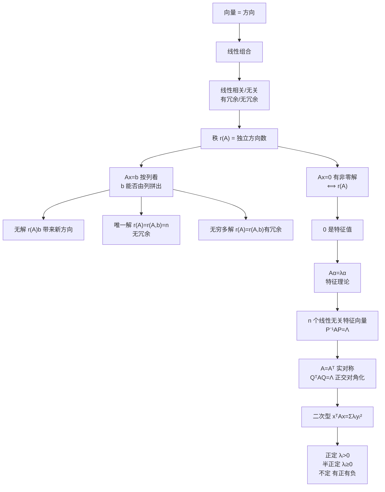

# 线性代数完整大观（总纲）

> [!info] 归属
> 线代大观 · **总纲篇**。这不是新知识，而是把行列式、矩阵、向量组、方程组、特征值、对角化、二次型**压缩成同一套语言**的总地图。与 8 篇专题笔记互为表里：专题讲细节，本篇讲框架。

> [!important] 核心一句话（考研线代总纲）
> $$\boxed{\text{线性代数研究的，本质上是"方向之间的线性关系，以及矩阵如何作用于这些方向"}}$$
> 几乎所有知识都围绕三个问题展开：
> $$\boxed{ \begin{aligned} &\text{① 有多少个真正独立的方向？} &&\longrightarrow \text{向量组、秩}\\ &\text{② 矩阵把哪些方向保留下来、哪些方向压没了？} &&\longrightarrow Ax=b,\ Ax=0,\ \text{可逆}\\ &\text{③ 有没有一些特别自然的方向，使矩阵作用特别简单？} &&\longrightarrow \text{特征值、对角化、二次型} \end{aligned}} $$

> [!note] 与专题笔记的关系
> 本篇是**总地图**，每个节点都链回对应的专题笔记；专题笔记是**放大镜**。先读本篇建立框架，再进专题看细节。

---

## 主线一：方向与秩

### 一、线性代数的第一原子：向量不是"一列数"，而是一个方向

例如 $\alpha=\begin{pmatrix}1\\2\\3\end{pmatrix}$。计算时它当然是一列数；但理解时，应该把它看成一个**方向**。于是 $2\alpha,\ -3\alpha,\ \frac12\alpha$ 虽然长度、朝向不同，但本质都在同一条直线上。

这就是为什么线性代数特别关心：**一个向量能不能由其他向量线性表示？** 例如 $\alpha_3=2\alpha_1-\alpha_2$，意味着知道了 $\alpha_1,\alpha_2$ 以后，$\alpha_3$ 没提供任何新的方向。

所以线性代数不是在数"这里有几个向量？"而是在数"这里真正有几个不能互相替代的方向？"这自然产生了两个概念：

$$\boxed{\text{线性相关}}\qquad\boxed{\text{线性无关}}$$

所谓 $k_1\alpha_1+\cdots+k_n\alpha_n=0$，如果只能有 $k_1=\cdots=k_n=0$，那么这些方向谁也不能由其他方向拼出来，所以线性无关；如果存在一组不全为零的 $k_i$，那么一定存在冗余。

$$\boxed{\text{线性相关}=\text{存在冗余}}\qquad\boxed{\text{线性无关}=\text{没有冗余}}$$

### 二、于是"秩"出现了：整个线代最重要的中枢之一

$$\boxed{\text{秩}=\text{真正独立的信息量}}\ =\ \text{最大线性无关向量个数}$$

例如 $A=\begin{pmatrix}1&2&3\\2&4&6\\3&6&9\end{pmatrix}$，三列看起来有三个向量，但 $\alpha_2=2\alpha_1,\ \alpha_3=3\alpha_1$，所以实际上只有一个独立方向：$\boxed{r(A)=1}$。

从现在开始，应该把 $r(A)=r$ 翻译成人话：
$$\boxed{A\text{ 里面真正只有 }r\text{ 个独立方向}}$$

> [!note] 详见 [[矩阵的秩（本质直觉）]]：本文讲"秩为什么是独立方向数"，专题讲完整直觉与推导。

---

## 主线二：方程组

### 三、为什么矩阵会和向量组联系起来？

因为矩阵本身就可以拆成一组列向量：$A=(\alpha_1,\alpha_2,\cdots,\alpha_n)$。如果 $x=\begin{pmatrix}x_1\\\vdots\\x_n\end{pmatrix}$，那么
$$\boxed{Ax=x_1\alpha_1+x_2\alpha_2+\cdots+x_n\alpha_n}$$
这一个式子非常重要。以后看到 $\boxed{Ax}$，脑子里要同时出现两幅图：

1. **矩阵 $A$ 作用在向量 $x$ 上**；
2. **用 $x_1,\ldots,x_n$ 作系数，把 $A$ 的列向量进行线性组合**。

第二种理解一建立，整个线性方程组几乎立刻通了。

### 四、于是线性方程组的本质一下子暴露出来

考虑 $Ax=b$，把 $A$ 写成列 $A=(\alpha_1,\ldots,\alpha_n)$，那么方程就是
$$x_1\alpha_1+\cdots+x_n\alpha_n=b.$$
所谓"解 $x_1,\ldots,x_n$"根本不是孤立地找几个数字，真正的问题是：**能不能用 $\alpha_1,\ldots,\alpha_n$ 拼出 $b$？**
$$\boxed{Ax=b\text{ 有解}}\iff\boxed{b\text{ 能由 }A\text{ 的列向量线性表示}}$$

### 五、为什么有解条件是 $r(A)=r(A,b)$？

增广矩阵 $(A,b)$ 相当于再把 $b$ 放进去。问题变成：$b$ 加进来以后，有没有产生一个全新的独立方向？

- 如果 $b$ 本来就能由 $\alpha_1,\ldots,\alpha_n$ 表示，它没有提供新方向，所以 $r(A,b)=r(A)$，方程有解；
- 反过来，如果 $r(A,b)>r(A)$，说明 $b$ 一放进去独立方向变多了，$b$ 不在原来列向量能表示的范围内，所以无解。

$$\boxed{Ax=b\text{ 有解}\iff r(A)=r(A,b)}$$
绝对不要只背成判定公式，要翻译成：
$$\boxed{\text{加入目标 }b\text{ 后没有产生新方向}}$$

### 六、有解之后，又分"唯一解"和"无穷多解"？

假设已知道 $Ax=b$ 能解，问题变成：**拼 $b$ 的方法是不是唯一？**

- 若 $r(A)=n$（$n$ 个列向量全部线性无关，没有冗余），一个 $b$ 如果能表示，方式只能有一种：$\boxed{r(A)=r(A,b)=n\Rightarrow\text{唯一解}}$；
- 若 $r(A)<n$（列向量有冗余，系数可以互相补偿），有解就会产生无穷多种表示：$\boxed{r(A)=r(A,b)<n\Rightarrow\text{无穷多解}}$。

所以三种情况应该记成一套逻辑：
$$\boxed{ \begin{aligned} r(A)<r(A,b)&\Rightarrow\text{无解},\\ r(A)=r(A,b)=n&\Rightarrow\text{唯一解},\\ r(A)=r(A,b)<n&\Rightarrow\text{无穷多解}. \end{aligned}}$$
但真正重要的是：
$$\boxed{\text{无解看 }b\text{ 能不能拼出来；唯一/无穷看表示有没有冗余}}$$

### 七、齐次方程 $Ax=0$ 为什么是整个线代的隐藏主角？

零向量永远可以由 $x=0$ 得到，所以齐次方程永远至少有零解。真正的问题是：**有没有 $x\ne0$，经过 $A$ 作用以后竟然变成 $0$？** 如果有 $Ax=0,\ x\ne0$，就意味着 $A$ 把某个非零方向彻底压没了。

这一句话极其重要，因为它同时可以翻译成：$A$ 的列向量线性相关，也就是 $r(A)<n$。因此：
$$\boxed{ Ax=0\text{ 有非零解} \iff r(A)<n }$$

### 八、为什么基础解系的向量个数是 $n-r(A)$？

不要背公式，要理解。假设一共有 $n$ 个未知数，$r(A)$ 表示真正有 $r(A)$ 个独立约束，那么
$$\boxed{\text{自由程度}\ =\ \text{未知数总数}-\text{独立约束数}\ =\ n-r(A)}$$
例如 $n=5,\ r(A)=3$：五个未知量被三个独立条件约束，还剩两个自由程度，因此齐次方程的全部解可以由两个彼此线性无关的基础解组合出来。

### 九、非齐次通解为什么一定是"特解 + 齐次通解"？

假设 $Ax=b$ 已找到一个特解 $x^*$（$Ax^*=b$），另一个解 $x$ 也满足 $Ax=b$，两式相减得 $A(x-x^*)=0$，所以 $x-x^*$ 一定是齐次方程的解。于是 $x=x^*+\eta$，其中 $A\eta=0$：
$$\boxed{\text{非齐次通解}\ =\ \text{一个特解}+\text{对应齐次方程全部解}}$$

> [!tip] 本质：齐次解描述的是
> $$\boxed{\text{怎样改变 }x\text{，却不改变 }Ax\text{ 的结果}}$$

> [!note] 详见 [[线性方程组（本质理解）]]：按列看方程组、有解判定、$n-r(A)$ 自由度、特解+齐次解的完整推导。

---

## 主线三：可逆与行列式

### 十、现在终于可以理解"可逆"到底意味着什么

对 $n$ 阶方阵，若 $A$ 可逆，$Ax=b$ 两边左乘 $A^{-1}$ 得 $x=A^{-1}b$，任何 $b$ 都有且只有一个解。这意味着 $A$ 既不会把某个方向压没，也不会把两个不同输入变成同一个输出，**所有独立方向都保留下来了**：
$$\boxed{\text{可逆}=\text{没有信息损失}}$$
而"没有信息损失"对应 $r(A)=n$。又因为 $n$ 阶方阵 $r(A)=n\iff\vert A\vert\ne0$，所以：
$$\boxed{ A\text{ 可逆} \iff r(A)=n \iff \vert A\vert\ne0 \iff Ax=0\text{ 只有零解} }$$
这几句话其实全部在讲同一件事：**所有方向都被完整保留下来了。**

### 十一、【补全模块】行列式的本质是什么？

不要把行列式理解成那个复杂的展开式。行列式最核心的任务，是回答：**这个 $n$ 阶矩阵的 $n$ 个方向有没有塌掉？**

- 若 $\vert A\vert\ne0$：方向没有挤到更低维里，$r(A)=n$，因此可逆；
- 若 $\vert A\vert=0$：至少有一个方向冗余，$r(A)<n$，于是 $A$ 把某些信息压掉了，不可逆。

$$\boxed{ \vert A\vert\ne0 \iff r(A)=n \iff A^{-1}\text{ 存在} \iff Ax=0\text{ 只有零解} }$$
按行展开、代数余子式、范德蒙德行列式等是"怎么算"；**上面的等价链才是"为什么重要"**。

> [!note] 本篇补全的行列式"为什么"，后续可在 10_数学大观 下新增《行列式（本质理解）》专题承接。

### 十二、矩阵的初等变换到底在干什么？

做初等行变换，不是在玩技巧，而是在：
$$\boxed{\text{重新组织原来的约束，而不改变真正的信息量}}$$
例如 $\begin{cases}x+y=2\\2x+2y=4\end{cases}$，第二个条件其实没有提供新信息，做 $R_2-2R_1$ 之后得到 $0=0$，于是"隐藏的重复约束"被暴露出来。

$$\boxed{\text{高斯消元的本质}=\text{把纠缠的信息重新整理，让独立信息和冗余信息显现出来}}$$
这也是为什么阶梯形矩阵中 $\boxed{\text{非零行数}=r(A)}$：最后剩下的每个非零行，代表一个真正独立的约束。

### 十三、为什么秩会成为考研线代的"交通枢纽"？

因为秩可以同时翻译成很多语言：$r(A)=r$ 可以理解成"有 $r$ 个独立列方向"、"有 $r$ 个独立行约束"、"方程中真正有效的约束有 $r$ 个"、"经过矩阵作用之后还保留下 $r$ 个独立方向"。秩一旦改变，很多事情一起改变。

于是线代第一条巨大等价链出现了：
$$\boxed{ \begin{aligned} r(A)<n &\iff \vert A\vert=0\\ &\iff A\text{ 不可逆}\\ &\iff Ax=0\text{ 有非零解}\\ &\iff 0\text{ 是 }A\text{ 的特征值}. \end{aligned}}$$
这条链是考研线代真正需要形成**条件反射**的地方。

### 十四、行满秩和列满秩，其实是在回答两个完全不同的问题

设 $A_{m\times n}$。

- **列满秩** $r(A)=n$：$n$ 个列向量全部线性无关，于是 $Ax=0$ 只有零解，即**不同的 $x$ 不容易被 $A$ 混成同一个结果**；
- **行满秩** $r(A)=m$：$A$ 的列向量能够生成整个 $m$ 维范围，即**任意 $b\in\mathbb R^m,\ Ax=b$ 都有解**。

$$\boxed{\text{行满秩：每个 }b\text{ 都打得到}}\qquad\boxed{\text{列满秩：有解时不会出现多种不同 }x}$$
方阵满秩时，两件事同时发生，于是就是可逆。

> [!warning] 避免常见错误
> $$\boxed{\text{行满秩}\ne\text{列向量一定线性无关}}\qquad\text{除非是方阵}$$

> [!note] 详见 [[行满秩（6条核心结论）]]。

### 十五、秩的很多公式其实都可以用"信息"来理解

- $r(AB)\le\min\{r(A),r(B)\}$：矩阵连续作用不会凭空创造新的独立信息，所以**越乘，秩只可能不变或下降**；
- 拼接矩阵 $(A,B)$：相当于加入新列，独立方向不可能反而减少，所以**越拼，秩只可能不变或增加**；
- 可逆矩阵 $P,Q$：$r(PAQ)=r(A)$，因为可逆变换只是在"重新表达信息"，不会丢信息。

> [!tip] 秩公式不要全当独立定理背
> 始终先问：这个操作是在**重新整理信息**，还是有可能**压掉信息**，还是在**加入信息**？

> [!note] 详见 [[矩阵的秩（10条性质）]]：10 条性质的完整公式表。

---

## 主线四：矩阵作用与特征值

### 十六、矩阵不是"数字表"，而是一个作用

考虑 $y=Ax$，最值得建立的理解是 $\boxed{A:x\longmapsto Ax}$：输入一个向量 $x$，经过 $A$ 以后变成另一个向量。通常长度会变、方向也会变。例如 $A\begin{pmatrix}1\\0\end{pmatrix}=\begin{pmatrix}2\\1\end{pmatrix}$，原来沿 $x$ 轴，现在方向被扭走了。所以一般矩阵看起来很复杂，是因为它会把各方向"搅"在一起。

### 十七、特征向量为什么会出现？

问一个非常自然的问题：**有没有某些特殊方向，经过 $A$ 以后不会被扭到别的直线上？** 如果有一个非零向量 $\alpha$ 满足 $A\alpha=\lambda\alpha$，那么 $A\alpha$ 只是 $\alpha$ 的倍数，意味着 $\alpha$ 所在的方向没有被扭走，只是可能拉长、压缩、反向、甚至被压成零。
$$\boxed{\text{特征向量}=\text{矩阵作用下的天然方向}}\qquad\boxed{\text{特征值}=\text{矩阵沿这个方向作用的倍数}}$$

### 十八、所以为什么要求 $\vert A-\lambda E\vert=0$？

绝对不要倒着学。真正的起点只有 $A\alpha=\lambda\alpha$，移项得 $(A-\lambda E)\alpha=0$。而特征向量要求 $\alpha\ne0$，所以这个齐次方程必须有非零解。刚建立过 $Bx=0$ 有非零解 $\iff \vert B\vert=0$，于是：
$$\boxed{\vert A-\lambda E\vert=0}$$
真正逻辑是：
$$\boxed{\text{寻找天然方向}\Rightarrow A\alpha=\lambda\alpha\Rightarrow (A-\lambda E)\alpha=0\Rightarrow \vert A-\lambda E\vert=0}$$

### 十九、为什么"0 是特征值"这么重要？

若 $\lambda=0$，存在 $\alpha\ne0$ 使 $A\alpha=0$，一个非零方向被 $A$ 直接压成了零，信息丢了。于是 $r(A)<n$、$\vert A\vert=0$、$A$ 不可逆：
$$\boxed{ 0\text{ 是特征值} \iff Ax=0\text{ 有非零解} \iff r(A)<n \iff \vert A\vert=0 \iff A\text{ 不可逆} }$$
这不是五条知识点，是**同一个现象的五种语言**——这就是线代真正"拉通"的感觉。

### 二十、特征值的很多性质，现在也能理解了

若 $A\alpha=\lambda\alpha$，则 $A^2\alpha=\lambda^2\alpha$，继续得 $\boxed{A^k\alpha=\lambda^k\alpha}$：复杂的矩阵高次幂，在特征方向上直接变成普通数字的幂。特征理论真正厉害的地方就是：
$$\boxed{\text{把矩阵运算降维成数字运算}}$$

> [!note] 【考研补全】常见性质
> $$\lambda_1+\cdots+\lambda_n=\mathrm{tr}(A),\qquad \lambda_1\lambda_2\cdots\lambda_n=\vert A\vert,$$
> 以及若 $\lambda$ 是 $A$ 的特征值，则在相应条件下 $A^k\rightarrow\lambda^k,\quad A^{-1}\rightarrow\frac1\lambda$。本质仍然只有 $A\alpha=\lambda\alpha$。

> [!note] 详见 [[特征值与特征向量（核心思想）]]：特征方向直觉、$|A-\lambda E|=0$ 的推导、$\lambda=0$ 的等价链。

---

## 主线五：相似对角化

### 二十一、相似对角化是特征理论的真正高潮

如果能够找到 $n$ 个线性无关的特征向量 $\alpha_1,\ldots,\alpha_n$，把它们组成 $P=(\alpha_1,\ldots,\alpha_n)$，那么
$$AP=(A\alpha_1,\ldots,A\alpha_n)=(\lambda_1\alpha_1,\ldots,\lambda_n\alpha_n)=P\Lambda.$$
左乘 $P^{-1}$ 得 $\boxed{P^{-1}AP=\Lambda}$。这就是对角化。所以：
$$\boxed{A\text{ 可对角化}\iff A\text{ 有 }n\text{ 个线性无关特征向量}}$$
本质：只要有足够多的独立"天然方向"，就可以把这些方向拿来当坐标轴。

### 二十二、为什么对角矩阵如此重要？

因为 $\Lambda y=\begin{pmatrix}\lambda_1y_1\\\lambda_2y_2\\\vdots\end{pmatrix}$，各个方向完全互不干扰。所以：
$$\boxed{\text{对角化}=\text{找到一套坐标，使矩阵在每个坐标方向上只做独立伸缩}}$$
这并不是为了"把矩阵变成对角矩阵很好看"，而是因为**对角矩阵把矩阵的内部结构彻底暴露出来了**。

### 二十三、相似矩阵到底为什么叫"相似"？

假设 $B=P^{-1}AP$。真正意思是：
$$\boxed{A,B\text{ 描述的是同一个线性作用，只不过使用了不同坐标系}}$$
所以相似矩阵有很多共同性质——因为"东西没变，只是坐标变了"：特征值不变、行列式不变、秩不变、迹不变。这些都是矩阵作用本身的内在性质。

> [!note] 详见 [[相似对角化与实对称矩阵（本质理解）]]：相似=换基、$AP=P\Lambda$ 推导、三个层次。

### 二十四、为什么"有 $n$ 个不同特征值"一定可对角化？

因为不同特征值对应的特征向量一定线性无关。所以 $n$ 阶矩阵若已有 $n$ 个互不相同的特征值，自然能获得 $n$ 个线性无关特征方向，于是必可对角化。但反过来不成立：例如 $A=E$，所有特征值都是 $1$，但它本身已经是对角矩阵。所以真正决定条件不是"特征值是否重复"，而是：
$$\boxed{\text{能不能凑够 }n\text{ 个线性无关特征向量}}$$

### 二十五、为什么实对称矩阵突然变得特别漂亮？

$A=A^T$。实对称矩阵最特殊的结论：
$$\boxed{\text{实对称矩阵一定可以正交对角化}}$$
即存在正交矩阵 $Q$（$Q^TQ=E$）使 $\boxed{Q^TAQ=\Lambda}$。因为 $Q^{-1}=Q^T$，它仍属于相似对角化，但比一般 $P^{-1}AP$ 更漂亮：普通对角化只保证特征向量**线性无关**，而实对称矩阵可以选成**两两垂直并且长度为 1**。
$$\boxed{\text{一般可对角化：得到一组特征向量基}}\qquad\boxed{\text{实对称：得到一组标准正交特征向量基}}$$

### 二十六、为什么不同特征值对应的特征向量正交？

设 $Au=\lambda u,\ Av=\mu v$，且 $\lambda\ne\mu$。因为 $A=A^T$：
$$u^TAv=(Au)^Tv.$$
左边用 $Av=\mu v$ 得 $\mu u^Tv$，右边用 $Au=\lambda u$ 得 $\lambda u^Tv$，所以 $(\lambda-\mu)u^Tv=0$，由于 $\lambda\ne\mu$：
$$\boxed{u^Tv=0}$$
实对称矩阵特征方向之间的正交性不是偶然的，它恰恰来源于 $\boxed{A^T=A}$。

---

## 主线六：二次型

### 二十七、现在二次型自然出现了

考虑 $f(x)=x^TAx$，这就是二次型的矩阵表达。例如 $A=\begin{pmatrix}2&1\\1&3\end{pmatrix}$，则 $x^TAx=2x_1^2+2x_1x_2+3x_2^2$。

> [!warning] 考研千万注意交叉项
> 如果二次型中有 $6x_1x_2$，那么对称矩阵中 $a_{12}=a_{21}=3$。因为交叉项来自两份 $a_{12}x_1x_2+a_{21}x_2x_1$，**交叉项系数要对半分**。

### 二十八、二次型为什么非要"化标准形"？

例如 $f=2x_1^2+2x_1x_2+2x_2^2$，$x_1x_2$ 交叉项让两个方向纠缠在一起。我们真正想要的是 $f=\lambda_1y_1^2+\lambda_2y_2^2$，因为此时两个方向互不干扰：
$$\boxed{\text{化二次型标准形}\ =\ \text{寻找更自然的坐标轴，消掉方向之间的交叉干扰}}$$

### 二十九、为什么二次型换元变成 $C^TAC$，而不是 $C^{-1}AC$？

二次型 $f=x^TAx$，令 $x=Cy$，则 $f=(Cy)^TA(Cy)=y^TC^TACy$，矩阵变成 $\boxed{C^TAC}$，这叫**合同变换**。而线性变换换基时是 $\boxed{P^{-1}AP}$（**相似变换**）。所以一定区别：
$$\boxed{\text{相似： }P^{-1}AP}\qquad\boxed{\text{二次型换元： }C^TAC}$$

### 三十、那么为什么到了实对称矩阵，这两条线突然合流？

因为实对称矩阵可以选正交矩阵 $Q$：$Q^{-1}=Q^T$，所以 $Q^{-1}AQ=Q^TAQ=\Lambda$。于是非常神奇的事情发生了——普通矩阵的相似对角化、实对称矩阵的正交对角化、二次型的正交变换，全部使用同一个 $Q$。
$$\boxed{\text{到实对称矩阵这里，相似变换与二次型的正交变换统一了}}$$
这就是为什么实对称矩阵是整本考研线代最关键的桥梁之一。

### 三十一、特征值终于和二次型彻底连上了

因为 $A=Q\Lambda Q^T$，令 $x=Qy$，则 $x^TAx=y^TQ^TAQy=y^T\Lambda y$：
$$\boxed{x^TAx=\lambda_1y_1^2+\cdots+\lambda_ny_n^2}$$
这一个式子，是后半部线代最值得记住的式子之一。它告诉你：
$$\boxed{\text{特征向量}=\text{二次型真正天然的方向}}\qquad\boxed{\text{特征值}=\text{这个方向上二次型的系数}}$$
于是以前神秘的"特征值"获得了第二层含义：在线性变换问题里 $\lambda_i=$ 沿特征方向的伸缩倍数；在二次型问题里 $\lambda_i=$ 沿天然方向的平方项系数。

### 三十二、所以正定矩阵到底是什么？

不要背判定条件。从 $f(x)=x^TAx$ 出发，所谓正定就是 $\boxed{x\ne0\Rightarrow x^TAx>0}$。经过正交变换 $x^TAx=\lambda_1y_1^2+\cdots+\lambda_ny_n^2$，如果所有 $\lambda_i>0$，那么只要 $y\ne0$ 就有 $x^TAx>0$：
$$\boxed{A\text{ 正定} \iff \lambda_1,\ldots,\lambda_n>0}\qquad(\text{默认实对称})$$

### 三十三、半正定的"半"到底是什么意思？

半正定：$\boxed{x^TAx\ge0}$，允许某些非零 $x$ 使 $x^TAx=0$，也就是允许某些 $\lambda_i=0$：
$$\boxed{A\text{ 半正定} \iff \lambda_i\ge0}$$
$$\boxed{\text{不出现负值，但允许某些非零方向取到 }0}$$
正定与半正定真正只差：**允不允许零方向**。

### 三十四、你现在应该意识到：零特征值又出现了

假如一个半正定矩阵有 $\lambda_k=0$，对应特征向量 $Av=0,\ v\ne0$，于是 $r(A)<n$，可能不可逆。又回到主线：
$$\boxed{\lambda=0 \iff Ax=0\text{ 有非零解} \iff r(A)<n \iff \vert A\vert=0}$$
而在二次型语言中：$\lambda=0=$ 某个非零方向上二次型完全不起作用。**同一件事情，现在你已拥有三套解释**：
- 方程组语言：有自由方向；
- 矩阵语言：有方向被压没；
- 二次型语言：有方向对应平方量为零。

### 三十五、为什么 $A^TA$ 一定半正定？

$$x^TA^TAx=(Ax)^T(Ax)=\boxed{\Vert Ax\Vert^2\ge0}$$
所以 $A^TA$ 一定半正定。什么时候正定？要求 $x\ne0\Rightarrow Ax\ne0$，即 $Ax=0$ 只有零解，也就是 $A$ 列满秩：
$$\boxed{A^TA\text{ 正定} \iff Ax=0\text{ 只有零解} \iff A\text{ 列满秩}}$$
这里又一次把正定、齐次方程、秩、线性无关连在了一起。

### 三十六、标准形、规范形，本质区别是什么？

二次型标准形 $\boxed{d_1y_1^2+\cdots+d_ry_r^2}$ 重点只有一个：**没有交叉项**。而规范形继续把非零系数化成 $1$ 或 $-1$：
$$\boxed{z_1^2+\cdots+z_p^2-z_{p+1}^2-\cdots-z_r^2}$$
最终只留下 $\boxed{+1,\ -1,\ 0}$。所以规范形在问最本质的事情：
$$\boxed{\text{有几个正方向、几个负方向、几个零方向？}}$$
虽然一般可逆换元得到的标准形系数未必等于特征值，但**正项、负项、零项的个数不会改变**——这就是考研中二次型"惯性"思想的本质。

### 三十七、二次型的秩为什么就是对应矩阵的秩？

假设最终 $f=\lambda_1y_1^2+\cdots+\lambda_ry_r^2$ 且 $\lambda_1,\ldots,\lambda_r\ne0$，其他系数为零，说明真正起作用的方向只有 $r$ 个：
$$\boxed{r(f)=r(A)=r}$$
本质仍然是：**真正有效的独立方向数**。线代从头到尾，"秩"的本质根本没有变。

> [!note] 详见 [[二次型（本质理解）]]、[[半定矩阵（本质理解）]]：二次型矩阵化、标准形/规范形、正定/半正定判定。

---

## 主线七：两个贯穿例子

### 三十八、用一个矩阵把整本线代穿起来

看 $A=\begin{pmatrix}2&1\\1&2\end{pmatrix}$。

**先看行列式**：$\vert A\vert=4-1=3\ne0$，于是立刻知道：$r(A)=2$、$A$ 可逆、$Ax=0$ 只有零解、$Ax=b$ 对任意 $b$ 都有唯一解、$0$ 不是特征值。

**再求特征值**：$\vert A-\lambda E\vert=0$ 得 $\lambda_1=3,\ \lambda_2=1$，对应特征方向 $\begin{pmatrix}1\\1\end{pmatrix},\ \begin{pmatrix}1\\-1\end{pmatrix}$。这两个方向正好互相垂直（因为 $A$ 实对称）。单位化后组成 $Q$，得到 $Q^TAQ=\begin{pmatrix}3&0\\0&1\end{pmatrix}$。

**再看对应二次型**：$f(x)=x^TAx=2x_1^2+2x_1x_2+2x_2^2$，换到特征坐标后 $\boxed{f=3y_1^2+y_2^2}$。由于 $\lambda_1,\lambda_2>0$，所以 $\boxed{A\text{ 正定}}$。

于是两条大主线在这个例子里全部接起来了：
$$\boxed{ \begin{array}{c} \vert A\vert\ne0\\ \Updownarrow\\ r(A)=2\\ \Updownarrow\\ A\text{ 可逆}\\ \Updownarrow\\ Ax=0\text{ 只有零解}\\ \Updownarrow\\ 0\text{ 不是特征值} \end{array}} \qquad\qquad \boxed{ A=A^T\Rightarrow Q^TAQ=\Lambda\Rightarrow x^TAx=3y_1^2+y_2^2\Rightarrow A\text{ 正定} }$$

### 三十九、再看一个"零特征值"，你会看到整张知识网一起塌一维

考虑 $B=\begin{pmatrix}1&1\\1&1\end{pmatrix}$，两列相同，所以 $r(B)=1<2$。因此：$\vert B\vert=0$、$B$ 不可逆、$Bx=0$ 存在非零解（例如 $x=\begin{pmatrix}1\\-1\end{pmatrix}$）、$0$ 是 $B$ 的特征值（另一个特征值是 $2$）。

再看 $B$ 的二次型：
$$x^TBx=x_1^2+2x_1x_2+x_2^2=(x_1+x_2)^2\ge0,$$
但沿 $x_1=-x_2$ 方向恰好等于零。所以 $\boxed{B\text{ 半正定但不正定}}$。

这一个例子几乎就是半本线代：
$$\boxed{ \begin{aligned} \text{列相关} &\iff r(B)<2\\ &\iff \vert B\vert=0\\ &\iff B\text{ 不可逆}\\ &\iff Bx=0\text{ 有非零解}\\ &\iff 0\text{ 是特征值}\\ &\iff \text{存在零方向}\\ &\iff x^TBx\text{ 可以在非零方向取 }0. \end{aligned}}$$
如果真正把这两个例子吃透，很多知识点就不需要分别背了。

---

## 主线八：三种化简、翻译系统、总神经网络

### 四十、整个考研线代，其实只有三种"化简"

| 变换 | 公式 | 服务于 | 本质 | 理想结果 |
|------|------|--------|------|----------|
| 初等变换 | — | 秩、方程组、逆矩阵等计算 | 重新整理信息 | 阶梯形 |
| 相似变换 | $P^{-1}AP$ | 研究同一线性作用换坐标后能否变简单 | 换坐标 | $\Lambda$ |
| 合同变换 | $C^TAC$ | 二次型换元，消掉交叉项 | 消交叉项 | 标准形 |

而实对称矩阵是最漂亮的地方，因为可以选择正交 $Q$（$Q^{-1}=Q^T$）使 $Q^{-1}AQ=Q^TAQ=\Lambda$，于是"矩阵对角化"和"二次型化标准形"在这里**合流**。

### 四十一、真正做考研题时，应该形成这套"翻译系统"

以后不要看到什么章节就用什么章节的方法，而是先翻译题目的语言：

1. 看到"向量能否表示、线性相关、极大无关组" → 翻译成：独立方向有几个？秩是多少？
2. 看到 $Ax=b$ → 翻译成：$b$ 能否由 $A$ 的列拼出来？表示是否唯一？
3. 看到 $Ax=0$ → 马上想：有没有方向被压成零？$r(A)<n$ 吗？
4. 看到 $\vert A\vert=0$ → 马上联想到：降秩、不可逆、齐次非零解、0 特征值。
5. 看到 $A\alpha=\lambda\alpha$ → 先想：这是矩阵不会扭走的天然方向，而不是先想特征方程。
6. 看到"可对角化" → 先问：能不能找到 $n$ 个线性无关特征方向？
7. 看到 $A=A^T$ → 马上想到：实对称 → 正交特征向量 → $Q^TAQ=\Lambda$ → 二次型。
8. 看到 $x^TAx$ → 马上想到：把 $A$ 正交对角化，最终研究 $\sum\lambda_iy_i^2$，正负性就看特征值符号。

### 四十二、把整个考研线代压成一张"总神经网络"

> [!note] 这就是你现有笔记最终形成的"二次型—实对称矩阵—正交对角化—特征值—正定性"汇合链（见 [[二次型（本质理解）]]）。

---

## 你最终要形成的不是"六章知识"，而是下面这三个本质

> [!important] 第一个本质：秩
> $$\boxed{\text{秩}=\text{真正独立的方向数}=\text{真正独立的信息量}}$$
> 它统一：向量组、线性相关、极大无关组、方程组、自由变量、可逆、行列式。

> [!important] 第二个本质：矩阵作用
> $$\boxed{x\longmapsto Ax}$$
> 矩阵在问：哪些方向被保留？哪些方向被压掉？哪些方向不会被扭走？其中 $Ax=0$ 研究**被压掉**的方向；$A\alpha=\lambda\alpha$ 研究**不会被扭走**的方向。

> [!important] 第三个本质：换坐标找最自然的方向
> $$\boxed{\text{复杂往往不是对象本身复杂，而是当前坐标系不够自然}}$$
> 找到特征方向 $P^{-1}AP=\Lambda$；实对称矩阵甚至可以找到互相垂直的天然方向 $Q^TAQ=\Lambda$；于是二次型也被彻底拆开 $x^TAx=\sum\lambda_iy_i^2$。

> [!important] 把整个考研线代的灵魂压缩成最后一句
> $$\boxed{\textbf{先研究有多少独立方向（秩），再研究矩阵如何作用这些方向（方程与特征），最后寻找最自然的坐标把这种作用彻底拆开（对角化与二次型）。}}$$
> 如果这一句话真正建立起来，行列式、秩、方程组、特征值、对角化、二次型就不再是六门知识，而是**同一件事从不同角度被反复描述**。

## 相关链接（专题地图）

- [[线代大观 MOC]]（主索引）
- [[矩阵的秩（本质直觉）]]（秩 = 独立方向数的完整直觉）
- [[矩阵的秩（10条性质）]]（秩的 10 条公式性质）
- [[行满秩（6条核心结论）]]（行满秩专题）
- [[线性方程组（本质理解）]]（$Ax=b$ 按列看，有解/唯一/无穷 + 基础解系）
- [[特征值与特征向量（核心思想）]]（$A\alpha=\lambda\alpha$ 与 $\vert A-\lambda E\vert=0$）
- [[相似对角化与实对称矩阵（本质理解）]]（$P^{-1}AP$、$Q^TAQ$、正交对角化）
- [[二次型（本质理解）]]（$f=x^TAx$，化标准形 = 找天然坐标轴）
- [[半定矩阵（本质理解）]]（正定/半正定由特征值符号决定）
- [[🌟A可逆的等价命题]]（可逆 ⇔ 满秩 ⇔ 0 不是特征值）
- [[🌟基础解系和极大线性无关组]]（$n-r(A)$ 与解空间维数）
- [[🌟施密特正交化]]（实对称矩阵特征向量的正交化工具）
