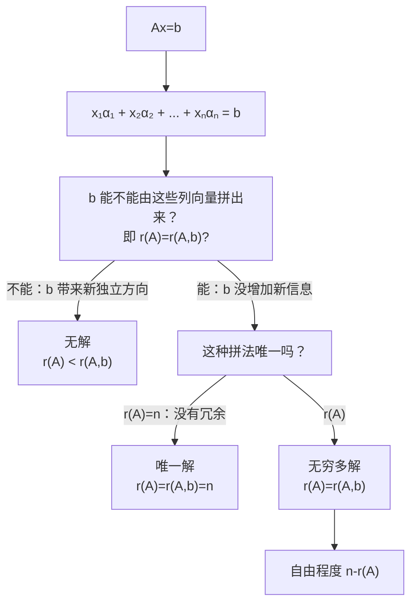

# 线性方程组（本质理解）

> [!info] 归属
> 线代大观 · 线性方程组专题 · **本质理解篇**。把前面"秩的本质""特征值的本质"在这里串成一张网。核心不是背"增广矩阵怎么消元"，而是先建立：**解方程组到底在做什么？**

> [!important] 核心一句话（两个角度）
> $$\boxed{ \text{解方程组的本质，就是寻找一组系数，使若干已知向量线性组合成指定向量。} }$$
> 换一个角度说：
> $$\boxed{ \text{也是在寻找同时满足若干个线性约束的未知量。} }$$
> 一个"按列看"，一个"按行看"。把这两种理解建立起来，后面的有解无解、唯一解无穷多解、秩、基础解系、自由未知量就全部能连起来。

---

## 一、先从最普通的方程组开始

例如
$$\begin{cases} x+2y=5,\\ 3x-y=4. \end{cases}$$
我们平时说"解方程组"，似乎就是要找到 $x,y$。但它真正问的是：**有没有一对数 $x,y$，能够同时满足这两个条件？**

一个"解" $(x,y)$ 本质上就是一个**同时满足所有约束的数值组合**。例如第一式要求 $x+2y=5$，第二式又要求 $3x-y=4$。我们不是分别找两个答案，而是找：
$$\boxed{\text{同时满足两条要求的同一个 }(x,y)}$$
这就是"联立"的本质。

---

## 二、从几何角度看：解 = 若干约束的公共部分

二维情况下 $ax+by=c$ 表示一条直线。因此两个二元一次方程
$$\begin{cases} a_1x+b_1y=c_1,\\ a_2x+b_2y=c_2 \end{cases}$$
实际上就是在问：**两条直线有没有公共点？**

于是自然只有三种情况：

| 情况 | 几何 | 结论 |
|------|------|------|
| 只有一个交点 | 两直线相交 | $\boxed{\text{唯一解}}$ |
| 两条直线平行但不重合 | 无公共点 | $\boxed{\text{无解}}$ |
| 两条直线完全重合 | 无穷多个公共点 | $\boxed{\text{无穷多解}}$ |

所以线性方程组为什么只有"无解、唯一解、无穷多解"，而不会恰好有两个解、三个解？从几何上已经能感受到原因：**对于线性约束来说，一旦出现两个不同的解，往往它们之间还可以产生更多解，因此不可能只有有限多个不同解。**

---

## 三、在线性代数里，更重要的是写成 $Ax=b$

例如
$$\begin{cases} x_1+2x_2=5,\\ 3x_1-x_2=4 \end{cases}$$
可以写成：
$$\begin{pmatrix}1&2\\3&-1\end{pmatrix}\begin{pmatrix}x_1\\x_2\end{pmatrix}=\begin{pmatrix}5\\4\end{pmatrix}.$$
记成 $\boxed{Ax=b}$：
$$A=\text{系数矩阵},\qquad x=\text{未知数向量},\qquad b=\text{常数项向量}.$$
但仅仅这样记还不够，最重要的是理解 $Ax=b$ 究竟在说什么。

---

## 四、把 $A$ 按列拆开，你就看见了方程组真正的核心

设
$$A=(\alpha_1,\alpha_2,\cdots,\alpha_n),\qquad x=\begin{pmatrix}x_1\\x_2\\\vdots\\x_n\end{pmatrix}.$$
那么矩阵乘法 $Ax$ 实际上就是：
$$\boxed{ Ax=x_1\alpha_1+x_2\alpha_2+\cdots+x_n\alpha_n }$$
所以方程 $Ax=b$ 其实就是：
$$\boxed{ x_1\alpha_1+x_2\alpha_2+\cdots+x_n\alpha_n=b }$$
现在本质就暴露出来了。

---

## 五、所以"解方程组"到底是在干什么？

就是问：**能不能用 $A$ 的这些列向量 $\alpha_1,\alpha_2,\cdots,\alpha_n$，经过适当的线性组合，拼出目标向量 $b$？**

如果能，那么 $(x_1,\cdots,x_n)$ 就是一个解。所以：
$$\boxed{ \text{解 }Ax=b\ =\ \text{寻找把列向量组合成 }b\text{ 的系数} }$$
这是线性方程组非常重要的一层本质。

---

## 六、举一个最简单的例子

设
$$A=\begin{pmatrix}1&0\\0&1\end{pmatrix}.$$
两列为 $\alpha_1=\begin{pmatrix}1\\0\end{pmatrix},\ \alpha_2=\begin{pmatrix}0\\1\end{pmatrix}$。求解 $Ax=\begin{pmatrix}3\\5\end{pmatrix}$，本质上就是问：
$$x_1\begin{pmatrix}1\\0\end{pmatrix}+x_2\begin{pmatrix}0\\1\end{pmatrix}=\begin{pmatrix}3\\5\end{pmatrix}.$$
显然 $x_1=3,\ x_2=5$。所以所谓"解未知数"，实际上是在寻找：
$$\boxed{\text{组合列向量时应该使用什么系数}}$$

---

## 七、这个观点立刻解释了"为什么会无解"

比如 $\alpha_1=\begin{pmatrix}1\\1\end{pmatrix},\ \alpha_2=\begin{pmatrix}2\\2\end{pmatrix}$。因为 $\alpha_2=2\alpha_1$，所以不管取什么 $x_1,x_2$：
$$x_1\alpha_1+x_2\alpha_2=(x_1+2x_2)\begin{pmatrix}1\\1\end{pmatrix}.$$
也就是说只可能得到 $\begin{pmatrix}t\\t\end{pmatrix}$ 这种向量。如果现在要求
$$x_1\alpha_1+x_2\alpha_2=\begin{pmatrix}1\\0\end{pmatrix},$$
显然不可能，因为右边根本不在这些列向量能够线性表示的范围里。所以：
$$\boxed{\text{方程组无解}\ \iff\ b\text{ 不能由 }A\text{ 的列向量线性表示}}$$

---

## 八、所以"有解"的真正条件是什么？

对于 $Ax=b$，设 $A=(\alpha_1,\cdots,\alpha_n)$。它有解 $\iff b=x_1\alpha_1+\cdots+x_n\alpha_n$，也就是：
$$\boxed{ b\text{ 能由 }\alpha_1,\cdots,\alpha_n\text{ 线性表示} }$$
这句话和"秩"可以立刻连接起来。

---

## 九、为什么有解条件是 $r(A)=r(A,b)$？

这里 $(A,b)=(\alpha_1,\cdots,\alpha_n,b)$ 是**增广矩阵**。原来 $r(A)$ 是在问 $\alpha_1,\cdots,\alpha_n$ 中有多少个真正独立的向量；现在把 $b$ 放进去，$r(A,b)$ 是在问：**加入 $b$ 后，独立信息有没有增加？**

**第一种情况：$b$ 能被原来的列表示。** 如果 $b=x_1\alpha_1+\cdots+x_n\alpha_n$，那么加入 $b$ 根本没有产生新的独立方向，所以 $r(A,b)=r(A)$，方程组有解。

**第二种情况：$b$ 不能被原来的列表示。** 那么 $b$ 加进来以后多出了一个新独立方向，因此 $r(A,b)>r(A)$，无解。

> [!important] 不要机械记忆，要懂本质
> $$\boxed{ \text{加上 }b\text{ 后秩不增加}\ \iff\ b\text{ 本来就能由 }A\text{ 的列表示} }$$
> 也就是方程能解。所以 $r(A)=r(A,b)$ 的本质是"$b$ 没有带来新信息"。

---

## 十、这也解释了为什么 $r(A)\neq r(A,b)$ 一定无解

假设 $r(A)=2,\ r(A,b)=3$：原来的列向量只有两个独立方向，但 $b$ 加进来以后变成三个独立方向，这说明 $b$ 绝对不可能由原来的列表示（如果能表示，就不应该产生新的独立方向）。所以无解。

> [!tip] 把"秩不同"直接翻译成人话
> $$\boxed{\text{目标 }b\text{ 跑出了原来的列向量所能表示的范围}}$$

---

## 十一、那么为什么有时候唯一解，有时候无穷多解？

假设已经知道 $r(A)=r(A,b)$，方程有解。接下来就要问：**表示 $b$ 的系数 $x_1,\cdots,x_n$，到底是不是唯一的？** 这和 $A$ 的列向量是否线性无关直接有关。

---

## 十二、如果 $A$ 的 $n$ 个列向量线性无关

假设 $r(A)=n$，即 $\alpha_1,\cdots,\alpha_n$ 全部线性无关。如果有两个解 $x,y$ 都满足 $Ax=b,\ Ay=b$，相减得到 $A(x-y)=0$。由于列向量线性无关，$Az=0$ 只能有 $z=0$，所以 $x-y=0$，即 $x=y$。因此：
$$\boxed{\text{唯一解}}$$
从本质上讲：
$$\boxed{ \text{唯一解}\ =\ b\text{ 能被表示，而且表示方式只有一种} }$$

---

## 十三、如果列向量存在"冗余"，为什么会无穷多解？

假设 $r(A)<n$，$n$ 个列向量线性相关，于是存在不全为零的 $k_1,\cdots,k_n$ 使 $k_1\alpha_1+\cdots+k_n\alpha_n=0$，也就是存在 $\eta\ne0$ 满足 $A\eta=0$。

现在假设 $Ax=b$ 已经有一个解 $x_0$，那么
$$A(x_0+\eta)=Ax_0+A\eta=b+0=b.$$
所以 $x_0+\eta$ 也是解。不只是它，对于任意数 $k$，$A(x_0+k\eta)=b$。于是：
$$\boxed{x=x_0+k\eta\ \text{ 都是解}}$$
所以一下子产生无穷多个解。这就是为什么 $r(A)<n$ 在方程有解的情况下会导致**无穷多解**。

---

## 十四、所以"解的三种情况"终于可以从本质上总结

> [!important] 对 $n$ 个未知数的非齐次线性方程组 $Ax=b$：

| 情况 | 秩条件 | 本质 |
|------|--------|------|
| ① 无解 | $\boxed{r(A)<r(A,b)}$ | $b$ 无法由 $A$ 的列向量表示 |
| ② 唯一解 | $\boxed{r(A)=r(A,b)=n}$ | $b$ 可以表示，且列向量彼此独立，表示方式唯一 |
| ③ 无穷多解 | $\boxed{r(A)=r(A,b)<n}$ | $b$ 可以表示，但列向量之间存在冗余，表示方式不唯一 |

> [!warning] 这三个式子不要单独背
> 连着上面的解释一起理解：**无解看"秩增没增"，有解看"有没有冗余"。**

---

## 十五、那我们平时为什么要"消元"？

例如
$$\begin{cases} x+y=3,\\ 2x+2y=6. \end{cases}$$
第二个方程其实就是第一个方程乘 2，所以第二个约束没有增加新信息。我们做"第二式 $-2\times$ 第一式"得到 $0=0$。

你看，消元并不是在玩数字技巧，它是在：
$$\boxed{\text{把隐藏的重复信息暴露出来}}$$
再比如
$$\begin{cases} x+y=3,\\ 2x+2y=7. \end{cases}$$
做相同操作"第二式 $-2\times$ 第一式"得到 $0=1$——出现了一个不可能满足的条件，所以无解。

因此高斯消元/初等行变换的本质就是：
$$\boxed{\text{在不改变方程组解的前提下，把复杂的约束重新整理成容易观察的形式}}$$

---

## 十六、为什么初等行变换"不改变解"？

假如原来有方程组①、②，我们把第二式改成 $②-k①$。如果某个 $x$ 同时满足原来的①和②，那么当然也满足 $②-k①$。反过来，如果它满足①和 $②-k①$，那么把 $k①$ 加回来，就又得到②。所以新旧方程组拥有完全相同的解。

$$\boxed{\text{初等行变换是在改写方程，而不是改变答案}}$$
这就是为什么我们敢一直消元。

---

## 十七、阶梯形矩阵到底是在告诉我们什么？

例如最后得到
$$\begin{pmatrix}1&2&0&3\\0&1&4&2\\0&0&0&0\end{pmatrix}.$$
假设前三列对应三个未知数，最后一列是常数项，对应
$$\begin{cases} x_1+2x_2=3,\\ x_2+4x_3=2. \end{cases}$$
这里有 $n=3$ 个未知数，但真正独立的方程只有 $r(A)=2$。所以三个未知量被两个独立条件限制之后，还剩 $3-2=1$ 个自由量。于是可以令 $x_3=c$，然后 $x_2=2-4c$，再求 $x_1$。这就是"自由未知量"的来源。

---

## 十八、所以 $n-r(A)$ 的本质是什么？

有 $n$ 个未知数，真正独立的约束有 $r(A)$ 个，那么剩余可以自由选择的数量就是 $n-r(A)$。所以：
$$\boxed{ \text{自由未知量个数}\ =\ \text{未知数总数}-\text{独立约束数} }$$
也就是 $\boxed{n-r(A)}$。这比死背"基础解系含 $n-r(A)$ 个向量"要重要得多。

> [!tip] 一句直觉
> $$\boxed{ \text{未知数个数}-\text{独立约束个数}\ =\ \text{自由程度} }$$

---

## 十九、齐次方程 $Ax=0$ 为什么尤其特殊？

现在看 $\boxed{Ax=0}$。它是在问 $x_1\alpha_1+\cdots+x_n\alpha_n=0$，也就是：**$A$ 的列向量之间有没有非平凡的线性关系？**

**永远有解**：直接取 $x=0$ 就有 $A0=0$，所以齐次方程组不会出现"无解"。

**什么时候只有零解？** 如果列向量线性无关，$x_1\alpha_1+\cdots+x_n\alpha_n=0$ 只能推出 $x_1=\cdots=x_n=0$：
$$\boxed{r(A)=n\iff Ax=0\text{ 只有零解}}$$

**什么时候存在非零解？** 如果 $r(A)<n$，列向量线性相关，必然存在一组不全为零的系数，于是：
$$\boxed{ Ax=0\text{ 有非零解} \iff r(A)<n }$$

> [!note] 这个结论几乎就是"线性相关"的定义换了一个写法。

---

## 二十、基础解系到底是什么？为什么需要它？

假设 $Ax=0$ 有无穷多个解，我们当然不可能把无穷多个解一个一个写下来。所以希望找少数几个最基本的解 $\eta_1,\eta_2,\cdots,\eta_s$，使得**所有解都能写成**
$$\boxed{ x=k_1\eta_1+k_2\eta_2+\cdots+k_s\eta_s }$$
并且 $\eta_1,\cdots,\eta_s$ 彼此线性无关。这就是**基础解系**。

$$\boxed{\text{基础解系}\ =\ \text{用最少的一组彼此独立的解，把所有解都表示出来}}$$
而它里面解向量的个数：
$$\boxed{s=n-r(A)}$$

---

## 二十一、非齐次方程的通解为什么是 $x=x^*+\eta$？

这是考研里一个非常核心的思想。假设 $Ax=b$ 已经找到一个特解 $Ax^*=b$。现在任意另外一个解 $x$ 满足 $Ax=b$。两式相减：
$$Ax-Ax^*=0,\qquad A(x-x^*)=0.$$
所以 $x-x^*$ 一定是齐次方程 $A\eta=0$ 的解。令 $\eta=x-x^*$，那么：
$$\boxed{x=x^*+\eta}$$
所以非齐次方程的所有解就是：
$$\boxed{ \text{一个特解}+\text{对应齐次方程的全部解} }$$

---

## 二十二、这句话的本质特别漂亮

对于 $Ax=b$，假设 $x^*$ 已经把 $b$ 拼出来（$Ax^*=b$）。但是有些变化 $\eta$ 会被 $A$ "消掉"（$A\eta=0$），那么：
$$A(x^*+\eta)=Ax^*+A\eta=b.$$
所以你在 $x^*$ 上加任何齐次解，都不会改变最终的 $b$。因此：
$$\boxed{ \text{齐次方程的解，描述了"怎样改变未知量却不改变方程结果"} }$$
这个理解非常重要。

---

## 二十三、用一个具体例子感受一下

考虑 $x_1+x_2=1$，写成
$$\begin{pmatrix}1&1\end{pmatrix}\begin{pmatrix}x_1\\x_2\end{pmatrix}=1.$$
先找一个特解 $x^*=\begin{pmatrix}1\\0\end{pmatrix}$（因为 $1+0=1$）。对应齐次方程 $x_1+x_2=0$ 的通解为
$$\eta=k\begin{pmatrix}1\\-1\end{pmatrix}.$$
所以原方程全部解：
$$x=\begin{pmatrix}1\\0\end{pmatrix}+k\begin{pmatrix}1\\-1\end{pmatrix},\qquad\text{即}\ x_1=1+k,\ x_2=-k.$$

注意 $\begin{pmatrix}1\\-1\end{pmatrix}$ 表示一种特殊变化：$x_1$ 增加多少，$x_2$ 就减少多少，因此 $x_1+x_2$ 始终不变。这就是**齐次解所代表的"不会影响右边结果的变化方向"**。

---

## 二十四、现在把"秩"和"方程组"彻底连起来

秩的本质是 $r(A)=$ 真正独立的信息量。现在方程组 $Ax=b$ 里，$r(A)$ 可以理解为：
$$\boxed{\text{真正独立的约束有多少个}}$$
或从列的角度：
$$\boxed{\text{真正独立的列方向有多少个}}$$
- $r(A)$ 越大：独立约束越多，自由程度越少；
- $r(A)$ 越小：重复信息越多，自由程度越大。

这就是为什么 $n-r(A)$ 决定了自由未知量的个数。

---

## 二十五、一个经常让初学者困惑的问题：方程多，是不是约束就一定多？

不是。例如
$$\begin{cases} x+y=2,\\ 2x+2y=4,\\ 3x+3y=6,\\ 100x+100y=200. \end{cases}$$
看起来有 4 个方程，但实际上后面三个全部是第一个的倍数，所以真正独立的约束只有 1 个，因此 $r(A)=1$。

> [!warning] 一定要区别两个概念
> $$\boxed{\text{方程个数}}\quad\text{与}\quad\boxed{\text{独立方程个数}}$$
> 真正起作用的是后者，而它正是秩在告诉你的事情。

---

## 二十六、你可以把"解方程组"分成三个层次理解

| 层次 | 视角 | 内容 |
|------|------|------|
| 第一层 | 高中视角 | 寻找 $x_1,x_2,\cdots,x_n$ 使所有等式同时成立 |
| 第二层 | 约束视角 | 每个方程是一个线性约束，解方程组是找所有约束的公共解 |
| 第三层 | 线性代数视角 | $Ax=b \Rightarrow x_1\alpha_1+\cdots+x_n\alpha_n=b$，解方程组就是寻找一组系数把 $A$ 的列向量线性组合成 $b$ |

> [!important] 第三层是考研线代以后尤其应该掌握的视角

---

## 二十七、把所有判定公式"翻译成人话"

对 $Ax=b$，有 $n$ 个未知数：

| 秩条件 | 翻译成人话 | 结论 |
|--------|-----------|------|
| $\boxed{r(A)<r(A,b)}$ | $b$ 带来了新的独立信息，原来的列拼不出 $b$ | $\boxed{\text{无解}}$ |
| $\boxed{r(A)=r(A,b)=n}$ | $b$ 能拼出来，且所有列都独立，没有自由活动的余地 | $\boxed{\text{唯一解}}$ |
| $\boxed{r(A)=r(A,b)=r<n}$ | $b$ 能拼出来，但有些列之间存在重复关系，一些未知量可以自由变化 | $\boxed{\text{无穷多解}}$ |

自由未知量个数：$\boxed{n-r}$。

---

## 二十八、总主线

> [!important] 以后看到线性方程组 $Ax=b$，按这条路线思考：

---

## 你真正应该记住的四句话

> [!important] 第一句
> $$\boxed{ \text{解方程组}\ =\ \text{寻找一组系数，使列向量线性组合成 }b }$$

> [!important] 第二句
> $$\boxed{ r(A)=r(A,b) }\ \text{不是一条机械判定公式，它的意思是：}$$
> $$\boxed{ b\text{ 没有增加新的独立方向，所以 }b\text{ 能被原列表示} }$$

> [!important] 第三句
> $$\boxed{ n-r(A)\ =\ \text{自由程度} }$$
> 它决定自由未知量和基础解系中向量的个数。

> [!important] 第四句
> $$\boxed{ \text{非齐次通解}\ =\ \text{一个特解}+\text{齐次方程全部解} }$$
> 即 $\boxed{x=x^*+\eta,\quad A\eta=0}$。

> [!tip] 结论
> 把这四句话真正理解以后，线性方程组、向量线性表示、线性相关、秩、基础解系就不再是五个章节，而是在**研究同一件事情**。

## 相关链接

- [[线代大观 MOC]]
- [[矩阵的秩（本质直觉）]]（秩 = 独立信息量，与独立约束数衔接）
- [[矩阵的秩（10条性质）]]（秩的公式性质）
- [[行满秩（6条核心结论）]]（$r(A)=m$ 时 $Ax=b$ 对任意 $b$ 有解）
- [[特征值与特征向量（核心思想）]]（$Ax=0$ 非零解 ⟺ 0 是特征值）
- [[🌟基础解系和极大线性无关组]]（$n-r(A)$ 与解空间维数）
- [[🌟两个矩阵秩相同拥有的性质]]
- [[🧵6.【‼️】线性方程组]]（教材级长笔记）
- [[🧵3.矩阵和向量组]]（教材级长笔记）
