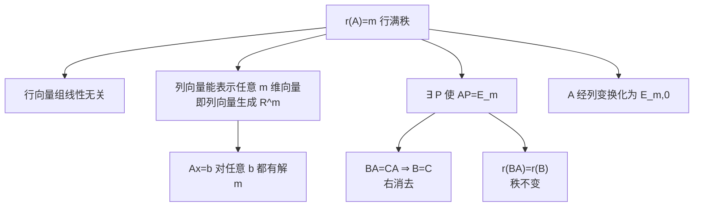

# 行满秩（6 条核心结论）

> [!info] 归属
> 线代大观 · 矩阵的秩专题 · **行满秩**。本文以**「总前提 → 6 条结论 → 逻辑链 → 考研核心版」**的框架整理行满秩矩阵的所有常用性质。

> [!important] 固定总前提（全文统一）
> $$\boxed{ A\in\mathbb R^{m\times n},\qquad r(A)=m }$$
> 即 **$A$ 行满秩**。通常尤其关注 $\boxed{m<n}$ 的情形。
> "行满秩"最核心的一句话就是：
> $$\boxed{r(A)=m=\text{$A$ 的行数}}$$
> 下面 6 条结论全部由这句话推出。

---

## 1️⃣ 右乘行满秩可消去

> [!important] 结论
> $$\boxed{ BA=CA\Rightarrow B=C }$$
> 注意这里是**右边乘了 $A$**，而 $A$ 是行满秩。

### 为什么？

因为 $A$ 行满秩，所以存在一个矩阵 $P$，使得
$$AP=E_m.$$

于是
$$BA=CA$$
两边同时右乘 $P$：
$$BAP=CAP.$$
由于 $AP=E_m$，所以
$$BE_m=CE_m,$$
即
$$\boxed{B=C}.$$

> [!tip] 记忆锚点（类比普通数）
> 普通数里：
> $$ba=ca,\quad a\neq 0\Rightarrow b=c.$$
> 矩阵**不能随便消**，但如果右边这个 $A$ 是**行满秩**，就获得了类似的**"右消去能力"**。

---

## 2️⃣ 右乘行满秩，秩不变

> [!important] 结论
> $$\boxed{ r(BA)=r(B) }$$
> 其中 $A$ 行满秩。

### 为什么？

先利用基本不等式：
$$r(BA)\le r(B).$$
另一方面，因为 $A$ 行满秩，存在 $P$ 使 $AP=E$。那么
$$B=BAP.$$
所以
$$r(B)=r(BAP)\le r(BA).$$
于是两边夹住：
$$r(BA)\le r(B),\qquad r(B)\le r(BA).$$
因此
$$\boxed{r(BA)=r(B)}.$$

### 和第 1 条的关系

这两条本质上非常像：**一个行满秩矩阵放在右边，不会把左边矩阵的信息"压没"**。所以：

- **等式可以消掉**；
- **秩也不会下降**。

> [!note] 与 [[矩阵的秩（10条性质）]] 第⑦条的衔接
> 这里即"**右乘行满秩矩阵，秩不变**"，正是 10 条性质中第⑦条 $r(CA)=r(C)$（$A$ 行满秩）的完整证明。

---

## 3️⃣ A 的行向量组线性无关

> [!important] 结论
> $$\boxed{ A\text{ 的行向量组线性无关} }$$

### 为什么？

这一条几乎就是定义。假设 $A$ 有 $m$ 行，矩阵秩 $r(A)$ 等于行向量组的秩。现在 $r(A)=m$，而行向量一共就只有 $m$ 个，所以 $m$ 个行向量的秩也是 $m$，说明它们**全都线性无关**。因此：
$$\boxed{ A\text{ 的行向量组线性无关} }$$

### 对比记忆

如果一个矩阵有 4 行：

- $r(A)=4$：4 个行向量**线性无关**；
- $r(A)=3$：4 个行向量**一定线性相关**。

所以：
$$\boxed{\text{行满秩}\iff\text{所有行向量线性无关}}$$

---

## 4️⃣ 非齐次方程组 $Ax=b$ 有解

> [!important] 结论（非常重要）
> 对**任意** $b\in\mathbb R^m$：
> $$\boxed{ Ax=b\text{ 一定有解} }$$
> 若 $m<n$，则不仅有解，且通常是 **无穷多解**。

### 为什么？

因为 $r(A)=m$。给任意 $b\in\mathbb R^m$，考虑增广矩阵 $(A,b)$。由于 $A$ 本身已有秩 $m$：
$$r(A)=m.$$
而 $(A,b)$ 也只有 $m$ 行，因此其秩不可能超过 $m$：
$$r(A,b)\le m.$$
但 $A$ 又是 $(A,b)$ 的一部分，所以
$$r(A,b)\ge r(A)=m.$$
因此
$$r(A,b)=m=r(A).$$
根据非齐次方程组有解的判定 $r(A)=r(A,b)$，所以
$$\boxed{ Ax=b\text{ 一定有解} }$$
而且这里的 $b$ 是**任意的**。

### 若 $m<n$，继续推出无穷多解

未知数个数为 $n$，而 $r(A)=m<n$，所以自由未知量个数为
$$n-r(A)=n-m>0.$$
因此不仅有解，而且通常是**无穷多解**。所以在 $m<n$ 时：
$$\boxed{ A\text{ 行满秩}\Rightarrow Ax=b\text{ 对任意 }b\text{ 都有无穷多解} }$$

> [!tip] 直观理解
> $Ax=b$ 是把 $x\in\mathbb R^n$ 映射到 $\mathbb R^m$。行满秩说明这个线性映射是**满射**（打到整个 $\mathbb R^m$），所以每个 $b$ 都至少有一个原像。当 $m<n$ 时，还有 $n-m$ 个自由维，故为无穷多解。

---

## 5️⃣ A 的列向量组可线性表示任一同维向量

> [!important] 结论
> $$\boxed{ \alpha_1,\alpha_2,\cdots,\alpha_n \text{ 可以线性表示任意 }m\text{ 维向量} }$$

### 为什么？——其实就是第 4 条换一种语言

把 $A=(\alpha_1,\alpha_2,\cdots,\alpha_n)$，方程 $Ax=b$ 展开就是
$$x_1\alpha_1+x_2\alpha_2+\cdots+x_n\alpha_n=b.$$
第 4 条告诉我们：对任意 $b\in\mathbb R^m$，这个方程都有解。这就等价于：**任意一个 $m$ 维列向量 $b$ 都能由 $A$ 的列向量线性表示**。所以：
$$\boxed{ \alpha_1,\cdots,\alpha_n \text{ 可以线性表示任意 }m\text{ 维向量} }$$

### ⚠️ 一个易错点

这并**不**意味着 $A$ 的列向量线性无关。恰恰相反，如果 $m<n$，那么：

- 一共有 $n$ 个列向量；
- 每个列向量都是 $m$ 维；
- $n>m$。

因此列向量组**一定线性相关**。所以很容易考一个易错点：
$$\boxed{\text{行满秩，不代表列向量线性无关}}$$
而是：
$$\boxed{\text{列向量能够生成全部 }m\text{ 维向量}}$$

> [!tip] 关键词对照
> - 行满秩 ⟹ **行向量**线性无关（第 3 条）；
> - 行满秩 ⟹ **列向量**可表示一切 $m$ 维向量（第 5 条），但列向量可能线性相关。

---

## 6️⃣ A 可经过列变换化为 $(E_m,0)$

> [!important] 结论
> $$\boxed{ A\xrightarrow{\text{初等列变换}}(E_m,\ 0) }$$
> 即**左边是 $E_m$，右边是 $0$**。例如 $A$ 是 $2\times4$ 行满秩矩阵，可化为
> $$\begin{pmatrix} 1&0&0&0\\ 0&1&0&0 \end{pmatrix}.$$

### 为什么？

因为 $r(A)=m$，所以 $A$ 的列向量组中一定能找到 $m$ 个线性无关的列向量。把这 $m$ 个线性无关的列通过交换列移动到最左边：
$$A\longrightarrow (A_1,\ A_2),$$
其中 $A_1$ 是 $m\times m$ 方阵且 $r(A_1)=m$，因此 $A_1$ **可逆**。又因为其余列都能由这 $m$ 个列向量表示，所以通过列变换，最终可以把前 $m$ 列化成单位阵，其余列消成 0：
$$\boxed{ A\xrightarrow{\text{列变换}} \left(E_m,\ 0\right) }$$

> [!note] 与第 5 条的呼应
> "其余列都能由这 $m$ 个列向量表示"正是第 5 条"列向量能表示任意 $m$ 维向量"的具体化。

---

## 6 条逻辑链总览

> [!tip] 把 6 条串成一条逻辑链
> $$\boxed{r(A)=m}$$
> - 立刻得到：行向量线性无关；
> - 同时列秩也等于 $m$：列向量能表示任意 $m$ 维向量；
> - 因此：$Ax=b$ 对任意 $b$ 都有解；
> - 同时行满秩还意味着存在 $P$ 满足 $AP=E_m$，于是马上得到 $BA=CA\Rightarrow B=C$ 与 $r(BA)=r(B)$；
> - 最后在矩阵化简上表现为：$A\xrightarrow{\text{列变换}}(E_m,0)$。

---

## 考研最建议记住的核心版

> [!important] 不要把 6 条孤立地背，只抓两个核心
> $$\boxed{ \text{① } r(A)=m } \qquad\qquad \boxed{ \text{② 行满秩}\Rightarrow \exists P,\ AP=E_m } $$
> 其中：
> - 第 **3、4、5、6** 条主要从 **$r(A)=m$** 理解；
> - 第 **1、2** 条用 **$AP=E_m$** 秒杀。
>
> 这样做题时比硬背六条**稳定得多**。

---

## 行满秩 vs 列满秩（快速对照）

| | 行满秩 $r(A)=m$ | 列满秩 $r(A)=n$ |
|---|---|---|
| 尺寸 | $m\times n$ 且 $m\le n$ | $m\times n$ 且 $n\le m$ |
| 行向量 | **线性无关** | 可能线性相关 |
| 列向量 | 能表示任意 $m$ 维向量 | **线性无关** |
| $Ax=b$ | 对任意 $b$ 有解（满射） | 有解则解唯一（单射） |
| 核心手段 | $AP=E_m$（存在右逆） | $PA=E_n$（存在左逆） |
| 化简 | 列变换 → $(E_m,0)$ | 行变换 → $\binom{E_n}{0}$ |
| 消去 | 右消去：$BA=CA\Rightarrow B=C$ | 左消去：$AB=AC\Rightarrow B=C$ |

> [!note] 类比提示
> 行满秩 = **满射**（值域占满整个 $\mathbb R^m$）；列满秩 = **单射**（零空间只有 $0$）。方阵满秩则既满射又单射 = 可逆。

## 相关链接

- [[线代大观 MOC]]
- [[矩阵的秩（10条性质）]]（第⑦条 $r(CA)=r(C)$ 与此处第 2 条衔接）
- [[🌟A可逆的等价命题]]（满秩方阵 ⇔ 可逆）
- [[🌟两个矩阵秩相同拥有的性质]]
- [[🌟基础解系和极大线性无关组]]（$Ax=0$ 解空间与 $n-r(A)$）
- [[🧵3.矩阵和向量组]]（教材级长笔记）
- [[🧵6.【‼️】线性方程组]]（有解判定 $r(A)=r(A,b)$）
