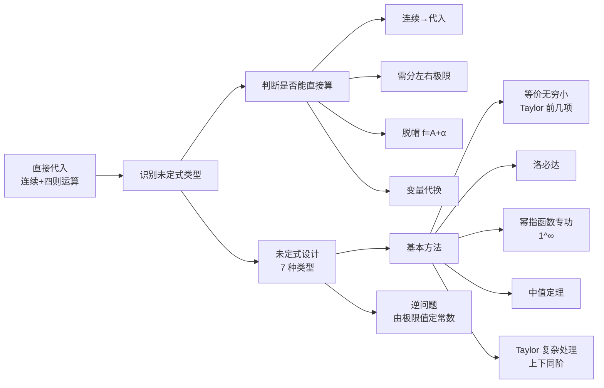

# 函数极限 MOC

> 一元函数极限常用方法的结构总览与速查。完整推导与例题见 [[函数极限大观]]。

## 知识结构总览

## 极限方法导航

| 要点 | 核心 | 适用 |
|------|------|------|
| **连续 + 四则运算** | 连续函数在极限点直接代入 | 结论型极限、多项连乘直代 |
| **左右极限** | $e$ 指数 / 反三角 / 偶次根号 / 取整 / 分段 | 极限点处左右不等、含 $|x|$、$\frac{1}{x}$ 型 |
| **脱帽** | $\lim f = A \Rightarrow f = A + \alpha$ | 把极限条件转成"极限值+无穷小" |
| **变量代换** | $t=x-x_0$ 或 $x=1/t$ | 把非零/无穷远极限归到 $0$ |
| **未定式设计** | 先识别 $7$ 种未定式再选方法 | 承上启下、选择策略 |
| **等价无穷小** | Taylor 前几项 + 替换/变形定理 | 乘除型快速求极限 |
| **Taylor 复杂处理** | 上下同阶、抵消不掉、吸阶大法 | 分子分母相减、阶数不齐 |
| **洛必达** | 仅限 $\frac{0}{0}$、$\frac{\infty}{\infty}$ | 基本型未定式，注意失效情况 |
| **幂指函数专功** | $1^\infty = e^A$ | $1^\infty$、$0^0$、$\infty^0$ 型 |
| **中值定理** | 出现 $f(b)-f(a)$ | 函数差结构转化为导数 |
| **逆问题** | 由极限值定未定常数 | 已知极限求 $a,b$、隐含极限 |

## 核心考点速查

- **先判型，后出手**：连续可带 → 直代；$\frac{0}{0}$/$\frac{\infty}{\infty}$ → 洛必达 / 等价 / 泰勒；$1^\infty$ → 幂指函数专功。
- 等价无穷小本质是 Taylor 前几项，**加减法不能整体代换**，乘除法可局部代换。
- 幂指函数统一思路：$f(x)^{g(x)} = e^{g(x)\ln f(x)}$；$1^\infty$ 型必考，牢记 $e^A$。
- 洛必达四大坑：只对基本型、先验证条件、求导后不存在≠原极限不存在、循环现象。
- 泰勒展开口诀：**上下同阶 / 抵消不掉 / 吸阶大法**；复合函数内外层都可展开。
- 逆问题核心：极限存在 ⟹ 相应无穷大**同阶**，多项式最高次幂与系数要匹配。

## 相关链接

- [[函数极限大观]]（完整详细笔记）
- [[多元微分 MOC]]（同库其他专题）
- [[一元积分 MOC]]（同库其他专题）
