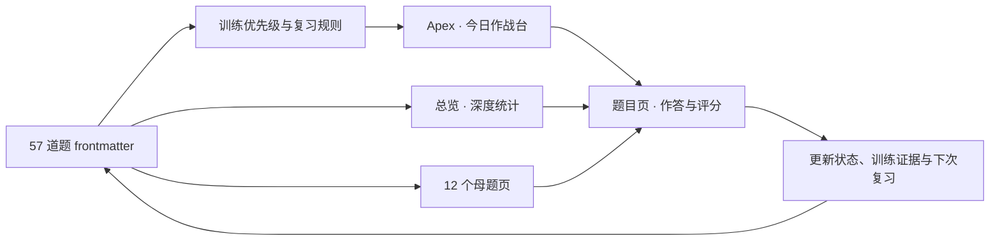

# 408 数据结构算法训练系统与 Apex Dashboard 设计

> [!abstract] 设计结论
> 采用 Apex Dashboard 的“今日作战台”布局和“抹茶”主题，以题目 frontmatter 为唯一训练数据源。首页负责推动当天训练，`[[总览]]` 负责深度统计，题目页负责作答与复盘，母题页负责形成可迁移的纸笔模板。

## 1. 背景与目标

本项目用于提升 408 数据结构算法题的实际得分能力，而不只是记录 LeetCode 是否通过。优化后的系统必须形成以下闭环：

1. 首页明确给出当前最值得训练的题目；
2. 每道题以首刷、二刷、纸笔和迁移训练逐步过关；
3. 状态必须由日期、结果、得分等证据支撑；
4. 真题作答覆盖算法思想、正确性、代码和复杂度；
5. 仪表盘、总览、母题页与题目页使用统一视觉语言；
6. Apex Dashboard 不可用时，Markdown 与 Dataview 页面仍可独立使用。

## 2. 当前项目审计

### 2.1 内容规模

| 内容 | 数量 | 当前情况 |
|---|---:|---|
| 刷题记录 | 57 | 47 道 LeetCode，10 道 408 真题 |
| 母题模板 | 12 | 结构完整，但“模板复写”均为空 |
| 408 真题题面 | 10 | 均已录入题面或摘要 |
| 有完整解题笔记的题目 | 1 | 其余 56 道保留占位文本 |
| 状态脚本副本 | 57 | 同一段 DataviewJS 被复制到每道题中 |

### 2.2 训练数据

| 状态 | 数量 |
|---|---:|
| 未开始 | 42 |
| 学习中 | 0 |
| 已AC | 11 |
| 已二刷 | 0 |
| 可纸笔 | 4 |

所有 57 道题的首刷日期、首刷耗时、二刷日期、纸笔日期、纸笔得分、下次复习、掌握评分和薄弱点均为空；所有“错误类型”均为“无”。因此，15 道“已AC”或“可纸笔”的题目存在状态与训练证据不一致的问题。

### 2.3 界面与维护问题

- `总览.md` 已有环图、母题进度、复习列表和交互式表格，但“加权掌握度”和“AC 及以上题数”同时出现，容易把两种指标理解为同一完成率。
- 题目 frontmatter 的状态与正文中的“当前状态：未开始”是两套数据，现有 15 道题已经发生冲突。
- 57 份重复脚本使一次修复需要修改 57 个文件。
- 当前使用 Obsidian 默认主题，无 CSS snippet；题目页、母题页和总览页缺少统一的版式与响应式设计。
- `真题` 文件夹为空，真题缺少独立冲刺入口。

## 3. 已确认的设计决策

| 决策项 | 结论 |
|---|---|
| 首页定位 | A：今日作战台 |
| Apex 视觉 | 抹茶 · 专注耐看 |
| 数据源 | 刷题记录的 frontmatter |
| 状态模型 | 保留现有五级状态 |
| 旧数据处理 | 保留原状态，设置 `证据状态: 待校准`，界面显示“证据待补”，不自动降级 |
| 纸笔评分 | 10 分制，8 分为达标线 |
| 首页与总览关系 | Apex 首页负责行动，`总览.md` 负责分析 |
| 样式范围 | 仅作用于 `11_数据结构` 页面 |

## 4. 总体架构

### 4.1 职责边界

- Apex Dashboard：展示今日任务、复习队列、快捷入口和轻量概览。
- `总览.md`：展示完整统计、筛选、排序、数据质量和交互式状态管理。
- 题目页：承载题面、独立作答、参考答案、评分和错因复盘。
- 母题页：承载识别信号、不变量、纸笔模板、正确性依据和迁移条件。
- 共享 Dataview 视图：集中实现状态控制、证据回写和统计组件。
- 项目 CSS：统一题目页、母题页和总览页的视觉，不侵入其他目录。

## 5. 训练状态与证据门槛

### 5.1 五级状态

| 状态 | 训练动作 | 进入下一阶段的条件 |
|---|---|---|
| 未开始 | 独立审题，写出输入、输出、约束和朴素解 | 开始限时首刷 |
| 学习中 | 完成首刷，记录日期、耗时、结果、边界和复杂度 | 独立完成或订正后重新实现通过 |
| 已AC | 间隔 1～3 天闭卷重做 | 不看旧代码独立通过 |
| 已二刷 | 按考研格式限时纸笔作答 | 评分不低于 8/10 |
| 可纸笔 | 更换接口、存储方式或数据范围进行迁移 | 按 7、14、30 天保温复习 |

状态不再由孤立的正文复选框表达。题目页的显示状态、训练记录和总览统计均读取 frontmatter。

### 5.2 纸笔评分尺

| 评分项 | 分值 | 满分要求 |
|---|---:|---|
| 算法思想 | 2 | 关键观察、数据结构和处理顺序完整 |
| 正确性与边界 | 2 | 说明算法不遗漏、不重复或保持关键不变量；边界完整 |
| 核心代码 | 4 | 接口符合题意，初始化、循环、返回值和关键注释正确 |
| 复杂度及依据 | 2 | 时间、空间复杂度及其依据正确 |
| 合计 | 10 | 总分不低于 8 分进入“可纸笔” |

### 5.3 复习节奏

| 事件 | 默认下次复习 |
|---|---|
| 首刷独立通过 | 3 天后进行二刷 |
| 首刷订正通过 | 1 天后重新闭卷验证 |
| 二刷通过 | 7 天后进行纸笔训练 |
| 纸笔首次达标 | 14 天后进行迁移训练 |
| 迁移通过 | 30 天后保温复习 |
| 任一阶段失败 | 1 天后重新训练，并记录错误类型 |

## 6. 数据模型

### 6.1 保留字段

保留现有的题号、母题、母题模块、章节、来源、引用、标题、优先级、限时、手写、训练目标、状态、各阶段日期与结果、错误类型、下次复习、复习次数、掌握评分、薄弱点和备注。

### 6.2 新增字段

| 字段 | 类型 | 用途 |
|---|---|---|
| 证据状态 | 文本 | `有效`、`待校准`；仅旧状态冲突需要校准 |
| 最后训练 | 日期 | 首页判断近期训练与连续性 |
| 思想得分 | 数字 | 纸笔评分，范围 0～2 |
| 正确性得分 | 数字 | 纸笔评分，范围 0～2 |
| 代码得分 | 数字 | 纸笔评分，范围 0～4 |
| 复杂度得分 | 数字 | 纸笔评分，范围 0～2 |

`纸笔得分` 等于四项得分之和。共享状态控件负责同步更新状态、对应阶段日期、最后训练、复习次数和下次复习，避免用户重复填写。

状态控件遵守以下写入规则：

1. 向前切换状态时，只为尚未填写的对应阶段日期写入当天日期，不覆盖既有日期；
2. 切回较低状态时保留历史日期、得分和复盘证据，只改变当前训练阶段；
3. 新题进入“可纸笔”前必须完成四项评分且总分不低于 8 分；旧题的“待校准”状态不受此限制；
4. 每次训练动作更新“最后训练”；失败时不得写入通过结果；
5. 任一写入失败时整次操作回滚，不产生部分字段已更新的状态。

### 6.3 旧数据迁移规则

1. 状态为“未开始”的 42 道题保持不变，证据状态设为“有效”。
2. 状态为“已AC”或“可纸笔”且训练证据为空的 15 道题保留原状态，证据状态设为“待校准”。
3. “待校准”题目进入首页单独队列；完成一次与当前状态相符的闭卷验证后，证据状态改为“有效”。
4. 不根据空日期自动清零或降低用户已有状态。

### 6.4 母题复写字段

12 个母题页面增加以下 frontmatter：

| 字段 | 类型 | 用途 |
|---|---|---|
| 模板状态 | 文本 | `未开始`、`学习中`、`可复写` |
| 上次复写 | 日期 | 最近一次闭卷复写日期 |
| 下次复写 | 日期 | 首页生成第三类任务的依据 |
| 复写得分 | 数字 | 0～10 分；不低于 8 分视为可复写 |

迁移时 12 个母题的模板状态均设为“未开始”，不虚构复写记录。

## 7. 今日任务选择规则

首页固定给出三类任务：

1. 一道已到期或逾期的复习题；
2. 一道最高优先级的 408 真题；
3. 一道母题模板复写或迁移题。

某一类没有候选题时，按以下顺序补位：

1. 逾期天数更多；
2. 来源为 408 真题；
3. 优先级为 S+、S、A、B；
4. 手写要求为“必须”；
5. 掌握阶段较低；
6. 题号较小。

“证据待补”不直接等于“未掌握”，但同等条件下优先进入闭卷校准。

## 8. 页面设计

### 8.1 Apex 首页：`408作战台.md`

Apex 的 Dashboard 文件路径设置为 `11_数据结构/408作战台.md`，语言设为中文，主题设为“抹茶”。该设置只改变 Apex 的入口视图，不改变 Obsidian 的全局主题。

从上到下排列：

1. Banner：日期、当日训练目标和一句简短提示；
2. 今日首要任务：题目、来源、母题、限时、状态、开始计时和打开题目；
3. 今日三题：到期复习、真题、母题或迁移题；
4. 复习告警：逾期、七天内到期和证据待补；
5. 本周得分链：完成思想、正确性、代码、复杂度和纸笔复现的题数；
6. 快捷入口：`[[总览]]`、真题冲刺、错题回炉、12 个母题和`[[使用说明]]`；
7. 轻量统计：加权掌握度、纸笔达标率、真题纸笔达标率。

不在首页放置全量 57 行表格或过多趋势图，保证打开首页后能够直接开始训练。

### 8.2 深度统计：`总览.md`

统计指标严格分离：

- 加权掌握度：五级状态权重的平均值；
- AC 及以上比例：状态为已AC、已二刷或可纸笔的题数占比；
- 纸笔达标率：可纸笔题数占比；
- 真题纸笔达标率：可纸笔真题数占真题总数的比例。

总览包含母题掌握度、复习队列、证据待补、错误类型分布和可筛选题表。状态按钮必须同时更新训练证据，不再只修改“状态”字段。

### 8.3 题目页

统一章节顺序：

1. 题目卡片；
2. 题面或外部题目入口；
3. 独立作答区；
4. 折叠的思路提示；
5. 共享状态与证据控件；
6. 折叠的参考答案；
7. 纸笔评分；
8. 错因复盘；
9. 相邻题目、母题与总览导航。

408 真题的参考答案必须按“算法思想—正确性—代码—复杂度—评分点”书写。LeetCode 训练题保持练习优先，不默认展开答案。

### 8.4 母题页

每个母题页包含：

1. 识别信号：看到哪些条件应联想到该母题；
2. 核心不变量或递归定义；
3. C/C++ 纸笔模板；
4. 正确性说明；
5. 时间与空间复杂度；
6. 常见边界和失分点；
7. 训练题、对应真题和推荐顺序；
8. 模板闭卷复写记录；
9. 可迁移变化：接口、存储结构、数据范围和目标变化。

### 8.5 新增入口页

- `真题/真题冲刺.md`：汇总 10 道真题，按年份、母题、状态、纸笔得分和证据状态展示。
- `错题回炉.md`：汇总错误类型不为“无”或证据待补的题目。
- `训练数据校准.md`：只显示状态与证据不一致的题目，并给出解除校准标记的动作。

## 9. 可维护性设计

### 9.1 共享视图

将 57 份重复 DataviewJS 收敛为项目内共享视图：

- `系统/状态控件/view.js`：状态、日期、结果、得分与复习日期回写；
- `系统/状态控件/view.css`：控件样式；
- 题目页仅保留一行 `dv.view(...)` 调用。

总览的大型脚本按“数据、统计卡、复习队列、筛选表”拆分为独立视图，降低单文件复杂度。

### 9.2 内容模板

新增题目模板与母题模板，用于后续扩充题库。模板包含完整 frontmatter、标准章节、折叠提示、共享状态控件和导航，不再复制旧脚本。

## 10. 视觉系统

### 10.1 Apex

- 主题：抹茶；
- 气质：低饱和暖绿、米白背景、克制阴影；
- 信息密度：中等偏高，但首页只保留行动相关内容；
- 主题设置由 Apex Dashboard 管理。

Apex 官方支持自定义 Dashboard 文件路径、中文界面、主题、快捷操作和 DQL 查询。参考：[Apex Dashboard 中文说明](https://github.com/PandoraReads/apex-dashboard/blob/main/README_ZH.md)。

### 10.2 项目笔记页面

项目 CSS 使用 `cssclasses` 限定作用范围：

- `ds-408-dashboard`：总览和入口页；
- `ds-408-problem`：题目页；
- `ds-408-pattern`：母题页。

CSS 文件位于 Vault 的 `.obsidian/snippets/408-training.css`。虽然 snippet 在 Vault 级启用，但所有页面规则必须以前述 `cssclasses` 为作用域，禁止使用会改变全库页面的无前缀选择器。

统一设计包括：较宽的可读内容区、清晰标题层级、抹茶色 callout、纸张感代码块、紧凑属性区、响应式表格、状态徽标和顶部导航。亮色、暗色及窄屏均需保持对比度和可读性。

## 11. 内容完善范围

本轮优化包含：

- 完善 12 个母题页面的识别信号、不变量、模板、正确性、复杂度、边界与迁移；
- 为 10 道 408 真题补充折叠式满分参考答案和评分点；
- 为 47 道 LeetCode 训练题统一练习结构、状态控件与复盘区；
- 不强制填充用户个人首刷答案、错误经历或主观薄弱点；这些内容必须来自真实训练。

## 12. 错误处理与降级

- Apex 未安装、被禁用或加载失败时，`总览.md` 仍提供完整入口和训练数据。
- Dataview 被禁用时，题面、参考答案、母题模板和静态导航仍可阅读；动态统计区域显示依赖提示。
- 状态更新失败时，控件提示失败并保持原显示，不伪造成功状态。
- 缺少或非法 frontmatter 时，数据校准页列出文件与具体字段，不在统计中静默吞掉。
- 迁移前不覆盖用户已填写的非空字段；设计文档、实施计划和每类批量修改均独立提交，便于回退。

## 13. 验收标准

### 13.1 数据

- 57 道题均具备完整且类型正确的核心属性；
- 15 道旧进度被标记为待校准且状态未被降低；
- 不存在 frontmatter 状态与正文静态状态冲突；
- 纸笔总分与四项评分之和一致；
- 下次复习日期能够由训练动作正确更新。

### 13.2 功能

- Apex 首页能打开项目题目、母题、总览、真题和错题入口；
- 今日三题符合选择规则；
- 状态控件一次点击即可更新 frontmatter 和当前界面；
- 总览在 metadata 变化后刷新；
- Apex 不可用时可从 `总览.md` 完成主要操作。

### 13.3 内容

- 12 个母题页面不再保留“模板复写”占位文本；
- 10 道 408 真题均具备算法思想、正确性、代码、复杂度和评分点；
- 参考答案默认折叠，保证先练后看；
- 47 道训练题均可记录真实首刷、二刷、纸笔与错因证据。

### 13.4 视觉与稳定性

- 桌面亮色、桌面暗色和窄屏下无横向溢出、文字遮挡或低对比文本；
- Obsidian 开发者错误面板无本项目新增错误；
- Apex 首页、总览、母题页和题目页均完成截图验收；
- CSS 选择器不会改变 `11_数据结构` 以外的笔记页面。

## 14. 非目标

- 不改造 Vault 中其他学科或项目的主题、属性和工作流；
- 不自动编造用户的训练日期、耗时、得分、错误类型或薄弱点；
- 不用 Apex 内部 Todo 重复保存题目状态；
- 不开发新的 Obsidian 社区插件；
- 不把统计图数量作为目标，所有首页组件必须直接服务于当天行动或复习决策。
